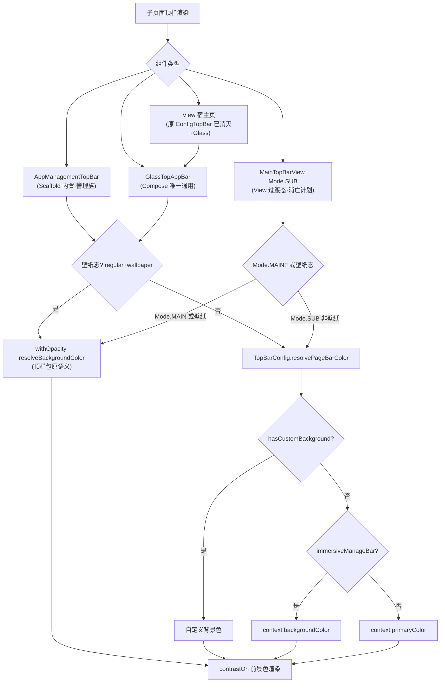

# design.md — 子页面顶栏样式统一

## Technical Approach

核心思路：**两层收敛**——取色决策单点化 + 顶栏组件缩减（4→3，检查点 R1 用户裁决）。

### 第一层：统一决策函数（新增）

```kotlin
// TopBarConfig.kt 新增（位置：resolveBackgroundColor 附近）
/**
 * 子页面顶栏背景三级决策链（subpage-topbar-unify AD-01）：
 * 1. 顶栏包显式自定义背景色（hasCustomBackground 值比较判定）
 * 2. 沉浸开关开启 → 页面底色（backgroundColor）
 * 3. 兜底 → 主题主色（primaryColor）
 * 注意：壁纸态叠加语义（withOpacity+resolveBackgroundColor）不走本函数，由各组件保持原逻辑。
 */
fun resolvePageBarColor(context: Context, config: Config): Int {
    return when {
        hasCustomBackground(config) -> resolveBackgroundColor(config)
        AppConfig.immersiveManageBar -> context.backgroundColor
        else -> context.primaryColor
    }
}
```

### 第二层：组件收敛（4→3）

| 组件 | 终态 | 实施动作 |
|------|------|---------|
| `GlassTopAppBar` | Compose 页唯一通用顶栏 | 取色接统一函数（见下） |
| `ConfigTopBar`（ConfigActivity 私有，:188-298） | **消灭** | :135 调用点改 `GlassTopAppBar`；MenuAction 适配：`alwaysShow && !header` 一级图标直出（20dp，tint=contrastOn），其余进 `AppDropdownMenu` 溢出（IconButton 三点触发，逻辑从 ConfigTopBar :240-297 平移到调用侧适配函数）；删除 ConfigTopBar 定义 + `decodeTopBarBitmap`（:300，GlassTopAppBar 已有 decodeTopBarWallpaper） |
| `AppManagementTopBar`（AppManagementScaffold 内私有） | Scaffold 脚手架内置（管理族标准本体） | topBarBase 改调统一函数（:152-159 去重） |
| `MainTopBarView`（View 体系） | View 宿主过渡态：MAIN 长期保留，SUB 随 master-track 页面迁移消亡 | renderBackgroundLayer fallbackColor 按 Mode 分流（:659-678） |

收敛后顶栏 bug 修复面：Compose 通用页（GlassTopAppBar）/ 管理族（Scaffold 内置）/ View 残留（MainTopBarView，消亡计划明确）三层，杜绝"同功能双实现"。

### 对标 legado_NG：与全面 Compose 化终态的对齐（v1.2 升级，检查点 R2 用户指令）

**终极目标（用户锚定）**：不影响主题设置体系前提下，除阅读器页面外的全面 Compose 化；本 spec 是该目标的子任务。NG（legado_NG_src）已实现大部分 Compose 化，其顶栏架构为本设计的对标基线。

**NG 模式要点**（探索实证）：
1. **唯一主题快照 + 专用顶栏语义色**：`NgThemeSnapshot.colors.topBarContainer/onTopBar`（NgThemeSnapshot.kt:11-56）为只读权威快照，View 顶栏（TitleBar.kt:211-217）与 Compose 顶栏同源消费，注释明确"旧 ThemeStore 应先解析为该结构，View 与 Compose 不再分别推导"
2. **原子统一 + 骨架分场景**：不搞单一巨型 TopBar（20+ 私有 TopBar composable），但搜索框（NgSearchBar 双档）/溢出菜单（NgExpandableActionMenu）/材质容器（NgGlassSurface）/语义取色四处原子收敛，每屏自组骨架
3. **渐进迁移三宿主模式**：ComposeView-only 布局 / onCreateView 直接返回 ComposeView / RssComposeBinding 把 ComposeView 伪装成 ViewBinding 兼容旧基类
4. **阅读器保留 View**（ReadBookActivity ViewBinding + Compose 玻璃层混合）——本项目阅读器豁免有先例背书

**本项目映射与升级**：

| NG 概念 | 本项目对应物 | 本轮动作 |
|---------|-------------|---------|
| NgThemeSnapshot.colors.topBarContainer | `TopBarConfig.resolvePageBarColor` + `contrastOn` | **升格为顶栏语义色单源**：三级决策链即本项目版 topBarContainer 实现（TopBarConfig 顶栏包/颜色主题 = NG 所无的优势，保留为第一优先级） |
| 原子统一（NgSearchBar/ExpandableMenu/GlassSurface） | contrastOn/ThemeUiPalette/MenuAction/GlassTopAppBar | 已具备，本轮取色接入单源后原子层即齐 |
| 骨架分场景（各屏私有 TopBar） | GlassTopAppBar(通用) + Scaffold 内置(管理族) | 终态路线确认：骨架不强行归一，原子与取色必须单源 |
| View 顶栏遗留（TitleBar 19 布局） | MainTopBarView Mode.SUB 22 页 + XML 残留 | Mode.SUB 消亡路线正式挂接 master-track B 波次；本轮取色单源 = 迁移铺路（页面迁移时顶栏颜色零迁移成本） |

**终态声明**：全面 Compose 化完成后，View 体系顶栏（MainTopBarView/TitleBar）整体退役，`resolvePageBarColor + contrastOn` 成为唯一顶栏色权威实现；本轮是该终态的取色铺路，避免迁移过程中每页重做取色逻辑。

### 四组件取色接入方式

| 组件 | 改动位置 | 接入方式 | 行为变化 |
|------|---------|---------|---------|
| `AppManagementTopBar` | AppManagementScaffold.kt:152-159 | `topBarBase` 改调统一函数 | 无（本函数即从此处提炼，去重） |
| `GlassTopAppBar` | GlassTopAppBar.kt:88-92 | 非 regular 分支 `Color(context.primaryColor)` → `Color(resolvePageBarColor(...))`；regular+壁纸态保持原 `withOpacity(resolve)` | 新增沉浸分支；regular 无壁纸时基色改走统一函数 |
| `ConfigTopBar` | ConfigActivity.kt:135,188-298 | **整组件删除**，调用点换 GlassTopAppBar | **消除黑白硬编码**；56dp→M3 64dp；壁纸态语义由 GlassTopAppBar 等价承接；内容色统一 contrastOn |
| `MainTopBarView` | MainTopBarView.kt:659-678 | `renderBackgroundLayer` 的 fallbackColor：Mode==SUB 且非壁纸态 → `resolvePageBarColor`；Mode==MAIN 或壁纸态保持 `resolveBackgroundColor` | **Mode.SUB 消除黑白硬编码**；Mode.MAIN 零改动 |

### GlassTopAppBar regular 无壁纸分支细节

现逻辑（GlassTopAppBar.kt:88-92）：regular → `withOpacity(resolveBackgroundColor)`（黑白兜底污染）；非 regular → `primaryColor`（缺沉浸/自定义分支）。改为：

```kotlin
val defaultColor = if (wallpaper != null && isRegular) {
    // 壁纸态：顶栏包原语义
    Color(TopBarConfig.withOpacity(TopBarConfig.resolveBackgroundColor(config), config.wallpaperAlpha))
} else {
    // 统一三级决策链
    Color(TopBarConfig.resolvePageBarColor(context, config))
}
```

### ConfigTopBar → GlassTopAppBar 适配要点（ConfigActivity 单文件内完成）

1. 调用点（:135-139）替换：`title`/`onBack` 直传；`actions` 槽放 MenuAction 适配
2. 适配函数（新增，ConfigActivity 私有）：一级 action（`alwaysShow && !header`）→ IconButton+Icon（20dp，tint 由 GlassTopAppBar 的 actionIconContentColor=contrastOn 自动继承）；其余 → 三点 IconButton + AppDropdownMenu（菜单项渲染逻辑从 ConfigTopBar :276-297 平移）
3. 删除：ConfigTopBar 定义（:187-298）、decodeTopBarBitmap（:300+）、menuActions 相关 import 清理
4. H13 crop 全幅 vs 近似差异随消灭消除（GlassTopAppBar 注释 :84-86 的"简化说明"可在验证后更新）

### MainTopBarView Mode 区分

`renderBackgroundLayer` 需感知当前 Mode：非壁纸态时 `fallbackColor` 由 Mode 决定——`Mode.SUB → resolvePageBarColor`，`Mode.MAIN → resolveBackgroundColor`（保持主页黑白基线）。壁纸态一律保持 `withOpacity(resolve)`。实施时确认类内 mode 属性可访问性（`setMode` 已存在，预计为成员变量或需传递参数）。

### XML 残留清理

| 文件 | 残留 | 处理 |
|------|------|------|
| activity_read_record.xml:9-19 | TitleBar + MainTopBarView 双隐藏顶栏 | 删除两个节点（运行时 ReadRecordScreen:88 GlassTopAppBar） |
| activity_rule_sub.xml | TitleBar（RuleSubActivity.kt:60 已 GONE） | 删除节点 + 对应代码 |
| activity_ai_image_provider_edit.xml | TitleBar（AiImageProviderEditActivity.kt:68-75 removeView） | 删除节点 + removeView 代码 |
| fragment_explore.xml | TitleBar | 确认宿主是否运行时隐藏后删除（若仍在用则豁免并记录） |

## Architecture Decisions

### AD-01: 取色决策单点收敛到 TopBarConfig，而非组件级各自修复
- **Version**: v1.0
- **UpdateTime**: 2026-09-07
- **Context**: 4 套顶栏组件（AppManagementTopBar/GlassTopAppBar/ConfigTopBar/MainTopBarView）各自实现取色，`defaultBackgroundColor` 硬编码黑白被 2 套组件无条件消费，30+ 页面顶栏不随主题
- **Concern**: 逐组件修复则逻辑重复 4 份，未来主题体系演进（如新增顶栏形态）需 4 处同步，漂移必然复发
- **Decision**: 在 `TopBarConfig` 新增 `resolvePageBarColor` 三级决策函数（自定义背景色 → 沉浸开关页面底色 → 主题主色），4 组件全部消费
- **Goal**: 任一子页面顶栏颜色唯一由决策链决定，跟随颜色主题实时变化；与用户认可的管理族标准完全一致
- **Tradeoff**: Mode.SUB 家族 22 页视觉从黑白变主色（预期内变化，即用户诉求）；`resolveBackgroundColor` 黑白兜底保留（壁纸态与 hasCustom 判定依赖它）
- **Status**: Accepted
- **Superseded-by**: 无
- **ChangeLog**: 2026-09-07 初版

### AD-02: 基色统一决策链且保持不透明，wallpaperAlpha 只作用于壁纸图（v1.2 修订：检查点 2 二次否决后）
- **Version**: v1.2
- **UpdateTime**: 2026-09-07
- **Context**: v1.1 修复黑白兜底时保留 `withOpacity(基色, wallpaperAlpha)` 叠加——用户真机二次否决：低 wallpaperAlpha（如 25%）把主色调成半透明，日间透白底"大白框"、夜间透黑底"大黑头"（书架媒体实锤）
- **Concern**: wallpaperAlpha 语义是"壁纸图不透明度"，混入基色后基色透明度不受任何开关控制，随页面底色漂移出白框/黑框
- **Decision**: 基色（含壁纸态）一律 `resolvePageBarColor` 不透明直出；wallpaperAlpha 只作用于壁纸图（Image/ComposeThemeImage alpha）；三组件（GlassTopAppBar/MainTopBarView/AppManagementTopBar）同步修正
- **Goal**: 顶栏基色永远实色且随主题；壁纸作为半透明装饰层叠加
- **Tradeoff**: 顶栏包作者若依赖"低 alpha 基色透底"效果将失效（该效果本身是黑白兜底时代的衍生产物，废弃）
- **Status**: Accepted
- **Superseded-by**: 无
- **ChangeLog**: 2026-09-07 v1.2（v1.0"壁纸态保持 resolve"、v1.1"withOpacity 基色叠加"均废弃）

### AD-03: 本轮只统一颜色，不统一高度/字号/裁切
- **Version**: v1.1
- **UpdateTime**: 2026-09-07
- **Context**: 顶栏高度 48dp（AppManagementTopBar/MainTopBarView）与 56dp（ConfigTopBar）并存；壁纸 crop 裁切存在已知像素级偏差（GlassTopAppBar.kt:84-86 简化说明）
- **Concern**: 颜色统一是用户当前最痛点；高度/裁切统一涉及布局重排与 H13 遗留项，混入本轮会放大回归面
- **Decision**: 管理族 48dp 标准（用户认可）不动；ConfigTopBar 消灭后其 56dp 自然消失（M3 64dp 承接），高度差异面从 3 种缩为 2 种；crop 像素级对齐留待后续
- **Goal**: 最小改动消除"纯黑/纯色不跟随主题"问题
- **Tradeoff**: MainTopBarView 48dp 与 M3 64dp 仍并存（View 宿主过渡态消亡后自然归一）
- **Status**: Accepted
- **Superseded-by**: 无
- **ChangeLog**: 2026-09-07 v1.1 检查点 R1 裁决后更新（56dp 随 ConfigTopBar 消灭）

### AD-04: 顶栏组件缩减 4→3，ConfigTopBar 消灭（检查点 R1 用户裁决）
- **Version**: v1.0
- **UpdateTime**: 2026-09-07
- **Context**: 项目存在 4 套顶栏组件（AppManagementTopBar/GlassTopAppBar/ConfigTopBar/MainTopBarView），任何顶栏 bug 修复需考虑 4 套；用户检查点裁决强烈批评："为什么是4套顶栏组件！！！为什么不能缩减！任何一个bug修复，都要考虑4套？"
- **Concern**: 同功能多实现 = 持续架构债；ConfigTopBar 与 GlassTopAppBar 功能重合度极高（壁纸/圆角/溢出菜单/返回键），且仅 ConfigActivity 一处调用，是典型的孤立双实现
- **Decision**: ConfigTopBar 消灭（调用点换 GlassTopAppBar + MenuAction 适配层，单文件内完成）；AppManagementTopBar 定位为 AppManagementScaffold 脚手架内置（非独立组件）；MainTopBarView 定位为 View 宿主过渡态（MAIN 长期保留，SUB 22 页列入 master-track 迁移清单随页面 Compose 化逐页消亡）。终态：Compose 页唯一通用顶栏 GlassTopAppBar + 管理族脚手架内置 + View 过渡态
- **Goal**: 顶栏 bug 修复面从"4 套"缩为边界清晰的三层，且 View 层有明确消亡路线，杜绝双实现再生
- **Tradeoff**: 设置页顶栏 56dp→64dp 视觉微变；溢出菜单实现迁移需专项回归；Mode.SUB 22 页迁移是长期工程（不在本轮）
- **Status**: Accepted
- **Superseded-by**: 无
- **ChangeLog**: 2026-09-07 初版（检查点 R1 需调整后新增）

### AD-05: 顶栏语义色单源对齐 NG 模式，服务全面 Compose 化终态（检查点 R2 用户指令）
- **Version**: v1.0
- **UpdateTime**: 2026-09-07
- **Context**: 用户锚定终极目标——不影响主题设置体系前提下完成除阅读器外全面 Compose 化；项目已下载 legado_NG 参照（Compose 化约 45% Activity/67% Fragment），其顶栏架构 = 唯一主题快照（NgThemeSnapshot.topBarContainer/onTopBar）+ View/Compose 同源取色 + 原子统一骨架分场景；本项目 master-track B 波次正在做 22 页 View→Compose 迁移
- **Concern**: 若顶栏取色收敛停留在"每组件接入统一函数"的补丁层，未来 Compose 化迁移时每页仍需重新处理顶栏色；View/Compose 双轨取色若不单源化，主题体系变更将继续双倍成本
- **Decision**: `resolvePageBarColor + contrastOn` 定位为本项目版"顶栏语义色单源"（对标 NG topBarContainer/onTopBar）；TopBarConfig 顶栏包/颜色主题保持第一优先级（主题体系零破坏）；Mode.SUB 22 页消亡路线正式挂接 master-track B 波次；终态 = View 顶栏整体退役后此函数为唯一顶栏色权威
- **Goal**: 本轮取色收敛即为 Compose 化迁移铺路（页面迁移时顶栏颜色零迁移成本）；与 NG 架构模式同构，降低后续向 NG 模式深度演进的认知成本
- **Tradeoff**: 未引入 NG 的 NgThemeSnapshot 不可变快照+StateFlow 热更新架构（本项目 ThemeSync.version/ThemeUiPalette 机制已覆盖同等能力，避免双体系并存）；骨架层维持分场景不自组巨型组件
- **Status**: Accepted
- **Superseded-by**: 无
- **ChangeLog**: 2026-09-07 初版（检查点 R2 需调整后新增）

## Data Flow



主题变化响应：Compose 侧经 `ThemeSync.version` / `themeSignature` 重建重组（现有机制），View 侧经 `ThemeStore` upChanged 流程（现有机制），统一函数无需额外订阅。

## File Changes

| 文件 | 变更类型 | 说明 |
|------|---------|------|
| `app/src/main/java/io/legado/app/help/config/TopBarConfig.kt` | 修改 | 新增 `resolvePageBarColor(context, config)` |
| `app/src/main/java/io/legado/app/ui/widget/compose/AppManagementScaffold.kt` | 修改 | topBarBase 改调统一函数（:152-159） |
| `app/src/main/java/io/legado/app/ui/widget/components/GlassTopAppBar.kt` | 修改 | defaultColor 分支改调统一函数（:88-92） |
| `app/src/main/java/io/legado/app/ui/config/ConfigActivity.kt` | 修改 | **删除 ConfigTopBar（:187-298）+ decodeTopBarBitmap（:300+）**；:135 调用点换 GlassTopAppBar + MenuAction 适配函数（一级直出+溢出菜单平移） |
| `app/src/main/java/io/legado/app/ui/widget/MainTopBarView.kt` | 修改 | renderBackgroundLayer fallbackColor 按 Mode 分流（:659-678） |
| `app/src/main/res/layout/activity_read_record.xml` | 修改 | 删除残留双顶栏节点 |
| `app/src/main/java/io/legado/app/ui/about/ReadRecordActivity.kt` | 修改 | 清理关联隐藏代码（如有） |
| `app/src/main/res/layout/activity_rule_sub.xml` + `RuleSubActivity.kt` | 修改 | 删除 TitleBar 节点与 GONE 代码 |
| `app/src/main/res/layout/activity_ai_image_provider_edit.xml` + `AiImageProviderEditActivity.kt` | 修改 | 删除 TitleBar 节点与 removeView 代码 |
| `app/src/main/res/layout/fragment_explore.xml` | 修改/豁免 | 确认后删除 TitleBar 或记录豁免原因 |
| `app/src/main/assets/updateLog.md` | 修改 | 版本交付同步（编译前） |
| `docs/INDEX.md` | 修改 | 状态流转 |
