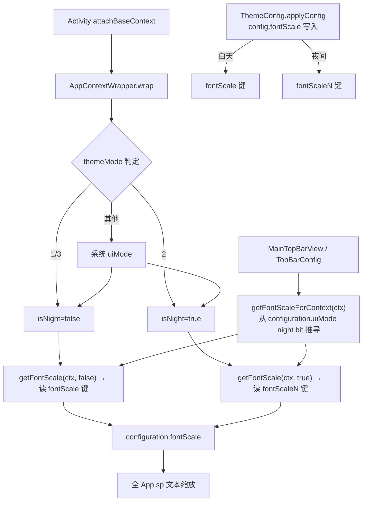

# design.md — 主题字体大小：默认值统一与日夜配置生效修复

## Technical Approach

### 修复链路（Bug：fontScaleN 只写不读）

核心修改集中在 `AppContextWrapper`：

1. `wrap()`：现有 themeMode → nightBit 判定后，推导 `isNight = (nightBit == Configuration.UI_MODE_NIGHT_YES)`，传入 `configuration.fontScale = getFontScale(context, isNight)`
2. `getFontScale(context, isNight)`：按 `if (isNight) PreferKey.fontScaleN else PreferKey.fontScale` 读取，值语义不变（/10f，0.8~1.6 之外回落系统）
3. View 层调用点（MainTopBarView 3 处、TopBarConfig 1 处）：新增公共入口 `AppContextWrapper.getFontScaleForContext(context)`——从 `context.resources.configuration.uiMode` 的 night bit 推导 isNight 后委托 `getFontScale`。由于所有 Activity context 均经 `wrap()` 修正 night bit，此推导与全局配置同源
4. `getFontScale` 签名改为必传 `isNight`（不设默认值），编译期暴露全部遗漏调用点

### 预置主题落点（AD-03/AD-04 定稿）

- 暗夜紫日夜 Config 代码内置（AppearanceKitManager），日间版由夜间色系 `#7B1FA2/#CE93D8/#1E1E32` 推导浅紫调
- 磨砂玻璃晨昏套件：图片压缩后入 assets/appearance_kits/，首启幂等 seeding 走 `AppearanceKitManager.importPackage`
- legacy themeConfig.json 及导入链（DefaultData/LocalConfig/Restore）在迁移完成后移除

## Architecture Decisions

### AD-01: 字号日夜感知采用"全局单源 + configuration 推导"方案
- **Version**: v1.0
- **UpdateTime**: 2026-09-08
- **Context**: 主题架构 v2 已建立日夜双键体系（颜色/字体/圆角等均按 isNight 拆键），但字号全局生效链（AppContextWrapper → configuration.fontScale）漏接夜间键，fontScaleN 成为死键；顶栏尺寸联动（bugfix-0908f）依赖 getFontScale 同源
- **Concern**: 如何让夜间字号生效，且 View 层与全局配置日夜判定同源，不引入第二套判定逻辑
- **Decision**: getFontScale 增加必传 isNight 参数；wrap() 复用既有 nightBit 判定；View 层经 getFontScaleForContext 从已修正的 configuration.uiMode 推导
- **Goal**: 夜间字号真实生效；五处消费点全部编译期对齐；判定逻辑单一来源
- **Tradeoff**: getFontScale 签名破坏性变更（编译期全量修正）；View 层依赖 configuration 已被 wrap() 修正的隐含契约
- **Status**: Accepted
- **Superseded-by**: 无
- **ChangeLog**: 2026-09-08 初稿；2026-09-08 红队第2轮补充：现存日夜判定偏差已知——wrap() 中 themeMode 缺省 "2"（夜间）与 AppConfig.themeMode 缺省 "0"（跟随系统）不一致，全新安装未设置模式时两者可能判定不同；字号键选择**跟随渲染真值**（configuration.uiMode，决定 values-night 资源解析），保证字号与实际渲染的日夜表面一致；该偏差为现存问题，本次不修，字号行为与渲染严格对齐

### AD-02: 首次安装默认字号策略（已定稿：2A 仅内置主题 9）
- **Version**: v1.0
- **UpdateTime**: 2026-09-08
- **Context**: 现设计语义为 0=跟随系统（尊重系统无障碍字体缩放）；内置日/夜主题均未设 fontScale；磨砂玻璃套件内 fontScale=100 存在 clamp 成 16（1.6 倍）的缺陷
- **Concern**: 强制 0.9 使「跟随系统」语义消失；2B 影响所有未设置用户
- **Decision**: **2A**——`builtinEntry()` 日/夜内置主题 `fontScale=9`，应用内置主题后生效，未应用前仍跟随系统；磨砂玻璃套件资产内 fontScale 同步修正为 9（同时消除 100→clamp 16 缺陷）
- **Goal**: 应用内置/预置主题后字号统一 0.9 倍；尊重用户显式设置
- **Tradeoff**: 首装未应用主题前为系统字号（0.9 在应用预设主题后达成——首装默认套用暗夜紫套件，故实际首装即 0.9）
- **Status**: Accepted
- **Superseded-by**: 无
- **ChangeLog**: 2026-09-08 v0.1 初稿；2026-09-08 v1.0 用户定稿 2A

### AD-03: 历史遗留默认主题资产处置（已定稿：移除资产及导入链 + 暗夜紫配置迁移）
- **Version**: v1.0
- **UpdateTime**: 2026-09-08
- **Context**: assets/defaultData/themeConfig.json 17 主题属旧体系，UI 不展示；但**三处暗夜紫逻辑依赖 configList 中的暗夜紫条目**（App.kt 首装预设 L121、App.kt 可回切注册 L217、ensureDarkPurpleKit L142），直接移除会破坏暗夜紫首装预设
- **Concern**: 移除顺序不当会导致暗夜紫整套外观套件注册失败（ensureDarkPurpleKit 返回 null）
- **Decision**: **先迁移后移除**——①在 AppearanceKitManager 内新增代码内置暗夜紫夜间 Config 常量（配色取 legacy 资产原值 `#7B1FA2/#CE93D8/#1E1E32` 系）与新推导的日间 Config 常量；②三处依赖点改读代码常量；③移除 themeConfig.json + DefaultData.themeConfigs/importDefaultThemeConfigs + LocalConfig.needUpThemeConfig + Restore.kt:223 调用
- **Goal**: 消除不可见历史数据；暗夜紫首装预设与可回切能力不回退
- **Tradeoff**: 暗夜紫配色硬编码进代码（后续调色需发版）；升级补发旧默认主题能力消失（主题包体系已接管）
- **Status**: Accepted
- **Superseded-by**: 无
- **ChangeLog**: 2026-09-08 v0.1 初稿；2026-09-08 v1.0 用户定稿移除，补充迁移依赖链

### AD-04: 初始化预置主题体系（暗夜紫日夜 + 磨砂玻璃晨昏套件入库）
- **Version**: v1.1
- **UpdateTime**: 2026-09-08
- **Context**: 用户要求①首装即暗夜紫夜间主题（现有能力，保留）；②暗夜紫需日间变体（现不存在）；③output/theme/磨砂玻璃晨昏套件.zip（2.43MB）初始化进主题体系；④图片裁剪/压缩控包体
- **Concern**: 套件背景图 2736×3648（948KB/1.38MB）直接入 assets 显著增大 APK；套件内 fontScale=100 缺陷；importZip 同名会生成 `_1` 后缀目录造成重复
- **Decision**: ①暗夜紫日夜 Config 代码内置（AD-03），字段级设计见下节；②磨砂套件经图片压缩后以 ASCII 文件名放入 assets/appearance_kits/；③首启 IO 协程幂等 seeding（pref 标记 + localThemeExists 双重幂等）：解压至 cacheDir 后走现有 `AppearanceKitManager.importPackage`；④不自动套用磨砂套件（首装默认仍为暗夜紫套件）
- **Goal**: 首装主题列表即含：内置日/夜主题、暗夜紫（日+夜）、磨砂玻璃晨/昏（日+夜）；包体增量 ≤1.2MB
- **Tradeoff**: APK 体积 +≤1.2MB；磨砂套件随版本更新需手动维护 assets
- **Status**: Accepted
- **Superseded-by**: 无
- **ChangeLog**: 2026-09-08 v1.0 依据用户检查点1反馈新增；2026-09-08 v1.1 依据用户质询补套件逐项核实结论+暗夜紫字段级设计

### 磨砂玻璃晨昏套件逐项核实结论（v1.1 补，全组件解包验证）

| 组件 | 内容 | 核实结果 |
|------|------|---------|
| appearance_kit.json | id=kit_frosted_glass_dawn_dusk，version=1，binding.preset=default，绑定晨雨/夜雨主题+晨雨/夜雨顶栏 4 组件 | 结构与 `AppearanceKitManager.importAppearanceKit` 契约一致（build_kit.py 构建契约） |
| theme_day.zip | 晨雨磨砂玻璃：bg #FFEAEEED blur12，card #FFF3F8F7，muted/search/tab #FFE1E7E5，shelf #FFEAEEED，primary #FF597259，accent #FF7FA37E，shadow2，uiCornerScale1.1，layoutAlpha98，dialogAlpha96 | **缺陷①：fontScale=100**（applyConfig clamp 0..16 → 16 = 1.6 倍巨字），须改 9 |
| theme_night.zip | 夜雨磨砂玻璃：bg #FF222522 blur18，card #FF2D322D，muted/search/tab #FF191C19，primary #FF79AD79，accent #FF9DBE8C，shadow1，uiCornerScale1.1 | 同缺陷①，须改 9 |
| top_bar_day.zip | 晨雨顶栏：regular，tagBar #FFE1E7E5 alpha92，tagSelected #FF597259 alpha100，cornerScale1.1 | 无缺陷 |
| top_bar_night.zip | 夜雨顶栏：regular，tagBar #FF191C19 alpha92，tagSelected #FF79AD79 alpha100，cornerScale1.1 | 无缺陷 |
| 背景图 | background.jpg 两张，2736×3648，948KB/1.38MB；preview.png 68KB/33KB | **缺陷②：体积过大**，重采样 1080 宽 JPEG q≈80（对齐 upgrade_packs.py 的 LANCZOS+q80 方法论） |

### 暗夜紫日/夜主题字段级设计（v1.1 补，代码内置常量）

夜间版 = legacy 资产原值系（保证首装预设视觉零变化）；日间版 = 同色系浅紫推导（每色与表面文字对比度按 `applyFontColorPrefs` 1.3 阈值校验）：

| 字段 | 夜间（legacy 原值） | 日间（浅紫推导） | 推导依据 |
|------|-------------------|----------------|---------|
| primaryColor | #8E24AA | #8E24AA | 品牌主色保留，浅底对比 6.7:1 |
| accentColor | #CE93D8 | #6A1B9A | 浅底需深紫强调（浅色 accent 反向） |
| backgroundColor | #201A2E | #F4EEFA | 夜底明度反转，保留紫相 |
| bottomBackground | #1B1626 | #ECE4F4 | 底栏微深一档 |
| cardColor | #2A2138 | #FBF8FE | 卡片近底色微提亮 |
| mutedColor | #8A85A0 | #DCCFEA | 弱化面 |
| searchFieldBackgroundColor | #2E2540 | #E7DDF2 | 搜索框弱化面 |
| tabBackgroundColor | #3A2E4E | #DFD2EE | 标签条弱化面 |
| shelfColor | #241C31 | #F0E9F8 | 书架面 |
| cardShadow | 6 | 2 | 浅色系小阴影（对齐晨雨=2） |
| cardBackgroundBlur | 0.3 | 0.25 | 磨砂微糊对齐夜版量级 |
| fontScale | 9 | 9 | AD-02 2A 统一 |
| transparentNavBar | true | true | 沉浸一致 |
| uiFontPath/titleFontPath/uiCornerScale 等 | 不设（走运行时默认） | 不设（走运行时默认） | 与 legacy 行为一致 |

顶栏包（沿用 ensureDarkPurpleKit 夜间既有定义；日间新增对称配置）：style=regular，cornerScale=1f（贴卡片圆角）；夜 tagBar=#2A2138 alpha100/tagSelected=#CE93D8；日 tagBar=#DCCFEA alpha92/tagSelected=#8E24AA alpha100。

暗夜紫日间**不携带背景图**（纯色渐变面），与首装视觉策略一致；如后续需要壁纸版另行迭代。

## Data Flow

## File Changes

| 文件 | 变更类型 | 变更内容 |
|------|---------|---------|
| `app/src/main/java/io/legado/app/base/AppContextWrapper.kt` | 修改 | wrap() 传递 isNight；getFontScale 增必传 isNight 参数并按日夜读键；新增 getFontScaleForContext |
| `app/src/main/java/io/legado/app/ui/widget/MainTopBarView.kt` | 修改 | 3 处 getFontScale 调用改走 getFontScaleForContext |
| `app/src/main/java/io/legado/app/help/config/TopBarConfig.kt` | 修改 | 1 处调用改走 getFontScaleForContext |
| `app/src/main/java/io/legado/app/help/config/ThemePackageManager.kt` | 修改 | builtinEntry 日/夜主题 fontScale=9（AD-02） |
| `app/src/main/java/io/legado/app/help/config/AppearanceKitManager.kt` | 修改 | 新增代码内置暗夜紫日夜 Config 常量；ensureDarkPurpleKit 改读常量（不再依赖 configList）；新增磨砂套件 assets seeding（幂等） |
| `app/src/main/java/io/legado/app/App.kt` | 修改 | 首装预设与可回切注册改读 AppearanceKitManager 内置常量；IO 协程内追加磨砂套件 seeding 调用 |
| `app/src/main/assets/defaultData/themeConfig.json` | 删除 | 移除历史 17 主题资产（AD-03） |
| `app/src/main/java/io/legado/app/help/DefaultData.kt` | 修改 | 移除 themeConfigs lazy 与 importDefaultThemeConfigs |
| `app/src/main/java/io/legado/app/help/config/LocalConfig.kt` | 修改 | 移除 needUpThemeConfig |
| `app/src/main/java/io/legado/app/help/storage/Restore.kt` | 修改 | 移除 importDefaultThemeConfigs 调用 |
| `app/src/main/assets/appearance_kits/frosted_dawn_dusk_kit.zip` | 新增 | 压缩后的磨砂玻璃晨昏套件（目标 ≤1.2MB，fontScale=9，ASCII 文件名） |
| `app/src/main/assets/updateLog.md` | 修改 | 按 version-delivery-sync 规范基于 git diff 追加用户可读条目 |

> 消费点盘点说明：`ThemeUiPalette.kt` 中的 fontScale/fontScaleN 键引用仅用于键清单维护与诊断摘要展示（默认参数走 AppConfig.isNightTheme），非生效链路，本次不修改。`ui/code/config/SettingsDialog.kt` 的 fontScale 为书源编辑器字号（独立 PreferKey 语义），不在本规格范围。

## 验证策略
- L1：编译通过（`build-legado.bat`）
- L2：模拟器真机验证（测试包 io.legado.miss.app.debug）：夜间主题设字号 9 → 全局文本与顶栏尺寸按 0.9 生效；切白天恢复白天配置；重启后保持；首装暗夜紫夜间预设不回退；日间暗夜紫/磨砂晨昏套件在主题列表可见可选；磨砂套件应用后字号 0.9、背景图正常显示
- L3：老用户覆盖安装场景（白天/夜间各设不同字号 → 升级后各按原值生效）；已删除磨砂套件的老用户不被重复 seeding
