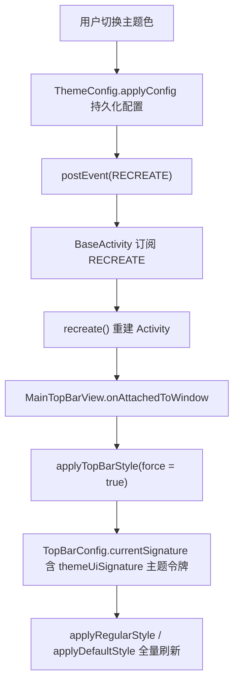
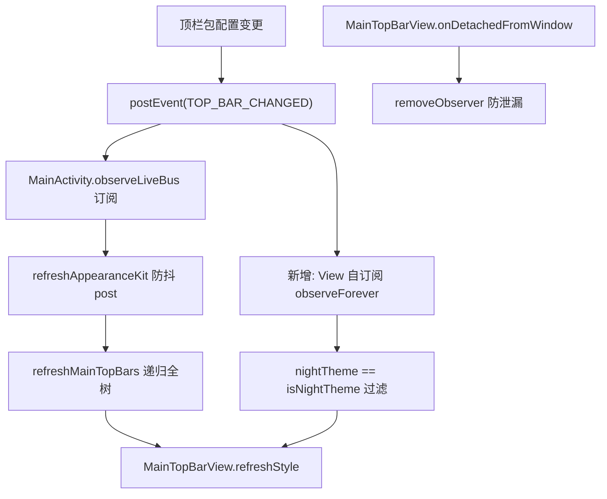
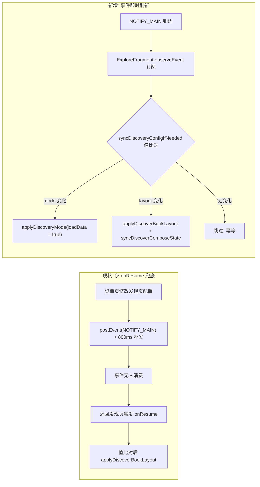

# 技术设计：theme-rss-header-layout-sync（主题/顶栏/订阅与发现页布局联动同步）

> 状态：设计中 ｜ 关联：[tasks.md](./tasks.md) ｜ 前置 spec：[rss-classic-layout-align](../rss-classic-layout-align/README.md)
> 本设计所有行号经源码穿透核实（2026-08-30），实施前建议 Grep 二次定位（±1 行容差）。

## 0. 背景与根因

| # | 问题 | 根因锚点（已核实） |
|---|------|------------------|
| P1 | 订阅页（RSS）顶栏 tagsBar 源标签无选中背景，发现页（DISCOVERY）有，视觉不一致 | `MainTopBarView.applyRegularStyle` 中 `tagsBar.setSelectedBackgroundVisible(mode == Mode.DISCOVERY)`（MainTopBarView.kt:488）；default 风格 L437 为全模式 `true`，两风格自相矛盾 |
| P2 | 发现页布局/形态配置切换后不即时生效，仅 onResume 兜底 | `ExploreFragment.onResume`（L3542-3556）是唯一值比对触发点，全文件 0 事件订阅 |

辅助事实：`applyTopBarStyle`（L347-364）签名比对机制在全调用点 `force=true` 下为冗余防御；`TopBarConfig.currentSignature`（TopBarConfig.kt:118-124）默认包签名含 `themeUiSignature()`（ThemeUiPalette.kt:149-183）。

---

## 1. Technical Approach

### F1 修复：RSS 模式 tagsBar 选中背景对齐 DISCOVERY

**变更**：MainTopBarView.kt:488

```kotlin
// 改前
tagsBar.setSelectedBackgroundVisible(mode == Mode.DISCOVERY)
// 改后
tagsBar.setSelectedBackgroundVisible(mode == Mode.DISCOVERY || mode == Mode.RSS)
```

**内容适配核实结论（无副作用）**：tagsBar 仅在 modern 订阅模式承载内容（RssFragment.kt:201 注释、L691 `showTags(true)`）；classic 订阅模式在多处置 `showTags(false)`（L416/663/702/847/1119/1131/1310/1315），tagsBar 整体隐藏（GONE），选中背景对隐藏控件无视觉影响。setMode（L178-198）不直接操作 tagsBar 可见性，显隐由 `tagsBarRequested`/`showTags` 链路独立管理，互不干扰。

**default 风格不动**：applyDefaultStyle L437 已是全模式 `true`，与修复后语义一致，无需变更。

### F2 修复：发现页配置变更事件即时刷新

**变更**：ExploreFragment.kt

1. 将 onResume（L3542-3556）中的值比对刷新逻辑抽取为私有方法 `syncDiscoveryConfigIfNeeded()`（对齐 config-needs-restart-fix 的值比对防重复范式）：

```kotlin
private fun syncDiscoveryConfigIfNeeded() {
    if (discoveryPageMode != AppConfig.discoveryPageMode || !discoveryModeLoaded) {
        applyDiscoveryMode(loadData = true)
        discoveryModeLoaded = true
    } else if (usingModernDiscovery) {
        applyDiscoverBookLayout()
        syncDiscoverComposeState()
    } else if (usingSuiteDiscovery) {
        refreshSuiteConfig()
    }
}
```

2. `onFragmentCreated`（L237，BaseFragment 钩子，view 已就绪）注册订阅（复用 Fragment 版 observeEvent，EventBusExtensions.kt:52-74，生命周期绑定自动取消）：

```kotlin
observeEvent<Boolean>(EventBus.NOTIFY_MAIN) {
    if (isAdded && view != null) {
        syncDiscoveryConfigIfNeeded()
    }
}
```

3. onResume 原逻辑替换为 `syncDiscoveryConfigIfNeeded()` 调用。

**空安全说明**：`isAdded && view != null` 防护 Fragment lifecycle observe（非 viewLifecycleOwner）在 view 重建间隙的回调窗口；detached 状态下不触发容器操作。

**链路背景**：设置页已发 NOTIFY_MAIN + 800ms 补发（DiscoverySubscriptionConfigFragment.kt:115-127、SubscriptionConfigFragment.kt:65-74），本修复只补消费端，不动发送端。

### F3 加固：MainTopBarView 自订阅 TOP_BAR_CHANGED 第二刷新通道

**变更**：MainTopBarView.kt（onAttachedToWindow L173-176 增加；新增 onDetachedFromWindow 覆写）

```kotlin
private var topBarEventObserver: Observer<Boolean>? = null

override fun onAttachedToWindow() {
    super.onAttachedToWindow()
    applyTopBarStyle(force = true)
    topBarEventObserver = Observer { nightTheme ->
        if (nightTheme == AppConfig.isNightTheme) refreshStyle()
    }
    eventObservable<Boolean>(EventBus.TOP_BAR_CHANGED).observeForever(topBarEventObserver!!)
}

override fun onDetachedFromWindow() {
    topBarEventObserver?.let {
        eventObservable<Boolean>(EventBus.TOP_BAR_CHANGED).removeObserver(it)
    }
    topBarEventObserver = null
    super.onDetachedFromWindow()
}
```

**实现要点**：EventBusExtensions 现有 observeEvent 仅 Activity/Fragment/LifecycleService 三重载（utils/EventBusExtensions.kt:28/52/76），View 无生命周期对象，采用 LiveEventBus `observeForever` + `onDetachedFromWindow` 移除的标准做法，不新增扩展函数抽象。

**覆盖性评估（设计结论）**：MainActivity observeLiveBus（L2336-2371）已订阅 TOP_BAR_CHANGED（L2351）→ refreshAppearanceKit（防抖 post，L1634-1637）→ refreshMainTopBars 递归全树（L702-714）→ refreshStyle（L270-276），同 Activity 内场景已覆盖。自订阅价值：① 宿主非 MainActivity 的复用场景；② 与 recreate 主链解耦的双保险。**幂等性**：refreshStyle 无外部副作用（重置签名缓存 + force 重刷 + requestLayout/invalidate），双路径重入无害。订阅回调保留 `nightTheme == AppConfig.isNightTheme` 过滤，与 MainActivity 行为对齐，避免夜间切换时双触发。

### F4 清理：废弃 key 分类处置（核实修正）

Grep 全量核实结果（app/src/main/java 范围，PreferKey.kt:292-296）：

| key | 引用情况 | 处置 |
|-----|---------|------|
| `rssViewMode` | 0 代码引用（仅 RssFragment.kt:1344 注释文本提及） | **删除** PreferKey.kt:293 常量；PreferKey.kt:291/294 注释同步微调 |
| `sourceViewMode` | AppConfig.kt:2842（`migrateSourceConfigIfNeeded()` 一次性迁移读取） | **保留**（删除将破坏覆盖安装老用户数据迁移） |
| `sourceFolderStyle` | AppConfig.kt:2843（同上） | **保留** |
| `sourceFolderMargin` | AppConfig.kt:2850（同上） | **保留** |

**修正说明**：`migrateSourceConfigIfNeeded()`（AppConfig.kt:2840-2853）由 AppConfig.kt:2806 活跃调用，将旧 key 值迁移至 `sourceGroupStyle`/`sourceMargin`，属老用户数据迁移路径，非死代码。AppConfig 中不存在 `rssViewMode` 属性封装（任务预设"AppConfig 对应属性"不成立），无需改 AppConfig。

### F5 文档：rss-classic-layout-align 状态收口

`docs/specs/rss-classic-layout-align/README.md:3` 状态行「🔄 设计中（检查点 1 待审）」→「✅ 已完成」；README 末尾状态标记区（检查点 1/修复实施/编译门禁/真机验证/验收 5 项）按实际完成度同步勾选，保持状态自洽。

---

## 2. Architecture Decisions（ADR，Y-Statement 模板）

### AD-01 RSS tagsBar 选中背景对齐 DISCOVERY

- **Context（背景）**：在 regular 顶栏风格下，发现页 tagsBar 有选中背景（MainTopBarView.kt:488 条件命中 Mode.DISCOVERY），订阅页无；default 风格（L437）两页均有，同一组件两种风格语义不一致。
- **Concern（关注点）**：订阅页 modern 模式的源标签（D1 二级标签）选中态不可见，用户无法辨识当前选中源。
- **Decision（决策）**：将 L488 条件扩展为 `mode == Mode.DISCOVERY || mode == Mode.RSS`。
- **Goal（目标）**：RSS 与 DISCOVERY 的 tagsBar 选中背景视觉对齐，消除 P1。
- **Tradeoff（代价）**：需回归 DISCOVERY 场景确认无视觉回归；classic 订阅模式 tagsBar 隐藏态不受影响（已核实 showTags(false) 链路）。
- **Status（状态）**：Proposed

### AD-02 发现页刷新采用事件订阅 + 值比对

- **Context（背景）**：发现页配置（discoveryPageMode / discoveryPageLayout / bookshelfListItemStyle）变更经设置页发 NOTIFY_MAIN（含 800ms 补发），ExploreFragment 仅 onResume 值比对兜底，站内即时切换不生效。
- **Concern（关注点）**：如何在不引入泄漏的前提下获得即时刷新，且不与 onResume 逻辑双写漂移。
- **Decision（决策）**：onFragmentCreated 注册 `observeEvent<Boolean>(NOTIFY_MAIN)`，回调与 onResume 共用抽取的 `syncDiscoveryConfigIfNeeded()` 值比对方法；否决全局 SharedPreferences listener 方案（Context/生命周期泄漏风险，且偏离项目 LiveEventBus 范式）。
- **Goal（目标）**：发现页形态/布局配置变更即时生效，onResume 兜底保留为第二道防线。
- **Tradeoff（代价）**：NOTIFY_MAIN 已有 800ms 双发兜底，事件可能有两次回调，值比对保证幂等无重复重建；Fragment lifecycle observe 需 isAdded 空安全防护。
- **Status（状态）**：Proposed

### AD-03 MainTopBarView 自订阅 TOP_BAR_CHANGED 第二刷新通道

- **Context（背景）**：MainTopBarView 刷新全靠宿主驱动（MainActivity.refreshMainTopBars / recreate 链），View 自身无事件订阅，宿主覆盖不到的场景（非 MainActivity 复用、宿主时序竞争）无兜底。
- **Concern（关注点）**：View 无 LifecycleOwner，如何订阅且保证不泄漏。
- **Decision（决策）**：onAttachedToWindow 用 `observeForever` 订阅 TOP_BAR_CHANGED，onDetachedFromWindow `removeObserver`；回调保留 nightTheme 过滤后调 refreshStyle()。
- **Goal（目标）**：View 具备独立于宿主的刷新能力，作为 recreate 主链与 MainActivity 通道之外的双保险。
- **Tradeoff（代价）**：与 MainActivity refreshMainTopBars 形成双路径，依赖 refreshStyle 幂等可重入（无副作用，已核实 L270-276）；observeForever 手工配对取消，需代码纪律保证。
- **Status（状态）**：Proposed

### AD-04 废弃 key 分类删除

- **Context（背景）**：PreferKey.kt:292-296 四个废弃 key 标注"已废弃，保留兼容"；Grep 核实 rssViewMode 0 代码引用，其余 3 个被 `migrateSourceConfigIfNeeded()` 一次性迁移函数引用（AppConfig.kt:2806 活跃调用）。
- **Concern（关注点）**：删除是否会破坏老用户数据迁移。
- **Decision（决策）**：仅删除 0 引用的 `rssViewMode` 常量；迁移依赖的 sourceViewMode/sourceFolderStyle/sourceFolderMargin 保留（迁移函数为一次性路径，读完即由 sourceConfigMigrated 标志短路）。
- **Goal（目标）**：清死代码同时保住数据迁移完整性。
- **Tradeoff（代价）**：覆盖安装用户残留 prefs 中的 rssViewMode 键值无害留存（SharedPreferences 残项不影响运行，不主动清理避免遍历开销）。
- **Status（状态）**：Proposed

### AD-05 不动 recreate 主链，只增不改

- **Context（背景）**：主题色变更链路（ThemeConfig.kt:535 applyConfig → postEvent(RECREATE) → BaseActivity.kt:110-118 recreate）已实锤生效；recreate 后 onAttachedToWindow force 刷新覆盖全部状态。
- **Concern（关注点）**：是否应将 recreate 级刷新改造为更细粒度的免重建刷新。
- **Decision（决策）**：不动 recreate 主链；本设计新增通道（F2 事件订阅、F3 自订阅）均为增量，只加不改。
- **Goal（目标）**：以最低风险修复 P1/P2，不触碰已验证稳定的主题链路。
- **Tradeoff（代价）**：主题切换的重建级刷新闪屏保留（用户已接受的现有体验）；换来零回归风险于主题链路。
- **Status（状态）**：Proposed

---

## 3. Data Flow

### 链 1：主题色变更 → RECREATE → recreate → MainTopBarView force 刷新（现状主链，AD-05 不改）



### 链 2：顶栏包变更 → TOP_BAR_CHANGED → 宿主通道 + 新增自订阅通道



说明：主通道（MainActivity，L2351）覆盖同 Activity 场景；第二通道（F3 新增）防宿主非 MainActivity 场景并作双保险，refreshStyle 幂等可重入，双触发无害。

### 链 3：发现布局变更 → NOTIFY_MAIN → ExploreFragment 即时刷新（F2 新增，对比现状仅 onResume）



---

## 4. File Changes

| 文件 | 变更类型 | 内容 |
|------|---------|------|
| `app/src/main/java/io/legado/app/ui/widget/MainTopBarView.kt` | 修改 | **F1**：L488 条件加 `\|\| mode == Mode.RSS`；**F3**：新增 `topBarEventObserver` 字段 + onAttachedToWindow 订阅 + onDetachedFromWindow 取消（import `androidx.lifecycle.Observer`、`eventObservable`、`EventBus`） |
| `app/src/main/java/io/legado/app/ui/main/explore/ExploreFragment.kt` | 修改 | **F2**：抽取 `syncDiscoveryConfigIfNeeded()`（onResume 逻辑上移）；onFragmentCreated（L237）注册 `observeEvent<Boolean>(NOTIFY_MAIN)` + isAdded 空安全 |
| `app/src/main/java/io/legado/app/constant/PreferKey.kt` | 修改 | **F4**：删 L293 `rssViewMode` 常量；L291/294 注释同步；sourceViewMode/sourceFolderStyle/sourceFolderMargin 保留 |
| `app/src/main/java/io/legado/app/help/config/AppConfig.kt` | 不改 | **F4 核实**：无 rssViewMode 属性封装；migrateSourceConfigIfNeeded（L2840-2853）为迁移依赖保留 |
| `docs/specs/rss-classic-layout-align/README.md` | 修改 | **F5**：L3 状态行改「✅ 已完成」+ 状态标记区同步勾选 |
| `app/src/main/assets/updateLog.md` | 修改 | 交付同步：编译前基于 git diff 逐文件审计追加条目（置于 `## cronet版本:` 之后） |

---

## 5. 验证标准

### 设计自检（本文档）

- [x] 4 章节齐全（Technical Approach / Architecture Decisions / Data Flow / File Changes）
- [x] ADR 5 条（AD-01~AD-05），每条含 Context / Concern / Decision / Goal / Tradeoff / Status 全 6 字段
- [x] mermaid 3 条链，节点 ID 全英文，中文标签英文双引号包裹，中文标点已转英文

### 实施后回归清单

1. **P1 回归（DISCOVERY 不回归）**：发现页 tagsBar 选中背景仍正常（regular/default 双风格）
2. **P1 验证（RSS 生效）**：modern 订阅模式源标签选中背景可见；classic 订阅模式无视觉异常（tagsBar 隐藏）
3. **P2 验证**：设置页修改发现页形态（modern/suite/legacy）与布局（列表/紧凑/网格），返回发现页即时生效，无需再次进出
4. **F2 幂等**：NOTIFY_MAIN 双发（含 800ms 补发）不引发列表重复重建
5. **F3 幂等**：顶栏包切换刷新正常，无泄漏（反复进出 MainActivity 后 observer 计数不增长）
6. **主题链回归**：主题色/夜间切换正常（recreate 主链未被触碰）
7. **F4 验证**：老版本覆盖安装后订阅源分组样式/间距迁移正常（migrateSourceConfigIfNeeded 未破坏）
