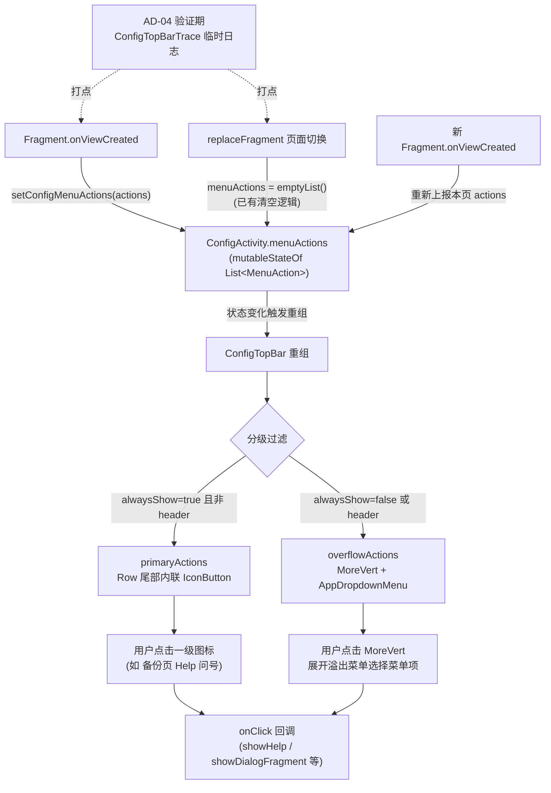

# 顶栏图标语义修复（topbar-icon-semantics-fix）设计文档

> 规格目录：`docs/specs/topbar-icon-semantics-fix/`
> 日期：2026-08-28
> 关联规范：`docs/project-flow/ui-standards/architecture.md`（四组件族门禁）、`docs/project-flow/ui-standards/how-to.md`（八严禁清单）
> 参照策略：原版（Archive）菜单体系——`showAsAction always` = 一级图标（1~3 个）、`never` = 溢出菜单；`when` 统一分发，零死按钮

## 背景与现状

设置宿主页（ConfigActivity）顶栏目前将 Fragment 上报的全部菜单动作塞进「三点溢出菜单」，丢失了「一级图标」语义（典型：备份与恢复页的「帮助」问号被吞进溢出菜单）。同时排查中发现三处死按钮隐患与一个未实证的状态残留假设。

### 现状事实（源码核实，2026-08-28）

| 锚点 | 事实 |
|------|------|
| `ui/widget/components/AppMenuSheet.kt:32-39` | `MenuAction` 数据类现有 6 字段：`icon: ImageVector` / `title: String` / `tint: Color?` / `checked: Boolean?` / `header: Boolean = false` / `onClick: () -> Unit`（**onClick 无默认值居尾**，调用点为尾 lambda 形式） |
| `ui/config/ConfigActivity.kt:71` | `var menuActions by mutableStateOf<List<MenuAction>>(emptyList())` 常驻 Activity |
| `ui/config/ConfigActivity.kt:73-77` | `setConfigMenuActions`：值不等才赋值（防抖） |
| `ui/config/ConfigActivity.kt:162-171` | `replaceFragment` **已有**切换清空逻辑：`menuActions = emptyList()` 后再 replace（注释「切换目标页时清空上一页上报的菜单，由新页 onViewCreated 上报自己的菜单」） |
| `ui/config/ConfigActivity.kt:180-268` | `ConfigTopBar`（private composable）：Box(clip 圆角 + bgColor + statusBarsPadding + 56dp) > Row > [返回 IconButton + Text(weight 1f) + Box{MoreVert IconButton + AppDropdownMenu}]；`actions.isEmpty()` 时渲染 48dp Spacer |
| `ui/widget/components/AppDropdownMenu.kt:34-104` | `header=true` 渲染不可点文本标签；普通项 `Surface.clickable { onDismiss(); onClick() }`，支持 tint/checked |
| `ui/config/BackupConfigFragment.kt:130-146` | `onViewCreated` 上报 [Help, Log] 两个 MenuAction；首次自动 `showHelp("webDavHelp")` |
| `ui/widget/AppManagementScaffold.kt:53`（隐患） | `AppManagementAction.onClick` 默认 `{}`，可空实现 → 潜在死按钮 |
| `ui/widget/GlassTopAppBar.kt:138`（隐患） | 仅 `navIcon != null && onNavClick != null` 才渲染返回键，否则静默无返回键 |

---

## 1. Technical Approach

### 1.0 根因链：B 类 18 页「一级图标」语义三级丢失（二次审查结论）

| 时点 | 环节 | 每步丢失内容 | 证据 |
|------|------|-------------|------|
| T1（2026-08-14） | commit 5f5652db「ui-redesign-m3 菜单下沉」范式确立 | 首次降维 replace_edit，「一级图标」语义开始丢失 | `docs/specs/ui-redesign-m3/pages-inventory.md:199` |
| T2（2026-08-19） | archive-ui-migration-202608 7.11x 搬壳不搬语义 | 迁移未对照原版 `showAsAction`；MenuProvider 系统 Toolbar 侥幸保住 always 语义 | archive spec 7.11x |
| T3（2026-08-27） | H6 收敛：数据模型 + 单容器渲染双向降维 | MenuAction 无 `showAsAction` 承接字段（AppMenuSheet.kt:32-39）+ ConfigTopBar 仅单一 MoreVert 容器（ConfigActivity.kt:248-263），语义蒸发 | 源码核实 |

流程四因（规范与流程层缺口，防重犯机制见 §2 AD-05/AD-06 与 §4 文档变更）：

1. 规范只审视觉：ui-standards 审查仅覆盖视觉一致性，无原版语义对照维度。
2. 迁移登记表无「原 always 处置」列：迁移时未强制记录每个动作的 showAsAction 去向。
3. 验收全视觉断言：验收用例只断言视觉元素，未断言「一级图标 / 溢出」分层语义。
4. icon 字段留存 review 盲区：数据模型中 icon 字段仍在，review 误判菜单语义已保留。

分层实施，自下而上共四层：

### ① 数据层：MenuAction 增加 alwaysShow 字段

```kotlin
data class MenuAction(
    val icon: ImageVector,
    val title: String,
    val tint: Color? = null,
    val checked: Boolean? = null,
    val header: Boolean = false,
    val alwaysShow: Boolean = false,   // 新增：true=一级图标，false=溢出菜单（默认，向后兼容）
    val onClick: () -> Unit            // 保持必填、保持最后（尾 lambda 调用语法不破坏）
)
```

- 默认 `false`：全部 38 处既有调用点零改动即保持「溢出菜单」现状。
- 字段插在 `onClick` 之前：带默认值字段归拢，且不改变 `onClick` 的尾参位置。
- 语义约束（写入 KDoc）：`header=true` 项是溢出菜单内的分组标签，不是动作图标，**不得**与 `alwaysShow=true` 组合使用（渲染层亦作防御过滤，见 ②）。

### ② 渲染层：ConfigTopBar 分级算法（单组件内闭环）

```text
ConfigTopBar(title, onBack, actions):
    primaryActions  = actions.filter { it.alwaysShow && !it.header }   // 一级图标（防御性排除 header）
    overflowActions = actions.filter { !it.alwaysShow || it.header }   // 溢出菜单（header 强制归入）
    Row {
        IconButton(onBack)                        // 返回键（不变）
        Text(title, Modifier.weight(1f))          // 标题（不变）
        primaryActions.forEach { action ->
            IconButton(onClick = action.onClick) { Icon(action.icon) }   // 内联一级图标
        }
        if (overflowActions.isNotEmpty()) {
            Box {
                IconButton { MoreVert }                                   // menuExpanded = true
                AppDropdownMenu(menuExpanded, onDismiss, overflowActions) // 仅喂溢出子集
            }
        } else if (primaryActions.isEmpty()) {
            Spacer(width = 48.dp)                 // 兜底对齐返回键宽（等价原 actions.isEmpty() 分支）
        }
    }
```

要点：
- 分级是**纯过滤**，`actions.isEmpty()` 兜底 Spacer 语义保持（全空才补位）。
- `AppDropdownMenu` 签名零改动，溢出路径复用既有渲染（含 header 分组标签、tint、checked 能力）。
- 一级图标数量约束 1~3 个靠 ui-standards 规范约束（见 §4 文档变更），不做编译期强制。

### ③ 页面层：ConfigTopBar 系页面上报加 alwaysShow（备份 Help + 主题 DarkMode）

`onViewCreated` 上报处（BackupConfigFragment.kt:130-142 / ThemeConfigFragment.kt:32-39），一级项加 `alwaysShow = true`：

```kotlin
MenuAction(
    icon = Icons.AutoMirrored.Filled.Help,
    title = getString(R.string.help),
    alwaysShow = true        // 恢复顶栏问号一级图标（对齐原版 Archive showAsAction=always 语义）
) { showHelp("webDavHelp") }
```

Log 项保持默认（溢出）。ConfigTopBar 系本次修两页：备份恢复页 Help、主题设置页 DarkMode；上报方无需自传 tint（渲染层统一 contrastOn(bgColor)，见 AD-07）。

### ④ 排查层：Fragment 切换 menuActions 残留假设的验证路径

现状：`replaceFragment` 已有切换点清空（ConfigActivity.kt:162-171），残留假设需先实证再修。

- **临时日志统一 tag**：`ConfigTopBarTrace`（与 tasks.md 0.4/1.2/5.3 一致；真机 logcat 过滤该 tag，禁全量日志）。
- **打点位置**（仅 2 处，实施验证期临时添加，验证后移除）：
  - `setConfigMenuActions` 入口：记录 `actions.size` + 列表 identityHashCode（记录数量与标识，不输出菜单业务文案）；
  - `replaceFragment` 清空点：记录 `configTag` + 清空动作。
- **验证矩阵**：①页内切换（备份恢复 → 其他 → 备份恢复）②返回重进 ③屏幕旋转/Activity 重建。
- **判定标准**：logcat 序列中若出现「新页 onViewCreated 上报前，旧页菜单仍可见的重组帧」→ 实锤残留 → 触发 AD-04 修复（预设方向：Fragment `onDestroyView` 时上报空列表，与现有切换点清空互补）；若无实锤 → 移除临时日志，关闭假设，零代码变更。

### ⑤ 四组件系分层修复（B 类 18 页 / 25 项收拢回归，二次审查全量普查）

> 修复原则（AD-05）：对齐 Archive 原版 `showAsAction` 语义——`always` → 一级图标、`never` → 溢出下拉；D 类重构与有意进化除外。

| 组件系 | 修复方式 | 取色接入点 | 涉及页面清单 |
|--------|---------|-----------|-------------|
| ConfigTopBar 系 | MenuAction.alwaysShow 分级渲染（即 §1 ①②③，一次组件改造） | 新直出一级 IconButton tint 用 `contrastOn(bgColor)`（与顶栏包背景消费自洽，禁止硬编码） | 备份 Help、主题 DarkMode |
| GlassTopAppBar 系 | 页面 actions 槽直接写一级 IconButton（组件已支持，无需改造） | 继承 `actionIconContentColor`（=contrastOn(barColor)，深色壁纸自动黑/白适配），调用方禁止自传 tint | 订阅源编辑 3 项、替换编辑 2 项、txt_toc 与 dict 新增、缓存分组、WebDav 刷新排序、导入选目录排序、收藏夹分组、书信息页 6 项、视频浮窗等 |
| MainTopBarView 系 | Mode.MY / Mode.RSS 布局增加一级图标位 | 新按钮必须进 `updateIconColors()` 清单（tint=context.primaryTextColor）+ `setMode` 显隐声明 + applyDefaultStyle/applyRegularStyle 两风格尺寸同步，禁止硬编码 | 我的 tab 帮助（MyFragment.kt:120 moreButton 点击直接 showHelp("appHelp")，语义不符）；订阅 tab 历史/分组/设置（RssFragment.kt:950-962） |
| View TitleBar 系 | TitleBar 加一级图标按钮 | 走 BaseActivity `applyTint` final 链（toolBarTheme→getMenuColor→titleTextColor 夜间联动）或图标色用 `context.titleTextColor`，禁止硬编码 | 书源编辑（BookSourceEditActivity.kt:125-144 ModernActionPopup(R.menu.source_edit)） |

C 类疑似丢失 3 项（封面启停 / 正文全屏编辑 / 主题剪贴板导入）：列入 showasaction-audit.md 待核实后逐项裁决。判定型页面（ifRoom / 动态显隐）逐项裁决后增补（批E）。

---

## 2. Architecture Decisions

### AD-01: MenuAction 增加 alwaysShow 字段实现分级

- **Context**：`MenuAction`（AppMenuSheet.kt:32-39）现有 6 字段无「展示层级」语义；ConfigTopBar 将全部 actions 塞入溢出菜单（ConfigActivity.kt:247-261），Backup 页 Help 被迫降级为菜单项。
- **Concern**：需要让页面声明某动作属「一级图标」还是「溢出菜单」；若新建第二套数据类或每页手写顶栏布局，将破坏 H6/H8 已收敛的「单组件 + 数据上报」架构，且波及 38 处调用点。
- **Decision**：`MenuAction` 增加 `alwaysShow: Boolean = false` 字段，默认 false 向后兼容，插入位置在 `onClick` 之前（保住尾 lambda 调用语法）。
- **Goal**：单一数据模型承载分级语义，调用方一行声明即可改变展示层级，既有调用点零迁移。
- **Tradeoff**：数据类字段膨胀 1 个；一级图标 1~3 个的数量上限靠规范约束而非编译期强制。
- **Status**：Accepted

### AD-02: ConfigTopBar 分级渲染保持单组件

- **Context**：ConfigTopBar 是设置宿主页唯一顶栏（ConfigActivity 私有 composable，ConfigActivity.kt:180-268）；AppDropdownMenu 已承接 38 处调用点（H8 改造）。
- **Concern**：分级渲染若拆成两个组件或引入新的「顶栏图标行」组件，违反 ui-standards 四组件族门禁（防私自拉组件）。
- **Decision**：ConfigTopBar 单组件内完成分级：`primaryActions`（`alwaysShow && !header`）内联 IconButton 渲染；`overflowActions` 继续走既有 MoreVert + AppDropdownMenu；全空保留 48dp Spacer 兜底。
- **Goal**：零新组件、AppDropdownMenu 签名零改动、外部调用点零变更，改动收敛在单 composable 内。
- **Tradeoff**：ConfigTopBar 函数体增长约 15 行（以分级伪代码结构注释维持可读性）；溢出菜单不再包含 alwaysShow 项（语义即预期行为）。
- **Status**：Accepted

### AD-03: 死按钮防线三道

- **Context**：三处隐患——`MenuAction.onClick` 无默认值（编译期防线**已存在**）；`AppManagementScaffold.kt:53` `AppManagementAction.onClick` 默认 `{}` 可空实现；`GlassTopAppBar.kt:138` `navIcon != null && onNavClick != null` 才渲染返回键（不满足时静默无返回键）。
- **Concern**：默认 `{}` 与静默不渲染都可能产出「点了没反应」或「回不去」的死按钮；强制改签名（去默认值/抛异常）会波及大量既有调用点，收益不成比例。
- **Decision**：三道防线——① **编译期**：`MenuAction.onClick` 保持必填不动；② **文档期**：GlassTopAppBar 对「onNavClick 为 null 时返回键不渲染」的静默行为补 KDoc 警示（调用方须自行保证返回可达性），不强制改签名；③ **流程期**：真机走查任务，参照原版 Archive 策略（always=一级图标 1~3 个、never=溢出、when 统一分发零死按钮）逐页核对。
- **Goal**：不引入破坏性签名变更的前提下，把死按钮拦在编译、文档、真机三个阶段。
- **Tradeoff**：KDoc 警示依赖开发者自觉（非编译强制）；真机走查有一次性人工成本。
- **Status**：Accepted

### AD-04: Fragment 切换 menuActions 残留采用「真机验证先行，实锤才修」策略

- **Context**：`menuActions` 常驻 Activity（mutableStateOf），Fragment 经 `setConfigMenuActions` 上报；`replaceFragment` 已在切换点清空（ConfigActivity.kt:162-171），现有清空逻辑是否覆盖全部路径未实证。
- **Concern**：仍存在未实证的残留窗口可能——如绕过 `replaceFragment` 的切换路径、transaction commit 异步窗口内的上报时序竞态、Fragment view 重建路径漏上报；若不实证就叠加双重清空（onDestroyView 上报空列表），可能引入新的竞态。
- **Decision**：真机验证先行（排查层方案见 §1-④：统一 tag `ConfigMenuAudit`、两处打点、三矩阵、明确判定标准）；实锤存在残留才修，预设修复方向为 Fragment `onDestroyView` 时上报空列表（与现有切换点清空互补，而非替换）。
- **Goal**：修复决策基于运行时证据，避免为未实证问题引入双重清空竞态。
- **Tradeoff**：验证期需临时日志与真机时间；若不实锤则零代码变更（验证成本沉没）。
- **Status**：Proposed

### AD-05: 修复原则 = 对齐 Archive showAsAction 语义

- **Context**：二次审查全量普查确认 B 类 18 页 / 25 项收拢回归模式一致（三级丢失链见 §1.0），原版 Archive 中每个菜单项均有明确 `showAsAction` 声明。
- **Concern**：若逐页自行判定「哪个该一级、哪个该下拉」，无统一基线将导致标准不一、同类页面密度漂移，且主观裁决易再引入争议。
- **Decision**：以原版 `showAsAction` 为唯一对照基线——`always` → 一级图标、`never` → 溢出下拉；D 类重构与有意进化除外。
- **Goal**：语义恢复有据可依，防主观裁决；审计表（showasaction-audit.md）逐项登记原值与处置，形成防重犯闭环。
- **Tradeoff**：部分页面原版密度较高（如书信息页 6 项全 always），直接照搬可能超「一级图标 1~3 个」规范约束——此类页面归入批E 逐项裁决兜底（该超限处置本身属有意进化豁免，需在审计表记录理由）。
- **Status**：Accepted

### AD-06: 四组件系分层修复

- **Context**：B 类 18 页分布在 4 种顶栏体系（ConfigTopBar 系 / GlassTopAppBar 系 / MainTopBarView 系 / View TitleBar 系，见 §1-⑤），数据模型与渲染能力各异。
- **Concern**：单一方案（如全部强制走 MenuAction.alwaysShow）无法覆盖——GlassTopAppBar 有自己的 actions 槽、MainTopBarView 是 View 体系多 Mode 布局、书源编辑走 ModernActionPopup，强行统一需大规模改造。
- **Decision**：四系各取最小改动——ConfigTopBar 走 alwaysShow 数据驱动分级；GlassTopAppBar 页面 actions 槽直写一级 IconButton；MainTopBarView 改 Mode.MY/Mode.RSS 布局增加一级图标位；View TitleBar 加一级图标按钮。
- **Goal**：各系以最小改动恢复语义，不破坏既有组件族架构与四组件族门禁。
- **Tradeoff**：4 种修法并存，维护成本略升；长期收敛依赖后续顶栏迁移统一（迁移时按 AD-05 基线与审计表执行）。
- **Status**：Accepted

### AD-07: 一级图标取色接入权威源

- **Context**：TopBarConfig（help/config/TopBarConfig.kt:50-71，19 字段）与顶栏管理 UI（TopBarEditDialog.kt:283-430）均无右上角操作区 tint/显隐/样式控制开关——原版"整体控制"=颜色单源机制+显隐规则内聚，非用户开关；原版接入标准：Activity 菜单走 BaseActivity.kt:172-176 `applyTint` final 链（toolBarTheme→getMenuColor→titleTextColor 夜间联动），MainTopBarView 图标色内聚在 `updateIconColors()`（MainTopBarView.kt:543-550）+ `setMode`（:180-186）显隐声明。OURS 四组件系操作区取色现状不统一：MainTopBarView 用 context.primaryTextColor（不消费 TopBarConfig 图标层）、GlassTopAppBar 用 `topAppBarColors(actionIconContentColor=contrastOn(barColor))`（GlassTopAppBar.kt:105-111，深色壁纸自动黑/白适配，机制最健壮）、ConfigTopBar MoreVert 用 palette.primaryText 但消费顶栏包背景（含用户自定义深色背景）存在"包背景与图标色脱钩"裂缝、AppManagementTopBar/AppManagementMoreActionButton 完全不消费 TopBarConfig。
- **Concern**：新增一级图标若硬编码 tint，会在换肤/夜间/深色壁纸场景下颜色错乱，破坏 Archive 主题体系（颜色单源机制）边界。
- **Decision**：各组件系按对应权威源接入，全部禁止硬编码颜色——View 系（MainTopBarView）新按钮进 `updateIconColors()` 清单 + `setMode` 显隐声明 + applyDefaultStyle/applyRegularStyle 两风格尺寸同步；GlassTopAppBar 系继承 `actionIconContentColor`、调用方禁止自传 tint；ConfigTopBar 新直出图标 tint 用 `contrastOn(bgColor)`（与背景消费自洽，修复裂缝在该图标上不扩大）；View TitleBar 走 `applyTint` 链或 `context.titleTextColor`。
- **Goal**：新增一级图标随主题/顶栏包/夜间/深色壁纸自动适配，不破坏 Archive 主题体系边界。
- **Tradeoff**：ConfigTopBar 直出图标与既有 MoreVert（palette.primaryText）短暂不一致；MoreVert 既有 tint 统一与 Glass 门控口径问题登记 P2 可选优化，不在本任务扩大。
- **Status**：Accepted

---

## 3. Data Flow



> 注：上图仅覆盖 ConfigTopBar 系数据流（分级分支已含 primaryActions / overflowActions 双路径）。AD-06 其余三系不走 menuActions 上报链路：GlassTopAppBar 系在页面 actions 槽内直写一级 IconButton（页面内闭环）；MainTopBarView 系改 Mode.MY / Mode.RSS 布局一级图标位（View 体系点击事件直连）；View TitleBar 系加一级图标按钮（书源编辑 ModernActionPopup 收敛）。见 §1-⑤。

---

## 4. File Changes

| 文件 | 变更类型 | 内容 |
|------|---------|------|
| `app/src/main/java/io/legado/app/ui/widget/components/AppMenuSheet.kt` | 修改 | `MenuAction` 新增 `alwaysShow: Boolean = false` 字段（插在 `header` 之后、`onClick` 之前）；KDoc 补分级语义与「header 不得与 alwaysShow 组合」约束 |
| `app/src/main/java/io/legado/app/ui/config/ConfigActivity.kt` | 修改 | `ConfigTopBar` 分级渲染改造：`primaryActions`（`alwaysShow && !header`）内联 IconButton + `overflowActions` 复用 MoreVert + AppDropdownMenu；全空保留 48dp Spacer；（条件性）AD-04 实锤后叠加 Fragment 切换时序加固 |
| `app/src/main/java/io/legado/app/ui/config/BackupConfigFragment.kt` | 修改 | Help 菜单项上报加 `alwaysShow = true`（恢复顶栏问号一级图标）；Log 项保持溢出 |
| `app/src/main/java/io/legado/app/ui/config/ThemeConfigFragment.kt` | 修改 | DarkMode 菜单项上报加 `alwaysShow = true`（恢复主题设置页一级亮度图标，对齐原版 theme_config.xml always 语义） |
| `docs/project-flow/ui-standards/architecture.md` | 文档 | §四门禁补条款：ConfigTopBar 菜单分级规范——alwaysShow 一级图标限 1~3 个、其余入溢出菜单、MenuAction.onClick 必接真实回调禁死按钮 |
| `docs/project-flow/ui-standards/how-to.md` | 文档 | §八严禁清单 + §2.1 补条款：新增顶栏 MenuAction 必须显式声明 alwaysShow 语义（一级/溢出）并接真实 onClick，禁止默认 `{}` 空实现 |
| `app/src/main/java/io/legado/app/ui/widget/AppManagementScaffold.kt` | 不改（仅记录） | AD-03 评估结论：`AppManagementAction.onClick` 默认 `{}` 暂不强制改签名，靠真机走查拦截（本规格不改此文件） |
| `app/src/main/java/io/legado/app/ui/widget/GlassTopAppBar.kt` | 修改（KDoc only） | navIcon/onNavClick 静默不渲染返回键的行为补 KDoc 警示，签名与逻辑零改动 |
| `app/src/main/java/io/legado/app/ui/widget/MainTopBarView.kt` | 修改 | Mode.MY / Mode.RSS 布局增加一级图标位（四组件系 MainTopBarView 系改造，见 §1-⑤ / AD-06） |
| `app/src/main/java/io/legado/app/ui/main/my/MyFragment.kt` | 修改 | 我的 tab 帮助恢复一级图标位（现状 moreButton 点击直接 showHelp("appHelp") 语义不符，MyFragment.kt:120） |
| `app/src/main/java/io/legado/app/ui/main/rss/RssFragment.kt` | 修改 | 订阅 tab 历史/分组/设置恢复一级图标位（RssFragment.kt:950-962） |
| `app/src/main/java/io/legado/app/ui/rss/source/edit/RssSourceEditActivity.kt` | 修改 | GlassTopAppBar 系：订阅源编辑 3 项恢复一级图标（actions 槽直写一级 IconButton） |
| `app/src/main/java/io/legado/app/ui/replace/edit/ReplaceEditActivity.kt` | 修改 | GlassTopAppBar 系：替换编辑 2 项恢复一级图标（actions 槽直写一级 IconButton） |
| `app/src/main/java/io/legado/app/ui/book/toc/rule/TxtTocRuleScreen.kt` | 修改 | GlassTopAppBar 系：txt_toc 编辑页新增项恢复一级图标 |
| `app/src/main/java/io/legado/app/ui/dict/rule/DictRuleScreen.kt` | 修改 | GlassTopAppBar 系：dict 编辑页新增项恢复一级图标 |
| `app/src/main/java/io/legado/app/ui/book/cache/CacheActivity.kt` | 修改 | GlassTopAppBar 系：缓存分组恢复一级图标 |
| `app/src/main/java/io/legado/app/ui/book/import/ImportBookScreen.kt` | 修改 | GlassTopAppBar 系：导入选目录排序恢复一级图标 |
| `app/src/main/java/io/legado/app/ui/rss/favorites/RssFavoritesActivity.kt` | 修改 | GlassTopAppBar 系：收藏夹分组恢复一级图标 |
| `app/src/main/java/io/legado/app/ui/book/source/edit/BookSourceEditActivity.kt` | 修改 | View TitleBar 系：书源编辑菜单恢复一级图标按钮（ModernActionPopup(R.menu.source_edit)，BookSourceEditActivity.kt:125-144） |
| `docs/specs/topbar-icon-semantics-fix/showasaction-audit.md` | 新增（文档） | 1.4 审计表：18 页 / 25 项 B 类收拢回归 + C 类疑似丢失 3 项逐项登记（原 showAsAction 语义、现状、修复归属组件系）；判定型页面（ifRoom / 动态）批E 裁决后增补 |
| `docs/project-flow/ui-standards/migration-registry.md` | 修改（文档） | 迁移登记表新增「原 always 处置」必填列（对齐 §1.0 流程四因之 2，防重犯机制）；H6 等历史条目按 1.4 审计表补记 |

> 批E 判定型页面（ifRoom / 动态显隐）待逐项裁决后增补本表；GlassTopAppBar 系剩余页面（书信息页 6 项、WebDav 刷新排序、视频浮窗等）与 C 类疑似丢失 3 项以 showasaction-audit.md 1.4 审计表为准，裁决后同步进本表。

> 注：MenuAction 定义文件经核实为 `AppMenuSheet.kt`（非背景预估的 AppDropdownMenu.kt）；`replaceFragment` 切换清空逻辑已存在（ConfigActivity.kt:162-171），AD-04 为验证性条目，实锤前 ConfigActivity 不叠加修复代码。
