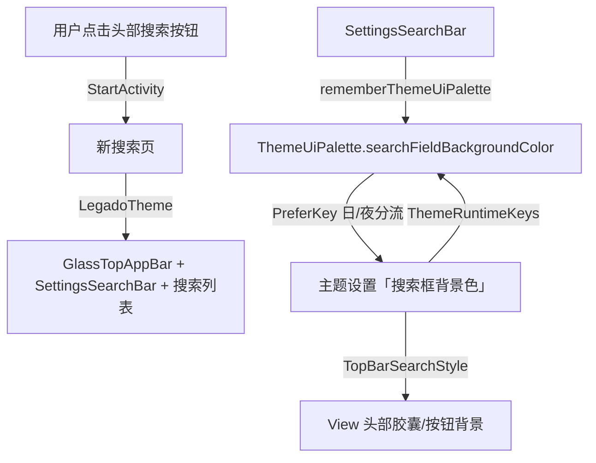

# 主Tab头部搜索入口形态统一与主题取色对齐 — 技术设计（design.md）

## 设计阶段深度审查记录（2026-08-28，检查点 1 前置核实）

> 用户要求：设计阶段核实清楚卡点后再实施。以下为逐项源码核实结论（全部基于 Grep/Read 实证，非推测）。

### 审查发现的卡点与处置

| # | 级别 | 卡点描述 | 核实证据 | 处置 |
|---|------|---------|---------|------|
| B1 | P0 | 发现页关胶囊触发 **titleSelect 互斥连锁**：regular 风格 `titleSelect.isVisible = !searchEntryRequested`（MainTopBarView L458-460），胶囊占满 title 行时 titleSelect 被压制；关胶囊后 titleSelect（标题"发现"+箭头，点击弹源选择菜单 L1908/长按弹分类 L1911）自动显示——胶囊实际承担"源名 hint + 搜索入口 + 压制 titleSelect"三重角色 | MainTopBarView L458-464、ExploreFragment L1908-1913/L2731-2737 | 纳入设计：titleSelect 显示为预期行为（对齐订阅页策略），真机验证场景 6 补充；源名不再显示于头部（titleText regular 固定"发现"）视为可接受（对齐订阅页 regular 显示"订阅"） |
| B2 | P0 | **订阅页根因描述错误（原设计）**：`initComposeTopBar()` L947 初始化已 `setSearchEntryVisible(false)`（注释"搜索已改为弹全屏搜索页，隐藏内置搜索条"），`renderEmptyState()` L826 也关闭；**真正根因是 `selectSource()` L604 `setSearchEntryVisible(hasSearch)` 选中源后覆盖初始化状态** | RssFragment L946-948/L826/L604 | 修正部件 B：移除 selectSource 的覆盖调用（而非"改为 false"重复设置），保留既有初始化/空状态关闭 |
| B3 | P0 | **ThemeUiPalette 死槽位不可直接消费（原 AD-02 方案错误）**：`themeSearchFieldBackgroundColorOrDefault()` 未配置回退 `R.color.background_menu`（非 surfaceVariant），且 palette 无 `hasCustomSearchFieldColor` 标志（只有 card/muted 有）——直接消费槽位会让默认主题 14 处搜索框发生视觉回归 | ThemeUiPalette L102-116/L209-216（Grep 证无 hasCustomSearchField） | 修正 AD-02：改用 `themeSearchFieldBackgroundColorOrNull()` 直读，未配置回退 surfaceVariant（零回归）；死槽位登记 issue-list 不动 |
| B4 | P1 | **alpha 口径差异**：View 侧配置色叠 alpha（日 0.18/夜 0.42）+ 1dp 描边浮在顶栏壁纸上；Compose 若用不透明配置色，双端观感不一致 | TopBarSearchStyle L22-46/L57-64 | 新增 AD-05：Compose 同 alpha 叠加 + 描边对齐 |
| B5 | P1 | **影响面清单缺失**：SettingsSearchBar 全部调用点 = 14 处（高亮/设置搜索/网址记录/RSS搜索/阅读记录/订阅调试/换源×2/自动任务/缓存/搜索内容/源选择/书架管理），取色改动全局生效 | Grep `SettingsSearchBar\(` 14 命中 | 已登记 File Changes + 验收场景 7（默认零回归）；组件级单点修改是预期收益 |
| B6 | P2 | **searchButton 显隐竞争核实**：setMode(DISCOVERY) L182 置 true → updateDiscoverSearchButtonState L1976 覆盖为 `canSearch && !regular`；default 风格 applyDefaultStyle L409-411 仅对 BOOKSHELF/MY 生效，不影响 DISCOVERY——改 `canSearch` 后 default 行为不变（现状 default 下 `!regular`=true 同样恒显） | MainTopBarView L182/L409-411、ExploreFragment L1974-1981 | 确认无回归，维持部件 A 方案 |
| B7 | P2 | **订阅页 titleSelect 衔接核实**：selectSource 后 titleSelect 点击 = `showSourceSelector()`（RssFragment L458 已有绑定），关胶囊后自然衔接，无额外改动 | RssFragment L440/L458 | 无需改动，真机验证覆盖 |

### 审查后规范对齐核查（2026-08-28 第二轮，用户指令"再次全面查看前端设计子规范对齐整体设计"）

| # | 级别 | 发现 | 规范依据 | 处置 |
|---|------|------|---------|------|
| B8 | P0 | **B3 修正方案（v2 OrNull 直读 + surfaceVariant 回退）本身违规**：`SettingsSearchBar` 现用 `colorScheme.surfaceVariant` 属**既有 M3 派生色违规**，v2 方案延续该违规 | color.md §五 M3 派生色禁令（硬约束，H9/H11 教训）+ how-to.md L195（严禁清单第 2 条 + 正例 palette 直色）+ theme-architecture.md 红线 4（禁止 M3 派生色取色，必须经 LegadoTheme palette） | **推翻 v2，采用 v3 最终方案：消费 `rememberThemeUiPalette().searchFieldBackgroundColor` 槽位**（color.md §一 key 表本意：`themeSearchFieldBackgroundColor` 自定义 → `background_menu` R.color 兜底）+ alpha 对齐 View 口径；**彻底清除 surfaceVariant**（修正既有违规，与 H9/H10/H11 同性质）；B3 的"视觉回归"重新定性为"规范对齐的必然观感变化"（未配置态 md_grey_200 叠 alpha ≈ surfaceVariant 灰度，轻微差异属合规修正）；hasCustom 标志不再需要（palette 槽位自带兜底） |
| B9 | P1 | **frontend-ui-standards.md §1.4 旧条款与新规范矛盾**："搜索框浅底统一用 surfaceVariant（Compose）"是 bugfix-ui-20260824 时期产物，早于 color.md 禁令（2026-08-27），规范内部自相矛盾 | color.md §五 + how-to.md 严禁清单 | 部件 D 修订该条款为 palette 槽位口径（`themeSearchFieldBackgroundColor` + `background_menu` 兜底），消除规范内部矛盾 |
| B10 | P2 | 日/夜 alpha 判断入口合规确认：Compose 侧用 `AppConfig.isNightTheme`（palette key 路由已内含 N 后缀键经 ThemeRuntimeKeys），非自建 uiMode 判断 | theme-architecture.md 红线 1（禁止绕过 isNightTheme）+ 红线 6（禁止手写日夜成对键） | 合规 ✓；取色重组联动确认：`themeUiSignature()` 已含 search key（ThemeUiPalette L177），配置改动自动触发重组 |
| B11 | P2 | 骨架兼容确认：how-to.md L253 搜索列表页骨架 = GlassTopAppBar + SettingsSearchBar，本次不改骨架仅改取色 | how-to.md L253 | 兼容 ✓ |

### AD-02 废弃链（B3→B8 两轮修正）

- v1（初版）：消费 ThemeUiPalette 死槽位 → 被自己 B3 否决（误判"回归风险"）
- v2：OrNull 直读 + surfaceVariant 回退 → **被 B8 规范核查否决**（延续 M3 派生色违规）
- **v3（最终）**：消费 `rememberThemeUiPalette().searchFieldBackgroundColor` 槽位 + 统一 alpha（0.18/0.42）+ 描边同源，**彻底清除 surfaceVariant** → Accepted

### 审查后剩余待澄清点（已裁决）

1. **订阅页形态**（AD-03）：✅ 用户已裁决「纯按钮」（2026-08-28 23:05）。
2. **源名头部展示**：关胶囊后 titleText 固定"发现"/"订阅"（对齐订阅页既有策略），源名经 titleSelect 点击查看——已在检查点汇报，随本轮再审确认。

## Technical Approach

### 现状双栈取色链路（权威）

```
主题设置 key（themeSearchFieldBackgroundColor / Night）
  → ThemeRuntimeKeys（日/夜分流）
  → ① View 侧 TopBarSearchStyle.surfaceColor(context)      → 胶囊/搜索框背景（alpha 日0.18/夜0.42）
    ② Compose 侧 ThemeUiPalette.searchFieldBackgroundColor → 定义但无消费方（死槽位，Grep 实证）
    ③ Compose 侧 SettingsSearchBar 实际用 MaterialTheme.colorScheme.surfaceVariant → 不读配置色
  → 组件渲染
```

### 部件 A：发现页搜索入口统一为纯按钮

**文件**：`app/src/main/java/io/legado/app/ui/main/explore/ExploreFragment.kt`

1. `onCreateView`（约 L270）：`binding.topBar.setSearchEntryVisible(true)` → `setSearchEntryVisible(false)`。
2. `updateDiscoverSearchButtonState()`（约 L1974-1981）：
   - `searchButton.isVisible = canSearch && !binding.topBar.isRegularStyle()` → `searchButton.isVisible = canSearch`（regular 风格也显示按钮）；
   - 保留 `searchButton.isEnabled = canSearch` 与 `alpha` 逻辑；
   - 移除/保留 `searchEntry.isEnabled/alpha` 无害（胶囊已隐藏）。
3. `onCreateView`（约 L1927-1928）：`searchEntry.setOnClickListener { openDiscoverSearch() }` 绑定保留或删除均无碍（胶囊隐藏不触发）；为清理可删。

**风险点**：确认 `MainTopBarView.applyDefaultStyle()` 中 `searchButton.isVisible = showSearch`（BOOKSHELF/MY 模式）与 `Mode.DISCOVERY` 分支（L182 `searchButton.isVisible = mode==DISCOVERY||RSS||MY`）不冲突——发现页 regular 下由 `updateDiscoverSearchButtonState` 直接控制按钮显隐，default 下走 `showSearchInDefaultStyle`。

### 部件 B：订阅页形态统一（按用户裁决）

**文件**：`app/src/main/java/io/legado/app/ui/main/rss/RssFragment.kt`

- ⚠️ 审查修正（B2）：`initComposeTopBar()` L947 初始化已 `setSearchEntryVisible(false)`，`renderEmptyState()` L826 也已关闭；**根因是 `selectSource()` L604 `setSearchEntryVisible(hasSearch)` 覆盖初始化状态**。
- 选项 1（纯按钮，推荐）：
  - `selectSource`（L604）：**删除** `binding.topBar.setSearchEntryVisible(hasSearch)` 一行（保留既有初始化/空状态关闭，不重复设置）；
  - L610：`searchButton.isVisible = hasSearch && !binding.topBar.isRegularStyle()` → `searchButton.isVisible = hasSearch`（regular 风格也可见）；
  - L611-612：删除 `searchEntry.isEnabled/alpha` 两行残留；
  - L605-607：setTitle 逻辑保持（regular && hasSearch 显示"订阅"）——titleSelect 自动显示后点击弹 `showSourceSelector()`（L458 既有绑定，B7 已核实衔接）。
- 选项 2（保守保留）：不动显隐，仅纳入部件 C 取色对齐验证。

### 部件 C：Compose 搜索框取色对齐主题设置（v3 最终版，B8 规范对齐）

**文件**：`app/src/main/java/io/legado/app/ui/widget/components/SettingsSearchBar.kt`

1. 背景取色（v3：消费 palette 槽位，清除 surfaceVariant）：
   - `rememberThemeUiPalette().searchFieldBackgroundColor`（取色链：`themeSearchFieldBackgroundColor` 自定义 key → `R.color.background_menu` 兜底，color.md §一 key 表本意）；
   - 统一叠 alpha：`Color(palette.searchFieldBackgroundColor).copy(alpha = if (AppConfig.isNightTheme) 0.42f else 0.18f)`（AD-05 对齐 `TopBarSearchStyle` 口径，isNightTheme 判断符合 theme-architecture 红线 1）；
   - 描边同源：1dp `TopBarSearchStyle.strokeColor` 同逻辑（primaryTextColor 低透明度）；
   - **彻底清除 `MaterialTheme.colorScheme.surfaceVariant`**（修正既有 M3 派生色违规，color.md §五 + how-to.md 严禁清单）；
   - 保持 `AppShapes.Search`（18dp）+ 40dp 高度不变。
2. 重组联动：`themeUiSignature()` 已含 search key（ThemeUiPalette L177），配置改动/日夜切换自动触发重组（B10）。
3. 14 处调用点（B5 清单）自动联动，无需逐点修改。
4. `ThemeUiPalette` 槽位由死槽位转正（本组件即消费方），无需新增 hasCustom 标志。

**默认观感说明（合规修正非回归）**：未配置态从 surfaceVariant 变为 background_menu（md_grey_200）叠 alpha——两者同为灰度系，观感轻微变化属清除 M3 派生色违规的规范对齐（与 H9/H10/H11 修正同性质）。

### 部件 D：前端 UI 规范补充与矛盾修订

**文件**：`docs/project-flow/frontend-ui-standards.md` + `docs/project-flow/ui-standards/architecture.md`

1. `frontend-ui-standards.md`：
   - **修订 §1.4 矛盾条款**（B9）："搜索框浅底统一用 surfaceVariant（Compose）" → "搜索框底色统一走 `ThemeUiPalette.searchFieldBackgroundColor`（`themeSearchFieldBackgroundColor` key + `background_menu` 兜底 + alpha 0.18/0.42 对齐 View），禁止 M3 派生色（color.md §五）"；
   - 新增「主 Tab 头部搜索入口形态」条款：标题（titleSelect）+ 搜索按钮（点击打开新搜索页），禁止胶囊式伪输入框 / 就地展开搜索框；注明 searchEntry 与 titleSelect 互斥关系；
   - 新增「搜索框取色双端一致」条款（Compose palette 槽位 / View TopBarSearchStyle 同源）。
2. `ui-standards/architecture.md`：顶栏族基线补充搜索入口形态约束。
3. `ui-standards/migration-registry.md`：登记本次批次。

## Architecture Decisions

### AD-01: 发现页 searchEntry 胶囊关闭，搜索入口收敛为纯按钮
- **Context**: `header-search-unify` 已将书架/我的统一为纯按钮；发现页被其 Out of Scope 保留 searchEntry 胶囊，用户反馈"带搜索输入框"观感不一致。
- **Concern**: 发现页 regular 风格下胶囊与按钮形态割裂，且胶囊视觉误导为可输入框。
- **Decision**: `ExploreFragment` 关闭胶囊（`setSearchEntryVisible(false)`），regular 风格下搜索按钮可见（`searchButton.isVisible = canSearch`），点击仍走 `openDiscoverSearch()`（SearchActivity + 当前源 searchScope）。
- **Goal**: 发现页与书架/我的/订阅搜索入口形态统一为"搜索按钮 → 新搜索页"。
- **Tradeoff**: 失去胶囊内嵌当前源名的信息展示；接受，按钮点击仍携带 searchScope，功能不丢失。
- **Status**: Proposed

### AD-02: Compose 搜索框取色对齐主题设置（v3 最终版：palette 槽位，清除 M3 派生色违规）
- **Context**: View 侧 `TopBarSearchStyle` 消费「搜索框背景色」配置；Compose 侧 `SettingsSearchBar` 用 M3 `surfaceVariant` 不消费——经规范对齐核查（B8）确认属**既有 M3 派生色违规**（color.md §五 + how-to.md 严禁清单 + theme-architecture 红线 4），且该槽位本就是 palette 取色链设计的一部分（color.md §一 key 表"搜索框底色"用途）。
- **Concern**: 用户修改主题「搜索框背景色」后 View/Compose 搜索框表现不一致；同时 Compose 侧延续违规取色。
- **Decision**: `SettingsSearchBar` 消费 `rememberThemeUiPalette().searchFieldBackgroundColor`（自定义 key → background_menu 兜底）+ 统一 alpha 0.18/0.42（AD-05）+ 描边同源；**彻底清除 surfaceVariant**。
- **Goal**: View/Compose 双栈搜索框取色同源随主题联动，同时修正既有违规取色（对齐 H9/H10/H11 修正方向）。
- **Tradeoff**: 未配置态默认观感轻微变化（md_grey_200 叠 alpha vs surfaceVariant）；接受，属规范对齐的合规修正而非回归。
- **Status**: Accepted（废弃链：v1 死槽位直用 → v2 OrNull+surfaceVariant 回退均被否决，见"AD-02 废弃链"）

### AD-05: Compose 搜索框 alpha 与描边对齐 View 口径
- **Context**: View 侧 `TopBarSearchStyle` 配置色叠 alpha（日 0.18/夜 0.42）+ 1dp `strokeColor` 描边浮在顶栏壁纸上（B4 核实）。
- **Concern**: Compose 若用不透明配置色，与 View 侧半透明浮层观感不一致，"双端一致"目标打折。
- **Decision**: Compose 已配置态用 `Color(configured).copy(alpha = if (isNight) 0.42f else 0.18f)` 叠在 surfaceVariant 底色上；描边按 `TopBarSearchStyle.strokeColor` 同源逻辑（primaryTextColor 低透明度）。
- **Goal**: 双端观感一致，配置色"染色"而非"实色替换"。
- **Tradeoff**: 实现复杂度略增（alpha/描边两处对齐）；接受，保证"对齐 View 口径"目标真实达成。
- **Status**: Proposed

### AD-06: 发现/订阅关胶囊后的 titleSelect 连锁变化为预期行为
- **Context**: regular 风格下胶囊与 titleSelect 互斥（MainTopBarView L458-460）；胶囊当前承担"源名 hint + 搜索入口 + 压制 titleSelect"三重角色（B1/B7 核实）。发现页 titleSelect 点击弹源选择菜单（L1908）/长按弹分类（L1911）均为既有绑定；订阅页 titleSelect 点击弹源选择弹窗（L458）既有绑定。
- **Concern**: 关胶囊是布局结构变化（titleSelect 显示），且源名不再显示于头部。
- **Decision**: 接受 titleSelect 自动显示（源选择入口回归，功能增强）；源名展示对齐订阅页既有策略（regular 标题固定"发现"/"订阅"）；真机验证场景 6 覆盖。
- **Goal**: 头部形态统一的同时源选择能力不丢失（反而更直观）。
- **Tradeoff**: 源名不再一眼可见；接受，titleSelect 点击即可选源，且原胶囊"源名 hint"在无搜索能力的源上本就不显示。
- **Status**: Proposed

### AD-03: 订阅页形态统一为纯按钮
- **Context**: 订阅页初始化（L947）与空状态（L826）已是纯按钮，仅 `selectSource()`（L604）选中源后重开胶囊（B2 审查修正后的准确根因）。
- **Concern**: 订阅页胶囊形态与"纯按钮"目标形态不一致；但胶囊是"源内搜索"的有效入口。
- **Decision**: 统一为纯按钮（用户 2026-08-28 23:05 裁决）：删 `selectSource` L604 覆盖调用 + L610 `searchButton.isVisible = hasSearch`（regular 可见）+ 清理 L611-612 胶囊残留；titleSelect 源选择入口回归（L458 既有绑定）。
- **Goal**: 四主 Tab 头部搜索形态完全统一为"titleSelect + 搜索按钮 → 新搜索页"。
- **Tradeoff**: 失去胶囊源名 hint 展示；接受，titleSelect 点击即可选源，与发现/书架/我的完全对齐。
- **Status**: Accepted（用户裁决 2026-08-28）

### AD-04: 前端 UI 规范补充"头部搜索入口形态"与"取色双端一致"条款
- **Context**: 现有规范仅约束搜索框样式（18dp 圆角），无"入口形态"（按钮 vs 胶囊 vs 就地搜索）统一条款，导致 header-search-unify 漏掉发现页、Compose 侧取色旁路无人拦截。
- **Concern**: 无规范约束则同类分裂会在后续改动中复发。
- **Decision**: 在 `frontend-ui-standards.md` 与 `ui-standards/architecture.md` 补充形态统一 + 双端取色一致条款（常驻防回潮，对齐 AD-08 Phase4 机制）。
- **Goal**: 形成预防机制，防 AI 重犯。
- **Tradeoff**: 规范新增条款需后续改动遵守；接受，属低开销高收益。
- **Status**: Proposed

## Data Flow



- 形态流：`ExploreFragment.updateDiscoverSearchButtonState()` / `RssFragment.selectSource()` → `MainTopBarView.setSearchEntryVisible()` + `searchButton.isVisible` → 头部渲染。
- 取色流：`主题设置 key → ThemeRuntimeKeys 日/夜分流 → TopBarSearchStyle（View 胶囊）/ themeSearchFieldBackgroundColorOrNull（Compose SettingsSearchBar）→ 组件渲染`，双端同源；⚠️ ThemeUiPalette.searchFieldBackgroundColor 为死槽位不在此链路上（B3）。
- 主题切换：`ThemeStore`/`LegadoTheme` 重组 → Compose 搜索框与 View 胶囊同步刷新。

## File Changes

| 文件 | 变更类型 | 变更内容 |
|------|---------|---------|
| `app/src/main/java/io/legado/app/ui/main/explore/ExploreFragment.kt` | 修改 | `setSearchEntryVisible(false)` + `updateDiscoverSearchButtonState` 按钮 regular 可见 + 移除胶囊点击绑定（titleSelect 连锁为预期行为，AD-06） |
| `app/src/main/java/io/legado/app/ui/main/rss/RssFragment.kt` | 修改（按 AD-03 裁决） | 纯按钮：删 `selectSource` 的 `setSearchEntryVisible(hasSearch)` 覆盖调用（L604）+ `searchButton.isVisible = hasSearch`（L610）+ 清理胶囊 isEnabled/alpha（L611-612）；保留：不动 |
| `app/src/main/java/io/legado/app/ui/widget/components/SettingsSearchBar.kt` | 修改 | 背景取色 v3：`rememberThemeUiPalette().searchFieldBackgroundColor` + alpha 0.18/0.42（AD-02 最终版 + AD-05）+ 描边同源；**清除 surfaceVariant**（修正既有 M3 派生色违规）；14 处调用点自动联动（B5 清单） |
| `docs/project-flow/frontend-ui-standards.md` | 修改 | **修订 §1.4 矛盾条款**（B9：surfaceVariant → palette 槽位口径）+ 新增「主 Tab 头部搜索入口形态」+「搜索框取色双端一致」条款 |
| `docs/project-flow/ui-standards/architecture.md` | 修改 | 顶栏族基线补充搜索入口形态约束 |
| `docs/project-flow/ui-standards/migration-registry.md` | 修改 | 登记本次批次（部件 A/B/C/D + 文件清单） |
| `app/src/main/assets/updateLog.md` | 修改 | 基于 git diff 更新（编译前，步骤 8） |

> 注：`ThemeUiPalette.kt` 本次**不修改**——`searchFieldBackgroundColor` 槽位由死槽位转正（SettingsSearchBar 即消费方），读取/兜底/签名联动逻辑已完备（B10 核实）。
