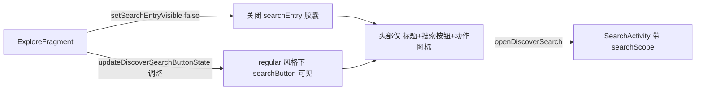
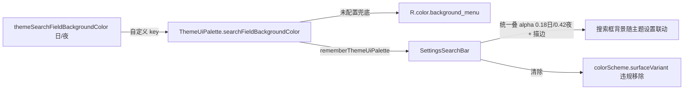

# 主Tab头部搜索入口形态统一与主题取色对齐 — 需求规格（spec.md）

## Intent

### 用户反馈与问题定义

用户观察到：**发现页 / 书架页 / 订阅页**三个主 Tab 的头部搜索入口形态不一致，部分页面还显示"搜索输入框"外观，而用户预期是"搜索按钮 → 点击打开新搜索页面"（书架/我的已按此统一）。

用户三项明确诉求：

1. **解释现状差异**：为什么发现/书架/订阅头部搜索不一样、还有带搜索输入框的？
2. **核查前端 UI 规范**：`frontend-ui-standards.md` 等是否有对应规范？
3. **深入分析主题设置影响**：主题设置里有没有对头部搜索框的主题设置项？切换主题/搜索框背景色时是否有影响？
4. **分析对齐**：书架/发现/订阅搜索按钮与 archive（迁移自 Archive 的前端 UI 体系）的主题设置及样式是否对齐？

### 现状实证（代码核查结论 + 深度审查修正 2026-08-28）

| 主 Tab 页面 | regular 顶栏风格 | default（经典）顶栏风格 | 搜索点击行为 |
|------------|-----------------|------------------------|-------------|
| 书架 `BaseBookshelfFragment` | **搜索按钮**（`setSearchEntryVisible(false)`，header-search-unify 已实施） | 搜索按钮（`showSearchInDefaultStyle` 控制） | SearchActivity 新页 |
| 我的 `MyFragment` | **搜索按钮**（`setSearchEntryVisible(false)`） | 搜索按钮 | SettingsSearchActivity 新页 |
| 订阅 `RssFragment` | **胶囊 searchEntry**（⚠️ 审查修正：`initComposeTopBar()` L947 初始化已 `setSearchEntryVisible(false)` 为纯按钮；**是 `selectSource()` L604 `setSearchEntryVisible(hasSearch)` 选中源后又打开了胶囊**——状态覆盖冲突才是根因）+ 按钮隐藏 | 搜索按钮 | RssSearchActivity 新页 |
| 发现 `ExploreFragment` | **胶囊 searchEntry**（`setSearchEntryVisible(true)` 固定开启）+ 按钮隐藏 | 搜索按钮（`canSearch`） | SearchActivity 新页（带 searchScope） |

**根因（修正后）**：①发现页固定开胶囊（header-search-unify Out of Scope 遗留）；②订阅页 `selectSource()` 覆盖了初始化的"纯按钮"状态（`hasSearch=true` 时重开胶囊）。胶囊实为可点击入口（点击均打开新搜索页），但**视觉误导**用户。

**关键布局互斥（审查新发现 B1/B6）**：regular 风格下 `titleSelect.isVisible = !searchEntryRequested`（MainTopBarView L458-460）——**胶囊与 titleSelect（标题选择器）互斥**。发现/订阅页当前胶囊占满 title 行时 titleSelect 被隐藏；关闭胶囊后 titleSelect 自动显示（标题+下拉箭头，点击弹源选择菜单）。即：**胶囊同时承担了"源名 hint 展示 + 搜索入口 + 压制 titleSelect"三重角色**，关闭它是布局结构变化而非单纯隐藏。

### 主题设置影响（代码核查结论 + 审查修正）

- **存在配置项**：主题管理「搜索框背景色」→ `PreferKey.themeSearchFieldBackgroundColor` / `themeSearchFieldBackgroundColorNight`（ThemeManageActivity 可配置，经 ThemeRuntimeKeys 日/夜分流）。
- **View 侧消费**：`TopBarSearchStyle.surfaceColor(context)` 读取配置色 + 固定 alpha（日 0.18 / 夜 0.42）+ 1dp 描边 → 发现/订阅的 searchEntry 胶囊背景 = `actionBackground`（消费主题设置），**主题切换/改色生效**。
- **Compose 侧不消费**：`SettingsSearchBar`（14 处调用点：高亮规则/设置搜索/网址记录/RSS搜索/阅读记录/订阅调试/换源×2/自动任务/缓存/搜索内容/源选择/书架管理）用 `MaterialTheme.colorScheme.surfaceVariant` → **不读配置色**。
- **⚠️ 审查修正（B3→B8 两轮）**：`ThemeUiPalette.searchFieldBackgroundColor` 槽位**正是规范设计的取色链槽位**（color.md §一 key 表：`themeSearchFieldBackgroundColor` 自定义 → `background_menu` R.color 兜底）。第一轮曾误判"不可直用"（担心未配置态观感变化），但规范对齐核查（B8）确认：**`SettingsSearchBar` 现用 `colorScheme.surfaceVariant` 本身就是 M3 派生色违规**（color.md §五硬约束 + how-to.md 严禁清单 + theme-architecture 红线 4），正确方案 = **消费 palette 槽位 + 彻底清除 surfaceVariant**（修正既有违规，与 H9/H10/H11 同性质），"未配置观感轻微变化"属合规修正非回归。
- **⚠️ 审查修正（B4 alpha 口径）**：View 侧配置色叠加半透明 alpha（日 0.18/夜 0.42）浮在顶栏壁纸上；Compose 侧需同 alpha 叠加策略（AD-05）。
- **⚠️ 规范矛盾修订（B9）**：`frontend-ui-standards.md` §1.4 "搜索框浅底统一用 surfaceVariant（Compose）"系旧条款（早于 color.md 禁令），规范内部自相矛盾，部件 D 一并修订。

### 前端 UI 规范缺口（核查结论）

- `frontend-ui-standards.md` §3 只规定搜索框**样式**（SettingsSearchBar / TopBarSearchStyle，统一 18dp 圆角浅底），**无"头部搜索入口形态"（按钮 vs 胶囊 vs 就地搜索）统一条款**。
- `ui-standards/architecture.md` 顶栏族基线（MainTopBarView/GlassTopAppBar/AppManagementTopBar）亦无搜索入口形态规范。
- 结论：需在规范中补充"主 Tab 头部搜索入口形态"统一条款，防回潮。

## Scope

### In Scope（本次实现）

1. **发现页形态统一**：`ExploreFragment` 关闭 searchEntry 胶囊（`setSearchEntryVisible(false)`），并确保 regular 风格下搜索按钮可见（当前 `updateDiscoverSearchButtonState` 在 regular 风格隐藏按钮，需调整为可见，防止"关闭胶囊后无搜索入口"）。
2. **订阅页形态统一（按用户决策）**：regular 风格下 `RssFragment` 胶囊行为对齐按钮形态（待用户确认：保留动态胶囊 or 统一纯按钮）。
3. **主题取色对齐**：Compose 侧 `SettingsSearchBar` 改读「搜索框背景色」配置（消费 `ThemeUiPalette.searchFieldBackgroundColor` 或直读 PreferKey），对齐 View 侧 `TopBarSearchStyle` 口径；启用死槽位。
4. **前端 UI 规范补充**：`frontend-ui-standards.md` + `ui-standards/architecture.md` 增加"主 Tab 头部搜索入口形态"统一条款 + "搜索框取色双端一致"条款。

### Out of Scope（不实现）

1. **搜索页内部逻辑**：SearchActivity / RssSearchActivity / SettingsSearchActivity 自身不改。
2. **MainTopBarView 组件**：不删除 searchEntry 组件本体（显隐由 `setSearchEntryVisible()` 控制，仅宿主侧关闭），不重写 searchButton。
3. **各搜索页内搜索框**：书源/订阅源管理等管理页内的 `SettingsSearchBar` 仅做取色口径统一，不改交互与布局。
4. **default 经典风格的搜索按钮显隐策略**：沿用 `showSearchInDefaultStyle` 既有配置逻辑。

## Approach

### Selected Approach（选定方案）

**部件 A：发现页搜索入口统一为纯按钮（对齐书架/我的）**

1. `ExploreFragment.onCreateView`：`setSearchEntryVisible(true)` → `setSearchEntryVisible(false)`。
2. `ExploreFragment.updateDiscoverSearchButtonState()`：`searchButton.isVisible = canSearch`（移除 `&& !isRegularStyle()` 条件，或改为仅 default 风格保留 showSearch 语义），保证 regular 风格下胶囊关闭后搜索按钮仍可达。
3. 移除 `searchEntry.setOnClickListener` 绑定（或保留无害，因胶囊已隐藏）。
4. **⚠️ 审查补充（B1 titleSelect 连锁）**：关胶囊后 titleSelect 自动显示（标题"发现"+箭头；点击 `showDiscoverSourceMenu()` 源选择菜单 / 长按 `showDiscoverKindsDialog()`）——发现页已有 titleSelect 点击绑定（L1908-1913），无需额外改动，但需真机验证 titleSelect 显示与点击正常。源名不再显示于胶囊 hint（titleText regular 固定"发现"），对齐订阅页 regular 显示"订阅"的既有策略。

**部件 B：订阅页形态统一（✅ 用户已裁决：纯按钮，2026-08-28）**

- ⚠️ 审查修正：订阅页 `initComposeTopBar()`（L947）初始化已是 `setSearchEntryVisible(false)` 纯按钮（注释"搜索已改为弹全屏搜索页，隐藏内置搜索条"），且 `renderEmptyState()`（L826）也关闭胶囊。**根因是 `selectSource()` L604 `setSearchEntryVisible(hasSearch)` 在选中源后覆盖了初始化状态**。
- 执行方案（已裁决）：
  - **删除** `selectSource()` 中的 `setSearchEntryVisible(hasSearch)`（保留初始化与空状态的 false，不重复设置）；
  - `searchButton.isVisible = hasSearch`（regular 风格也可见，当前 L610 是 `hasSearch && !isRegularStyle()`）；
  - 清理 `searchEntry.isEnabled/alpha` 残留（L611-612）。
- 附带结构变化：关胶囊后 titleSelect 自动显示（标题"订阅"+箭头，点击弹 `showSourceSelector()` 源选择弹窗）——与订阅页已有 titleSelect 点击绑定（L458）自然衔接，无额外改动。

**部件 C：Compose 搜索框取色对齐主题设置（v3 最终版，B8 规范对齐）**

1. `SettingsSearchBar.kt`：背景取色改用 `rememberThemeUiPalette().searchFieldBackgroundColor`（规范取色链：自定义 key → `background_menu` R.color 兜底，color.md §一 key 表本意）；
   - 统一叠 alpha（日 0.18 / 夜 0.42，`AppConfig.isNightTheme` 判断，AD-05 对齐 `TopBarSearchStyle` 口径）+ 描边同源；
   - **彻底清除 `MaterialTheme.colorScheme.surfaceVariant`**（修正既有 M3 派生色违规：color.md §五 + how-to.md 严禁清单 + theme-architecture 红线 4）；
   - 保持 `AppShapes.Search`（18dp 圆角）+ 40dp 高度不变。
2. 重组联动：`themeUiSignature()` 已含 search key，配置改动/日夜切换自动触发重组。
3. 14 处调用点全部自动获得主题取色能力（组件级单点修改）。
4. 默认观感说明：未配置态从 surfaceVariant 变为 background_menu 叠 alpha——**合规修正非回归**（清除 M3 派生色违规，与 H9/H10/H11 修正同性质）。

**部件 D：前端 UI 规范补充与矛盾修订**

- `frontend-ui-standards.md`：
  - **修订 §1.4 矛盾条款**（B9）："搜索框浅底统一用 surfaceVariant（Compose）"→ palette 槽位口径（`themeSearchFieldBackgroundColor` + `background_menu` 兜底 + alpha 对齐，禁止 M3 派生色）；
  - 新增"主 Tab 头部搜索入口形态 = 标题（titleSelect）+搜索按钮（点击打开新页），禁止胶囊式伪输入框 / 就地展开搜索框"条款（注明 searchEntry 与 titleSelect 互斥关系）；
  - 新增"搜索框取色双端一致"条款（Compose palette 槽位 / View TopBarSearchStyle 同源）。
- `ui-standards/architecture.md`：顶栏族基线补充搜索入口形态约束。

### Alternatives Considered（否决的替代方案）

| 方案 | 说明 | 否决理由 |
|------|------|---------|
| 发现页保留 searchEntry 胶囊 | 维持"有效宿主"现状（header-search-unify 原 Out of Scope 理由） | 用户明确反馈"带搜索输入框"观感不一致，与书架/我的已统一的纯按钮形态矛盾 |
| 删除 MainTopBarView 的 searchEntry 组件本体 | 从组件层移除胶囊能力 | 影响订阅页"按源动态显隐"能力与未来功能扩展，波及面大；宿主侧关闭已足够 |
| Compose 搜索框继续用 M3 surfaceVariant | 不改 SettingsSearchBar 取色 | 与 View 侧消费主题设置不一致，用户改"搜索框背景色"对 Compose 搜索框无效（对齐缺口实锤） |
| 就地展开搜索框（发现/订阅） | 点击按钮在当前页展开 SearchView 过滤 | 与用户"点搜索按钮→新搜索页"预期矛盾，且书架/我的已按新页模式统一 |
| 只改发现页、不动订阅页 | 订阅页保持按源动态胶囊 | 订阅页 regular 风格下同样显示胶囊"搜索框"外观，不统一则用户反馈仍复现 |
| 仅补充规范不实施 | 只写规范、不改代码 | 用户诉求含"对齐"，需代码+规范双管齐下，且规范无实装佐证难以约束 |

### Drawbacks（已知缺点与接受理由）

| 缺点 | 影响 | 接受理由 |
|------|------|---------|
| 发现页 regular 风格下胶囊关闭后，搜索入口收敛为单个按钮 | 视觉上失去"胶囊内嵌当前源名"的信息展示 | 对齐书架/我的已统一形态；搜索按钮点击仍带当前源 searchScope，功能不丢失 |
| SettingsSearchBar 取色改读配置色后，未配置主题色时依赖默认值回退 | 需保证默认值与 M3 surfaceVariant 观感接近 | 回退链已有（`background_menu`），且本次会验证默认/自定义双场景 |
| 订阅页若选"纯按钮"方案，regular 风格下不再有"源内搜索胶囊" | 源内搜索入口从胶囊变为按钮 | 点击行为不变（RssSearchActivity），仅视觉形态变化 |
| 涉及 View + Compose 双栈取色口径统一 | 改动需编译 + 真机验证双端 | 符合 ui-standards 双栈取色统一原则，一次到位 |

### Prior Art

- `header-search-unify`（[docs/specs/header-search-unify/](../header-search-unify/README.md)）：书架/我的已按"纯搜索按钮"统一，本次沿用其手法（`setSearchEntryVisible(false)` + 按钮显隐调整），并补齐其 Out of Scope 的发现页。
- `bugfix-ui-20260824` ②：搜索框样式统一（18dp 圆角浅底，View/Compose 双端口径），本次取其"双端一致"精神扩展到取色来源。
- `fix-rss-search-scope`：订阅搜索按钮按当前浏览上下文限定搜索范围，本次不改变其交互逻辑。

## Requirements

### 功能需求

- [ ] FR-1：发现页头部不再显示 searchEntry 胶囊"搜索框"外观（regular 风格）
- [ ] FR-2：发现页 regular 风格下搜索按钮可见，点击打开 SearchActivity（带当前源 searchScope）
- [ ] FR-3：订阅页头部搜索形态统一为纯按钮（✅ 用户已裁决：删 selectSource 覆盖调用 + regular 按钮可见 + 清理胶囊残留）
- [ ] FR-4：Compose 搜索框（SettingsSearchBar）取色消费「搜索框背景色」主题设置，对齐 View 侧（palette 槽位 + alpha 0.18/0.42 + 描边，**清除 surfaceVariant 违规**）
- [ ] FR-5：发现/订阅关胶囊后 titleSelect（标题+下拉箭头+源选择菜单）正常显示与点击
- [ ] FR-6：书架/我的页搜索按钮行为回归确认（不受影响）

### 非功能需求

- [ ] NFR-1：default 与 regular 顶栏风格下均不出现"视觉像输入框"的无效胶囊
- [ ] NFR-2：主题切换（日/夜）与「搜索框背景色」改动后，View/Compose 搜索框同步联动
- [ ] NFR-3：不引入新依赖、不修改 MainTopBarView 组件本体
- [ ] NFR-4：前端 UI 规范补充"头部搜索入口形态"与"取色双端一致"条款
- [ ] NFR-5：改动不破坏订阅页按源动态显隐能力（若保留）与各搜索页内部逻辑

## Scenarios

### 场景 1：发现页统一为搜索按钮（主要场景）

**Given** 用户处于发现页，顶栏风格为 regular
**When** 正常浏览发现页
**Then** 头部仅显示 标题 + 搜索按钮 + 动作图标，无胶囊"搜索框"
**And** 点击搜索按钮打开 SearchActivity（新页面，搜索范围 = 当前选中源）

### 场景 2：主题设置搜索框背景色联动

**Given** 用户在主题管理中修改「搜索框背景色」（或切换日/夜主题）
**When** 打开发现/订阅头部（View 侧）与订阅搜索页/设置搜索页（Compose 侧）
**Then** 两侧搜索框背景同步使用新配置色/主题色，无偏色

### 场景 3：订阅页形态统一（若选纯按钮）

**Given** 顶栏风格为 regular，当前订阅源有搜索能力
**When** 正常浏览订阅页
**Then** 头部显示搜索按钮，点击打开 RssSearchActivity（按当前分组/类型限定搜索范围）

### 场景 4：default 经典风格回归

**Given** 顶栏风格为 default（经典）
**When** 浏览书架/我的/发现/订阅
**Then** 搜索按钮显隐遵循 `showSearchInDefaultStyle` 配置；不出现胶囊

### 场景 5：书架/我的回归

**Given** 用户处于书架/我的页面
**When** 点击头部搜索按钮
**Then** 分别打开 SearchActivity / SettingsSearchActivity，行为与 header-search-unify 后一致

### 场景 6：titleSelect 连锁回归（审查新增）

**Given** 发现/订阅页已关闭 searchEntry 胶囊，顶栏风格为 regular
**When** 查看头部并点击标题区
**Then** titleSelect（标题"发现"/"订阅" + 下拉箭头）正常显示
**And** 发现页点击弹源选择菜单、长按弹分类弹窗；订阅页点击弹源选择弹窗
**And** 源名不再出现在头部（胶囊 hint 已移除），选择源通过 titleSelect 完成

### 场景 7：Compose 搜索框默认态合规修正（审查新增，B8）

**Given** 用户未在主题管理配置「搜索框背景色」
**When** 打开任一使用 SettingsSearchBar 的页面（设置搜索/换源/高亮规则等 14 处）
**Then** 搜索框背景 = `background_menu` 兜底色叠 alpha（日 0.18/夜 0.42）——**清除 surfaceVariant 违规后的合规态**
**And** 观感轻微变化属规范对齐（M3 派生色禁令），非回归

### 场景 8：订阅页 selectSource 状态链回归（审查新增）

**Given** 订阅页初始化（initComposeTopBar）/ 空状态（renderEmptyState）/ 选中源（selectSource）三种状态流转
**When** 依次进入订阅页 → 空源状态 → 选中带搜索能力的源 → 切换到无搜索能力的源
**Then** 头部全程无胶囊（纯按钮形态）；无搜索能力源时搜索按钮隐藏（hasSearch=false）
