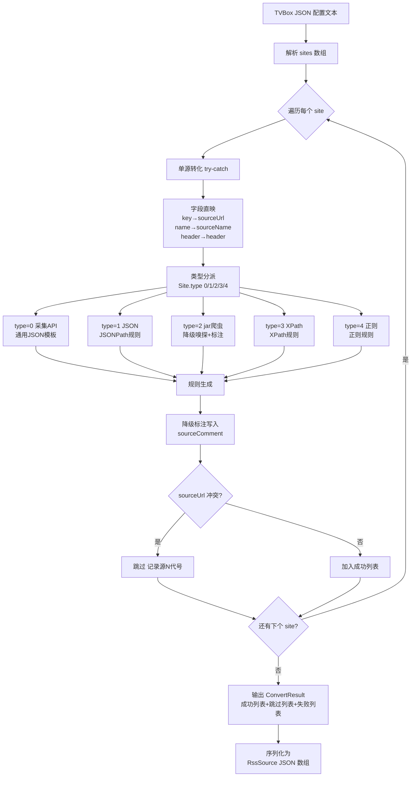
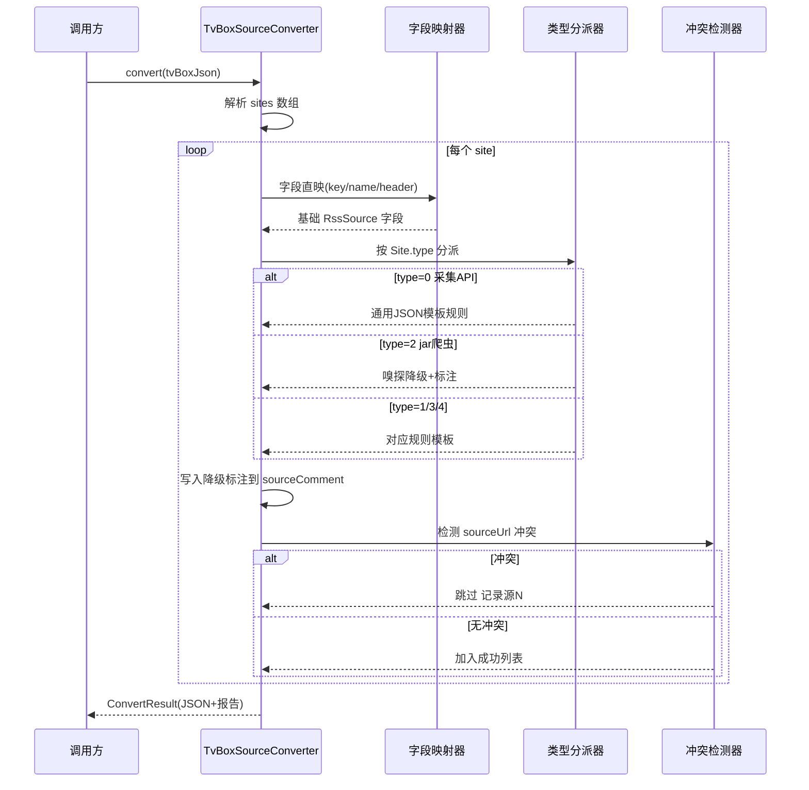

# design.md — TVBox/影视仓播放源转化 legado 订阅源

> 状态：🔄 设计中

---

## Technical Approach

### 1. 整体架构

转化器以独立 Kotlin object `TvBoxSourceConverter` 实现，核心入口为纯函数：

```kotlin
object TvBoxSourceConverter {
    fun convert(tvBoxJson: String): ConvertResult   // 批量转化
    fun convertSite(site: Site): RssSource?          // 单源转化
}
```

`ConvertResult` 包含成功转化的源列表、跳过列表（冲突）、失败列表（异常），均以代号（源[N]）记录，不含业务数据。

### 2. 字段映射表

| Site 字段 | RssSource 字段 | 映射策略 | 备注 |
|-----------|---------------|---------|------|
| key | sourceUrl | 直映 | 唯一标识，冲突时跳过 |
| name | sourceName | 直映 | |
| api | sourceUrl / sortUrl | 按 type 分派 | type=0→sourceUrl；type=1/3/4→sortUrl 推导；type=2→sourceUrl |
| header (Map) | header (JSON String) | JSON 序列化 | `GSON.toJson(header)` |
| categories (List) | sortUrl | 拼接 | `分类名::分类url\n...` 格式 |
| searchable | enabled | 1→true, 0→false | |
| type | type + 规则集 | 分派 | 见类型适配表 |
| jar | sourceComment | 降级标注 | 不映射到功能字段 |
| ext | sourceComment | 降级标注 | 不映射到功能字段 |
| playUrl | sourceComment | 降级标注 | 不映射到功能字段 |
| timeout | (不映射) | - | legado 用全局配置 |
| click | (不映射) | - | 影视仓特有 |
| style | (不映射) | - | 影视仓特有 |

### 3. 类型适配表

| Site.type | 含义 | RssSource.type | 规则生成 | 降级标注 |
|-----------|------|---------------|---------|---------|
| 0 | 采集站API | 2 (视频) | 通用 JSON 接口模板（JSONPath） | `需校验字段路径` |
| 1 | JSON | 2 (视频) | JSONPath 规则模板 | 无（直接映射） |
| 2 | 爬虫jar | 2 (视频) | singleUrl=true + WebView 嗅探 | `jar爬虫降级为嗅探` |
| 3 | XPath | 0 (网页) | XPath 规则模板 | 无（直接映射） |
| 4 | 正则 | 0 (网页) | 正则规则模板 | 无（直接映射） |

### 4. 规则模板（按 type 分派）

#### type=0 采集站 API 模板
```
sortUrl: 分类名::{{api}}?ac=list&class={{分类名}}
searchUrl: {{api}}?ac=detail&wd={{key}}
ruleArticles: $.class_list
ruleTitle: type_name
ruleLink: type_id
// 注: 实际字段路径需用户校验
```

#### type=1 JSON 模板
```
sortUrl: 分类名::{{api}}/category/{{分类id}}
ruleArticles: $.list
ruleTitle: $.name
ruleLink: $.id
ruleImage: $.cover
```

#### type=2 jar 爬虫降级
```
singleUrl: true
enableJs: true
loadWithBaseUrl: true
ruleContent: <嗅探配置>
sourceComment: // 降级说明: jar爬虫无法等价转化 | 已知上限: 列表/搜索失效 | 升级路径: 手动编写规则
```

#### type=3 XPath 模板
```
sortUrl: 分类名::{{api}}/list/{{分类id}}.html
ruleArticles: //ul[@class='list']/li
ruleTitle: //a/text()
ruleLink: //a/@href
ruleImage: //img/@src
```

#### type=4 正则模板
```
ruleArticles: <regex>列表项正则</regex>
ruleTitle: <regex>标题捕获组</regex>
ruleLink: <regex>链接捕获组</regex>
```

### 5. 转化流程

1. 解析 TVBox JSON，提取 `sites` 数组
2. 遍历每个 site，try-catch 包裹单源转化
3. 单源转化：字段直映 → 类型分派 → 规则生成 → 降级标注
4. 冲突检测：sourceUrl 已存在则跳过，记录源[N]代号
5. 收集结果：成功列表 + 跳过列表 + 失败列表
6. 输出 RssSource JSON 数组 + 转化报告

---

## Architecture Decisions

### AD-01: 转化器以独立 object 实现，不嵌入 legado 运行时

- **Context**: 转化器需在导入流程中被调用，但转化逻辑本身是纯数据转换，不依赖网络/数据库/Android 组件。
- **Concern**: 若嵌入运行时，会引入不必要的耦合，且难以单元测试。
- **Decision**: 转化器以独立 Kotlin object `TvBoxSourceConverter` 实现，核心方法为纯函数（输入 JSON 文本，输出 JSON 文本），不依赖 Android 运行时。
- **Goal**: 保证可测试性、可复用性、低耦合。
- **Tradeoff**: 转化阶段无法发起网络请求校验规则真实性，需依赖导入后的 legado 源校验功能。这是可接受的，因为在线校验属于另一关注点。
- **Status**: Proposed

### AD-02: jar 爬虫统一降级为 WebView 嗅探，不尝试等价还原

- **Context**: 影视仓 type=2 的 jar 爬虫包含自定义 Spider 实现，逻辑封闭在 jar 字节码中。
- **Concern**: 反编译/重写 jar 不可行（法律与维护成本），且 legado 无影视仓 Spider 加载器。
- **Decision**: type=2 一律降级为 `singleUrl=true` + WebView 嗅探模式，在 sourceComment 标注降级说明与升级路径。
- **Goal**: 保证转化后源"可播放"（嗅探能抓到播放地址），明确告知用户能力上限。
- **Tradeoff**: 列表/搜索能力会失效，需用户手动补规则。这优于"转化失败"或"引入 jar 依赖破坏架构"。
- **Status**: Proposed

### AD-03: 采集站 API(type=0) 使用通用模板，标注需校验

- **Context**: 采集站 API 协议多样（Maccms/CMS/自定义），无统一规范。
- **Concern**: 无法离线识别具体协议版本，生成的规则字段路径可能与实际接口不匹配。
- **Decision**: type=0 套用通用 JSON 接口模板（基于 Maccms 常见字段），在 sourceComment 标注 `需校验字段路径`，由用户导入后校验修正。
- **Goal**: 提供"可用但需校验"的起点，避免完全放弃该类型源。
- **Tradeoff**: 部分源的规则可能完全不可用，需用户介入。这是离线转化的固有局限。
- **Status**: Proposed

### AD-04: sourceUrl 冲突时跳过而非覆盖

- **Context**: 批量导入时可能出现 key 重复（同一 TVBox 配置内或与已有源冲突）。
- **Concern**: 覆盖可能丢失用户已有源的定制规则；报错中断会阻断批量流程。
- **Decision**: sourceUrl 重复时跳过该源，记录源[N]代号到跳过列表，不覆盖、不中断。
- **Goal**: 保护用户已有数据，保证批量流程完整性。
- **Tradeoff**: 用户需事后查看跳过列表决定是否手动合并。优于静默覆盖或中断。
- **Status**: Proposed

### AD-05: 降级标注写入 sourceComment，遵循编码哲学规范格式

- **Context**: 降级项需让用户感知到能力上限与升级路径。
- **Concern**: 标注信息若散落在多字段，用户难以统一查看；若格式不统一，难以程序化识别。
- **Decision**: 所有降级说明统一写入 `sourceComment`，格式 `// 降级说明: xxx | 已知上限: xxx | 升级路径: xxx`，符合编码哲学规范的简化标注要求。
- **Goal**: 统一标注位置与格式，便于用户查看与程序化解析。
- **Tradeoff**: sourceComment 可能较长，但优于信息分散。
- **Status**: Proposed

---

## Data Flow





---

## File Changes

### 新增文件

| 文件路径 | 用途 |
|---------|------|
| `app/src/main/java/io/legado/app/help/source/TvBoxSourceConverter.kt` | 转化器主入口 object，含 convert/convertSite 方法 |
| `app/src/main/java/io/legado/app/help/source/TvBoxSiteMapper.kt` | 字段映射器，纯函数实现 Site→RssSource 字段映射 |
| `app/src/main/java/io/legado/app/help/source/TvBoxRuleDispatcher.kt` | 类型分派器，按 Site.type 分派规则生成器 |
| `app/src/main/java/io/legado/app/help/source/TvBoxRuleTemplates.kt` | 规则模板集合（type=0/1/2/3/4 五套模板） |
| `app/src/main/java/io/legado/app/help/source/TvBoxConvertResult.kt` | 转化结果数据类（成功/跳过/失败列表） |
| `app/src/test/java/io/legado/app/help/source/TvBoxSourceConverterTest.kt` | 单元测试（纯函数，脱离 Android） |

### 修改文件

| 文件路径 | 修改内容 |
|---------|---------|
| `app/src/main/java/io/legado/app/help/source/` (目录) | 新增上述文件，不修改既有 RssSource.kt / RssSourceExtensions.kt |

### 不修改的文件

- `RssSource.kt`：转化器仅构造 RssSource 实例，不修改实体类定义
- `RssSourceExtensions.kt`：sortUrl 解析逻辑保持不变，转化器输出需符合其格式
- `WebBook.kt`：网络请求层不涉及，转化器为离线纯函数
- `BookSource.kt`：不涉及书源，仅参考字段结构

### 依赖关系

- 转化器依赖 GSON（legado 已有，`io.legado.app.utils.GSON`）解析输入 JSON
- 转化器依赖 Site bean 定义（从 forks-comparison 复制纯字段定义，不引入影视仓完整依赖）
- 转化器输出 RssSource 实例，复用 legado 现有 RssSource.kt
- 不引入新外部依赖，不升级 jsoup/rhino/hutool 锁定版本
