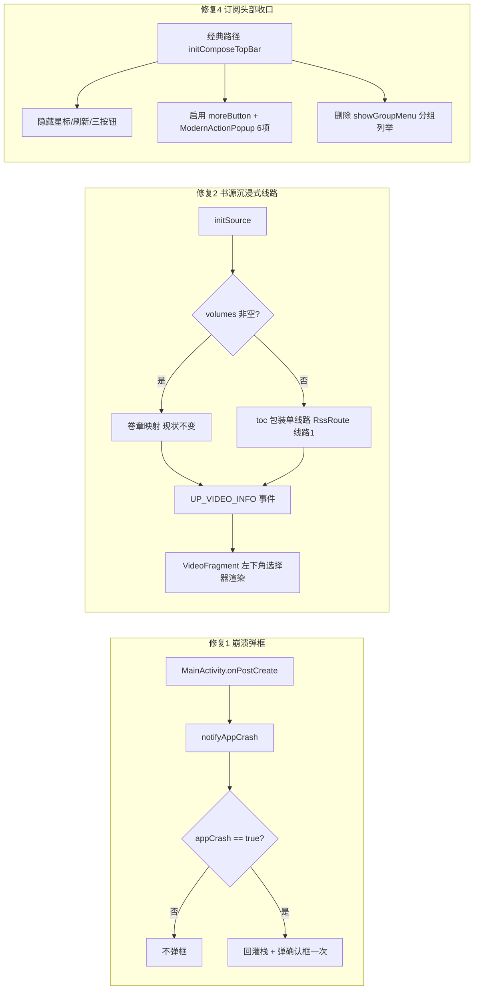
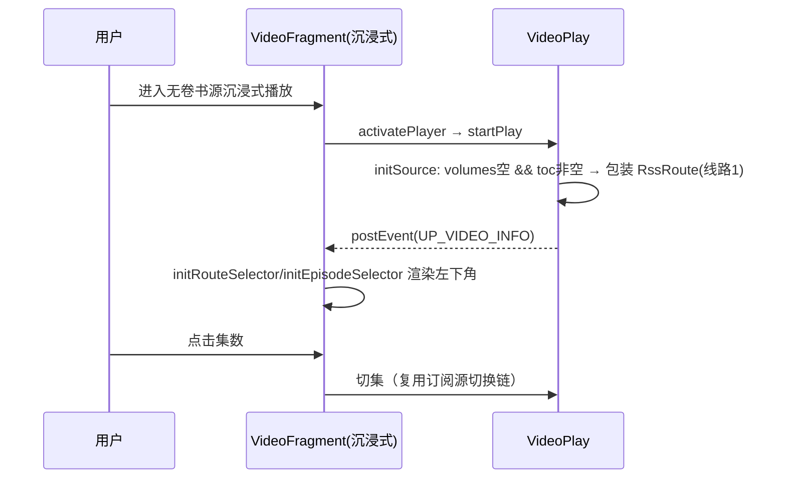

# design.md — ui-batch-fix-0905

## Technical Approach

## Architecture Decisions

### AD-01: 崩溃弹框移回 appCrash 条件块内
- **Version**: v1.0
- **UpdateTime**: 2026-09-05
- **Context**: [MainActivity.kt#L2261-L2272] 弹框被移出 `if (LocalConfig.appCrash)` 块，仅 `BuildConfig.DEBUG` 拦截；release 包每次主页创建/重建无条件弹框。
- **Concern**: 用户感知"没崩溃也反复弹崩溃框"，且弹框与崩溃文件脱钩。
- **Decision**: 将 `showComposeConfirmDialog` 移回 `if (LocalConfig.appCrash)` 块内；弹框处理后清标志，保证仅弹一次。顺带给 `CrashHandler.saveCrashInfo2File` 两条静默 catch 补 `AppLog.put` 记录（不弹框）。
- **Goal**: 误弹归零；真崩溃弹框语义恢复；写盘失败可排查。
- **Tradeoff**: 不做去抖/频控等防御（正确条件块已足够）；saveCrashInfo2File 主体策略不动。
- **Status**: Accepted
- **Superseded-by**: 空
- **ChangeLog**: 初版

### AD-02: 无卷书源数据层单线路回退（镜像 parseRssRoutes）
- **Version**: v1.0
- **UpdateTime**: 2026-09-05
- **Context**: 左下角选择器数据源硬绑 `rssRoutes/rssEpisodes`；[VideoPlay.kt#L1150] 映射条件 `volumes.isNotEmpty()` 使无卷书源整体跳过；订阅源侧已有扁平回退（parseRssRoutes L1402-1425）。
- **Concern**: 无卷视频书源沉浸式左下角只有标题，与订阅源体验不一致。
- **Decision**: `initSource` 映射块加 else：volumes 空且 toc 非空时，将 toc 章节映射为 `RssEpisode` 并包装单线路 `RssRoute(name="线路1")` 赋给 rssRoutes/rssEpisodes；复用现有 UP_VIDEO_INFO 事件链，UI 零改动。
- **Goal**: 书源/订阅源沉浸式信息展示对齐；集数选择器/详情抽屉/切换逻辑全部自动生效（线路选择器沿用 size>1 规则，单线路仅显示集数列表，与订阅源一致）。
- **Tradeoff**: 单线路书源不显示"线路1"行（与订阅源行为一致，非缺陷）；需核验 `isNewRoutesMode`/`switchBookRoute`/`upEpisodes`/`saveRead` 四处兼容。
- **Status**: Accepted
- **Superseded-by**: 空
- **ChangeLog**: 初版

### AD-03: 发现页 menu_group 定性 Bug 修复而非删除
- **Version**: v1.0
- **UpdateTime**: 2026-09-05
- **Context**: `menu_group` 有完整实现（showExploreGroupPopup → ModernActionPopup 锚定 toolbar），但用户真机点击无反应；H17 注释记载原 SubMenu 已删除转为 ModernActionPopup。
- **Concern**: 若直接删除菜单项会损失分组快捷过滤功能；若置之不理用户持续受阻。
- **Decision**: 先 L2 真机复现，定位弹框失败根因（候选：锚点 view 未就绪/弹窗 show 静默异常/模式守卫拦截），按根因修复后保留功能。修复过程中发现的根因沉淀到 issues-found.md。
- **Goal**: 经典发现页分组按钮恢复正常弹出与过滤。
- **Tradeoff**: 需一次真机复现成本；若根因在 ModernActionPopup 公共层需评估对其他调用点（书架/阅读记录）的回归影响，修复后必须回归这两处。
- **Status**: Accepted
- **Superseded-by**: 空
- **ChangeLog**: 初版

### AD-04: 死菜单项删除清单（仅删确证死项）
- **Version**: v1.0
- **UpdateTime**: 2026-09-05
- **Context**: 全量扫描 16 菜单 XML/15 宿主 + View/Compose 点击事件，确证死项：`rss_source_sel.xml` `menu_check_rss_source`（无分支+全项目零引用）；`content_select_action.xml` 3 项被 `filteredMenuActions` 过滤永不渲染（功能由 ContentSelectConfig 9 个 ACTION 承载）。
- **Concern**: 死项造成"点击无反应"体验，且用户无法区分空实现与 Bug。
- **Decision**: 删除上述 4 个死项。`book_manga.xml` menu_group_on_line 组（INFO 级，非空实现）、4 个 Activity 的死菜单覆写（无用户影响）本次不动，仅在 issues-found.md 记录。Compose 2 处单击空 lambda（ReadRecordOverviewCard/AiChatScreen 头像）属产品确认项，不动。
- **Goal**: 消除确证的点击无反应项，零功能损失。
- **Tradeoff**: menu_check_rss_source 若未来要补"校验"入口需重新加项（当前一级按钮已提供间隔校验，无缺口）。
- **Status**: Accepted
- **Superseded-by**: 空
- **ChangeLog**: 初版

### AD-05: 订阅头部收口仅在经典路径接线，不动 setMode
- **Version**: v1.0
- **UpdateTime**: 2026-09-05
- **Context**: [MainTopBarView.kt#L210-L218] `setMode()` 控制 moreButton 可见性且不含 Mode.RSS（现代形态 initModernRssView 未接监听）；书架已有标准 ModernActionPopup 数据驱动接线模式（BaseBookshelfFragment L100-165）可复用。
- **Concern**: 收口需隐藏星标/刷新/3 个动态按钮并启用三点；改 setMode 会波及现代形态。
- **Decision**: 仅在 `RssFragment.initComposeTopBar()` 经典路径内：`setActionsVisible(star=false, refresh=false)`、移除 3 个 addActionButton、手动 `moreButton.isVisible = true` + 接 ModernActionPopup（6 项：阅读记录/星标/刷新/订阅源管理/布局设置/分组管理）；删除 `showGroupMenu()`（含分组信息列举段 L1006-1011）。
- **Goal**: 头部仅剩标题+搜索+三点；全部操作收口且行为与原按钮一致；分组信息不再展示。
- **Tradeoff**: 高频操作（刷新/星标）多一次点击；经典路径手工启用 moreButton 与 setMode 声明式可见性略有分歧（以注释说明原因）。
- **Status**: Accepted
- **Superseded-by**: 空
- **ChangeLog**: 初版

## Data Flow

## File Changes

| 文件 | 变更 | 对应 AD |
|------|------|--------|
| `app/src/main/java/io/legado/app/ui/main/MainActivity.kt` | 弹框移回 `if (LocalConfig.appCrash)` 块内 | AD-01 |
| `app/src/main/java/io/legado/app/help/CrashHandler.kt` | 两条静默 catch 补 AppLog 记录 | AD-01 |
| `app/src/main/java/io/legado/app/model/VideoPlay.kt` | initSource 卷章映射块加 else 单线路回退 | AD-02 |
| `app/src/main/java/io/legado/app/ui/main/explore/ExploreFragment.kt`（及 ModernActionPopup 相关） | 分组弹框 Bug 修复（按复现根因） | AD-03 |
| `app/src/main/res/menu/rss_source_sel.xml` | 删除 menu_check_rss_source | AD-04 |
| `app/src/main/res/menu/content_select_action.xml` | 删除 3 个死项 | AD-04 |
| `app/src/main/java/io/legado/app/ui/main/rss/RssFragment.kt` | 经典头部收口 + 删 showGroupMenu | AD-05 |
| `app/src/main/assets/updateLog.md` | 基于 git diff 追加用户语言更新条目 | 门禁 |
