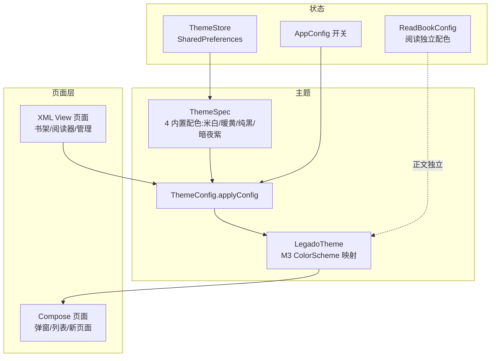
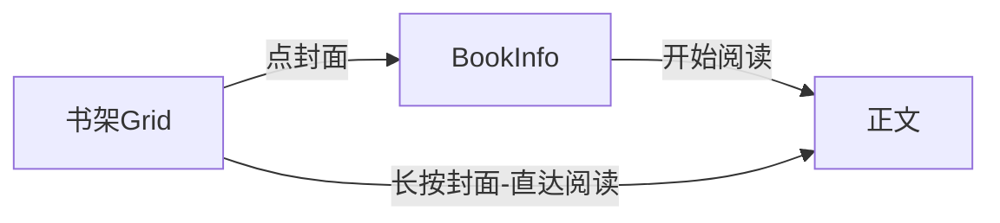
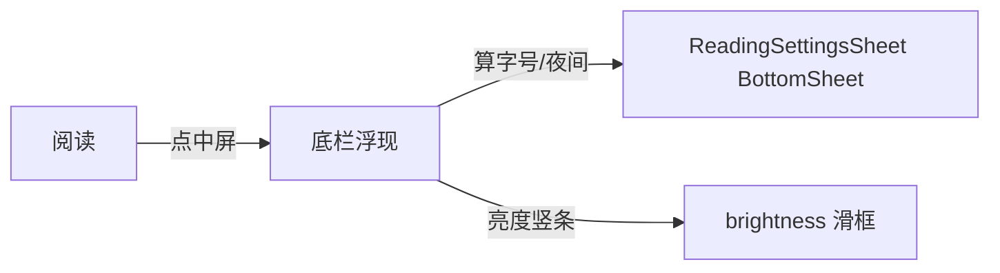
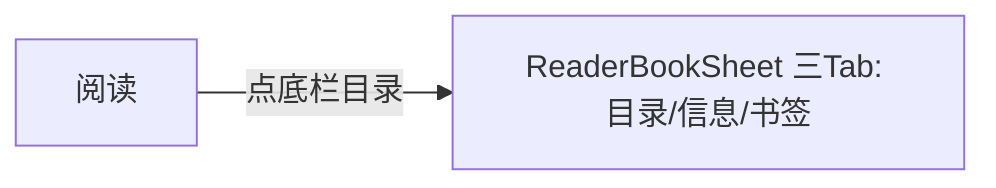
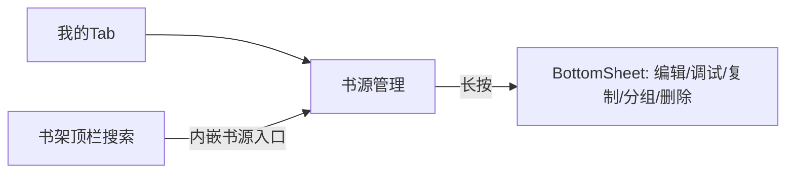

# design.md — UI 重构设计（技术路线与页面设计）

## 整体前端设计思想综合（合成权威）

> 五仓+鸿蒙判断**收敛成一套**统一前端架构（信息分层 P1/导航 P2/主题 P3/组件 P4/交互 P5 五大支柱、五仓贡献矩阵、整体架构图、**功能不裁剪红线清单 A~D 四级**、后续实施路径 Phase 0~4）。详见 [`frontend-synthesis.md`](./frontend-synthesis.md)。

## Technical Approach

### 架构分层

### 关键选型（每个 ADR 见下）

- AD-01：主题权威源 = 现有 `ThemeStore`；新增 `ThemeSpec` 4 套内置（含暗夜紫）。
- AD-02：阅读器正文引擎保持 **原生 View**，不做 Compose 重写；仅阅读浮层改 BottomSheet。
- AD-03：页面设计走"设计文档先行"，不进入本 spec 代码实施。
- AD-04：Compose 长列表作为优先迁移目标（书架/书源列表），正文切入点为 `AndroidView` 桥。

### 色彩体系（三套内置色）

**设计规范关键数值**（写进 token）：

| Token | 米白（Light） | 暖黄护眼（Light） | 纯黑（Dark） | 暗夜紫(保留, night) |
|-------|--------------|------------------|-------------|---------------------|
| background | #FAF7F2 | #FFF8E1 | #121212 | #1E1E32 |
| surface | #FFFFFF | #FFFDE7 | #1C1C1C | #2A2A45 |
| primary | #5D4037 | #D84315 | #BB86FC | #7B1FA2(源) |
| accent/onPrimary | #7B1FA2→文字白 | #FFAB40→文字黑 | #FFFFFF | #CE93D8 |
| 角标 | 小圆点 6dp | 小圆点 | 小圆点 | 小圆点 |
| 导航栏 | 跟随主题高 | 跟随主题 | 纯黑 | #1E1E32 |
| 卡片 radius | 18dp | 18dp | 18dp | 18dp |
| 按钮 radius | 12dp | 12dp | 12dp | 12dp |

> 保留现状暗夜紫主题配置不动（已在 `themeConfig.json`），设计文档中作为"默认暗色方案"出现，不影响其可用性。

### 栅格系统

- 基准 360dp、安全边距 16dp、间距档位 **4/8/16/24/32**dp、触控目标 ≥48dp、卡片 18/按钮 12dp 圆角。
- 列表 Item 间距 8dp；分组标题与内容间 8dp；卡片 padding 16dp。

## Page Design（页面设计 × 4 要素格式）

以下每个页面提供：① 布局文字框图 ② 交互流程 ③ Compose 组件实现思路 ④ 绘图 Prompt 草案。
完整每页设计落位 `pages/{page}.md`（本 spec 交付时仅 outline，逐页在 tasks 推进）。

### P1 书架（主 Grid）
- ① 布局：顶部磨砂工具栏（标题+搜索+换班）→ 书架分组 Tab/分类标签 → LazyVerticalGrid(3 列，封面 16:9, 圆角, 底部书名+小圆点角标) → 底部主 BottomNavigationView。
- ② 交互：点封面→进入阅读；长按封面→BottomSheet（开始/下载/替换/移除国）；左滑预览；空态引导。
- ③ Compose：`LazyVerticalGrid` + `Cardsurface` + 封面 `Glide-compose / CoverImageView` 包桥接；分组 header 用 stickyHeader。
- ④ Prompt：`/shelf m3，白色主底层，3列网格圆角封面，底部动画导航栏，磨砂顶部，留白充足，高保真UI设计稿，没有文字干扰/`

### 2 阅读器页
- ① 沉浸正文(最大化) + 顶部沉浸式状态栏(章节名/返回/设置/对齐) + 底部工具栏(目录/字号/亮度/夜间/更多) + 中间词组长按工具条(划线/装饰) + BottomSheet(全更多配置)。
- ② 点中央→显示/隐藏浮层；左右滑动翻页；点右上角→目录/书签侧滑；长按→选区工具；3s 无操作自动隐藏。
- ③ 正文用 AndroidView(PageView)；浮层 Compose（`ModalBottomSheet` + `AnimatedVisibility`）。
- ④ `/m3 reader 纯排版大面积正文保护，窄悬浮顶栏，"中央浮现控制"，暖白纸张，低饱和/`

### 3 书籍详情（BookInfo）
- 头部封面+合集信息 → 底部操作栏(开始阅读/加入书架/替换) → 章节目录预览/简介 →共享折叠。
- 点击章→TOC 展开；长按封面→替换封面/收藏分组。
- Compose：`Scaffold + TopAppBar` + `LazyColumn` + 封面 `Glide-compose`，操作栏 `BottomAppBar`。

### 4 我的 / 设置
- 我的：Profile 卡片（头像/书架收藏统计）→ 高频功能（书库/书源管理/订阅源/主题）卡片分组。
- 设置：卡片分组列表（主题外观/阅读/管理/网络）。
- 交互：点卡片→分组展开；开关即时保存。
- Compose：`LazyColumn` + `SettingsSwitch + SettingsGroup` 复用。

### 5 书源管理
- 列表 + 分组头 + 复用卡片 + 长按 BottomSheet(启用/编辑/调试/删除)。
- Compose：`LazyColumn` + `ItemSwipe` 滑动快捷。

### 6 发现 / 网络书城
- 搜索顶栏 + 分类 Grid（封面 36dp 圆角）→ 点进推荐列表 → 书详情。
- 布局沿用书架，封面卡片复用组件。

### 7 RSS / 订阅源
- 源列表卡片 + 文章流 List，正文区保留原能力，浮层化配置。

### 8 正文内浮层
- 目录/书签/搜索/替换/高亮全部 BottomSheet 化，禁止多层嵌套，阅读设置 ≥1 级直达。

### 每页绘图 Prompt 统一语气
全部效果图为：Material 3、低饱和、留白多、圆角卡片 18dp、按钮 12dp、无渐变高饱和、统一磨砂。用 `m{style}` 前缀便于复用。

## ADR（Y-Statement）

### AD-01: 主题权威源保留 ThemeStore + 内置 ThemeSpec
- **Context**: 现有 `ThemeStore` 已承载全部主题色（Primary/Accent/BG）与 17 套 json 主题；fork 生态出现 ThemeResolver(种子→M3) 与 zip 换肤两大趋势。
- **Concern**: 若采用 `hct 色板引擎` 全面替换 ThemeStore，将推翻用户既有自定义主题/背景图生态，且与"保留暗夜紫"需求冲突；若完全不动，M3 族主题难以产出。
- **Decision**: 保留 `ThemeStore` 为唯一主题权威源；新增 `ThemeSpec`（4 内置），通过 `LegadoTheme` 映射 M3 ColorScheme；用户在主题设置中可见 4 套 + 原有自定义。
- **Goal**: 双输无——用户量（保留自定义）与设计统一（M3 token）兼备。
- **Tradeoff**: 不会得到 fork 的"种子取色/zap 主题包"那样强动态；但实现成本与风险最低。
- **Status**: Proposed

### AD-02: 阅读器正文引擎保留原生 View
- **Context**: 正文由 `TextChapterLayout`/`PageView`/翻页委托等自绘 View 驱动，性能与布局复杂。
- **Concern**: Compose 重写正中排版将在无损兼容下高成本重复造轮子，回归破坏风险大。
- **Decision**: 正文渲染/触摸命中/翻页保持原生 View；Compose 只负责**浮层**与**菜单**。
- **Goal**: 保住阅读体验与稳定的翻页行为。
- **Tradeoff**: 混血架构需在 Compose 中 `AndroidView` 包一层，边界要写文档。
- **Status**: Accepted

### AD-03: 设计先行，本 spec 不写代码
- **Context**: 用户明确"先出设计，我来审核"，且要求每页绘图 Prompt。
- **Concern**: 若边写代码边设计，方向偏离后返工成本高。
- **Decision**: 本 spec 交付四文档+每页设计 outline 后，走 OpenSpec 检查点，实施另行立项。
- **Status**: Accepted

### AD-04: 三套内置 + 保留暗紫 = 四主题可见
- **Context**: 需求要求三套内置主题 + 保留现状暗夜紫。
- **Decision**: 主题设置中展示至少 4 套（米白/暖黄/纯黑/暗夜紫(默认)）。
- **Tradeoff**: 显示 4 套多于需求 3，但"保留暗紫"必须保，故以 4 套形式落地。
- **Status**: Accepted

## 用户旅程（UX State Machine）

以下 5 条关键旅程 = 设计验收基准（与目标仓现有实现对比，见 forks-deep-dive §6）。

### 旅程 1：进阅读（≤2 步）

- 书架长按 Book `/ BottomSheet` 提供「直达阅读」——满足 ≤2 步。

### 旅程 2：调字号/亮度/夜间（1 步 1 弹窗）

- 保留目标仓独有的亮度竖条把手 `vw_brightness_pos_adjust`（优势不丢）；字号/夜间走拉伸 Sheet。

### 旅程 3：查目录/书签（1 步）

- 借鉴 HapeLee `ReaderBookSheet`：同一 Sheet 三状态，周环比 < 72% 高，长目录可滚。

### 旅程 4：正文搜索（1 步）

### 旅程 5：书源管理（从「我的」二级提到一级）

- 高权操作（书源搜索/编辑/调试）前置到顶栏，编号对齐「高频两步可达」。

> 完整 journeys 由 courts step 的 `pages/*.md` 交互流程部分维护。

## ADR（Y-Statement）续：fork 深度借鉴决策

### AD-05: 书架封面「双层圆角」策略（图片 12dp / 卡片 18dp）
- **Context**: HapeLee 用 4dp 图片圆角；DESIGN-MD 要求 18dp 卡片。
- **Concern**: 图片被大圆角切割会丢视觉边缘，纯 18 圆角不含专业封面。
- **Decision**: 封面实体用 12dp（超过 4dp，保留 16:9 观感），外层 CardSurface 18dp。形成"图圆角 < 卡圆角"双层规范。
- **Goal**: 兼顾 DESIGN-MD 卡片统一与封面辨识度。
- **Tradeoff**: 比 HapeLee 4dp 稍重，但比单层 18 更优雅。
- **Status**: Proposed

### ADR-06: 阅读浮层用「单态激活 + sheet 族」（参考 HapeLee sealed 37 sheet）
- **Context**: HapeLee 用 sealed ReadBookSheet 单态互斥、一个 when 渲染；目标仓现在各种 Dialog 各自弹。
- **Decision**: 阅读浮层收敛为**单态激活 sheet hub**（目录/信息/书签三 Tab + 阅读设置 + 高亮），避免多层弹窗嵌套（禁嵌套向导 2）。
- **Goal**: 满足「阅读设置 ≥1 级直达」与「禁嵌套弹窗」。
- **Tradeoff**: 需重写阅读菜单触达逻辑，改动面较大，但为后续 Compose 壳铺路。
- **Status**: Proposed

### ADR-07: 书架 Compose 化走「渐进两期」
- **Context**: 书架是首页，最大用户群；HapeLee 的 `FastScrollLazyVerticalGrid` 很成熟但换库影响大。
- **Decision**: 期 1 用 View `GridLayoutManager + ItemDecoration` 复刻视觉（成本 Compose 的 1/4）；期 2 再上 Compose 网格（保留数据层复用）。
- **Goal**: 书架 60fps 长列表 + 低回归风险。
- **Tradeoff**: 双期实现有重复成本，但每一步可验证。
- **Status**: Proposed

### AD-11: XML 层也做 M3 token（Jingshiro 启示）
- **Context**: Jingshiro 不引 Compose 也能 M3 化——把语义色全部改别名指向 13 个 `md3_*` token。
- **Decision**: 目标仓 XML 颜色也改为「语义 token 引用」（`background→md3_surface` 等），View 与 Compose 颜色同源。
- **Goal**: View/Compose 色板一致，消除色值漂移；成本极低。
- **Tradeoff**: 需要 review 全部 264 个 layout 引用，工作量在全量切换时体现。
- **Status**: Proposed

### AD-12: 主题算法——背景色「锚定中性面」替代纯 lerp
- **Context**: legadoT 用 `Hct 背景色 tone 平移` 生成 surfaceContainer 5 级；目标仓现有 `lerp(bg, White, 0.04)`。
- **Decision**: 升级 LegadoTheme：surface 族 = 背景色 tone 偏移（±2/±4/±6/±8/±12 光 / +24/+16 暗），彩色角色仍按 ThemeStore accent 派生；**不引 MC 动态取色库**。
- **Goal**: 保留用户自制背景色同时具备 M3 分级 surfaceContainer（既存三大目录）。
- **Tradeoff**: 无法完全复刻 HC T 色级（material 动态库需 restricted API），得 80% 效果。
- **Status**: Proposed

### AD-13: 阅读切换面板「画底 2 行 6 色」（不移植完整 Canvas 五线）
- **Context**: youfeng 的六线 Canvas 管线与目标排版紧耦合，完整移植风险高。
- **Decision**: 本 spec 只落高亮选色面板（BottomSheet 化 2 行 6 色）+ 样式开关（沿用现有 Span 族），完整 Canvas 管线列为独立未来项。
- **Goal**: 低成本拿下「高亮」体验升级。
- **Tradeoff**: 默认多线样式感弱于 youfeng，但不动排版内核。
- **Status**: Accepted

### AD-14: 不引入 Suml-1 zip 换肤、不引入 Monet 动态取色（scope 削减）
- **Context**: Suml-1 的 ApplicationThemeManager 功能强但体积大；Monet 在 API<31 回退。
- **Decision**: 本次范围**不做** zip 换肤与 Monet 动态;保持 ThemeStore 多 JSON 主题原生态（含暗紫）。
- **Goal**: 控制实现风险与测试成本；暗紫保留靠现状配置即可。
- **Tradeoff**: 用户失去"一键导入整套皮肤"的能力（非阻塞诉求）。
- **Status**: Accepted

### AD-15: 组件化优先 — 自建公共组件库 `ui/widget/components/`
- **Context**: Rimchars 有 731 行 AppSettingComponents 组件族（palette+card+listRow+Modifier 装饰）；HapeLee 有 settingItem/18 文件 + SplicedColumnGroup；legados 组件库"有壳无肉"（5+ 组件 0 引用）。
- **Concern**: 不组件化则每个页面各写一套 settingRow/sectionTitle，颜色靠手抄导致漂移。
- **Decision**: 新建/对齐公共组件库（AppSettingPalette+remember 桥 / AppSettingSectionTitle / AppManagementCard / AppManagementListRow / Modifier.appSettingPanelBackground / Modifier.appSettingRowDecoration / SwipeActionContainer / VerticalScrollbar / AppModalBottomSheet / SplicedColumnGroup / GlassTopAppBar / BadgePill / SummaryCard+BookStackView / MetricGrid / SettingsSearchBar）；可在不影响 View 页面下直接接线。
- **Goal**: 所有新页面 100% 复用公共组件，消灭页面私有重复实现（对齐调色板/圆角/间距）。
- **Tradeoff**: 首期投入组件库建设成本；需质量控制（以真机验收制仿 NG_COMPONENT_ACCEPTANCE_CHECKLIST）。
- **Status**: Accepted

### AD-16: 「我的」页 MagCenter 三级布局（鸿蒙版信息架构）
- **Context**: 原版我的页 = 一长串 Preference（备份/主题/书源/系统设置混排，高频难找）——legados MyFragment 是活例，Ng 已有 MD3 分组卡，鸿蒙版做了「统计卡→高频功能卡→低频列表」三级。
- **Decision**: 我的页整页 Compose 化 → ① 用户区 Card（真实 readTime）② 统计卡行 MetricGrid ③ 高频功能卡组（备份/主题/书源/WebDAV/本地书/净化）+ 独立 Web 服务卡 ④ 低频列表（统一卡片分组）；顶栏带搜索（Rimchars buildVisibleSections 模式）。
- **Goal**: 高频 ≤2 步可达；统计用真实 Room 数据（区别于鸿蒙版写死占位）。
- **Tradeoff**: 需要 new Activity/替换 MyFragment + 清理 pref_main 死代码（回归 4 组入口）。
- **Status**: Proposed

### AD-17: 底部导航升级——PillNavigationBar 替代 BottomNavigationView
- **Context**: 现状 4 Tab 用 XML `BottomNavigationView`+ViewPager；MoRealm 的闹 `PillNavigationBar`（悬浮胶囊底栏）是玻璃拟态+滑动发光指示点+长按插槽的现代范本。
- **Decision**: 主框架保留 View `BottomNavigationView` 壳（回归风险低），**在持续推进 phase 记时以 Compose `PillNavigationBar` 改造**（剥离 `LocalMoRealmColors` 依赖、指示点换 M3 token 色）；角标沿用 6dp 圆点（MoRealm 全项目不用 BadgedBox，更新红点手绘 8dp error 圆点——与本设计 AD 一致）。
- **Goal**: 20x8 视觉观感与基本功能提升，同时保留现有 Fragment/ViewPager 迁移路径。
- **Tradeoff**: 需要与 ViewPager 同步选中态联动；Float 状态在横屏/嵌入屏需兜底。
- **Status**: Proposed

### AD-18: 主题推导——采纳 5 色→34 槽位公式（升级 AD-12，MoRealm 同源思路）
- **Context**: MoRealm `ThemeEntity.toColorTargets()`（5 核心色→34 M3 槽位，`Color.mix`+`hueShift(60°)` tertiary+`contrastOn` black/white+error 夜 `#FF897D`）是现成公式，比 legadoT 的 Hct 平移更轻且不依赖 MC 动态库。
- **Decision**: LegadoTheme 色板推导改用「5 色→34 槽位」配方（沿用 MoRealm 的 mix/hueShift/contrastOn，仅作算法参考，只读复制思路不抄代码）；**不采用 34 个 `animateColor` 平滑换肤动画**（常驻 recomposition 成本，保留即时切换 + 局部动效）。
- **Goal**: 一套公式产全 M3 色板，替代零散 lerp 特判；保留用户背景色锚定。
- **Tradeoff**: 需对照现有主题 JSON 逐一校验色值；引入 34 槽位概念后主题设置 UI 需适配。
- **Status**: Proposed

## Data Flow

1. 用户选主题 → `ThemeStore.setBackground`/`setPrimary`/... → `AppConfig.isNightTheme` + `ThemeConfig.applyDayNight` → 全局重建 → View 页同步 XML color，Compose 由 LegadoTheme react。
2. 阅读器正文配色走独立 `ReadBookConfig.durConfig`，不受全局切主题影响。
3. 主题切换时不改任何数据库实体，仅 SharedPreferences+EventBus(REPAINT) 触发。

## File Changes（设计交付产物）

| 文件 | 类型 | 说明 |
|------|------|------|
| `docs/specs/ui-redesign-m3/{README,spec,design,tasks}.md` | 新增 | OpenSpec 四文档 |
| `docs/specs/ui-redesign-m3/forks-deep-dive.md` | 新增 | 33 forks 深度学习清单（学了什么/源码佐证/移植评级） |
| `docs/specs/ui-redesign-m3/four-fork-deep-dive.md` | 新增 | 四 Fork（HapeLee/legados/Rimchars/legado_NG）+鸿蒙版前端对标、组件化方案、MyCenter 三级布局 |
| `docs/specs/ui-redesign-m3/morealm-deep-dive.md` | 新增 | 墨境 MoRealm 深度学习清单（导航/主题/组件/阅读器/Book列表、Top10 可搬运组件、权衡表） |
| `docs/specs/ui-redesign-m3/frontend-synthesis.md` | 新增 | **整体前端思想综合**：五支柱收敛、五仓贡献→组件矩阵、整体架构图、**功能不裁剪红线清单（A内核/B数据/C UI入口/D死代码）**、实施 Phase 0~4 |
| `docs/specs/ui-redesign-m3/implementation-spec.md` | 新增 | **实现细化规格**：17 组件签名、主题 toM3Scheme 代码映射、真实文件锚点（LegadoTheme.kt:40-43 等）、PR 粒度任务+KPI、themeConfig 格式封口、风险四则 |
| `docs/specs/ui-redesign-m3/pages/*.md` | 新增 | 每页四要素设计（8 页） |
| `docs/INDEX.md` | 变更 | 登记 spec 条目 |
| 实施阶段（另行立项）：`ui/theme/` 色板升级 / 阅读浮层 sheet 化 / 页面 Compose 迁移 | 新增/改造 | 不属本 spec |

> 本 spec 是纯设计文档，**不改动任何 src/**。文件变更仅限 docs/ 命名。