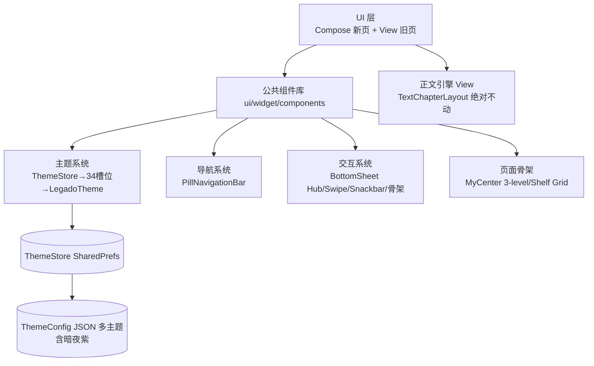

# 整体前端设计思想综合（Frontend Synthesis）

> 站在"整体前端 360° 视角"，将五仓+鸿蒙版精华**收敛为 Legado 自己的一套统一前端架构**，而非碎片化罗列。回答三问：
> ① 整体前端怎么取舍？② 五仓各贡献什么合成什么？③ 哪些底层功能绝不裁剪？

## 一、设计思想五支柱（统一收敛）

五仓精华不是堆砌，而是归纳出 5 个**必须全 App 一致的支柱**：

| 支柱 | 收敛来源 | 落地原则 |
|------|---------|---------|
| **P1 信息分层** | 鸿蒙 MyCenter 三级（统计→高频→低频）+ Rimchars 搜索 + MoRealm 主题前置 | 一切页面遵循「顶部精华 → 中部高频 → 底部低频」；≤2 步可达 |
| **P2 导航统一** | MoRealm PillNavigationBar + HapeLee FloatingBottomBar | 底部导航唯一形态（悬浮胶囊+指示点），4 Tab 不变 |
| **P3 主题一套** | MoRealm 5色→34槽位 + legadoT 背景锚定 + Jingshiro XML token | ThemeStore 单源 → 34 槽位推导 → View/Compose 同源，阅读独立 |
| **P4 组件复用** | Rimchars AppSetting 族 + HapeLee Spliced + MoRealm 设置三模板 | 一套公共组件库，页面无 private 重复实现 |
| **P5 交互一致** | 全部：BottomSheet 主力 + 小圆点角标 + 骨架屏 + 边缘返回 | 同一手势/弹层/加载语言 |

## 二、五仓贡献矩阵 → 合成到哪个组件

| 项目 | 贡献 | 合成产物（自己的组件） |
|------|------|----------------------|
| **MoRealm** | 主题实体→34槽位推导公式 / PillNavigationBar / 设置三模板 / shimmer骨架 / SwipeBackEdge / 目录书签双Tab底部面板 | `ThemeSpecToColorScheme`（AD-18）、`PillNavigationBar`（AD-17）、`SettingsSection/SettingsItem/SettingsClickRow/ToggleRow/RowIcon`、`ShelfGridSkeleton`、`SwipeBackEdge`、`BookTocBookmarkSheet` |
| **HapeLee** | Sealed 阅读浮层单态渲染 / 封面 Hero 转场 / AppModalBottomSheet 双引擎 | `ReaderSheetHub`（AD-06）、Hero 转场（默认关，AD-08）、`AppModalBottomSheet` |
| **legados** | SwipeActionContainer / VerticalScrollbar（已接线→DownloadManageScreen） / CommonPageColors 暗色特判 / BookStackView | `SwipeActionContainer`、`VerticalScrollbar`（已接线→DownloadManageScreen）、`CommonPageColors`（沿用）、~~`SummaryCard+BookStackView`~~（已删除 2026-08-16 孤儿清理） |
| **Rimchars** | AppSettingComponents 731行组件族 / palette+signature 取色桥 / buildVisibleSections 搜索 | `AppSettingPalette+rememberAppSettingPalette`、`AppManagementCard/ListRow`、`SettingsSearchBar` |
| **legado_NG** | 双端共用 Token / Glassmorphism / MD3 动色工程 / 组件验收矩阵 | `NgToken→LegadoToken` 概念（AD-15）、玻璃磨砂（顶栏/底栏）、`ComponentAcceptanceChecklist` |
| **鸿蒙版** | MyCenter 三级布局（信息架构） | `ProfileScreen-3Level`（AD-16） |

## 三、整体前端架构图（合成）

## 四、功能不裁剪清单（红线，模块级）

**第一原则：本次重构只动"UI 布局/控件样式/交互路径"，业务逻辑与数据层 100% 保留。**

### A. 内核层（绝不碰，连换皮都不做）
| 模块 | 说明 |
|------|------|
| 书源规则引擎 | `AnalyzeRule`（CSS/JSONPath/XPath/Regex/JS 五种解析） |
| 阅读排版引擎 | `TextChapterLayout`/`PageView`/`ContentTextView`/7 种翻页委托 |
| JS 引擎 | rhino 1.8.1（Landmine 锁定） |
| 书源编辑 | JSON 编辑器、规则调试平台 |
| 净化规则 / 替换规则 / 高亮规则 | 全部保留 |
| 数据库 | Room v89 schema 不变，无新增删表 |
| 备份恢复 / WebDAV | 全保留 |

### B. 数据层（只读复用，不改结构）
| 模块 | 说明 |
|------|------|
| `ReadBookConfig` | 每书独立配色保持（MoRealm 的 readerBackground 随主题只作"可选"，**Legado 现状每书独立优先**） |
| `BookSource`/`RssSource` | 实体与现有分组逻辑不动 |
| 本地书籍解析 | epub/umd/txt 全保留 |
| 自动任务 / Web 服务 / 视频播放 | 全保留 |

### C. UI 层（可重构，但不删功能入口）
| 保留项 | 说明 |
|--------|------|
| 全部设置项 | 主题/阅读/备份/网络等**入口一个不缺**，只是卡片化分组 |
| 书源编辑/净化/替换二级页 | 保留完整编辑能力，仅换视觉皮肤 |
| RSS/视频/音频/漫画阅读 | 入口与功能全保留 |
| 章节/书签/高亮/搜索浮层 | 从 Dialog 改 Sheet，但功能相等 |
| 角标语义 | 红数字→小圆点，但"N 新/未读"信息不丢 |

### D. 允许清理（仅死代码）
| 清   则可 | 依据 |
|-----------|------|
| `pref_main.xml` 死代码（MyFragment 已无 key 的 fileManage/storageManage/downloadManage/proceed 处理器） | 四仓对标发现，实体入口已移走 |

## 五、v2 自省：为什么学了 5 个开源前端效果仍差（2026-08-11）

> 用户审视 Phase0-3 改造后明确「效果还是不理想、显得杂乱」——深度学习了 5 个开源前端 UI 却未达成统一风格。**根因是学成了碎片、未沉淀成体系**，本轮 v2 从 4 个缺口补强：

| # | v1 缺口 | 根因 | v2 落地 |
|---|--------|------|--------|
| 1 | 学组件/学页面，没学「一套设计语言」 | 五支柱停留在理念层，未转成页面级可执行规则 | 六类页面骨架模板（AD-19，`ui-standards.md` §2） |
| 2 | 每页独立设计，无「所有页共用脚手架」 | Design 只给 token（圆角/间距/字号），没给布局骨架 | 组件六族目录 + 孤儿接线计划 + 组件新增规范（AD-21，`ui-standards.md` §3） |
| 3 | 覆盖缺口 60+ 页面无设计 | 只设计了 8 个核心页 | 全量 84 页面类功能点核对表 + P0→P3+N 迁移路线图（AD-20，`pages-inventory.md`） |
| 4 | 验收缺「统一性」KPI | KPI 只到「编译过/真机不崩」 | 同型页骨架一致/硬编码色=0/私有重复=0/孤儿全接线/真机每页覆盖（AD-21/FR-9~11，`ui-standards.md` §8） |

**一句话结论**：学习的正确姿势不是搬别人每一页的样式，而是把 5 仓精华**收敛成自己的页面骨架 + 组件标准 + 主题单源**三件套，再逐页套用。v1 做到了主题单源（AD-18）与组件库建仓，现在补齐骨架与复用门禁，后续每页 Compose 化才有章可循。

### 五·补1：页面类型骨架（v2 新增支柱，合并入 P1/P4 落地）

全局布局的统一靠 **6 类骨架模板 S1~S6**（详见 `ui-standards.md` §2），每页 Compose 化必先归类：

| 骨架 | 适用页面类 | 构成 |
|------|-----------|------|
| S1 主框架 Tab | MainActivity + 4 Tab | PillNavigationBar + BadgeDot + ViewPager 壳 |
| S2 列表管理 | 书源/RSS源/替换/词典/回收站/下载/URL记录/文件 | GlassTopAppBar + 搜索 + 列表 + 空态 + 数据流状态 |
| S3 表单编辑器 | 书源编辑/替换编辑/词典编辑/AutoTask编辑 | KeyboardToolPop + CodeEdit 全屏编辑 + 未保存拦截 |
| S4 详情阅读 | BookInfo/文章详情/About/ReadRecord | 共享折叠封面 + 正文保留 View + AppModalBottomSheet |
| S5 全屏沉浸 | 阅读器/Audio/Video/Manga/ImageGallery/漫画 | edge-to-edge + 3s 自动隐藏 + 专属手势（视觉 token 复用全局） |
| S6 弹窗透明窗 | association 4 透明窗/导入 Dialog | AppModalBottomSheet 统一 |

### 五·补2：现状 Compose 页面审查报告（2026-08-11 源码核验）

> 用户要求审查「已 Compose 化的组件页面是否符合统一要求」。以下为逐文件源码核验结论（ProfileScreen3Level/BookshelfScreen/BookshelfItems/LegadoTheme/components/）。

| 资产 | 骨架/组件复用 | 审查结论 |
|------|-------------|---------|
| **ProfileScreen3Level（我的页）** | ✅ 组件复用率最高：全页 import 自设置族（MetricGrid×2列/SettingsSection/SettingsCard/SettingsClickRow×14/SettingsToggleRow×2），页面几乎无私有实现（仅 formatDuring 工具） | **达标**，3 处待修：(a) 退出行 `(context as? Activity)?.finish()` 硬转类型；(b) 服务开关状态就地 `remember{ mutableStateOf }` 非 ViewModel（轻量可容忍）；(c) 统计加载用 CircularProgressIndicator（可换 Skeleton）。produceState 死锁已修复 |
| **BookshelfScreen（书架）** | ✅ 纯无状态受控组件范本：顶层无状态 + 6 个 private 组件 + sortedByBook + PullToRefreshBox + combinedClickable | **达标（最佳实践）**，2 处待修：加载态 line105 用内联 CircularProgressIndicator 未用公共 ShelfGridSkeleton（孤儿待接线）；**line302/426 用私有 UnreadBadge 而非公共 BadgeDot（AD-21 违例，P0补）** |
| **BookshelfItems** | ❌ UnreadBadge（count>99→99+，error/primary 色，50%圆角）**与公共 BadgeDot 语义完全重复** | **违例**：消除私有复制 → 改引 BadgeDot（接线计划已登记）；GeneratedCover（8色调色板+格式图标+本地/在线徽章）与 coverColorForBook 是书架专属资产，无公共重复，保留 |
| **LegadoTheme + ThemeSpec** | ✅ 完整接线：ThemeStore 5 核心色 → isColorLight 判亮 → remember ThemeSpec → toM3Scheme() 34 槽位 → MaterialTheme | **达标（全局样板）**：所有 Compose 页必须包 LegadoTheme{}（ui-standards §1.1），此模式即范本 |
| **ui/widget/components/ 19 文件** | ✅ 12 个孤儿已全部处理（2026-08-16）：~~SplicedColumnGroup/SummaryCard/ThemedSnackbarHost~~ 已删除；VerticalScrollbar 已接线 DownloadManageScreen；PillNavigationBar（MainActivity）/GlassTopAppBar（55 页）/SettingsSearchBar/AppModalBottomSheet/BookTocBookmarkSheet/ShelfGridSkeleton/SwipeActionContainer（BookSourceItems）/BadgeDot 均已接线 | **超前建设已闭环**：孤儿组件已全部接线或清理（Grep 复核 2026-08-16），统一性验收 KPI 可逐步成立 |

**审查总结**：已 Compose 化的三段（主题/我的页/书架）**主体符合统一规范**（主题单源、设置组件族复用、受控组件模式），证明主干资产有效；**两处违例待收敛**（UnreadBadge→BadgeDot、加载态→ShelfGridSkeleton）与 12 孤儿接线列入 Phase P1 支干阶段首批处理。改进后，"相同样式布局复用化、避免每页独立风格"的统一性目标达标。

**统一性缺口盘点（书架/书源/订阅源/我的四模块 + 搜索 + 布局排序，用户 2026-08-11 追问）**：
- **骨架**：四模块均归入 S1/S2/S3（我的=S2、书架=S2、书源=S2/S3、订阅源=S2/S3/S4/S5），无"每页独立布局风格"。✅
- **搜索**：已统一 `SettingsSearchBar`（S2 骨架第 2 结构件），四模块搜索（书架搜索/书源筛选/订阅源搜索/RSS 搜索/全局搜索）均走该组件。✅
- **布局切换 + 排序**：❌ **缺口（已补设计未实现）**——书架 layout1/2、书源三视图+排序6、订阅源三视图+rssSort6、RSS 文章 5 布局、替换/词典拖拽、ReadRecord 排序在各页**私有实现**（View 时代各写各的，Compose 化后仍无统一组件承接）。已登记 **`ListLayoutMenu`**（ui-standards §2 S2/§3 组件表/§9.2 接线计划 P1 里程碑首接线 BookSourceActivity）统一承接。
- **结论**：四模块骨架/搜索已统一，布局排序统一为**待建新组件 `ListLayoutMenu`**，属 P1 支干阶段首批建设，建成后四模块全部切换到它，最终消除私有实现（验收 KPI 第 2 项=0 私有重复）。

**统一性缺口盘点 · 续（收尾维度核验，2026-08-11 追加）**：
- **导航/路由**：AD-17 PillNavigationBar 替代 BottomNavigationView；明确不引入 Nav3（保持 startActivity/VMBaseActivity）。✅ 已定。
- **换肤/多主题**：AD-14 不引入 zip 换肤/Monet，保持 ThemeStore 多 JSON 主题（17 套含暗夜紫）+ AD-18 5 色→34 槽位公式。✅ 已定。
- **权限**：源码已统一 `checkPermissions{}` 扩展封装（HandleFileActivity 六处等），非 UI 统一性缺口。✅ 已覆盖。
- **国际化**：❌ **原有缺口（本轮补证）**——文档无 i18n 规范，源码确有硬编码中文（RegexTestScreen/TimestampConvertScreen/SettingsSearchBar/OpenUrlConfirmDialog/视频页/SpeakEngineDialog 等）。新增 ui-standards §6.1：新文案双语 strings.xml、禁硬编码、存量清零清单（随页面改造逐项迁移）。
- **动画/转场**：⚠️ **原有分散（本轮固化）**——Hero 转场 AD-08（默认关）、浮层零打断、spring 微交互、禁常驻全量换肤动画 AD-18 此前散见各文档。新增 ui-standards §6.2 统一规范，§7 检查清单扩至 13 步（含国际化/动画与转场两步）。
- **书源/订阅源管理页布局**：⚠️ **原有缺口（2026-08-11 用户追问补证）**——书架已深挖，书源/订阅源管理页此前仅 1 句现状观察。补做核验（forks-deep-dive §7）：HapeLee 书源/订阅源 + MoRealm 书源均**单列表无三视图**。决策：按原版红线保留三视图（ListLayoutMenu P1 里程碑不变），分组态优先走折叠渲染（GroupHeader），排序/多选/状态陷阱吸收进 ui-standards v2.7。
- **阅读页整体框架**：⚠️ **原有保守冻结（2026-08-11 用户重点要求补强：其他开源阅读项目已 Compose 化，期望学习优点结合自身规范完善阅读页设计）**——上版因「正文 Compose 化回归风险大」将阅读页冻结。fork 深挖证明「正文 View + 浮层 Compose 壳-核分离」为 3 仓共同成功范式（HapeLee AndroidView 桥接、MoRealm 仿真翻页退回 View）。已定稿：pages/P2-reader.md 全面重写（壳-核三层架构/单一 activeSheet 三类渲染/BackHandler 优先级链/磨砂降级方案/ReaderViewport 尺寸接缝/R0-R4 迁移路径/红线 6 条），正文引擎零改动（AD-02），UI 壳渐进 Compose 化。ui-standards v2.8 + §3 阅读器族 5 组件。

### 六、实施路径（后续自实施，不再追加设计轮）
1. **Phase 0**：公共组件库建仓（settings 三件套+PillNav+骨架+Snackbar+SwipeBack）— ✅ 已落地（19 组件）
2. **Phase 1**：主题 34 槽位推导替换 lerp（View 同步 XML token）— ✅ 已落地
3. **Phase 2**：我的页/书架 Compose 化（MyCenter 三级 + Shelf Grid）— ✅ 已落地
4. **Phase 3**：阅读器浮层 Sheet hub 化（BottomSheet 主力）— ⏳ 待执行
5. **Phase 4**：全 App 一致性巡检（组件验收矩阵，AD-21 收敛存量重复 + 孤儿接线）
6. **Phase P1~P3 页面级**：按 `pages-inventory.md` §G 路线图逐页 Compose 化，每页过 FR-11 真机功能点覆盖测试门禁

每 Phase 独立可验证，不阻塞、不破坏现状功能。