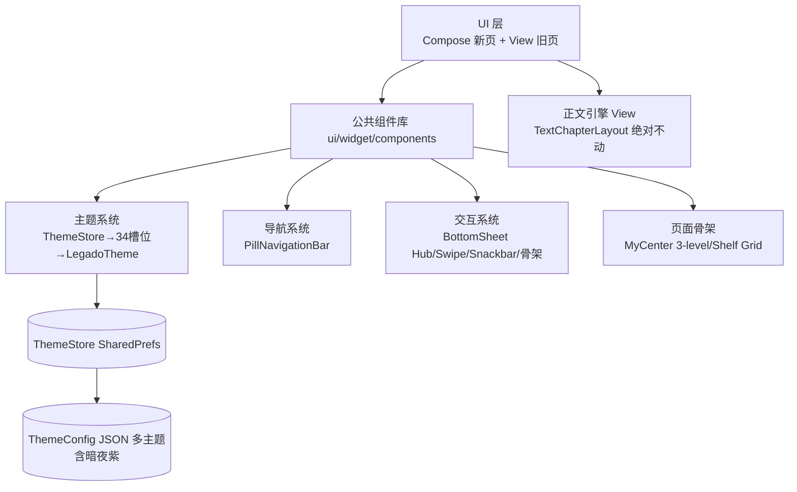

# 整体前端设计思想综合（Frontend Synthesis）

> 站在"整体前端 360° 视角"，将五仓+鸿蒙版精华**收敛为 Legado 自己的一套统一前端架构**，而非碎片化罗列。回答三问：
> ① 整体前端怎么取舍？② 五仓各贡献什么合成什么？③ 哪些底层功能绝不裁剪？

## 一、设计思想五支柱（统一收敛）

五仓精华不是堆砌，而是归纳出 5 个**必须全 App 一致的支柱**：

| 支柱 | 收敛来源 | 落地原则 |
|------|---------|---------|
| **P1 信息分层** | 鸿蒙 MyCenter 三级（统计→高频→低频）+ Rimchars 搜索 + MoRealm 主题前置 | 一切页面遵循「顶部精华 → 中部高频 → 底部低频」；≤2 步可达 |
| **P2 导航统一** | MoRealm PillNavigationBar + HapeLee FloatingBottomBar | 底部导航唯一形态（悬浮胶囊+指示点），4 Tab 不变 |
| **P3 主题一套** | MoRealm 5色→34槽位 + legadoT 背景锚定 + Jingshiro XML token | ThemeStore 单源 → 34 槽位推导 → View/Compose 同源，阅读独立 |
| **P4 组件复用** | Rimchars AppSetting 族 + HapeLee Spliced + MoRealm 设置三模板 | 一套公共组件库，页面无 private 重复实现 |
| **P5 交互一致** | 全部：BottomSheet 主力 + 小圆点角标 + 骨架屏 + 边缘返回 | 同一手势/弹层/加载语言 |

## 二、五仓贡献矩阵 → 合成到哪个组件

| 项目 | 贡献 | 合成产物（自己的组件） |
|------|------|----------------------|
| **MoRealm** | 主题实体→34槽位推导公式 / PillNavigationBar / 设置三模板 / shimmer骨架 / SwipeBackEdge / 目录书签双Tab底部面板 | `ThemeSpecToColorScheme`（AD-18）、`PillNavigationBar`（AD-17）、`SettingsSection/SettingsItem/SettingsClickRow/ToggleRow/RowIcon`、`ShelfGridSkeleton`、`SwipeBackEdge`、`BookTocBookmarkSheet` |
| **HapeLee** | Sealed 阅读浮层单态渲染 / SplicedColumnGroup / 封面 Hero 转场 / AppModalBottomSheet 双引擎 | `ReaderSheetHub`（AD-06）、`SplicedColumnGroup`、Hero 转场（默认关，AD-08）、`AppModalBottomSheet` |
| **legados** | SwipeActionContainer / VerticalScrollbar / CommonPageColors 暗色特判 / BookStackView | `SwipeActionContainer`、`VerticalScrollbar`、`CommonPageColors`（沿用）、`SummaryCard+BookStackView`（AD-16） |
| **Rimchars** | AppSettingComponents 731行组件族 / palette+signature 取色桥 / buildVisibleSections 搜索 | `AppSettingPalette+rememberAppSettingPalette`、`AppManagementCard/ListRow`、`SettingsSearchBar` |
| **legado_NG** | 双端共用 Token / Glassmorphism / MD3 动色工程 / 组件验收矩阵 | `NgToken→LegadoToken` 概念（AD-15）、玻璃磨砂（顶栏/底栏）、`ComponentAcceptanceChecklist` |
| **鸿蒙版** | MyCenter 三级布局（信息架构） | `ProfileScreen-3Level`（AD-16） |

## 三、整体前端架构图（合成）

## 四、功能不裁剪清单（红线，模块级）

**第一原则：本次重构只动"UI 布局/控件样式/交互路径"，业务逻辑与数据层 100% 保留。**

### A. 内核层（绝不碰，连换皮都不做）
| 模块 | 说明 |
|------|------|
| 书源规则引擎 | `AnalyzeRule`（CSS/JSONPath/XPath/Regex/JS 五种解析） |
| 阅读排版引擎 | `TextChapterLayout`/`PageView`/`ContentTextView`/7 种翻页委托 |
| JS 引擎 | rhino 1.8.1（Landmine 锁定） |
| 书源编辑 | JSON 编辑器、规则调试平台 |
| 净化规则 / 替换规则 / 高亮规则 | 全部保留 |
| 数据库 | Room v89 schema 不变，无新增删表 |
| 备份恢复 / WebDAV | 全保留 |

### B. 数据层（只读复用，不改结构）
| 模块 | 说明 |
|------|------|
| `ReadBookConfig` | 每书独立配色保持（MoRealm 的 readerBackground 随主题只作"可选"，**Legado 现状每书独立优先**） |
| `BookSource`/`RssSource` | 实体与现有分组逻辑不动 |
| 本地书籍解析 | epub/umd/txt 全保留 |
| 自动任务 / Web 服务 / 视频播放 | 全保留 |

### C. UI 层（可重构，但不删功能入口）
| 保留项 | 说明 |
|--------|------|
| 全部设置项 | 主题/阅读/备份/网络等**入口一个不缺**，只是卡片化分组 |
| 书源编辑/净化/替换二级页 | 保留完整编辑能力，仅换视觉皮肤 |
| RSS/视频/音频/漫画阅读 | 入口与功能全保留 |
| 章节/书签/高亮/搜索浮层 | 从 Dialog 改 Sheet，但功能相等 |
| 角标语义 | 红数字→小圆点，但"N 新/未读"信息不丢 |

### D. 允许清理（仅死代码）
| 清   则可 | 依据 |
|-----------|------|
| `pref_main.xml` 死代码（MyFragment 已无 key 的 fileManage/storageManage/downloadManage/proceed 处理器） | 四仓对标发现，实体入口已移走 |

### 五、实施路径（后续自实施，不再追加设计轮）
1. **Phase 0**：公共组件库建仓（settings 三件套+PillNav+骨架+Snackbar+SwipeBack）
2. **Phase 1**：主题 34 槽位推导替换 lerp（View 同步 XML token）
3. **Phase 2**：我的页/书架 Compose 化（MyCenter 三级 + Shelf Grid）
4. **Phase 3**：阅读器浮层 Sheet hub 化（BottomSheet 主力）
5. **Phase 4**：全 App 一致性巡检（组件验收矩阵）

每 Phase 独立可验证，不阻塞、不破坏现状功能。