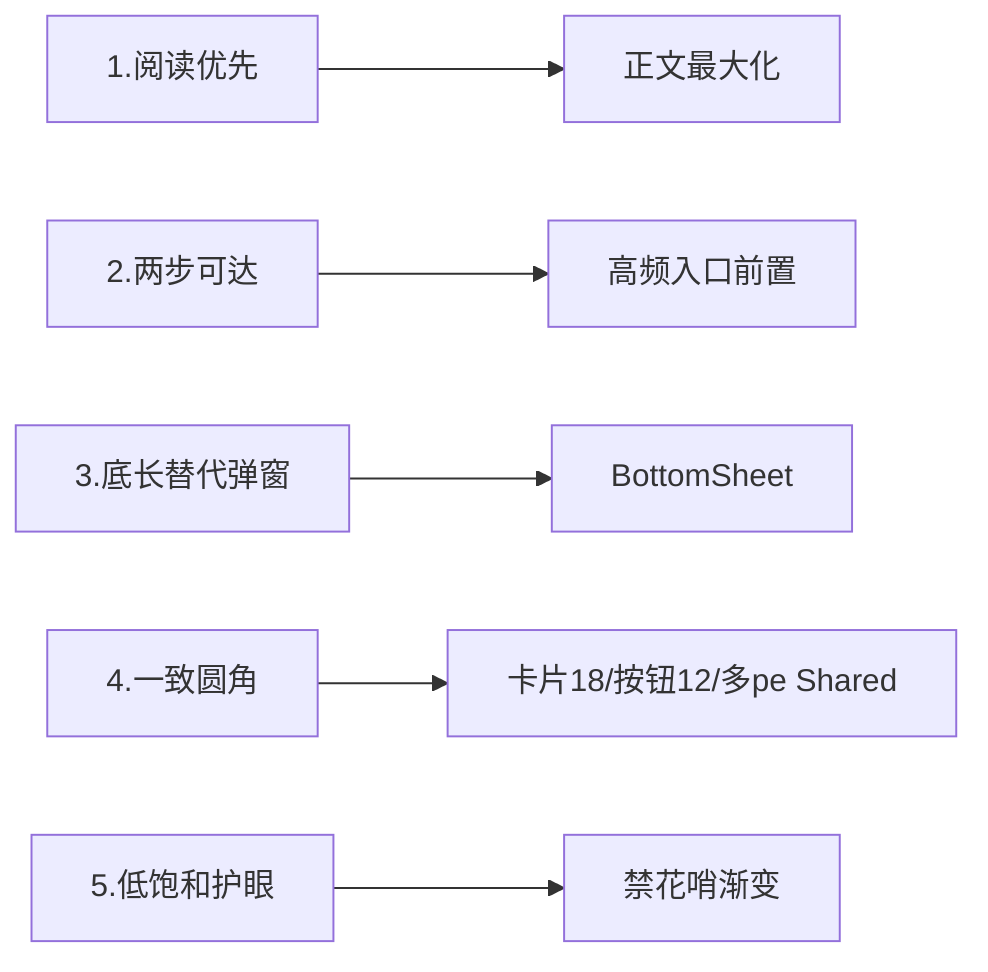

# spec.md — UI 重构设计

## Intent

将 Legado（阅读 App fork）的 UI 从"XML View 原版观感"升级为 **Material3 设计语言 + 阅读优先**的现代化体验，同时：

1. **全量保留业务能力**（书源引擎、JS 编辑器、净化规则、RSS、WebDAV、本地书籍、备份恢复），业务逻辑零改动。
2. **对标开源 fork 生态**：学习 33 个已下载 fork 的 UI 设计资产，抽取可借鉴方案并**转化为自有统一设计语言**（而非照抄他人页面）。
3. **保留默认暗紫色主题**：现状 `themeConfig.json` 中的"暗夜紫"（primary `#7B1FA2`、accent `#CE93D8`、背景 `#1E1E32`）作为默认暗色主题保留，不因重构丢失。
4. **最终目标：前端全部 Compose**（页面壳/浮层/列表/弹窗/菜单全量 Compose，达到工程级项目级标准规范）。**边界**：正文引擎（PageView/TextChapterLayout/7 种翻页委托）、漫画/音频/WebView 池（PooledWebView）、代码编辑器（sora）、相机扫码（camera-scan）等**内核与第三方控件保留原生 View，用 Compose 做页面壳与浮层**（AD-02/AD-20）。改造页面时依据 [`ui-standards.md`](./ui-standards.md) 工程规范快速定位页面骨架与组件选型。
5. **统一设计思想，杜绝每页独立风格**：同一类型页面（列表管理/表单编辑/详情/全屏沉浸）共用统一骨架模板与组件族，样式/布局/间距/圆角 token 全站复用（见 `ui-standards.md`）。
6. **核心功能一个不漏**：全量 84 个页面类逐一登记功能点核对表（`pages-inventory.md`），每页 Compose 化时逐项核对，真机功能点覆盖测试通过才算完成。

## Scope

### In Scope（本次设计文档覆盖）

| 范围 | 说明 |
|------|------|
| 设计令牌体系 | color / spacing / radius / typography 四类 token 的命名与取色来源 |
| 主题系统 | 三套内置主题（米白/暖黄/纯黑）**Wave + 保留暗夜紫默认**、日夜切换、阅读模式独立配色 |
| 页面层级 | **全量 84 页面类**（详见 [pages-inventory.md](./pages-inventory.md)）：主框架/我的、书架、阅读器、书籍详情/编辑、书源/订阅源/替换/词典/高亮/自动任务管理、发现、搜索、导入/缓存/存储/下载、RSS 全套、视频/音频/漫画/图片、配置 6 子页、文件/URL记录/回收站、登录/扫码/透明窗、debug 工具、about |
| 每页设计输出 | 布局文字框图 / 交互流程（点击、长按、手势）/ Compose 组件实现思路 / 绘图 Prompt / 功能点核对（功能一个不漏） |
| 工程规范 | 6 类页面骨架模板、组件六族复用规则、状态管理范式、三态规范、页面改造检查清单、验收 KPI（[ui-standards.md](./ui-standards.md)） |
| 技术路线 | XML View 与 Compose 共存的边界、组件复用选型、逐页迁移路线图与优先级 |

### Out of Scope（不由本次设计文档实现，仅描述方向）

| 排除项 | 原因 |
|--------|------|
| 业务逻辑改动 | 书源/净化/规则引擎零改动 |
| 数据库 schema 变更 | 无 |
| 第三方源仓库结构调整 | 无 |
| 内核/第三方控件重写 | 正文引擎/漫画/音频/WebView 池/代码编辑器/相机扫码保留原生 View（AD-02），仅换 Compose 壳 |

## Approach

### Selected Approach

采用**"设计先行 + 渐进式 Compose + 工程规范兜底"**路线：

1. **工程规范先行**：`ui-standards.md` 定义 6 类页面骨架、组件六族、状态范式、三态、检查清单——所有页面共用同一脚手架，杜绝每页独立风格。
2. **全量页面清单逐页推进**：`pages-inventory.md` 登记 84 页面类功能点与迁移优先级，逐页 Compose 化时逐项核对功能不丢。
3. **设计分层**：先建设计令牌层（View+Compose 共用），再逐页面设计，最后输出绘图 Prompt 供美工/GPT 生成效果图。
4. **主题系统双层**：`ThemeStore` 保持全局唯一主题权威源；新增 `ThemeSpec` 三套内置配色（米白/暖黄护眼/纯黑），**暗夜紫保留为默认主题配置**。Compose 侧 `LegadoTheme` 复用现有映射（sp全部守恒），阅读器用自己的 `ReadBookConfig` 独立配色不参与整体切换。
5. **阅读器保留原生 View**：`TextChapterLayout`/`PageView`/7 种翻页委托与正文绘制不改，仅对阅读菜单（`ReadMenu`）与浮层改 **BottomSheet**。Compose 页用 `AndroidView` 桥接正文。理由：换 View 会牵动全部排版/触碰命中，风险极高（对照 Mihon/微信读书均保留 EPUB 渲染核心）。

### Why now

- 33 个 fork 已下载在手（`temp/forks-comparison/`、`temp/legado/temp/dandanmax-web`），能闻到其他 fork 的设计资产（HapeLee MD3、paintingT 种青色、legados 桥接、Sumry 换肤 zip、JingMin XML token、NY 下划线族）。
- Compose 基建已在（compose BOM 2025.04.01，material3、kotlin-compose 插件、LegadoTheme、ComposeActivitySupport），无需引入额外大依赖。
- DESIGN-MD 已给出明确的视觉约束（栅格 360dp、间距 4/8/16/24/32、卡片 18dp、按钮 12dp、禁高饱和、禁用三角/嵌套弹窗）。

### Alternatives Considered + Drawbacks

| 替代方案 | 否决理由 |
|----------|----------|
| 全量 Compose 重写所有 Activity | 60+ 页面一次性改写工程极大；阅读器引擎/漫画/音频/WebView 沉浸重制成本不可控；回归破坏业务风险高。改为渐进式。 |
| 直接用 Mihon 式 Hero+网格替换书架 | Mihon 是漫画/图片流 App，Hero 动画对小说书架只有封面大图场景有价值，其余场景（列表/搜索）收益低，且有共享元素转场的性能与覆盖安装回归风险。仅吸收"封面大图 + 圆角卡片 + 底部角标"设计语言。 |
| 引入新第三方主题框架（如 hct kv 注入） | 增加依赖与维护面；本项目已要求保留特定默认主题，自定义框架吃力不讨好。用 ThemeStore 原生能力 + 现成 `LegadoTheme` 映射即可。 |
| 完全替换 ThemeStore（去掉主题色系统） | 破坏现有"用户可自选主题色+背景图"生态，与保留暗紫需求冲突。 |

### Design Pillars（16 字实施原则）

### Prior Art（已有可复用资产）

- 现有 `app/src/main/java/io/legado/app/ui/theme/LegadoTheme.kt`（把 ThemeStore 主色映射 M3 ColorScheme，SP 键驱动）。
- `ComposeActivitySupport.kt` 提供 `setLegadoContent`、状态栏/导航栏自适应、背景图加载。
- 现有 8 个内置主题（`buildin-themes ✅ 完成`）、`themeConfig.json` 17 套主题（含暗夜紫）。
- fork 级借鉴清单（见 README 对齐参考表，实测来源：`temp/legado/temp/forks-comparison/*`、`temp/legado/temp/dandanmax-web`）。

## Layout / Interaction Reset（书籍类几个端）

所有关键交互需在每页 design.md 段落回答：点击、长按、手势三途径分别对应什么操作；正文区域可点击/长按提供哪些高冗余入口。

## Requirements

### 功能需求（FR）

| ID | 需求 | 优先级 | 验收 |
|----|------|--------|------|
| FR-1 | 三套内置主题（米白/暖黄护眼/纯黑）+ 保留暗夜紫默认在设置主题中可见 | P0 | 主题设置可见 4 套（含默认暗紫），切换即时生效 |
| FR-2 | 阅读器正文最大区域；顶部/底部浮层仅在点击/长按出现，3s 无操作自动隐藏 | P0 | 走查阅读器：区域内 UI 控件不常驻遮挡 |
| FR-3 | 书架（主 Grid）封面圆角 12-18dp，卡片式布局，空态提醒 | P0 | 走查书架样式 1/2 均适配 |
| FR-4 | 高频操作（搜索、书源管理、主题切换、返回书架）≤2 步 | P0 | 路径检查 |
| FR-5 | 弹窗总量大幅减少，设置类改为 BottomSheet | P1 | 书源编辑相关弹窗改为 sheet（审核阶段设计稿） |
| FR-6 | 正文浮层（搜索、替换、图内）为 BottomSheet + 长按快捷方式 | P1 | 走查全部弹窗调用点 |
| FR-7 | 未读角标/通知改为小圆点而非刺眼数字红标 | P2 | 走查书架与 RSS 角标 |
| FR-8 | **前端全部 Compose**：页面壳/浮层/列表/弹窗全量 Compose 化，正文内核与第三方控件保留原生 View | P1 | 全量 84 页面类按迁移路线图（pages-inventory §G）逐页完成，真机功能点覆盖测试通过 |
| FR-9 | **统一页面骨架**：同一类型页面共用统一骨架模板（ui-standards §2），样式/布局/间距/圆角 token 全站复用，禁止每页独立风格 | P0 | 逐页核对同类型页骨架一致；全仓 grep 非内核页面硬编码色值=0、页面私有重复组件=0 |
| FR-10 | **组件复用门禁**：公共组件库已有能力，页面禁止私有复制（如 UnreadBadge 复制 BadgeDot） | P0 | 孤儿组件全部接线；0 处私有重复（巡检 KPI） |
| FR-11 | **真机功能点覆盖测试**：每页 Compose 化后必须用真机/模拟器覆盖全部功能点（ai_e2e 框架），通过才算完成 | P0 | tasks.md 逐页挂测试门禁；测试记录留档 |
| FR-12 | **工程规范文档交付**：提供可指导后续任意页面优化的规范（ui-standards.md） | P0 | 新页面改造按 §7 检查清单通过 9 项 |

## NFR

- 性能：长列表滑动不掉帧，正文翻页无新增卡顿。
- 兼容：minSdk 23，AndroidX 版本不动，**不引新增依赖**。
- 开源合规：基于 M3 公共组件与自有 token，不复制他人代码。
- 状态管理：统一"受控组件 + ViewModel + Flow"范式（ui-standards §4），禁止 Fragment 散落重复订阅。

## Scenarios

### S1 用户切换暗夜紫主题
1. 我的 → 设置 → 主题外观。
2. 列表中出现"浅色米白 /暖黄护眼 /纯黑/ 暗夜紫(默认)"。
3. 选择"暗夜紫"；`ThemeConfig.applyConfig` 生效，全 App 主题即时切换，Compose 页由 LegadoTheme 同步。
4. 正文阅读界面维持独立配色不联动。

### S2 阅读器操作浮层
1. 进入阅读，静止 3s → 顶栏/底栏自动隐藏，只见正文。
2. 点击中屏 → 出现顶部状态栏层 + 底部工具栏。
3. 长按文字 → 原生选择 + 快捷工具条（拷贝/划线/高亮/分享）。
4. 本册操作均 2 步内可达，无嵌套多层弹窗。

### S3 书架网格管理
1. 书架首页默认被遗漏 Grid，封面圆角。
2. 长按书架分组/书籍 → 弹出 BottomSheet 快捷菜单（下载、删除、替换、移至分组）。
3. 低数量书籍/空书库 → 空态插图 + 引导"去发现书城/导入本地书"。

### S4 书源编辑调试
1. 书源管理列表长按 → BottomSheet：编辑/调试/复制/分组。
2. 书源详情进入编辑，内容区保留全部 JSON 编辑能力。
3. 调试只读展示，log 展开为 BottomSheet。

## Checklist（验证完整性）

- [x] 每个核心页面是否给出布局结构（文字 block 图）
- [x] 每个核心页面是否给出交互/手势清单
- [x] 每个核心页面是否给出 Compose 复用思路
- [x] 每个核心页面是否给出绘图 Prompt
- [x] 系统主题 4 套（含暗紫）隐忧排除
- [x] 与现有基础设施（LegadoTheme、ThemeStore、BottomSheet）引用一致
- [x] 全量 84 页面类功能点核对表（pages-inventory.md）——**核心功能一个不漏**
- [x] 工程规范（ui-standards.md）——统一骨架/组件复用/状态范式/三态/检查清单
- [x] 统一性验收 KPI（同型页骨架一致、硬编码色=0、私有重复=0、真机覆盖）
- [ ] 逐页 Compose 化 + 真机功能点覆盖测试（随迁移 Phase1-5 执行）