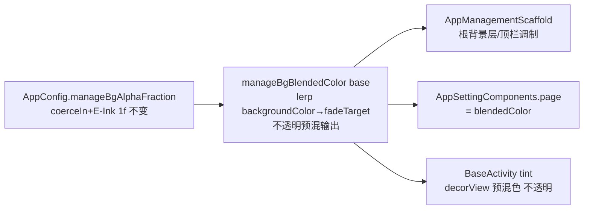
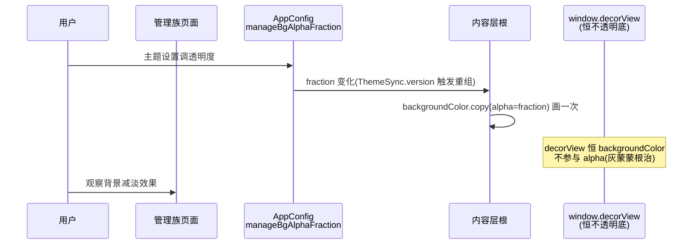

# design.md — 管理页样式统一与交互回归修复

> 状态：🔄 设计中

## Technical Approach

### F1 注入恢复（Explore 探索铁证：注入被 revert 移除，消费链残留）

从 `05e4dde3c` 重放 5 处注入 diff（行数 7-20 行不等，重放时以 `git show` 原文为准重新定位锚点——现工作区行号已漂移），**统一按 `isVideo` 过滤后注入**（防混排分类上滑落入文本书，红队 R2-2）：

| 入口 | 位置 | 注入内容 |
|------|------|---------|
| ExploreShowActivity | showBookInfo→open 前 | `VideoPlaylistHolder.set(composeBooks.toList(), idx)` |
| ExploreFragment | 点击回调（L3708 原位） | `VideoPlaylistHolder.set(holderList, idx)` |
| SearchActivity | open 前（L630 原位） | 同源子序列注入 |
| BookshelfFragment1 | 视频列表点击（L156 原位） | 书架视频列表注入 |
| BookshelfFragment2 | 同上（L141 原位） | 同上 |

消费链（VideoPlay.kt:434 `switchToBookFromList`→`VideoPlaylistHolder.neighborOf`）与清理链（VideoPlayerActivity.onDestroy:1845 `clear()`）不动。`VideoPlaylistHolder.consume()` 死代码保留不动。ExploreFragment 兜底链命中横排 suite widget 时注入的"列表下一个"空间语义可能与用户预期错位（半成品遗留），真机矩阵补 suite 横排入口用例。

### F2 书架手势三修（BookshelfScreen.kt）

1. **刷新条件化（红队 R5-3 层级整改）**：M3 PullToRefreshBox 的 nestedScroll 在 onPostScroll 消费且位于内容与外层之间——外层拦截无效。改为**最简 onRefresh 短路**：`onRefresh` lambda 内 `books.isNotEmpty() && listState.canScrollBackward` 不满足时直接不复位不刷新（配合指示器回落）；或内容包一层 onPostScroll 全量消费。二选一实施
2. **状态保活（红队 R2-1 整改）**：两 state **提升到 loading 分支外**（现位于 else 分支内 loading 时不组合）+ `rememberSaveable(saver=LazyGridState.Saver/LazyListState.Saver)`；loading 骨架改 Box 叠加常驻；upConnect loading 仅首次置位。**无 key=跨分组保持滚动位置为有意决策**（切组越界由 LazyGrid clamp 兜底），禁止实施者加 key
3. **轴向锁定（红队 R5-4 基线修正）**：LockableViewPager 现状仅 swipeEnabled 布尔、无位移判定基线——**从零实现**：onInterceptTouchEvent 记录初始触点，move 累计 |dx|/|dy| 比例 >1.2 才交 super 拦截

### F3 发现页头部闪烁三修（MainTopBarView.kt + RoundedTagBarView.kt）

1. `createTopBarLayoutTransition()`（L759）：补 `disableTransitionType(APPEARING)` + `disableTransitionType(DISAPPEARING)`（保留 CHANGING bounds 动画）
2. `updateFilterBarsVisibility`（L701-730）：四个 isVisible 赋值前比较旧值，相同不重赋；`animateFilterToggle`（L732）目标 rotation 与当前一致时 return 不重启
3. ~~RoundedTagBarView submitItems 早退~~（红队 R1-1 核实：现行代码 L147-152 已有 sameItems 早退，全量重绘路径不存在，无操作销项）

### F4 透明度消费模型重构（Delta：superseding ui-theme-governance-polish P6 BaseActivity tint 路线）

- **v2 预混模型（红队 R5-1 P0 整改，superseding polish P6 alpha/tint 双路线）**：alpha 叠加废弃（同色底叠 alpha 数学性归零；异色底灰蒙蒙；15 处消费点双重叠透泄漏）。新模型：`AppConfig.manageBgBlendedColor(baseColor) = lerp(baseColor, fadeTarget, 1-fraction)`，fadeTarget=浅色主题白/深色主题黑（isNightTheme），**输出恒不透明**。滑条语义登记为"背景减淡"（100=原色，0=完全减淡）
- `AppSettingComponents.kt:139`：`val page = Color(context.backgroundColor)` → `Color(AppConfig.manageBgBlendedColor(context.backgroundColor))`（随 ThemeSync.version 组合刷新；15 处 settings.page 消费点自动全域生效，TagManage 在 Scaffold 内叠 page 的双重叠透随不透明预混消解）
- `AppManagementScaffold`：根背景层/顶栏调制从 `copy(alpha=fraction)` 改 `manageBgBlendedColor`（壁纸调制 wallpaperFactor 乘法合成保留——壁纸路径维持 alpha 语义不动，仅无壁纸路径走预混）
- `BaseActivity.manageHostTintColor()`：改用 `manageBgBlendedColor(backgroundColor)`（decorView tint 恒不透明预混色，C 类 View 宿主亦生效，无灰蒙蒙）
- 防叠加规则：预混不透明色天然无叠加问题；装饰卡片/列表项保持原色（可读性底线不变）

### F5 子页面统一第一期（分型矩阵驱动，探索统计 23/24 未接入）

| 类别 | 页面 | 改造 |
|------|------|------|
| A 类 9 页（全 Compose 列表） | TxtTocRule/DictRule/HighlightRule/FileManage/StorageManage/LibraryContainer/BookCharacter/Download/AiProvider | 换 AppManagementScaffold（含搜索/多选/底栏按页接入），`AppManagementAction` 增加 `icon: ImageVector? = null` 槽位（红队第 3 轮⑤：iconRes DrawableRes 与 ImageVector 不可逆转换），删页内自绘 SelectionActionBar |
| B 类共享组件 | AppPackageManageComponents | Screen 壳接入统一顶栏语义（TopBarManage/NavigationBarManage/ShareNoteTemplate 三页随之统一） |
| B 类单页 | BookInfo/Bubble/AdvancedTitle/CoverCollection/DiscoverySuite | View TitleBar 摘除 → AppManagementScaffold |
| C 类 4 页（View RecyclerView） | CacheManage/ParagraphRule/ReadMenuButton/ReadAloudBgm | 仅顶栏样式对齐：TitleBar 基色消费 backgroundColor（消 primaryColor 断层），列表不动 |
| GlassTopAppBar 族顶栏断层 | TxtTocRule 等 Glass 页 | 过渡期顶栏基色改 backgroundColor 同源（消白带）；随 A 类平移后自然消解 |

ThemeManage（LazyVerticalGrid 网格）顶栏平移、网格列表保留（content lambda 天然兼容）。

## Architecture Decisions

### AD-01: F1 采用注入点恢复而非收口/自愈
- **Version**: v1.0 / **UpdateTime**: 2026-09-03
- **Context**: revert 450e60bf8 移除 5 处注入，消费链残留；原注入为已验证设计的一部分被整批误伤
- **Concern**: 三入口（发现/搜索/书架）上滑续播全部失效
- **Decision**: 按 05e4dde3c 最小 diff 重放 5 处注入
- **Goal**: 队列闭环恢复，无新架构
- **Tradeoff**: 需甄别半成品批次中注入代码的完备性并重跑真机矩阵
- **Status**: Proposed

### AD-02: 书架刷新条件化采用 nestedScroll 连接
- **Version**: v1.0 / **UpdateTime**: 2026-09-03
- **Context**: M3 PullToRefreshBox 默认顶部任何下拉放行；发现页有 View 侧回调先例
- **Concern**: 非顶部下拉误触发全量刷新；斜滑误触
- **Decision**: Compose nestedScroll 拦截：仅 `canScrollBackward==false` 放行；配合 State Saveable+常驻组合+ViewPager 轴向锁定
- **Goal**: 三症状消除，顶部刷新保留
- **Tradeoff**: 多一层 nestedScroll 连接复杂度；流式列表"下滑翻页"预期不由手势层解决
- **Status**: Proposed

### AD-03: 透明度消费模型统一为内容层 alpha（superseding BaseActivity tint）
- **Version**: v1.0 / **UpdateTime**: 2026-09-03
- **Context**: decorView 之下无内容可透出（window 非 translucent），tint alpha 机制性产生"灰蒙蒙"；三个全屏不透明根层遮死 tint（真机：仅书源/订阅源管理可见）
- **Concern**: 33 宿主透明度全域生效且不灰蒙蒙
- **Decision**: decorView 恒不透明底；alpha 只画内容层根（AppManagementScaffold 模式为准）；AppSettingComponents.page 带 fraction；全屏根层去不透明；BaseActivity 钩子退役为标记位
- **Goal**: 全域可见、无灰蒙蒙、E-Ink/可读性底线保持
- **Tradeoff**: 透出物=主题底色减淡混合而非壁纸；每页只允许一处 alpha（防叠加）
- **Status**: Proposed / Superseded-by: 无 / ChangeLog: superseding ui-theme-governance-polish P6 BaseActivity decorView tint 路线

### AD-04: F5 分期统一而非 24 页全量迁移
- **Version**: v1.0 / **UpdateTime**: 2026-09-03
- **Context**: 管理族 24 页仅 1 页接入统一体系；C 类 4 页为纯 View RecyclerView
- **Concern**: 白带断层与样式割裂普遍存在 vs 工作量 12-16 人日
- **Decision**: 第一期 A 类 9 页平移+B 类共享组件+C 类顶栏对齐；C 类全量 Compose 化另行立项
- **Goal**: 用户可见断层（白带/异形列表）本期消除
- **Tradeoff**: C 类列表样式暂保留 View 形态
- **Status**: Proposed

## Data Flow

## File Changes

| 文件 | 变更 | 关联 |
|------|------|------|
| ExploreShowActivity/ExploreFragment/SearchActivity/BookshelfFragment1/BookshelfFragment2 | 恢复 VideoPlaylistHolder.set 注入（5 处） | F1 |
| bookshelf/BookshelfScreen.kt | 刷新条件化+State Saveable+loading 常驻叠加 | F2 |
| ui/widget/LockableViewPager.kt | 轴向锁定强化 | F2 |
| bookshelf/style1/BookshelfFragment1.kt | loading 首次置位语义 | F2 |
| ui/widget/MainTopBarView.kt | LayoutTransition 禁 alpha+幂等化 | F3 |
| ui/widget/RoundedTagBarView.kt | submitItems 相等早退 | F3 |
| help/config/AppConfig.kt | 新增 manageBgBlendedColor(baseColor) 预混 helper | F4 |
| base/BaseActivity.kt | manageHostTintColor 改用预混色 | F4 |
| ui/widget/components/AppSettingComponents.kt | page 色改预混 blendedColor | F4 |
| ThemeManageActivity/AppPackageManageComponents/BookInfoManageScreen | 根层不透明去除 | F4 |
| ui/book/toc/rule/TxtTocRuleScreen.kt 等 A 类 9 页 | 平移 AppManagementScaffold | F5 |
| ui/widget/compose/AppManagementScaffold.kt | AppManagementAction 增加 icon: ImageVector? 槽位；根背景/顶栏改预混 | F4/F5 |
| ui/widget/components/AppMenuSheet.kt | （如需）MenuAction 共享调整 | F5 |
| ui/book/toc/TocComposeScreen.kt | settings.page 吸顶遮蔽分支随预混自然生效（影响分析登记） | F4 |
| ui/widget/components/AppPackageManageComponents.kt | B 类共享组件统一顶栏 | F5 |
| C 类 4 页 Activity | TitleBar 基色对齐 | F5 |
| ui/widget/ GlassTopAppBar.kt | 顶栏基色 backgroundColor 语义 | F5 |

## 验证策略

L1 编译；L2 真机矩阵：S-F1 三入口×首/中/末视频、S-F2 三手势+斜滑、S-F3 浅色主题标签/切源/筛选展开、S-F4 四页透明度（50%/0%/100%）+E-Ink、S-F5 TxtTocRule 浅色顶栏+列表同族；回归：F1 不破坏 VideoPlay 既有链、F4 不破坏壁纸背景图路径、F2 顶部刷新可用。
