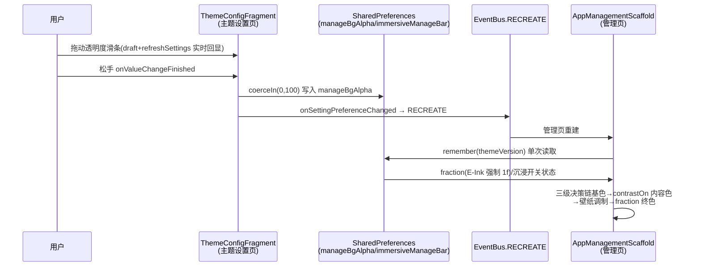

# design.md — UI 主题纳管与弹框交互优化

> 状态：🔄 设计中（红队 R1-R5 终审 GO-WITH-NOTES）
> 整改来源：审查穿透核验（1P0+4P1+6P2）+ 红队 R1 执行模拟（4P0+8P1）+ R2 稳定健壮（2P0+4P1）+ R3 通用遗漏（1P0+4P1）+ R4 一致性（1P0+3P1+5P2）+ R5 终审 GO-WITH-NOTES

## Technical Approach

### 总体思路

不做主题引擎重构，以"点位补齐"方式修复 6 个问题。所有修复共享一个原则：**取色唯一基线 = AppDialogStyle / ThemeStore 直取**，禁止 M3 colorScheme 直读。

### P1: 开关组件主题化（复用既有组件 + 可选参数扩展 + 全域清零）

**红队整改（R1-P0-1/R2-P1-4）**：`ui/widget/compose/LegadoMiuixComponents.kt:281` 已存在 `LegadoMiuixSwitch(checked, onCheckedChange, palette, modifier, enabled)`（内部 miuix/M3 双渲染路径），且有 `AppDialogSwitchRow`（AppComposeDialogs.kt:1846）等既有消费点。**禁止新建同名组件**（同包 Conflicting overloads 编译失败），**禁止改变既有参数的默认行为/视觉**（会外溢全 App 弹框开关视觉）；允许以"新增可选参数（默认值零影响）"方式扩展。

修正后的方案：

```
SourceFolderConfigDialog.SourceFolderAscendingRow（L790-793 裸 M3 Switch）
    └─ 换用既有 LegadoMiuixSwitch + style.toMiuixPalette() 桥接
       （先例：AppDialogSwitchRow 同款用法；AppDialogStyle→LegadoMiuixPalette 桥已存在）
BookshelfConfigDialog.BookshelfMiniSwitch（L1002-1042）
    └─ 迁移至公共组件（用户裁决：无二期，本期完成两弹框开关视觉统一）
       既有组件新增两个可选参数：
       ① stroke: Color? = null（描边）
       ② compact: Boolean = false（mini 尺寸 38x22dp 轨道/16dp thumb，且关闭阴影）
       书架调用点传 style.stroke + compact = true
屏幕域裸 Switch 8 处（AutoTaskEditScreen:127/144、AiWorldBookManageScreen:585/662/1015、
SettingsSelectableRow:123、SettingsToggleRow:64、RegexTestScreen:338）
    └─ 本期清零（用户裁决无二期）：SwitchDefaults.colors 换 palette/AppDialogStyle 映射（§8）
```

**stroke/compact 实现规格（红队 N1-P0-2/N1-P1-1/N2-P1-2 整改）**：

1. stroke 统一经 switchModifier 追加 `Modifier.border(1.dp, if (checked) Color.Transparent else stroke, RoundedCornerShape(50))`——双渲染路径共用同一 modifier（miuix 路径 `MiuixSwitchDefaults.switchColors` 无 stroke/border 槽，不能走 colors 参数），仅未选中态着色，对齐原书架实现语义；登记"边界=组件边界与原轨道边界 ≤1dp 视觉差"
2. compact 参数：38x22dp 轨道/16dp thumb 复现原 mini 尺寸，且 compact 时 shadow 关闭（原 mini 无阴影；同时规避 E-Ink 下 shadow 永久灰圈问题）；M3 fallback 分支同步实现 stroke/compact（虽 miuix 路径在 minSdk23 下恒真，编译一致性必须保持）
3. 选中 thumb 采用 palette.resolvedOnAccent 自适应黑白（原书架硬编码 White 在浅 accent 下低对比，迁移后为改善而非回归——红队 N2-P1-3 裁决，删除"白色保留豁免"表述）
4. 语义由内层 Switch 原生承担，**禁止外挂 toggleable**（双触发防御）；新增参数追加至参数表末尾（既有 21 处调用点均为命名传参，插参安全）

裸 Switch 检查口径（红队整改 R1-P1-8 + R4-P1-3 + N1-P0-1 全域清零）：Grep `\bSwitch\(`（覆盖全限定名与短名 import 两种形式）于 `app/src/main/java` 全部 .kt，合法存量点为 `LegadoMiuixComponents.kt:312`（组件内部 fallback 分支）与 `ThemeEditorScreen.kt:737`（预览画布 mock，文件头门禁注释豁免），**其余 9 处（SourceFolderConfigDialog:790 + 屏幕域 8 处）全部本期清零后 = 0 残留（存量总数 11 = 9 待修 + 2 合法豁免）**。

### P2: 登录弹框按钮收纳

`AppDialogFrame` 扩展 `titleTrailing: (@Composable () -> Unit)? = null` 槽（默认 null，82 处（含定义行）/74 文件零感知）。标题行结构改造：`Row { Text(Modifier.weight(1f), maxLines=2, ellipsis) + titleTrailing() }`——必须保留既有 Ellipsis 行为，防长标题（登录弹框标题含源 tag）挤出 trailing 槽（红队整改 R1-P2-13/R2-P2-6）。

登录弹框：

- titleTrailing 槽：`Box { IconButton(MoreVert) + AppDropdownMenu(menuActions) }`，菜单项 = 显示登录头（Visibility 类图标）/ 删除登录头（Delete 类图标）/ 日志（Article 类图标）——3 项 strings（`show_login_header`/`del_login_header`/`log`）与 `MenuAction.icon: ImageVector` 均已存在，**零新资源**
- actions 槽：仅保留"确定"（primary），固定右下
- **换源弹框同步迁移（用户裁决无二期）**：`ChangeBookSourceDialog` 内容区搜索行的三点菜单（L414-477）迁移至同一 titleTrailing 槽，搜索行腾出空间；菜单项内容不变（刷新列表/校验作者/字数加载/详情加载/目录加载/关闭）

### P3: 主题编辑器保存感知

**dirty 判定（红队整改 R1-P0-3/R2-P1-1）**：`ThemeEditorState` 含非编辑字段（`isNight/applySuccess/suggestions/extracting/wallpaperBitmap`）且 ViewModel 持 `drafts: MutableMap<Boolean, ThemeEditorState>` 日夜双草稿（switchMode 整体替换 state），**单一 initialState 快照不可行**。实现约定：

- 投影函数 `ThemeEditorState.toDirtyComparable(): DirtySnapshot`——仅提取编辑字段（9 色槽 + name + wallpaperPath/Blur + 4 滑杆值），剔除全部非编辑字段
- 按模式快照 `initialSnapshots: Map<Boolean, DirtySnapshot>`，与 drafts 同构：首次进入某模式时记录该模式快照
- `isDirty = 当前模式 DirtySnapshot != initialSnapshots[当前模式]`
- `apply()` 成功后：显式复位 `applySuccess = false`（防止 drafts 缓存携带 true 导致重复触发自动关闭）并对当前模式重建快照

**关闭通道收敛（红队整改 R1-P0-2/R2-P1-2）**：DialogFragment 存在第三关闭通道（点击弹框外部 → `Dialog.cancel()` 直接 dismiss，不经过 `handleDialogBack`）。整改：

1. `ThemeEditorDialogFragment` 显式 `isCancelable = false`（禁用点外部直接关闭），所有退出收敛到三条 dirty 感知路径：返回键 / 取消按钮 / 保存成功
2. `ComposeDialogFragment` 新增 `protected open fun onBackIntercepted(): Boolean = false`，`handleDialogBack()` 改为 `if (!onBackIntercepted() && isCancelable) dismissAllowingStateLoss()`（默认 false，全量调用点零感知；handleDialogBack 为 private 但两条返回路径——OnBackPressedCallback 与 KeyListener——均汇入，钩子覆盖完整）

**按钮落点（红队整改 R1-P1-12）**：按钮在 `ThemeEditorDialogFragment` 的 actions lambda 内实现（可访问 viewModel/dirty 状态）：`取消` onClick = dirty 检查 → 未脏 dismiss / 脏弹"放弃修改？"确认弹框；`保存`（primary）= apply 成功后关闭（既有 applySuccess 自动关闭链路复用）。

**取色纳管分层（红队整改 R1-P1-11）**：ThemeEditorScreen.kt 实测 38 行 `MaterialTheme.colorScheme` 命中，语义分三类区别处理：

| 分层 | 范围 | 处置 |
|------|------|------|
| chrome 区（本弹框 UI） | 按钮行 L115-142 / DayNightTabs L168-190 / TabButton / SectionCard | 逐个替换为 AppDialogStyle 字段 |
| 预览画布 | 嵌套 MaterialTheme 临时 scheme 区（文件头门禁注释明确预览专用） | **豁免不改**（改了会破坏预览语义） |
| SimpleColorPickerDialog | ThemeEditorScreen.kt:819 私有函数（调用点 L148），非独立文件 | **本期纳管**（用户裁决无二期）：colorScheme 直读点替换 AppDialogStyle 字段（映射：surfaceContainerHigh→fieldSurface、onSurface→primaryText、onSurfaceVariant→secondaryText、outline→stroke、primary→accent，可直调 rememberAppDialogStyle()）；预览画布豁免不变 |

### P4: 字号滑条 + 高度自适应

- `ThemeEditorScreen.kt:406` 与 `:392`：`?: 12f` → `?: 10f`（valueRange 8..16 + steps=7 的离散点为 8~16，10f 合法且位于 25% 偏左）。注意 null 语义下 valueText 显示"跟随默认"文案而非"10"（L404-406），**滑块位置与文案错位属接受项**（AD-04）
- 编辑器内层 `EditorMaxContentHeight = 460.dp` 固定上限 → `with(LocalConfiguration) { (screenHeightDp * 0.7f).dp }.coerceAtMost(520.dp)`：内层上限与外层 AppDialogFrame 520dp 上限取 min，保证小屏/大字号下内层不再先于外层裁切，底部按钮行始终可见
- 文字截断真机排查清单（红队整改 R3-P1-2 扩展）：SettingSpecScreen minHeight=60dp/72dp、ThemeEditorScreen 固定高度区、**NavigationBarManageActivity:1239 `heightIn(max=460.dp)`（同款 460dp 模式）**、AiProviderEditScreen:487（360dp）、ThemeManageActivity:2364-2631 预览卡（198/96/32dp 固定高）、AppearanceKitActivity:634/651——逐项大字号过一遍，发现一处修一处

### P5: 沉浸顶栏开关修复（三级决策链 + 壁纸调制保留）

`AppManagementScaffold.kt:141-150` 决策链重写。**前置事实（红队整改后口径）**：

- `TopBarConfig.Config.backgroundColor: Int?` 可空；`defaultConfig` 恒填默认色，但**自定义包 JSON 可为 null**（normalizeConfig 不兜底），故判定必须走 `resolveBackgroundColor`（内含 `?:` 兜底，L323-325），**禁止裸 `backgroundColor != null` 或裸值比较**
- REGULAR 分支现行为含 `withOpacity(resolveBackgroundColor, wallpaperAlpha)` 调制 + 顶栏下方壁纸层绘制（L159-167）——**壁纸调制维度必须保留**（红队整改 R3-P0-1），否则"仅设壁纸不改背景色"用户的壁纸被不透明顶栏遮死，P5 自身引入回归
- `isRegular` 还门控 wallpaperFile 加载 / cornerRadius / topBarContentColor（L133-152）——**wallpaperFile/cornerRadius 门控保持不变**，仅重写 topBarColor 决策（红队整改 R1-P1-6）

```kotlin
// TopBarConfig 新增封装（红队整改 R1-P1-5：resolve 兜底后值比较）：
fun Config.hasCustomBackground(): Boolean =
    TopBarConfig.resolveBackgroundColor(this) != TopBarConfig.defaultBackgroundColor(isNightMode)

// AppManagementScaffold 决策链：
val topBarBase = when {
    config.hasCustomBackground() -> Color(TopBarConfig.resolveBackgroundColor(config))
    AppConfig.immersiveManageBar -> Color(context.backgroundColor)   // 沉浸：融入页面背景
    else -> Color(context.primaryColor)                              // 实色主色
}
// 内容色先于 alpha 决策（红队整改 R3-P1-1/R2-P2-3：对比度基于不透明基色计算；
// 非 REGULAR 内容色由 titleTextColor 统一为 contrastOn(基色)，视觉变化接受并纳入 6.3 视验）
val topBarContentColor = contrastOn(topBarBase)
// 统一调制层（红队 R4-P0-1 整改：壁纸调制与 P6 透明度为乘法合成——copy(alpha=) 是
// 绝对赋值，顺序两次 copy 会使后一次覆盖前一次，默认 fraction=1f 时壁纸调制丢失，
// R3-P0-1 回归复现）：
val wallpaperFactor = if (isRegularStyle && wallpaper != null) {
    config.wallpaperAlpha.coerceIn(0, 100) / 100f
} else 1f
val alpha = wallpaperFactor * AppConfig.manageBgAlphaFraction      // E-Ink 时 fraction 强制 1f
val topBarColor = topBarBase.copy(alpha = alpha)
```

已知边界登记（红队整改 R2-P1-3/R1-P1-7，接受语义）：①本地顶栏包背景色烘焙于创建时刻，主题背景色后续变更会触发值比较误判"自定义"（用户显式创建过包即视为自定义，视觉无损可接受）；②仅调 wallpaperAlpha 未改背景色的顶栏包会走沉浸/默认分支丢失其 alpha 调制（罕见配置，登记）。E-Ink 模式（themeMode=3）下决策链强制 WHITE/不透明契约（`defaultBackgroundColor` 已强制 WHITE，透明度由 P6 fraction=1f 保证）。

### P6: 管理页透明度设置

```mermaid
flowchart LR
    A[ThemeConfigFragment<br>复用 SettingSliderSpec<br>新增透明度滑条] -->|onValueChangeFinished<br>coerceIn(0,100) 写入| B[(PreferKey.manageBgAlpha<br>默认 100 不分日夜)]
    B --> C[AppManagementScaffold<br>顶栏终色 + 根背景绘制层消费]
    C --> E[管理页视觉<br>顶栏/背景半透明<br>内容色不透明可读]
```

- **clamp 双向防御（红队整改 R2-P0-1）**：`manageBgAlpha` 读取与写入均 `coerceIn(0, 100)`（get/set 双向，对齐 `dialogAlpha`/`frostedGlassLevel` 既有范式；`Color.copy(alpha)` 对超界值抛 IllegalArgumentException，脏 pref 会使 5 个管理页全崩）
- **E-Ink 豁免（红队整改 R2-P0-2）**：`fraction = if (AppConfig.isEInkMode) 1f else manageBgAlphaFraction`，对齐既有 E-Ink 契约三先例（AppComposeDialogs/ComposeDialogFragment/TopBarConfig 强制不透明）
- **分 key 决策声明（红队整改 R2-P2-1）**：单 key 不分日夜（管理页日夜同源背景，与 dialogAlpha 分 key 场景不同），此为显式决策非静默偏离
- **读取稳定性（红队整改 R2-P2-8）**：Scaffold 内 `remember(themeVersion)` 单次读取 fraction，避免每次重组直读 SharedPreferences
- **消费落点（红队整改 R1-P0-4）**：Scaffold 根 Column 现为 `background(Color.Transparent)`，页面底色实为宿主 windowBackground（不透明），顶栏与内容区上下结构不重叠。消费模型选定 **(a)**：根 Column 增加显式背景绘制 `background(backgroundColor.copy(alpha = fraction))` + 顶栏终色消费 fraction，透出层 = windowBackground；**S6 验收以"顶栏/背景色调与 100% 存在可观测差异"为准**，真机若 windowBackground 同色致无感，**在同一任务内追加内容卡片级透明度消费后复验（不遗留、不延期）**。alpha 统一在 P5 终色应用点应用一次
- **提交机制（红队整改 R1-P1-10）**：渲染层无状态（`spec.value` 驱动回显，buildPageSpec 非 Composable 无 remember 宿主），照字面实施滑条松手会弹回。方案：Fragment 持 `manageBgAlphaDraft` 变量，onValueChange 更新 draft + `refreshSettings()`（复用 ComposeSettingFragment refreshTick 重组桥），`onValueChangeFinished` 时 `updateIntSetting` 提交 + `onSettingPreferenceChanged(PreferKey.manageBgAlpha)` 触发 RECREATE（同 immersiveManageBar 模式）
- **RECREATE 语义（红队整改 R2-P2-4）**：容忍同帧多次 recreate（非粘性事件幂等收敛，以最后 pref 值为准），设计不引入去重逻辑
- **作用域裁决（审查 P0-1 整改 + 红队整改 R3-P1-3 + 用户裁决无二期）**：`manageBgAlpha` 由**管理族全部宿主**消费：①`AppManagementScaffold`（背景/顶栏，5 个管理页）②**非 Scaffold 管理族宿主根背景本期全部接入**（红队 N1-P1-3/N2-P1-4 整改后的集成契约）：
  - 集成层选型：**BaseActivity 统一钩子**而非逐页 onCreate 一次性接入——根背景机制实为 `window.decorView.applyBackgroundTint(backgroundColor)`（BaseActivity.kt:191-207），且存在三条刷新链路（onCreate initTheme / RECREATE 豁免分支 L116 / onResume token 比对 L137-144）；逐页接入会在 `recreateOnThemeChange=false` 豁免页（如 ConfigActivity.kt:124-127）被 L116 以无 alpha 基色覆写丢失
  - 实现：BaseActivity 新增 `protected open fun manageBackgroundAlphaEnabled(): Boolean = false`，`applyBackgroundTint` 内当开启时改用 `backgroundColor.copy(alpha = fraction)`（fraction 统一读 `AppConfig.manageBgAlphaFraction`，E-Ink 强制 1f）——单点覆盖三条刷新链路，管理族宿主（1.5 封闭清单）逐一 override true
  - 清单契约：1.5 产出**封闭清单**（逐页列入/豁免+理由 + recreateOnThemeChange 真值列），作为 7.5/S6 验收基准；ConfigActivity 是否纳入由清单裁决并书面记录
  - `AppDialogFrame` 为全 App 通用弹框骨架（82 处调用点/74 文件），面板底色已消费全局 `AppConfig.dialogAlpha`（按日夜分 key，**UI 入口已存在**：ThemeManageActivity L659 setupDialogAlphaRow/L817-834 滑条）——弹框面板透明度**由既有 dialogAlpha 机制承担（已存在，复用非新增）**，manageBgAlpha 不作用于弹框面板，防全 App 弹框误伤及双 alpha 叠乘；dialogAlpha×manageBgAlpha 双低组合（同 <40%）可读性属用户自选风格，书面登记接受
- **弹框域取色离群清零（用户裁决无二期）**：dialog 域 Checkbox/RadioButton 三处离群（SingleChoiceDialog:78 裸 RadioButton + colorScheme 直读、ServersDialog:216 裸 RadioButton、SettingsSelectableRow:94 无参 CheckboxDefaults.colors()）本期替换为 AppDialogStyle/palette 主题化取色，修复后 dialog 域无 colorScheme 直读离群点。实施细节：ServersDialog 的 ServersRow（L202-208）作用域无 style，需加参传入或行内调 rememberAppDialogStyle()；SettingsSelectableRow 取色来源用既有 rememberAppSettingPalette()（该文件 L40 已 import）；SingleChoiceDialog 为 M3 AlertDialog 容器（L53），容器色由 M3 scheme 派生属登记豁免（仅修 RadioButton/文字色），8.4 验收注明"容器为默认派生色"
- archive 参考说明：archive 有类似透明度处理，但本项目的配置入口归入主题设置页、默认值 100%、管理族宿主作用域，均为自有设计决策

## Architecture Decisions

### AD-01: 开关主题化采用既有 LegadoMiuixSwitch 复用 + 可选参数扩展
- **Context**: 取色铁律禁止 colorScheme 直读；`LegadoMiuixComponents.kt:281` 已存在 palette 契约的同名组件（红队 R1-P0-1：新建会撞名编译失败）；全项目裸 Switch 实测 11 处存量（红队 N1-P0-1 证伪"唯一离群点"）
- **Concern**: 修复离群 Switch、完成订阅/书架两弹框开关视觉统一并全域清零（用户裁决无二期），同时零外溢
- **Decision**: 换用既有 `LegadoMiuixSwitch` + `style.toMiuixPalette()` 桥接；既有组件**新增可选 `stroke: Color? = null` 与 `compact: Boolean = false` 参数**（默认值不改变任何既有调用视觉）；书架迁移传 style.stroke + compact（复现 38x22 mini 尺寸/无阴影/描边）；屏幕域 8 处裸 Switch 本期 palette 映射清零（§8）
- **Goal**: 全域离群点清零 + 两弹框开关视觉统一（本期完成）
- **Tradeoff**: stroke 边界与原轨道边界 ≤1dp 视觉差（登记）；thumb 白→resolvedOnAccent 自适应黑白（浅 accent 下为对比度改善）；书架开关新增自身可点（原仅行级，行为变化属预期改善）
- **Status**: Proposed

### AD-02: 登录弹框按钮收纳采用 titleTrailing 槽 + AppDropdownMenu
- **Context**: 登录弹框 4 按钮横排超宽需滑动；项目已有换源弹框三点菜单成熟范式
- **Concern**: 如何在不破坏 AppDialogFrame 既有 82 处调用（含定义行）的前提下收纳低频按钮
- **Decision**: AppDialogFrame 增加默认 null 的 titleTrailing 槽（标题行改 Row+weight 保留 Ellipsis）；主操作"确定"留 actions 槽，3 个低频操作进三点菜单（图标：Visibility/Delete/Article 类，零新资源）
- **Goal**: 弹框默认态免滑动，主操作路径不变，低频操作可达
- **Tradeoff**: 低频操作多一层点击路径（接受：均为低频辅助功能）
- **Status**: Proposed

### AD-03: dirty 判定采用按模式快照 + 编辑字段投影
- **Context**: ThemeEditorState 含非编辑字段（isNight/applySuccess/suggestions/extracting/wallpaperBitmap）且日夜双草稿 drafts 整体替换 state（红队 R1-P0-3：单一快照误报不可实现）
- **Concern**: 零编辑不得误报，保存后不得仍判脏，日夜切换不得污染判定
- **Decision**: `toDirtyComparable()` 投影（仅 9 色槽+name+wallpaperPath/Blur+4 滑杆）+ 按模式 initialSnapshots（与 drafts 同构）+ apply 成功复位 applySuccess 并重建快照；`isCancelable=false` 收敛关闭通道；返回键经 `onBackIntercepted()` 钩子（默认 false 全调用点零感知）
- **Goal**: 三条退出路径（返回/取消/保存）全覆盖，无误报无漏报
- **Tradeoff**: 投影函数需与 State 字段维护同步（新增编辑字段时需更新投影，注释登记）
- **Status**: Proposed

### AD-04: 字号 fallback 采用 10f 而非"跟随系统"档位
- **Context**: null 语义实为"跟随系统"，但用户诉求是滑块偏左
- **Concern**: 最小改动 vs 语义完备
- **Decision**: fallback `12f`→`10f`（1.0x 标准倍率，25% 偏左），实际 null 行为不变；valueText 文案仍显示"跟随默认"（错位接受）
- **Goal**: 滑块默认偏左，零行为回归风险
- **Tradeoff**: 滑块位置与文案轻微错位（接受：10≈系统标准值）
- **Status**: Proposed

### AD-05: 沉浸开关在 TopBarConfig 显式自定义判断之后消费
- **Context**: REGULAR 顶栏风格用户（首装暗夜紫预设/顶栏包）开关分支死代码；`backgroundColor` 可空且自定义包可写 null（R1-P1-5：判定必须走 resolveBackgroundColor 兜底后值比较）
- **Concern**: 兼容存量顶栏配置、恢复开关语义、保留壁纸调制维度（R3-P0-1）
- **Decision**: 三级链"hasCustomBackground（resolve 值比较）→ 沉浸开关 → 默认主色"+ 内容色 contrastOn(topBarBase) 先于 alpha + 统一调制层（壁纸 alpha 保留，P6 fraction 同点应用）；wallpaperFile/cornerRadius 的 isRegular 门控不变
- **Goal**: 全用户群开关有效，壁纸可见性零回归，对比度不失真
- **Tradeoff**: 本地包背景烘焙色与主题背景变更后的值比较误判（显式创建包=自定义语义，接受）；仅调 wallpaperAlpha 的包丢失调制（罕见，登记）；非 REGULAR 内容色由 titleTextColor 统一为 contrastOn(基色)，属未登记过的行为变化（视觉变化接受并纳入 6.3 视验）
- **Status**: Proposed

### AD-06: 透明度设置收敛到管理族宿主作用域
- **Context**: 用户诉求为管理页及子页面组件底色不透明；`AppDialogFrame` 为全 App 82 处调用（含定义行）/74 文件通用骨架且已消费全局 `AppConfig.dialogAlpha`；Scaffold 根背景透明、真实底色为 windowBackground（R1-P0-4）
- **Concern**: 作用域过大（全 App 弹框透明化+双 alpha 叠乘）回归风险高；消费落点必须真实存在且可观测；用户明确无二期
- **Decision**: `manageBgAlpha`（coerceIn 双向 + E-Ink 强制 1f + 单 key 不分日夜 + remember(themeVersion) 读取）由**管理族全部宿主**消费：AppManagementScaffold（顶栏终色 + 根背景绘制层）+ 非 Scaffold 管理族宿主根背景（本期接入）；alpha 在调制点统一应用一次；弹框面板透明度复用既有 dialogAlpha 机制（非新增）；`AppDialogFrame` 取色链结构不动（唯一改动 = titleTrailing 槽）
- **Goal**: 管理页整体风格可调、可读性底线（内容色先于 alpha）、既有弹框透明度体系零扰动
- **Tradeoff**: windowBackground 同色系时低透明度视觉差异可能微弱（S6 以可观测差异验收，无感则同任务内追加内容卡片级消费复验，不遗留）
- **Status**: Proposed

## Data Flow



## File Changes

| 文件 | 变更类型 | 变更内容 | 关联问题 |
|------|---------|---------|---------|
| `app/src/main/java/io/legado/app/ui/adapter/SourceFolderConfigDialog.kt` | 修改 | SourceFolderAscendingRow 换既有 LegadoMiuixSwitch + toMiuixPalette（L790-793） | P1 |
| `app/src/main/java/io/legado/app/ui/widget/compose/LegadoMiuixComponents.kt` | 修改 | 既有 LegadoMiuixSwitch 新增可选 `stroke: Color? = null` + `compact: Boolean = false` 参数（border modifier 实现 stroke、compact 关阴影，默认值零影响；M3 fallback 分支同步） | P1 |
| `app/src/main/java/io/legado/app/ui/main/bookshelf/BookshelfConfigDialog.kt` | 修改 | BookshelfMiniSwitch 迁移至公共组件（传 style.stroke + compact），删除私有实现，视觉统一 | P1 |
| `app/src/main/java/io/legado/app/ui/widget/compose/AppComposeDialogs.kt` | 修改 | AppDialogFrame 增加 titleTrailing 槽（标题行 Row+weight 保留 Ellipsis；面板取色链不动） | P2 |
| `app/src/main/java/io/legado/app/ui/book/changesource/ChangeBookSourceDialog.kt` | 修改 | 内容区三点菜单迁移至 titleTrailing 槽（L414-477，菜单项不变） | P2 |
| `app/src/main/java/io/legado/app/ui/widget/compose/ComposeDialogFragment.kt` | 修改 | 新增 `onBackIntercepted()` 开放钩子（默认 false），handleDialogBack 接入 | P3 |
| `app/src/main/java/io/legado/app/ui/login/SourceLoginDialog.kt` | 修改 | 3 按钮收进三点菜单（零新资源），actions 仅留"确定"（L266-298） | P2 |
| `app/src/main/java/io/legado/app/ui/config/theme/compose/ThemeEditorScreen.kt` | 修改 | fallback 10f（L392/406）；高度 coerceAtMost；chrome 区+SimpleColorPickerDialog 取色替换（预览画布豁免） | P3/P4 |
| `app/src/main/java/io/legado/app/ui/widget/components/SingleChoiceDialog.kt` | 修改 | 裸 RadioButton + colorScheme 直读取色修复（L78/L87-100） | 取色扩展 |
| `app/src/main/java/io/legado/app/ui/.../ServersDialog.kt`（实施时以 Grep 定位全路径） | 修改 | 裸 RadioButton 取色修复（L216） | 取色扩展 |
| `app/src/main/java/io/legado/app/ui/.../SettingsSelectableRow.kt`（实施时以 Grep 定位全路径） | 修改 | 无参 CheckboxDefaults.colors() 取色修复（L94）+ 裸 Switch 清零（L123） | 取色扩展 |
| `app/src/main/java/io/legado/app/ui/autoTask/AutoTaskEditScreen.kt` | 修改 | 屏幕域裸 Switch 清零（L127/144，palette 映射） | 取色扩展 |
| `app/src/main/java/io/legado/app/ui/main/ai/compose/AiWorldBookManageScreen.kt` | 修改 | 屏幕域裸 Switch 清零（L585/662/1015，palette 映射） | 取色扩展 |
| `app/src/main/java/io/legado/app/ui/widget/components/SettingsToggleRow.kt` | 修改 | colorScheme 直读 SwitchDefaults 清零（L64，palette 映射） | 取色扩展 |
| `app/src/main/java/io/legado/app/ui/debug/RegexTestScreen.kt` | 修改 | 屏幕域裸 Switch 清零（L338，palette 映射） | 取色扩展 |
| `app/src/main/java/io/legado/app/base/BaseActivity.kt` | 修改 | 新增 `manageBackgroundAlphaEnabled()` 开放钩子（默认 false），applyBackgroundTint 消费 fraction（单点覆盖三条刷新链路） | P6 |
| 管理族非 Scaffold 宿主（按 1.5 封闭清单，override manageBackgroundAlphaEnabled=true） | 修改 | 接入透明度消费（清单含列入/豁免理由 + recreateOnThemeChange 真值列） | P6 |
| `app/src/main/java/io/legado/app/ui/config/theme/compose/ThemeEditorViewModel.kt` | 修改 | toDirtyComparable 投影 + initialSnapshots 按模式快照 + applySuccess 复位 | P3 |
| `app/src/main/java/io/legado/app/ui/config/theme/compose/ThemeEditorDialogFragment.kt` | 修改 | isCancelable=false；actions 槽取消/保存按钮；覆写 onBackIntercepted | P3 |
| `app/src/main/java/io/legado/app/help/config/TopBarConfig.kt` | 修改 | 新增 `Config.hasCustomBackground()`（resolveBackgroundColor 兜底后值比较） | P5 |
| `app/src/main/java/io/legado/app/constant/PreferKey.kt` | 修改 | 新增 manageBgAlpha key | P6 |
| `app/src/main/java/io/legado/app/help/config/AppConfig.kt` | 修改 | 新增 manageBgAlphaFraction（coerceIn(0,100) + E-Ink 强制 1f） | P6 |
| `app/src/main/java/io/legado/app/ui/config/ThemeConfigFragment.kt` | 修改 | 沉浸顶栏文案更新（L82-90）；透明度滑条（draft+refreshSettings+Finished 提交） | P5/P6 |
| `app/src/main/java/io/legado/app/ui/widget/compose/AppManagementScaffold.kt` | 修改 | 三级决策链+统一调制层+根背景绘制层+内容色先于 alpha | P5/P6 |
| `app/src/main/assets/updateLog.md` | 修改 | 基于 git diff 更新版本说明 | 门禁 |

登记不动（明确边界）：`LegadoMiuixComponents.kt` 既有参数默认行为（仅加可选 stroke 参数）、`ThemeEditorScreen` 预览画布区、`SourceLoginActivity`（View 体系全屏登录）、`AppDialogFrame` 面板取色链结构（弹框透明度由既有 dialogAlpha 机制承担）。

## 验证策略

1. **编译验证**：`build-legado.bat`（测试包）通过
2. **L2 真机验证**（`ai_tests` 固化脚本 + 手工检查单）：
   - S1-S7 场景逐项目视验证（S4 含"跟随默认"文案错位确认；S6 以可观测差异为准）
   - 脏值防御：手工写 pref=150/-5 后 5 管理页正常渲染（clamp）
   - E-Ink 回归：透明度开关在 E-Ink 模式无视觉变化
   - REGULAR+壁纸用户：P5 修复后壁纸仍可见（调制回归）
   - S2 登录弹框免滑动 + 三点菜单功能等价
   - S3 未保存拦截（返回键/取消/点外部三通道全被收敛）
   - S7 覆盖安装回归：8.1 抽验清单（订阅布局/书架布局/换源/登录/主题编辑器/阅读更多设置/高亮编辑 7 类弹框，含 LegadoMiuixSwitch 双渲染路径）
3. **静态检查**：Grep `\bSwitch\(`（覆盖全限定名+短名 import）排除 LegadoMiuixComponents.kt 与预览画布 = 0 残留；`MaterialTheme.colorScheme` 于 ThemeEditorScreen chrome 区 = 0 残留；无临时日志残留
