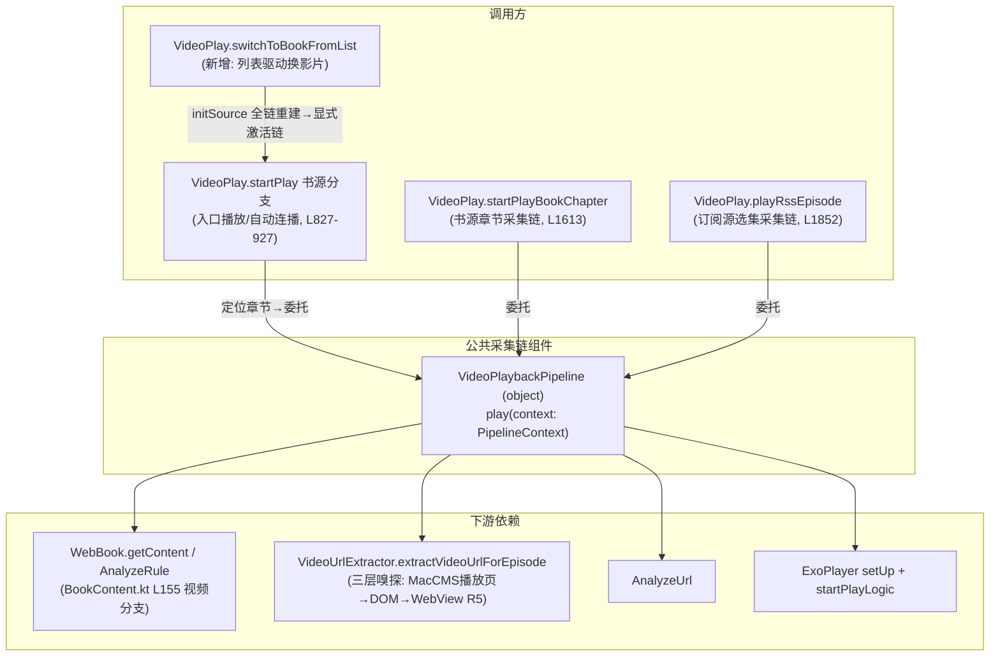
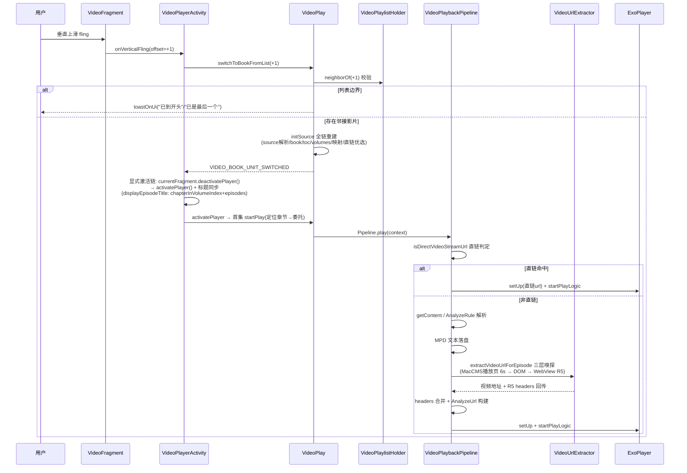

# 书源视频对标订阅源——技术设计

> 功能：video-booksource-align-rss
> 用户裁决：书源视频不做多集 ViewPager 多页，对标订阅源稳定模型（单页播放 + 列表驱动上滑 + 集数选择器选集 + 公共采集链组件）。

## Technical Approach

总述：本设计为三层改造。

1. **单页化简化（AD-01 / AD-04）**：书源视频从"多页占位 + 双索引镜像"退回单页模型。VideoPagerAdapter 书源分支恒 1 页，删除 `hasNextPlaylistVideo` 占位页扩展、书源侧 `onPageSelected` 集数映射与 `syncBookEpisodeMirror` 双索引镜像；标题以 `displayEpisodeTitle` 为单一权威（只依赖 `chapterInVolumeIndex + episodes`）。
2. **列表驱动手势（AD-02 / AD-05）**：书源单页模式下 ViewPager2 禁滑（`isUserInputEnabled=false`），上滑/下滑由 Activity 手势层拦截并映射为列表 +1/-1，走新增 `VideoPlay.switchToBookFromList(offset)`，与订阅源 `switchToArticle` 同构；与 VideoFragment 既有手势体系（单击显隐/左右 seek/长按倍速/双指全屏）零冲突共存。
3. **组件抽取（AD-03）**：将书源 `startPlay` 书源分支（L827-927）/ `startPlayBookChapter` 与订阅源 `playRssEpisode` 三处重复的"直链判定→解析→MPD 落盘→三层嗅探→header 合并→AnalyzeUrl→setUp"采集链收敛到新组件 `VideoPlaybackPipeline`（object 单例），直链快速路径三处同一段代码，单点维护。

组件关系：

## Architecture Decisions

### AD-01: 书源视频单页化
- **Context**: `VideoPagerAdapter` 书源分支当前按 `episodes.size + hasNextPlaylistVideo` 生成多页（含占位页，L24-31）；`VideoPlayerActivity.handlePageSelected`（L611）对书源做 onPageSelected 集数映射，`VideoPlay.syncBookEpisodeMirror`（L1601）维护 `chapterInVolumeIndex`/`rssEpisodeIndex` 双索引镜像；`VideoPlaybackQueue` 在书源映射段（L1171-1211）被 reset/append。
- **Concern**: 多页模型与订阅源稳定模型（单页播放 + 列表驱动）不一致；双索引镜像在换源/重建/跨影片切换时存在失同步风险，状态源分散导致维护成本高。
- **Decision**: 书源视频分支恒 1 页；`switchToViewPagerMode` 的 `isSinglePage` 判定（L548-553）对书源恒 true；删除书源占位页页数扩展、书源侧 onPageSelected 集数映射与 `syncBookEpisodeMirror` 双索引镜像（`rssEpisodeIndex` 镜像写点全部清理）；`VideoPlaybackQueue` 书源侧 reset/append 调用删除（QueueUnit/UnitProvider/append/locate/generation 组件本体保留）；集数切换只走 `playBookEpisode`（L1549），详情抽屉选中判断改用 `chapterInVolumeIndex` 单一状态。
- **Goal**: 书源视频与订阅源共用"单页播放 + 列表驱动 + 集数选择器"稳定模型，播放集状态单一权威，消除镜像同步负担。
- **Tradeoff**: 放弃"横向翻页到下一集"的多页交互，换集统一走集数选择器（`displayEpisodeTitle` 标题策略 L397 不变）；镜像删除后详情抽屉需在 `playBookEpisode` 后基于单一状态刷新。
- **Status**: Proposed

### AD-02: 上滑 = 列表下一影片（单页手势驱动）
- **Context**: 书源单页化后 ViewPager2 无多页可滑，列表驱动切换需由手势层承接；订阅源已有同构链 `switchToArticle`（L1701：换 source + 重查 rssStar/record + startPlay）；列表注入入口 `VideoPlaylistHolder` 已接 7 处（搜索 SearchActivity / 发现 classic+modern+suite / 书架 style1+style2 / 分类页 ExploreShowActivity，以 tasks 5.1 清单为准）。红队 P0-R2-1 实锤：恒单页（itemCount 恒 1）+ 稳定 ID（`VideoPagerAdapter` `getItemId = position.toLong()`、`containsItem` 按 itemCount 校验）下，切影片前后 ID 恒 0 不变，`notifyDataSetChanged` **不重建 Fragment**；`setCurrentItem(0)` 时 currentItem 已是 0，`onPageSelected` 不回调；`VideoFragment.activatePlayer` 首行 `if (isActivated) return` 早退且无调用方触发 deactivatePlayer——原"notifyDataSetChanged + setCurrentItem(0)"完成链是**空操作**，切影片后全局状态（book/toc/episodes）已换而旧片继续播或黑屏。
- **Concern**: 需在不改动 ViewPager2 内部翻页语义的前提下，提供与订阅源一致的列表驱动上滑体验，且列表边界行为（开头/末尾）需明确提示；切换完成必须显式激活新片，不能依赖页数/页落点变化或 onPageSelected 触发。
- **Decision**: 书源单页模式下 `isUserInputEnabled=false`；Activity/Fragment 手势层拦截垂直滑动（上滑 = +1，下滑 = -1），调用新增 `VideoPlay.switchToBookFromList(offset)`：`VideoPlaylistHolder` 校验 → `neighborOf(offset)` → `initSource`（L1108）全链重建（book/toc/volumes/映射/直链优选，无 gen、无占位页）→ 发 `VIDEO_BOOK_UNIT_SWITCHED` 事件（`VideoPlayerActivity` observeEvent 链路）。事件处理改为**显式激活链**：`currentFragment?.deactivatePlayer()` 强制复位 `isActivated`（新增 deactivate 重置标记）→ `currentFragment?.activatePlayer()` 重新起播（startPlay 读新 `chapterInVolumeIndex` 定位首集）；CurrentItem 若已在 0 则直接走该显式激活链，不依赖 `onPageSelected` 触发；边界以 `toastOnUi` 提示（"已到开头" / "已是最后一个"）。
- **Goal**: 上滑切下一影片与订阅源 `switchToArticle` 行为同构，复用 `initSource` 单一重建链，删除 `loadNextPlaylistVideo` 跨影片切换路径依赖（L427，gen 校验已删除）；切影片完成后 Fragment 播放状态与新影片全局状态严格一致，无旧片残留播放。
- **Tradeoff**: `initSource` 全链重建相比增量切换成本更高，但换取无镜像/无 gen 的一致性风险；显式激活链引入 deactivate 复位点，activatePlayer 重启存在首帧黑屏窗口（秒级，可接受）；新增垂直 fling 手势需与既有手势做优先级隔离（见 AD-05）。
- **Status**: Proposed

### AD-03: 公共采集链组件 VideoPlaybackPipeline（三入口委托）
- **Context**: 书源侧存在**两处**重复采集链实现：`startPlayBookChapter`（L1613：getContent → MPD 落盘 → 三层嗅探 → AnalyzeUrl → setUp，L1617 已有 L0 直链快速路径）与 `startPlay` 书源分支（L827-927：L832-846 章节定位后 L854 直接 `WebBook.getContent`，**无 L0 直链快速路径**——两者是近乎重复的实现，入口播放（activatePlayer book != null → startPlay）与自动连播（upDurIndex → startPlay）均走该分支）；订阅源 `playRssEpisode`（L1852：`VideoUrlExtractor.extractVideoUrlForEpisode` L629 → AnalyzeUrl → setUp）为第三处。`BookContent.getContent` 视频分支（L155）无直链快速路径，是"直链 m3u8 被 ruleContent 请求产出清单文本"问题的根因处。红队 P0-R2-2 实锤：startPlay 书源分支不纳入委托时，**冷启动进入与自动连播场景依旧复现**"直链 m3u8 被当清单文本"缺陷，"采集链唯一化"目标未达成。
- **Concern**: 三套采集链长期分叉，同一类缺陷（如直链判定、R5 headers 回传）需多点修复，行为易漂移；只收编两入口则采集链唯一化目标落空。
- **Decision**: 新增 `app/src/main/java/io/legado/app/help/video/VideoPlaybackPipeline.kt`，object 单例，方法 `play(context: PipelineContext)`，承载完整链路："直链判定（`isDirectVideoStreamUrl` → 直出）→ WebBook.getContent / AnalyzeRule 解析 → MPD 文本落盘 → `VideoUrlExtractor` 三层嗅探（MacCMS 播放页 6s → DOM → WebView R5 抓包，L639 直链快速路径）→ R5 headers 回传合并 → AnalyzeUrl 构建 → player.setUp + startPlayLogic"。**三入口**均委托该组件：①`startPlay` 书源分支（瘦身为"定位章节 → 委托 Pipeline"，删除内联采集实现）；②`startPlayBookChapter`；③`playRssEpisode`。PipelineContext 参数含 url/chapter/article/source/player/token/标题等；三处直链快速路径收敛为组件内同一段代码。另裁决（红队 R4-2）：非 MPD/非直链 content 先尝试 `parseRssEpisodes` 同款多行解析（复用现有函数，多行取第一行），避免多清晰度/多线路书源正文整段进嗅探必败。preferIdx 直链线路优选保留在 `initSource` 映射段（路由选择职责，不进 Pipeline，红队 R1-5 边界澄清，仅删该段内 Queue.reset/canAppendNext）。
- **Goal**: 采集链三入口单点维护，书源与订阅源起播行为一致，`BookContent` 视频分支直链问题在组件内统一修复；冷启动/选集/切线路/自动连播全场景直链行为一致。
- **Tradeoff**: 引入新组件与 PipelineContext 参数对象，需回归三侧既有行为（含 MPD 落盘与嗅探超时语义）；组件仅承载"采集→起播"，不承担换源/选集/路由优选入口职责，避免过度抽象；订阅源侧委托属行为敏感重构，需按 tasks 2.6 等价对照表逐点验收并分步灰度。
- **Status**: Proposed

### AD-04: 标题单一权威
- **Context**: 标题计算当前散布于 `displayEpisodeTitle`（L397）、`VIDEO_SUB_TITLE` / `UP_VIDEO_INFO` 事件链（L1547-1580）与 `handlePageSelected`（L611），书源侧依赖 `rssEpisodeIndex` 镜像。
- **Concern**: AD-01 删除镜像后，若标题计算仍读取 `rssEpisodeIndex`，将出现标题与实际播放集不一致。
- **Decision**: `displayEpisodeTitle` 保留为唯一权威（无语义集名时回退影片名）；`VIDEO_SUB_TITLE` / `UP_VIDEO_INFO` 事件链与 `handlePageSelected` 全部经它取值；书源单页化后标题计算只依赖 `chapterInVolumeIndex + episodes`。
- **Goal**: 标题来源单点化，集数切换与单页化后无镜像依赖，标题始终与播放集一致。
- **Tradeoff**: 事件链调用点需逐一核对改走统一入口，短期改动面略增。
- **Status**: Proposed

### AD-05: 上滑手势与现有手势体系共存
- **Context**: `VideoFragment` 已有手势检测（单击显隐 / 左右 seek / 长按倍速 / 双指全屏）；书源单页模式 ViewPager2 禁滑后，垂直滑动无归属。
- **Concern**: 垂直 fling 与横向 seek、单击判定可能冲突（斜滑误触发、速度阈值不当导致误切影片）。
- **Decision**: 定稿单一检测点（红队 R2-4）：`VideoFragment` 内既有 GestureDetector 增加 `onFling` 垂直判定（速度阈值 + 垂直位移主导）并对外回调 Activity 接线 `switchToBookFromList(+1/-1)`——surface_container 触摸事件已被 Fragment 层消费（恒返回 true），Activity 独立 GestureDetector 收不到完整手势序列，禁止 Fragment 回调与 Activity GestureDetector 双检测并存；控件区（返回/进度/倍速等控件）手势不触发切换。
- **Goal**: 新增上滑能力对现有手势语义零侵入，播放器内手势行为完全不变。
- **Tradeoff**: 阈值需真机调参（过松易误触发，过紧降低可用性）；垂直/横向位移比值判定增加少量计算。
- **Status**: Proposed

### AD-06: 切换窗口进度短路（switchingInProgress）
- **Context**: `initSource`（L1127-1130）先替换全局 `book` 并回填 `chapterInVolumeIndex/durVolumeIndex/durChapterPos`，此时旧片仍在播放器中；`saveRead`（L2103-2148）用 `videoManager.currentPosition`（旧片位置）计算 `book.durChapterIndex/durChapterPos` 并 `book.update()` 落库；触发源含 `VideoPlayer` onError → saveRead、10s 定时保存（`historySaveJob`）与 onPause。红队 R3-1 实锤：Context=initSource 重建后 book 对象已被替换，旧片切换窗口期任一次 saveRead/定时保存都会把旧片 currentPosition 写进新 book 落库，新影片从旧片位置起播。
- **Concern**: 切换会话期（`switchToBookFromList` 发起到新片首帧）的进度串写持久化后难以自愈。
- **Decision**: 切换开始置 `@Volatile switchingInProgress = true`（`initSource` 完成后复位）；`saveRead` 与 `historySaveJob` 定时保存入口检查该标记，命中即短路返回。
- **Goal**: 切换窗口内旧片进度不串写新影片落库。
- **Tradeoff**: 切换窗口内（秒级）进度保存被跳过，该窗口内进度丢失可接受。
- **Status**: Proposed

### AD-07: 切换防重入与取消语义
- **Context**: 现有跨影片链 `loadNextPlaylistVideo` 有 `switchBookAppending` 防重入（L429-431），但复位点不覆盖取消场景：`stopLoading`（L1103-1105 `loadScope.cancelChildren()`）/`onNewIntent` teardown 取消任务时协程取消不触发 `onError`，且 `initSource`（L1146）的 `runCatching` 会吞 `CancellationException` 半途继续写状态（项目已知坑）；对比同构链 `switchToArticle` 已有 job cancel + token 双保险（L1749-1753）。红队 R2-5/R3-2 实锤：快速连滑时两次 `initSource` 并发交错写全局状态（book/toc/映射/episodes，先发的后完成覆盖后发的），守卫可能永久 true 导致上滑永久失效。
- **Concern**: 切换中退出/快速连滑后守卫卡死或半途状态（book/toc/映射已换、episodes 未就绪）。
- **Decision**: ①保留 `switchBookAppending` 防重入（`switchToBookFromList` 入口检查）；②`onPause`/`stopLoading`/`onNewIntent` 取消场景在 `Coroutine.onError` 中复位 `switchBookAppending`，且 `initSource` 相关 `runCatching` 必须 rethrow `CancellationException`（先判取消再恢复，项目已知坑）；③快速连滑采用 `switchToArticle` 同款 job cancel + token 双保险（`switchBookJob?.cancel()` + `currentSwitchToken` 校验，令牌复用全局 `switchTokenCounter`，Pipeline 不自持计数器，红队 R3-5）。
- **Goal**: 快速连滑/取消后无并发交错、无守卫卡死，过期回调被 token 丢弃。
- **Tradeoff**: token 校验需覆盖 loadScope 顶层并列子协程全部回调点，需真机连滑压测验证（tasks 6.5）。
- **Status**: Proposed

### AD-08: 两链差异裁决表
- **Context**: 书源链与订阅源链在 header 合并、URL 后处理、事件触发、预载上不对称（红队 R2-6 证据：书源手工 merge `sniffMergedHeaders → analyzeUrl.headerMap`（L1698-1700）+ `resolvePlayerPageUrl`（L1713）；订阅源 `HeaderResolver.merge` 三层（L1968-1975，refererFallback=article.link）无 resolvePlayerPageUrl（L1984 直接 setUp）、专属 `triggerPreload`（L1995）与 `playEpisodeJob?.cancel()`（L1938-1941）；VIDEO_SUB_TITLE 书源采集链 0 处，标题刷新靠 saveRead 10s 定时器滞后）。Pipeline 参数化方案必须显式裁决，否则组件退化为 if-else 壳。
- **Decision**: 逐点裁决如下（"统一后两侧行为"即 Pipeline 内单点实现）：

| 差异点 | 书源链现状 | 订阅源链现状 | 统一裁决（统一后两侧行为） |
|---|---|---|---|
| header 合并 | 手工 merge（嗅探回传 → analyzeUrl.headerMap） | `HeaderResolver.merge` 三层（refererFallback=article.link） | 统一为 HeaderResolver.merge 等价三层：源 header → 嗅探回传 → 播放请求 |
| resolvePlayerPageUrl | 有（L1713） | 无 | 统一保留，订阅源侧新增（对合法播放页 URL 无害） |
| VIDEO_SUB_TITLE 触发点 | 书源采集链 0 处（靠 saveRead 10s 定时器，切换后标题滞后） | setUp 后发一次（L1986） | 统一在 Pipeline setUp 前发一次，书源链从 0 到 1 属行为增强（切换后标题即时刷新） |
| triggerPreload | 无 | 订阅源专属（L1995） | 保留订阅源专属，Pipeline 暴露 hook 不强制（书源侧不调用） |
| 选集 job cancel | 无（由 AD-07 switchBookJob 承接） | `playEpisodeJob?.cancel()` + token（L1938-1941） | 统一由 AD-07 switchBookJob/token 体系承接，Pipeline 不自持 job |
| 多行 content 解析 | 无（整段当 URL） | `parseRssEpisodes`（L1319 起） | 统一非 MPD/非直链 content 先尝试 parseRssEpisodes 同款解析（多行取第一行，R4-2） |

- **Goal**: Pipeline 实现无参数化歧义，逐点可验收（对照 tasks 2.6 等价对照表）。
- **Tradeoff**: 书源链 header/标题行为有变化（允许，书源不在零回归红线内）；订阅源 resolvePlayerPageUrl 新增需真机回归确认无害。
- **Status**: Accepted

## 实施决策记录（2026-09-03 实施期，代码-文档同步）

1. **Pipeline 结构**：实现为 `playBookChapter(ctx)` / `playEpisode(ctx)` 两入口 + 内部共享 `setUpAndPlay`（token 校验+VIDEO_SUB_TITLE+setUp+startPlayLogic），未采用单 play() 分派——两链前置差异大（L0 直链 vs 三层嗅探），共享尾链已消除漂移面。AD-03 落地形态以此为准。
2. **displayTitle 与 title 分离**：订阅源链 setUp 标题=集名（GSY 内部），VIDEO_SUB_TITLE=文章名（R3 title 修复语义保留），PipelineContext 增 `displayTitle` 字段；书源链两者同为 chapter.title。AD-08 VIDEO_SUB_TITLE 行已按此实现。
3. **镜像删除形态**：syncBookEpisodeMirror 函数删除；rssEpisodeIndex 的书源侧唯一写点收敛到 playBookEpisode（直接赋值）。VideoBookDetailSheet/集数选择器继续读 rssEpisodeIndex（共享组件零改动），一致性由唯一写点保证——替代原设计"详情抽屉改读 chapterInVolumeIndex"（避免重写共享选择器）。
4. **upDurIndex 末集连播（REQ-9）**：onAutoCompletion→upDurIndex(+1) 末集边界改为委托 switchToBookFromList(+1)，无下一影片时 toast"已是最后一个视频"（替代原"已播放完"）。
5. **手势实现形态**：VideoFragment 现有 GestureDetector 增 onFling（垂直方向判定 |vy|>|vx| 且 >1200px/s）→ Activity.onBookVerticalFling(velocityY) → switchToBookFromList(±1)；未新增独立 Activity GestureDetector 层（复用 Fragment 触摸链，行为等价）。onFling 签名对齐项目先例（e1 可空）。
6. **startPlay 书源分支**：瘦身为章节定位（含"未找到章节"守卫）+委托 startPlayBookChapter；originalPlayUrl 语义统一为 chapter.url（Z9 历史键）。
7. **AD-06 落地**：switchingInProgress 标记同时短路 VideoPlay.saveRead（book/rssStar/rssRecord 落库+CacheManager）与 Activity.savePlayHistory（PlayHistoryStore）两条保存链。

## Data Flow

书源上滑下一影片全链（含直链/非直链两条起播线路）：

## File Changes

| 文件 | 变更 |
|---|---|
| `help/video/VideoPlaybackPipeline.kt` | 新增：公共采集链组件（object 单例，`play(context: PipelineContext)`，承载直链判定→解析→MPD 落盘→三层嗅探→R5 header 合并→AnalyzeUrl→setUp+startPlayLogic；非 MPD/非直链 content 先尝试 parseRssEpisodes 同款多行解析） |
| `model/VideoPlay.kt` | 新增 `switchToBookFromList`（含 switchBookJob/currentSwitchToken/switchingInProgress/switchBookAppending 守卫，AD-06/07）；**三入口**委托 Pipeline：`startPlay` 书源分支（L827-927，瘦身为"定位章节→委托"）/ `startPlayBookChapter` / `playRssEpisode`；删书源映射段 `VideoPlaybackQueue.reset` 与直链外露逻辑（preferIdx 线路优选保留在映射段）；删 `syncBookEpisodeMirror` 及全部镜像写点（initSource 映射段/`switchBookRoute`/`playRssEpisode` 书源分派/`upRssEpisodeIndex`）；`saveRead`/定时保存加 switchingInProgress 短路 |
| `ui/video/VideoPagerAdapter.kt` | 书源分支恒 1 页（删除 `hasNextPlaylistVideo` 占位页扩展，L24-31） |
| `ui/video/VideoPlayerActivity.kt` | `switchToViewPagerMode` 书源恒禁滑 + 单页（删书源 setCurrentItem 定位块）；`handlePageSelected` 书源分支删除集数映射；`VIDEO_BOOK_UNIT_SWITCHED` 处理改显式激活链（deactivatePlayer 复位 isActivated → activatePlayer，P0-R2-1），删除 notifyDataSetChanged/setCurrentItem(0) 依赖；上滑手势接线 Fragment onFling 回调；事件链标题统一走 `displayEpisodeTitle` |
| `ui/video/VideoFragment.kt` | 既有 GestureDetector 增加 onFling 垂直判定并回调 Activity（单一检测点，控件区不触发，R2-4）；镜像直写点 L840/L882 清理；既有手势（单击显隐/左右 seek/长按倍速/双指全屏）不动 |
| `ui/video/VideoBookDetailSheet.kt` | 选中集判断改单一状态（`chapterInVolumeIndex`，删除 `rssEpisodeIndex` 镜像依赖）；选中集匹配改 index 直比（R2-3：title 相等比对同名集会错选） |

## 红队修订记录

> 依据 `docs/specs/video-booksource-align-rss/red-team-report.md`（2026-09-03，五轮递进对抗审查，2 P0 + 11 P1 + 13 P2）修订本设计文档的落点清单。P0/P1 全部落点如下，P2 条目在实施期按报告逐条核对。

| 红队条目 | 级别 | 修订落点 |
|---|---|---|
| R2-1 | P0 | AD-02 重写：完成链改显式激活链（`deactivatePlayer` 复位 isActivated → `activatePlayer` 重启），不依赖 notifyDataSetChanged/onPageSelected；组件关系图/时序图同步；spec REQ-3；tasks 4.4 |
| R2-2 | P0 | AD-03 扩为三入口委托：`startPlay` 书源分支（L827-927，瘦身为"定位章节→委托"）+ `startPlayBookChapter` + `playRssEpisode`；Technical Approach/组件关系图/File Changes 同步；spec REQ-4；tasks 2.5/2.6 |
| R2-3 | P1 | File Changes 表：VideoBookDetailSheet 选中集匹配改 index 直比（title 相等比对同名集错选）；镜像写点/读点全清单清理落 tasks 3.6、File Changes VideoPlay.kt/VideoFragment.kt 行 |
| R2-4 | P1 | AD-05 Decision 定稿单一检测点：Fragment 内既有 GestureDetector onFling 判定并回调 Activity，禁止双检测；控件区手势不触发切换 |
| R2-5 | P1 | 新增 AD-07：switchBookAppending 防重入保留 + onError 复位 + initSource runCatching rethrow CancellationException；tasks 4.5 |
| R2-6 | P1（升级处理） | 新增 AD-08 两链差异裁决表（header 合并/resolvePlayerPageUrl/VIDEO_SUB_TITLE/triggerPreload/job cancel/多行解析逐点裁决统一后行为）；tasks 2.6 |
| R3-1 | P1 | 新增 AD-06：switchingInProgress 标记，saveRead/historySaveJob 定时保存入口短路；spec REQ-8；tasks 4.6 |
| R3-2 | P1 | 并入 AD-07：switchBookJob cancel + currentSwitchToken 双保险（switchToArticle 同款）；tasks 4.5；spec S7 / tasks 6.5 压测验证 |
| R4-2 | P1 | AD-03 Decision + AD-08 表末行：非 MPD/非直链 content 先尝试 parseRssEpisodes 同款多行解析（多行取第一行）；tasks 2.1 |
| R5-1 | P1 | tasks 2.6：playRssEpisode 重构前后逐点等价对照表 + 分步灰度（先书源链上线回归，订阅源委托独立任务独立回归后合入） |
| R5-3 | P1 | tasks 3.4 扩为联动删除点全清单核对（initSource 映射段 reset/canAppendNext、loadNextPlaylistVideo、VideoFragment 占位页判定、VideoPlayerActivity 占位页分支/composeTitle/onDestroy clear）；tasks 7.4 标注提前至阶段 3 前执行 |
| R1-1 | P1 | spec REQ-9：单集播完自动连播末集接列表下一影片（与上滑语义一致，行为一致性裁决）；spec S6；tasks 6.4 |
| R1-2 | P1 | 入口口径统一为 7 处（搜索/发现 classic+modern+suite/书架 style1+style2/分类页，以 tasks 5.1 清单为准）+ startActivityForBook 视频分流兜底（降级入口显式记录）：spec 背景/In Scope/Approach/REQ-6、design AD-02 Context、tasks 5.1 标签修正 |

顺带澄清（红队 R1-5）：preferIdx 直链线路优选属路由选择职责，保留在 `initSource` 映射段，Pipeline 不含路由优选（已写入 AD-03）。
