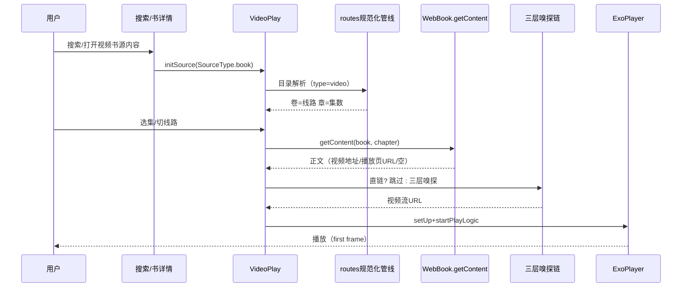

# design.md — video-booksource-multiroute

## Technical Approach

整体思路：**视频书源 = 订阅源播放管线的第二个数据源实现**。播放管线（VideoPlay）已以 `BaseSource` 为参数类型，多线路多集逻辑通过新增能力接口抽象后，`RssSource`（订阅源）与 `BookSource`（type=video 书源）双实现接入；目录解析侧为 type=video 书源复用订阅源的 routes 规范化管线，产出"卷=线路、章=集数"的 BookChapter 结构。

```mermaid
flowchart LR
    A[搜索/发现结果] --> B{isVideoResult?}
    B -->|是| C[VideoPlayerActivity]
    B -->|否| D[文字书详情]
    C --> E[initSource: SourceType.book]
    E --> F[目录解析分支]
    F -->|bookSourceType==video(=4)| G[ routes 规范化管线 ]
    F -->|其他| H[既有 TocRule 解析]
    G --> I[BookChapter 卷=线路 章=集数]
    H --> I
    I --> J[选集/切线路]
    J --> K[WebBook.getContent 正文]
    K --> L{正文内容}
    L -->|直链| M[ExoPlayer 直播]
    L -->|播放页URL/空| N[三层嗅探链]
    N --> M
```

关键复用点（已真机验证的订阅源能力）：
- `Rss.normalizeMacCmsBody`：MacCMS 扁平 vod_play_url/vod_play_from → routes 数组
- `Rss.getRoutesContentAwait` 同构逻辑（线路名/集数按 {routeIndex} 展开）
- `VideoUrlExtractor.isDirectVideoStreamUrl` + direct-route-first 选线
- `VideoUrlExtractor.extractVideoUrlForEpisode` 三层嗅探链（正文兜底，已有）

## Architecture Decisions

### AD-01: 字段映射——多集=ruleToc、视频地址=ruleContent、多线路=目录卷结构
- **Context**: ruleRoutes/ruleEpisodes 从书源"目录/正文"字段简化扩展而来；书源播放管线既定模型为"卷=线路、章=集数"（VideoPlay 760 行注释：无剧集时"全是线路卷章节，适合电影类"）
- **Concern**: 订阅源的线路/集数概念如何在不新增字段语义冲突的前提下映射回书源
- **Decision**: 多集映射 **ruleToc**（目录=集数列表），视频地址映射 **ruleContent**（正文=视频地址/嗅探），多线路映射 **目录卷结构**（isVolume 卷=线路）；type=video 时 MacCMS 响应经数据规范化层注入卷章结构（与订阅源 v3 同构），源侧可零规则成本
- **Goal**: 书源以最小规则成本获得与订阅源一致的多线路多集播放体验
- **Tradeoff**: routes 规范化分支使目录解析存在 type 条件分叉（以 bookSourceType==video 严格隔离）；"正文=视频地址"复用正文语义，正文文本展示对该类源无意义
- **Status**: Accepted（2026-09-02 修订：规范化层同时注入扁平 chapters 结构，支撑 L1 显式 JSONPath 写法，见 AD-05）

### AD-02: 现有解析零修改——type=video 分支严格隔离
- **Context**: 用户硬约束"不修改书源现在解析字段规则"；文本书源存量巨大
- **Concern**: 任何对 TocRule/ContentRule 解析逻辑的改动都可能破坏存量书源
- **Decision**: 所有新增逻辑收敛在 `bookSourceType == BookSourceType.video` 分支内；`ruleToc`/`ruleContent` 现有解析代码路径一行不动；文本书源回归用例覆盖
- **Goal**: 文本书源行为零变化
- **Tradeoff**: 目录/正文解析存在双路径，长期需防止分叉逻辑漂移（以回归用例守住）
- **Status**: Accepted

### AD-03: 播放管线复用——强转点抽象为多线路能力接口
- **Context**: VideoPlay 内 `as? RssSource` 强转 **8 处**（审查核验），另有 `L780 source as BookSource` 硬强转；其中 4 处（prewarm/switchToArticle/loadMoreArticles/preloadNext）为**订阅源文章模式专属**，无需接口化
- **Concern**: 直接复制订阅源逻辑到书源分支会产生双份漂移代码
- **Decision**: 新增 `SourceMultiRoute` 能力接口，改造范围**收窄至 4 处多线路核心强转点**（L476 initSource 源识别 / L1332、L1346 线路判断 / L1759 进度归属）+ L780 硬强转纳入接口分派。接口签名要点（审查修正）：
  - `getRouteNames(): List<String>`、`getEpisodesByRoute(routeIndex): List<EpisodeItem>`（返回统一轻量模型 EpisodeItem{title,url}，**由实现侧各自转换** RssEpisode/BookChapter，规避双类型不兼容）
  - `playRouteEpisode(...)` **播放分派方法**：订阅源走 rssArticle 链（playRssEpisode），书源走 `durVolumeIndex → upEpisodes() → startPlay 章节链`（playRssEpisode L1566 硬依赖 rssArticle 静默 return，必须接口内分派，不可共用实现）
- **Goal**: 一份多线路管线逻辑，两类源共享
- **Tradeoff**: EpisodeItem 轻量模型需在两实现侧各写一次转换（少量样板换解耦）；接口面收敛为 3 方法左右
- **Status**: Accepted（2026-09-02 审查修订：强转点 8→收窄 4，补播放分派与返回类型定义）
- **实施修订（2026-09-02 编码期）**：`SourceMultiRoute` 接口经评估**未落地为独立文件**——实施发现播放上下文（rssArticle/toc/volumes/token 竞态守卫）全部由 VideoPlay 持有，适配器化只会把 if/else 换成 polymorphism 而无行为差异，且重构已真机验证的订阅源 switchToRoute 路径回归风险高。最终采用 **VideoPlay 内联分派**（isNewRoutesMode/switchToRoute/playRssEpisode 三处按源类型分派，新增 switchBookRoute/playBookEpisode/startPlayBookChapter）；集数/线路 UI 数据源直接复用 RssRoute/RssEpisode 模型（initSource 卷章映射，VideoFragment 零改动）。此决策为"极简=无冗余"取舍，未来接入第三类源时再提接口

### AD-04: 正文入口——type=video 书源正文页播放动作
- **Context**: 阅读器正文页当前无任何视频播放入口（已探明）；用户要求"正文打开视频播放器，也是先嗅探"
- **Concern**: 入口形态（自动跳转/菜单动作）影响文本书源用户与视频书源用户的体验一致性
- **Decision**: type=video 书源正文页菜单新增"播放"动作；正文内容为视频 URL 时点击正文链接亦可达嗅探链；不做自动跳转（保留用户控制权）。**审查修订：阅读器对视频书几乎不可达**（BookInfo/书架/搜索/目录对 isVideo 均重定向播放器），本入口**降级为兜底兼容**（对应 L3 JS 源 ruleContent 产出正文文本等边缘场景），非主路径
- **Goal**: 正文→嗅探→播放器路径可达且可控
- **Tradeoff**: 需要阅读器菜单对 type=video 的条件渲染（小侵入）
- **Status**: Accepted（2026-09-02 审查修订：降级为兜底兼容入口）

### AD-05: 解析手段分级标准——五类全支持，JS 为最后手段（2026-09-02 用户裁决重定）
- **Context**: 用户裁决（原话要点）：①不要把订阅源新增的 ruleRoutes/ruleEpisodes 字段搬进视频书源 ②要兼容 archive 的 @js 视频书源 ③同时要"优化定义更高的标准"——ruleToc/ruleContent 两个映射字段在视频书源场景下支持五类解析（CSS/JSONPath/XPath/正则/JS），因为书源作者"迫不得已才选 JS"
- **Concern**: MacCMS 原始数据（vod_play_url 扁平串 `线路$$$...` / `集1#集2$$$...`）用纯 JSONPath 无法切分分组——这正是 archive 用 JS 的根因
- **Decision**: **不新增书源字段**。解法在**数据规范化层**（App 侧、解析逻辑零修改，订阅源 v3 已真机验证的同构架构）：
  - 规范化层检测 MacCMS 结构后注入**双结构**：`routes:[{name, episodes:[{title,url}]}]`（与订阅源同构，权威源）+ 派生扁平 **`chapters:[{title:"线路名", url:"", isVolume:true}, {title:"第01集", url:"http://…/1.m3u8", isVolume:false}, …]`**（专供目录范式消费）
  - **解析分级标准**（写法从易到难，作者按需选择）：
    - **L0 零规则**：type=video 书源 chapterList 为空且检测到规范化结构 → App 侧直接产卷章（VideoBookChapterHelper），作者什么都不写（**L0 仅指目录/正文零规则；搜索/详情等规则仍需作者按站点提供**）。**直链通路约定：L0/L1 源 ruleContent 留空**——既有机制（WebBook 正文规则空→返回 chapter.url）天然完成"正文=集数直链"映射，播放页 URL 场景嗅探兜底
    - **L1 纯 JSONPath 四条规则**（推荐标准写法）：`chapterList=$.chapters[*]`、`chapterName=$.title`、`chapterUrl=$.url`、`isVolume=$.isVolume`——既有解析引擎透明支持（getElements 列表范式 + 元素级 getString，已核实 BookChapterList L206-247），显式可控、不靠 JS
    - **L2 CSS/XPath/正则**（HTML 视频站）：目录列表选择器 + isVolume 规则判线路行（legado 文本书源既有能力），正文用选择器取 iframe/source/a 的 src/href
    - **L3 JS**（archive 兼容线）：@js ruleToc/ruleContent 走既有解析路径透明兼容（底线，非推荐）
  - 正文 ruleContent 同理：JSON 字段取直链（JSONPath）/ HTML 选择器（CSS/XPath）/ 正则提取 / JS，取不到或为播放页 URL 时三层嗅探兜底
- **Goal**: 五类解析全支持、零规则可达、JS 仅兜底；作者用 L1 四条 JSONPath 即可写出多线路多集视频书源
- **Tradeoff**: 规范化层注入的 chapters 为 App 约定键名（文档化承诺，非字段协议变更）；卷行 url 为空时既有引擎自动以 title+index 替代（BookChapterList L261-263），卷不参与正文采集
- **Status**: Accepted（取代原 AD-05 增量字段方案——ruleRoutes/ruleEpisodes **不进入** BookSource）

### AD-06: 抖音模式详情面板——书源简介/信息展示，订阅源零退化（2026-09-02 用户裁决新增）
- **Context**: 本项目播放器已统一 ViewPager2 抖音模式（P0-1，legacyContainer 已隐藏）；订阅源模式交互在 VideoFragment 左下角悬浮容器（标题+线路选择器 REQ-17+集数选择器 REQ-18）+ composeTopBar 菜单；legacy 详情区（封面/书名/作者/简介 tv_intro_container + volumes/chapters）在抖音模式不可见。用户裁决：书源的简介/信息内容需设计展示，且**不得影响订阅源使用**（订阅源无此数据）
- **Concern**: 抖音全屏沉浸模式没有自然位置放详情长内容；订阅源 UI 路径不能有任何视觉/行为退化
- **Decision**: **详情底部抽屉（BottomSheet）方案**——
  - 书源模式（source is BookSource && book!=null）：VideoFragment 左下角容器新增"详情"入口（标题可点+图标），弹出 BottomSheetDialogFragment：上半区封面+书名+作者+简介（复用既有 showBookIntro 渲染逻辑：intro 含 HTML 时 WebView，否则 ScrollTextView/Markwon）；下半区线路 Tab + 集数列表（数据源为 VideoPlay.volumes/episodes，UI 用 Compose 按 ui-standards 组件族实现）
  - 订阅源模式：**不注入详情入口**（无 intro 数据、UI 零新增）；线路/集数选择器保持 REQ-17/18 现状不动
  - 抽屉内切线路/选集：调用与悬浮选择器同一条切换逻辑（switchToRoute/选集回调），两处 UI 共享单一数据动作源
  - **审查修正**：简介渲染需从 legacy 隐藏视图解耦——showBookIntro 当前绑定 legacyContainer 内 tv_intro_container（已 gone），抽屉复用其渲染逻辑需抽为独立渲染方法（输入 intro 字符串→输出 View/Compose 节点），不得依赖 legacy 可见性
- **Goal**: 书源模式补齐详情+选集能力，订阅源模式视觉与交互零变化
- **Tradeoff**: 新增一个 BottomSheet 组件（约 1 文件）；集数列表在抽屉与悬浮横条两种形态并存（订阅源只有悬浮横条），需保证动作源统一防状态漂移
- **Status**: Accepted

## 全局架构盘点（前端入口 × 数据 × UI × 隔离面）

### 前端入口全清单（书源视频可达播放器的全部路径）
| 入口 | 机制 | 现状 | 本 spec 改动 |
|------|------|------|------------|
| 搜索/发现 | `SearchBookOpenHelper.isVideoResult` → openVideo（PREPARE_BOOK_INFO=true） | 既有 | 无需改（对接确认） |
| 书架/收藏 | `ContextExtensions.kt#L71`/`FragmentExtensions.kt#L99`/`MyFeatureBooksActivity`：book.isVideo → VideoPlayerActivity | 既有 | 无需改 |
| 目录页 | TocActivity isVideo 分支 | 既有 | 确认多线路卷章显示兼容 |
| 正文页 | ruleContent 正文采集（BookContent isVideo 分支已有副文弹幕处理） | 既有 | AD-04 播放动作入口新增 |
| 播放历史/悬浮窗返回 | VideoPlay 快照恢复 | 既有 | 书源模式进度记忆（durVolumeIndex/chapterInVolumeIndex）对接 |

### 数据模型差异（订阅源 vs 书源）
| 维度 | RssSource | BookSource(type=video) | 隔离策略 |
|------|-----------|----------------------|---------|
| 详情数据 | 无 intro/封面字段（rssArticle.title 仅标题） | Book.intro/coverUrl/author 齐备 | 详情入口仅书源注入 |
| 目录/集数 | routes 规范化（RssRoute/RssEpisode） | BookChapter 卷章（isVolume） | SourceMultiRoute 接口统一消费 |
| 进度记忆 | RssReadRecord/RssStar | Book.durVolumeIndex/chapterInVolumeIndex + BookChapter 表 | 各自存储，互不干扰 |
| 换线路动作 | switchToRoute（按需采集） | 同一接口（App 侧规范化后同构） | 接口内分派 |

### 回归矩阵（全量验证面）
| 场景 | 验证点 |
|------|-------|
| 订阅源-单URL | legacy→viewPager 单 Fragment 播放不回归 |
| 订阅源-多文章 | 垂直滑动+分页加载+文章标题不回归 |
| 订阅源-多线路多集 | REQ-17/18 悬浮选择器+按需采集+direct-route-first 不回归 |
| 书源-文本 | 目录/正文解析零变化（分支隔离） |
| 书源-视频 L0/L1/L3 | 真机三源矩阵（tasks 4.7/4.8） |
| 书源-电影类（无剧集） | 卷即章节播放（VideoPlay 既有注释语义） |
| 进度记忆 | 书源 durVolumeIndex/chapterInVolumeIndex 跨会话恢复 |

## Data Flow



## File Changes

| 文件 | 变更 |
|------|------|
| `app/src/main/java/io/legado/app/model/VideoPlay.kt` | `as? RssSource` 强转点改能力接口（**收窄 4 处核心**：L476/L1332/L1346/L1759 + L780 硬强转；文章模式专属 4 处不动）；initSource/startPlay 书源分支接入 routes 管线 |
| `app/src/main/java/io/legado/app/help/video/SourceMultiRoute.kt` | 新增：多线路能力接口（getRouteNames/getEpisodesByRoute→EpisodeItem/playRouteEpisode 分派） |
| `app/src/main/java/io/legado/app/help/book/VideoBookChapterHelper.kt` | 新增：L0 零规则分支（规范化结构→卷章 BookChapter）；**抽共享 `MacCmsNormalizer`**（从 Rss.kt private 方法上提，含 routes+chapters 双结构注入与**对称键冲突检测**——修正原实现 L386 查 item / L410 注顶层的不对称） |
| `app/src/main/java/io/legado/app/model/webBook/WebBook.kt` | getChapterList type=video 分支（L0 自动管线 / L1 规则走既有解析） |
| `app/src/main/java/io/legado/app/ui/book/read/ReadBookActivity.kt`（或正文菜单组件） | type=video 正文"播放"动作 |
| `app/src/main/java/io/legado/app/ui/video/VideoBookDetailSheet.kt` | 新增：书源详情底部抽屉（封面/书名/作者/简介 + 线路 Tab + 集数列表，AD-06） |
| `app/src/main/java/io/legado/app/ui/video/VideoFragment.kt` | 左下角容器详情入口（仅书源模式注入；订阅源 REQ-17/18 不动） |
| `app/src/main/java/io/legado/app/ui/book/SearchBookOpenHelper.kt` | 对接确认（既有） |
| `.trae/skills/legado-source-creator/` | 视频书源规则模板（L0-L3 分级写法样例）+ 陷阱沉淀 |
| `docs/project-flow/` 相关文档 | 步骤 8 文档同步 |

## Archive 实现实证（对照参考，2026-09-02 源码分析）

archive 的视频书源多线路多集实现（`docs/analysis/archive-src` 浅克隆）验证了本设计的字段映射方向：

1. **目录 = ruleToc 产出卷章 BookChapter**（`VideoPlayerActivity.prepareVideoBook`）：走 `BookInfoViewModel.chapterListData` → WebBook 章节管线，`chapter.isVolume==true` 过滤为 `VideoPlay.volumes`（卷=线路）。本项目 `BookChapterList.kt#L234-247` 已支持 `tocRule.isVolume` 规则判断，**ruleToc 兜底路径零改动成立**。
2. **选集/切线路 = 卷切片**（`VideoPlay.upEpisodes`）：episodes = toc 中 `durVolume.index` 到下一卷 index 之间的章节；进度记忆 `durVolumeIndex/chapterInVolumeIndex` 存 Book。本项目 VideoPlay 已有同构 volumes 模型（L892-1155），仅差 BookSource 接入。
3. **正文 = ruleContent 取直链**（`VideoPlay.startPlay` 书源分支）：`WebBook.getContent` → content 空=抛异常 / `<`开头=MPD 文本落盘播放 / 否则当 URL 经 AnalyzeUrl 包 header → `player.setUp`。archive **无显式嗅探引擎**（依赖 ruleContent JS 提直链）；本项目已有三层嗅探链（`VideoUrlExtractor`），能力超集，正文为播放页 URL/空时嗅探兜底即 AD 设计。
4. **电影类特例**（无剧集）：卷即播放章节，卷 URL 以 title 开头视为未取到链接跳过——与本项目 VideoPlay 既有注释一致，规范化管线产出时需保证卷 URL 真实可播。
5. **性能增强参考**：chapterLinkCache（TTL 直链缓存）+ preloadNextEpisode（下一集预取直链），可列为可选增强项。

**结论**：本设计（AD-01~05）与 archive 实现同构且为超集（自动规范化管线 + 嗅探兜底 archive 均不具备），无需推翻。

## 回归保障

- 文本书源目录/正文解析路径零改动（代码隔离 + 用例）
- 订阅源播放路径零改动（接口抽象后行为等价，回归用例）
- 单测：routes 规范化→卷章映射、direct-route-first 选线、正文直链判定
- 真机：MacCMS 视频书源全链路（搜索→目录→播放→切线路）+ 文本书源回归
