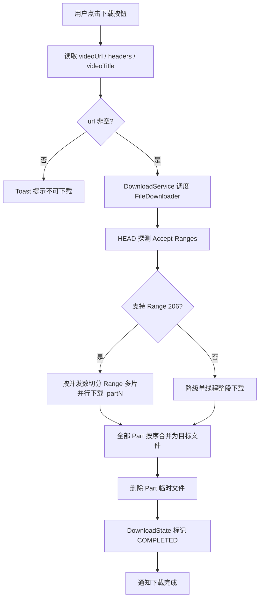
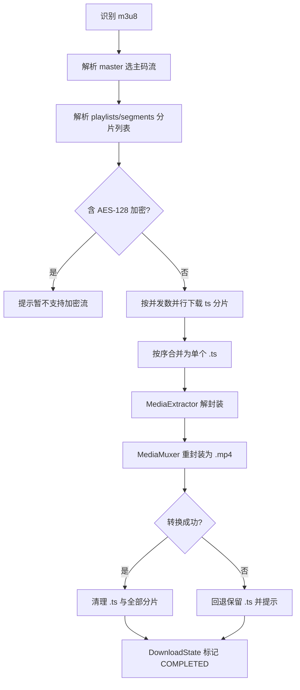

# design.md — 视频下载与下载管理整合

## Technical Approach

采用 **自研下载引擎 + 平台媒体 API 两段式方案**，架构分三层：

1. **表现层**：`VideoFragment` 右栏新增 `btnDownload`；下载管理页复用现有 `DownloadManageActivity`/`DownloadManageScreen`。
2. **业务层**：`DownloadService`（前台调度 + 生命周期）→ `FileDownloader`（直链分片 + m3u8 分片调度）→ `DownloadState`（任务状态源，保持现有 StateFlow 协议）。
3. **网络/媒体层**：复用现有 OkHttp/Cronet 网络栈与防盗链头；m3u8 转 mp4 用平台 `MediaExtractor` + `MediaMuxer`，零新增依赖。

### 模块划分

```text
io.legado.app.service
  DownloadService.kt        # 改造：调度自研引擎，替换系统 DownloadManager 调用
  DownloadState.kt          # 扩展任务模型（新增 taskType/本地路径/并发数），保持状态协议
io.legado.app.help.download            # 新增下载引擎包
  FileDownloader.kt         # 直链多线程分片下载（Range 并发 Part + 合并 + 断点续传）
  HlsDownloader.kt         # m3u8 解析分片 → 并发下载 → ts 合并 → mp4 重封装
  TsToMp4Remuxer.kt        # 基于 MediaExtractor + MediaMuxer 的 ts→mp4 重封装
io.legado.app.ui.video
  VideoFragment.kt          # 右栏新增 btnDownload 挂载与点击逻辑
```

## Architecture Decisions

### AD-01: 自研分片下载引擎替代系统 DownloadManager
- **Context**: 现有下载走 Android 系统 DownloadManager（单一队列、仅整段下载、无法分片/续传控制、无法 m3u8 转 mp4），且无内容消费入口，管理页常为空。
- **Concern**: 需要"正在/完成/暂停/重试"可控、可合并且能触发的下载能力，系统 DownloadManager 无法满足分片与转换需求。
- **Decision**: 自研 `FileDownloader`（直链 Range 多片 + m3u8 分片调度），`DownloadService`/`DownloadState` 解耦系统 DownloadManager。
- **Goal**: 支持 IDM 式多线程分片快速下载与 m3u8→mp4，保持下载管理页状态视图。
- **Tradeoff**: 需自行处理非 Range 降级、断点续传、网络重试与清理；弃用系统下载通知通道，改为自建前台服务通知。
- **Status**: Proposed
- **Superseded-by**: -

### AD-02: m3u8→mp4 用平台 MediaExtractor + MediaMuxer，不打包 ffmpeg
- **Context**: m3u8 分片为 TS，用户要求转成 mp4。需在"打包 ffmpeg（重）"与"平台 API（免依赖）"间选择。
- **Concern**: APK 体积、多 ABI 原生库、授权管理成本高；但转换正确性需可靠。
- **Decision**: 用 Android 平台 `MediaExtractor`（解封装 TS + MediaMuxer（重封装 MP4），不做转码，仅重封装（remux），速度极快、无额外依赖。
- **Goal**: 无需第三方库即可得到真实 mp4 容器。
- **Tradeoff**: remux 依赖设备媒体框架对 MPEG-TS 解封装能力；个别设备/非常规流可能抛异常，需回退保留 ts。
- **Status**: Proposed
- **Superseded-by**: -

### AD-03: 下载状态源沿用 DownloadState，任务模型扩展而非重构
- **Context**: `DownloadManageActivity` 已按 `DownloadState.tasks` StateFlow 轮询过滤，UI 框架可用。
- **Concern**: 更换引擎要最小化对 Compose UI 的波及。
- **Decision**: 保留 `DownloadState` 为唯一任务状态源，新增 `taskType`（DIRECT/HLS）与本地文件路径字段，UI 基本不变。
- **Goal**: 管理页「正在/完成」分类切换零改动可用。
- **Tradeoff**: 需适配原系统 DownloadManager 相关操作（cancel/clear 的 File API 替换系统 id）。
- **Status**: Proposed
- **Superseded-by**: -

### AD-04: 下载按钮挂载至播放器右栏 right_buttons
- **Context**: 用户要求图标位于"全屏、收藏、设置"区域。
- **Concern**: 该区域由 `VideoFragment` 的 `right_buttons` LinearLayout 承载，参与自动隐藏动画。
- **Decision**: 在 `rightButtons` 内新增 `btnDownload`（fragment_video.xml），随容器整体显隐；点击逻辑读取 `VideoPlay.videoUrl` + headers + `videoTitle` 调起下载。
- **Goal**: 与全屏/收藏/设置视觉一致、交互一致。
- **Tradeoff**: 无（该容器职责已是"右栏功能按钮"）。
- **Status**: Proposed
- **Superseded-by**: -

### AD-05: m3u8 默认选择主码流（最高分辨率），不逐分辨率重复下载
- **Context**: master 清单常含多档分辨率。
- **Concern**: 用户未指定清晰度时需给出确定性默认，且避免多路同时下载造成浪费。
- **Decision**: 默认解析最高分辨率/主码流（BANDWIDTH 最高非 EXT-X-I-FRAME-STREAM 项），下载完成后仅需一次 mp4。后续可扩展为选择对话框。
- **Goal**: 单次下载即可获得高质量 mp4，行为可预期。
- **Tradeoff**: 无清晰度选择弹窗，用户不能在本期手动选清晰度（列入后续扩展）。
- **Status**: Proposed
- **Superseded-by**: -

## Data Flow

### 直链分片下载（IDM 式）


### m3u8 分片下载转 mp4


## File Changes

| 文件 | 变更类型 | 说明 |
|------|---------|------|
| `app/src/main/java/io/legado/app/help/download/FileDownloader.kt` | 新增 | 直链多线程分片下载核心（Range 并发 Part + 合并 + 断点续传 + 降级） |
| `app/src/main/java/io/legado/app/help/download/HlsDownloader.kt` | 新增 | m3u8 解析分片 → 并发下载 → ts 合并 |
| `app/src/main/java/io/legado/app/help/download/TsToMp4Remuxer.kt` | 新增 | MediaExtractor+MediaMuxer 的 ts→mp4 重封装 |
| `app/src/main/java/io/legado/app/service/DownloadService.kt` | 修改 | 由系统 DownloadManager 切换到自研引擎；调度/通知重写 |
| `app/src/main/java/io/legado/app/service/DownloadState.kt` | 修改 | 任务模型扩展 taskType/本地路径；方法适配新引擎 |
| `app/src/main/java/io/legado/app/model/Download.kt` | 修改 | `start` 增加 headers/taskType 参数，统一入口 |
| `app/src/main/java/io/legado/app/ui/video/VideoFragment.kt` | 修改 | 右栏新增 btnDownload 挂载与点击逻辑 |
| `app/src/main/res/layout/fragment_video.xml` | 修改 | right_buttons 内新增下载按钮 |
| `app/src/main/java/io/legado/app/ui/download/DownloadManageActivity.kt` | 修改 | 暂停/重试/删除/打开/清理适配新引擎 |
| `app/src/main/res/drawable/ic_download_video.xml`（或复用现有下载图标） | 新增/复用 | 下载按钮图标 |
| `app/src/main/res/values/strings.xml` | 修改 | 新增下载相关文案 |
| `app/src/main/assets/updateLog.md` | 修改 | 版本交付同步 |

> 网络/防盗链头复用现有 `buildAntiLeechHeaders`/`currentPlayHeaders`/`videoStreamClient`，避免重复实现。