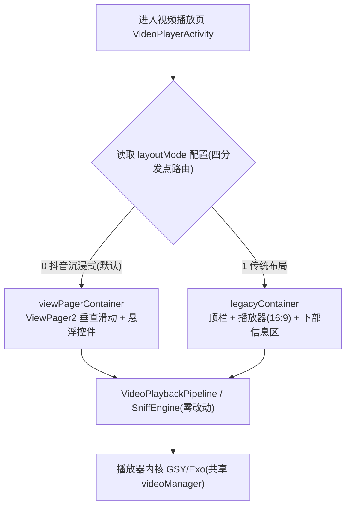

# 视频播放器双布局模式（video-player-dual-layout）

> 状态：🔄 开发中（✅ 设计完成：五轮红队闭环 GO-WITH-NOTES，残留清零；用户 /goal 指令实施）｜ 创建：2026-09-03

## 功能概述

为内置视频播放器（书源视频 + 订阅源视频统一入口 `VideoPlayerActivity`）引入**两种布局模式**，用户可在全局设置中切换，默认抖音沉浸式：

| 模式 | 形态 | 切视频方式 |
|------|------|-----------|
| 抖音沉浸式（默认） | 全屏竖滑 ViewPager，上滑切换影片/集数 | 垂直滑动（现状，不改动） |
| 传统布局 | 上部播放器（16:9）+ 下部视频介绍信息（封面/名称/简介/线路/选集/下一部） | 选集列表 / 线路切换 / 末集自动切下一部（无垂直翻页） |

同时进行**设置中心化**改造：把播放页内的"全局性偏好设置"抽取到「我的 → 视频播放器设置」全局页；播放页内仅保留对**当前播放即时生效**的操作（画面比例、音轨、布局即时切换、悬浮窗等功能菜单项）。

核心约束：**播放内核、嗅探能力、采集链（SniffEngine / VideoPlaybackPipeline）零改动**；介绍信息**零新增字段**，全部复用当前书源/订阅源数据流既有内容（名称/封面/简介/时长）。

## 核心能力

1. **双布局切换**：`layoutMode` 持久化配置（0=沉浸式默认，1=传统，异常值容错），**四分发点路由**（onCreate / initFromIntent 新会话 / 悬浮窗恢复 / onNewIntent），保证单实例复用与悬浮窗场景布局不漂移
2. **传统布局骨架复活**：红队确认其为死代码路径——顶栏提升（K1）、播放器槽位接线（K2）、起播触发（K3）、GSY 原生手势（K4）、跨影片队列接线+「下一部」入口（K5/K6）、信息区双源绑定（K7）、存量触点回归（K8）共 8 项复活清单
3. **传统布局信息区**：封面、名称、简介、线路、选集全部接线现有数据流（书源分支复用渲染链 / 订阅源分支新写绑定），不新增字段
4. **设置中心化（路线 B）**：新增「我的 → 视频播放器设置」全局页（普通 Fragment + ComposeView + `VideoSettingsPanelContent(PanelHost.GLOBAL)`，含布局模式选择）；播放页设置面板按归属表裁剪为仅即时项
5. **即时切换**：播放页内切换布局 → 六步时序契约（直读进度→互斥→串行重建→续播）；全局页修改 → 下次进入生效

## 红队审查记录

| 轮次 | 视角 | 结果 |
|------|------|------|
| R1 | 技术可行性 + 并行冲突（源码级核验） | 并行冲突阻塞(P0)、顶栏不可达、起播链缺口、setupPlayerView 死代码、手势归属未声明、订阅源绑定需新写 |
| R2 | 交互完整性 + 运行时稳定性（11 项逐项） | 跨影片队列语义空洞(P0)、全屏链断裂、onNewIntent 布局漂移、悬浮窗恢复漂移、切换时序契约缺失 |
| R3 | 设置中心化边界 + UI 体系一致性（7 项逐项） | 全局页基类路线错误(P0)、文档自相矛盾(P0)、搜索索引遗漏、R6 归属表与实现不符、入口四处重复 |
| R4 | 整改落盘（本文档） | 三轮发现去重 23 项（4P0+12P1+7P2）全量转化：spec R5/R11 新增 + R3/R4/R6/R10 修正、design AD-07~AD-10 + 骨架复活清单 K1-K8 + 四分发点模型 + 时序契约、tasks 7 章 40 项 |
| R5 | 终审复核 | **GO-WITH-NOTES**：23 项发现 22 ✅闭环+1 ⚠️（措辞残留，已修复）；源码锚点 20 项抽查全部吻合；无 P0/P1 阻塞，可进入实施 |

## 文档索引

| 文档 | 内容 |
|------|------|
| [spec.md](./spec.md) | 需求规格：Intent / Scope（含并行协调约束）/ Approach（含替代方案与缺点）/ Requirements / Scenarios |
| [design.md](./design.md) | 技术设计：技术方案 / ADR 决策 AD-01~AD-10（Y-Statement）/ 数据流 / 文件变更清单 |
| [tasks.md](./tasks.md) | 实施任务清单（`- [ ] X.Y` 格式，红队发现逐项标注 + AOAdapt 日志） |

## 关联设计文档

- `video-booksource-align-rss`（🔄 开发中，**并行协调 P0**）：书源视频单页化 + 公共采集链抽取 —— 本设计以其收口提交为基准快照，重叠文件串行 Edit，跨影片 API 对齐其收口后形态
- `douyin-style-video-player`（✅）：沉浸式布局来源，本设计保留其全部行为为默认模式
- `video-player-ux-fixes` / `video-player-image-enhance`：播放页设置项来源，本设计按归属表重新划分宿主
