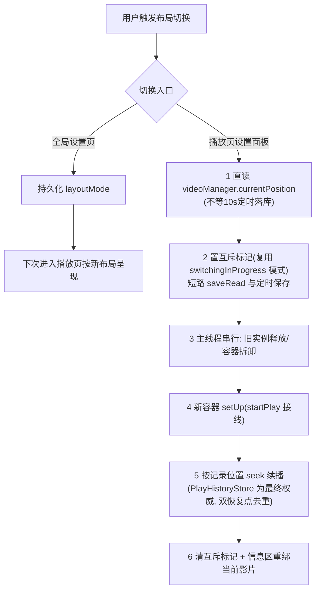
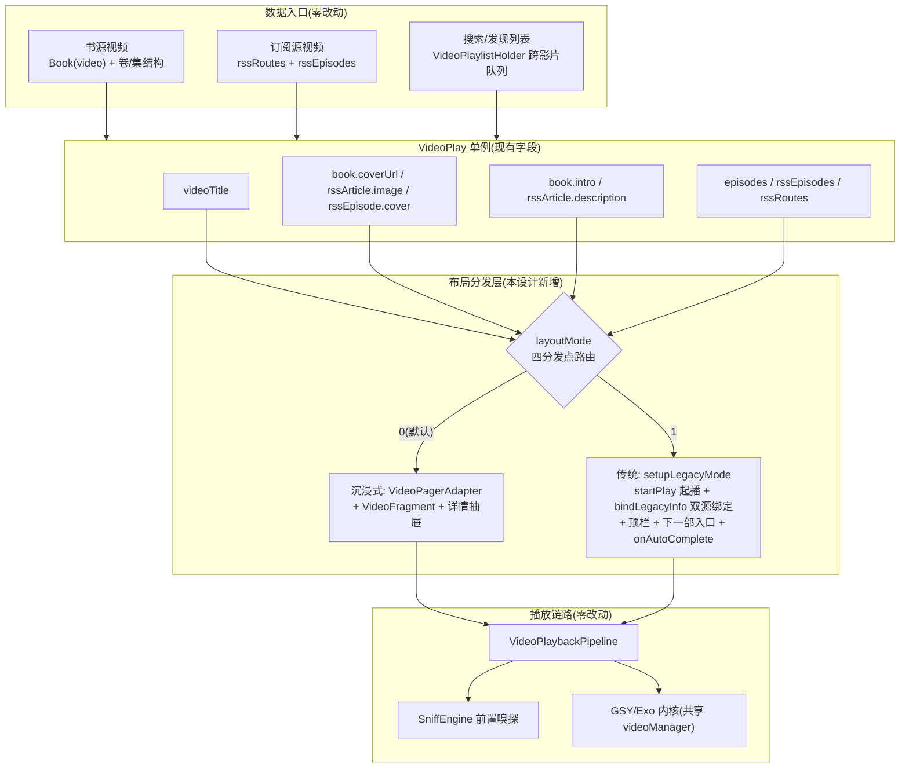

# Design：视频播放器双布局模式

> 红队状态：R1-R3 发现（4P0+12P1+7P2）已全量落盘本版；ADR AD-07~AD-10 为红队新增决策

## Technical Approach

### 0. 基准快照与并行协调（P0，红队 R1-F1）

本设计锚定的 `VideoPlayerActivity.kt`/`VideoPlay.kt` 正被 `video-booksource-align-rss` 轨道大改（工作树未提交 + Pipeline 在建）。强制约束：

1. **基准快照** = align-rss 任务收口（startPlay 三入口收口为 Pipeline 委托 + 提交推送远端）之后的 commit
2. **开工前检查点**：`git log` 确认收口提交存在；`startPlay/playRssEpisode/startPlayBookChapter` 已为 Pipeline 委托形态；UP_VIDEO_INFO legacy 分支（现 L1586-1613）存活
3. **串行约束**：重叠文件（VideoPlay.kt / VideoPlayerActivity.kt / ConfigActivity.kt / strings.xml）的本设计 Edit 排在 align-rss 队列之后，禁止并行
4. 行号引用（本文 L153/L168/L465/L479/L541 等）为快照参考，实施时以**函数名锚点**为准

### 1. 布局分发层：四分发点路由（P1 修正，红队 R2-11）

现状硬编码 `useViewPagerMode=true` 不止一处。改造为 `VideoPlay.layoutMode` 分发，覆盖四个分发点：

| 分发点 | 现状 | 改造 |
|--------|------|------|
| D1 onCreate 初始化 | `useViewPagerMode=true` 硬编码 | 读 `layoutMode` 分发 `setupImmersiveMode()` / `setupLegacyMode()` |
| D2 `initFromIntent` 新会话 | 两分支均硬编码 `switchToViewPagerMode()` | 按 `layoutMode` 分发；legacy 分支走 `setupLegacyMode()` 起播 |
| D3 悬浮窗/通知恢复 | `initFromIntent` 恢复分支硬编码回 ViewPager，clonePlayState 在 Fragment 内 | legacy 分支复用 `savePlayState → clonePlayState → setSurfaceToPlay → startAfterPrepared` 链（与 `VideoPlayService` 同构），布局不漂移 |
| D4 `onNewIntent` 单实例复用 | 拆卸链 ViewPager 专用（取消协程/清 adapter/移除 Fragment）；全屏复位不含 GSY 窗口 | 新增 legacy 拆卸分支（`playerView.release`）；补 `backFromWindowFull` 复位防 GSY 全屏窗口残留 |

### 2. 传统布局骨架复活清单（P0/P1，红队 R1-F2~F5 / R2-1/2/9）

传统布局为被弱化的死代码路径，以下为强制复活/补全项：

| # | 复活项 | 现状证据 | 改造 |
|---|--------|---------|------|
| K1 | 顶栏可达 | `composeTopBar` 位于 `viewPagerContainer` 内部（XML L17-20），legacy 显示时顶栏/返回/9 项菜单全不可见 | **结构级改动**：composeTopBar 提升到根 FrameLayout，两布局共用，由分发层控制行为 |
| K2 | 播放器槽位接线 | `setupPlayerView()`（16:9 尺寸/onPrepared 比例校准/全屏按钮/返回监听/lockTouchLogic）当前**全文件零调用点** | 纳入 `setupLegacyMode()` 调用链（`binding.playerView` 本就在 legacy 槽位，无需实例迁移） |
| K3 | 起播触发 | 沉浸式靠 `VideoFragment.activatePlayer()` 起播；legacy 无 Fragment | `setupLegacyMode()` 显式调 `VideoPlay.startPlay(binding.playerView)` |
| K4 | 手势提供方 | 手势逻辑在 VideoFragment（沉浸式专用）；`VideoPlayer` 类内建单击显隐/双击暂停/长按倍速，GSY 原生左右 seek | 传统布局采用 GSY 原生 + VideoPlayer 内建（AD-07）；seekSensitivity 不生效的差异如实接受 |
| K5 | 跨影片队列 | 队列消费仅两条链：Fragment 手势 onFling + 末集 onAutoComplete（legacy 无接线）；无"下一部"入口 | 末集播完自动切下一部（`setVideoAllCallBack` 接线复用现有切换 API，以 align-rss 收口后为准）+ 信息区「下一部」入口（K6） |
| K6 | 信息区「下一部」入口 | 无 | 下部信息区标题行尾新增入口，无下一影片/队列耗尽时隐藏 |
| K7 | 信息区双源绑定 | `showCover/showBook/showBookIntro` 仅接受 Book；订阅源渲染分支不存在 | `bindLegacyInfo()` 双源分发：书源分支复用现有方法；订阅源新写（`rssArticle.description/image`、`rssEpisode.cover/duration`）；缺失区块隐藏。注意：`RssEpisode.cover/duration` 为实体预留字段（当前构造点仅填 title/url，恒空串/0）——cover 空回退 `rssArticle.image`，duration=0 隐藏时长展示 |
| K8 | 存量空转触点激活 | `upView/upEpisodesView/upVolumesView` 在活路径被调但操作 GONE 容器内未挂 adapter 的 RecyclerView（现状无害空转） | layoutMode=1 后变为真实 UI 操作，纳入回归验证 |

### 3. 设置中心化：双宿主裁剪 + 顶栏第三入口（P0 路线修正，红队 R3-1/5/6/7）

`VideoSettingsPanelContent`（Compose，直读 `VideoPlay` 单例）新增 `host: PanelHost` 参数，**默认值 `PLAYER_PAGE`** 保证现有两个调用点（`VideoSettingsPanel.kt` 全回调 / `SettingsDialog.kt` 空回调）零破坏：

- **GLOBAL 宿主**（新增）：承载 spec R6 全局清单 + "布局模式"默认值分区
- **PLAYER_PAGE 宿主**：布局模式即时切换 + 画面比例/音轨/快进快退/信息复制/调试/画质即时调节/功能菜单（完整归属表见 spec R6，红队修正了换源/浏览器打开误列、全屏底部进度条孤儿项、长按倍速持久属性）

**全局设置页路线 B**（红队 R3 证据否定路线 A）：新建普通 Fragment（**不继承** `ComposeSettingFragment`——其 `prefs` 硬绑默认 SharedPreferences 且非 open，与 `video_config` 独立文件不兼容），自建 ComposeView + `LegadoTheme` + `VideoSettingsPanelContent(PanelHost.GLOBAL)`，挂 `ConfigActivity.replaceFragment()`（该机制接受任意 Fragment），标题走 `activity.setTitle()`；自行实现 onResume 重读配置与 `targetKey` 滚动定位。

**入口归一**（红队 R3-6）：

| 现有入口 | 处置 |
|---------|------|
| `OtherConfigFragment` "视频播放器设置"→SettingsDialog 弹框（空回调死按钮） | 改为跳转 `ConfigActivity(VIDEO_PLAYER)`；`pref_config_other.xml` 同步防死条目 |
| 播放页顶栏"配置设置"→SettingsDialog | 保留，SettingsDialog 收编为仅 PLAYER_PAGE 宿主（与 VideoSettingsPanel 底部弹层同宿主，逐调用方写明） |
| 「我的」新增行 | "工具"分组，`handleSettingsRowClick` 加路由分支 |
| 设置搜索页 | 仿 `welcomeShowTime` 先例在 `buildSettingsSubSearchItems` 硬编码关键条目（ownerConfigTag=VIDEO_PLAYER）+ 路由分支 |

**状态一致性**：`layoutMode` 单源读写（`VideoPlay.layoutMode`）；Activity 仅在 onCreate/onNewIntent/面板切换时读取；各宿主进入时重建 Compose 状态（`remember{}` 初值先例），无需事件总线。

### 4. 布局切换时序契约（AD-05 强化，红队 R2-3）

底层支撑（红队 R2 确认成熟）：全实例共享单一 `VideoPlay.videoManager`（`getGSYVideoManager()`），`saveState/cloneState` + `setSurfaceToPlay` 转移机制现成（悬浮窗链同构在用）。

### 5. 禁改清单（核心约束落地）

以下文件/逻辑**禁止改动**：`help/video/engine/SniffEngine.kt`、`help/video/engine/SniffModels.kt`、`help/video/VideoPlaybackPipeline.kt`、`help/video/VideoUrlExtractor.kt`、`help/exoplayer/` 预加载三件套、`VideoFragment.kt` 沉浸式手势逻辑、`VideoPagerAdapter.kt` 沉浸式分页逻辑。

已确认无需改动的边缘项（红队 R2-5/7/10）：预加载主链挂在播放启动链而非滑动链（传统布局选集播放同样触发，无浪费流量）；历史续播双通道与布局正交（`restorePlayHistory` 恰作用于 legacy playerView）；封面经 `CoverImageView.load` 采样降码（大图铁律天然满足）。

### 6. UI 体系门禁（P1 补全，红队 R3-4）

全局设置页与信息区 Compose 部分必须满足 `docs/project-flow/ui-standards/architecture.md` 门禁 Checklist 全部 9 项（0-8）：第 0 项图标语义/迁移登记、四组件族、`rememberAppSettingPalette()` 取色、根背景 `palette.settings.page`、硬编码色 Grep 自查、第 8 项 ui-standards(components.md/color.md)+migration-registry.md 同步；实施前先读 `how-to.md`。播放器沉浸页"手势红线不改造"边界引用该文档"播放器沉浸页不改造"条款——本设计不动手势体系，仅传统布局复活既有 GSY 原生手势。

## Architecture Decisions

### AD-01: 双容器复用而非新建播放页
- **Context**: `activity_video_player.xml` 中传统布局 `legacyContainer` 与沉浸式 `viewPagerContainer` 已并存于同一 Activity，前者仅被运行时隐藏
- **Concern**: 如何以最小改动面支持两种布局，且不动播放/嗅探链路
- **Decision**: 复用同一 Activity 双容器，`layoutMode` 配置经四分发点路由
- **Goal**: 布局切换不影响播放状态管理、预加载、续播体系，改动集中在 Activity 与配置层
- **Tradeoff**: `VideoPlayerActivity` 双布局宿主职责复杂度上升；以私有方法分区缓解
- **Status**: Accepted

### AD-02: layoutMode 存于 VideoPlay(video_config) + 异常值容错
- **Context**: 现有 20+ 视频配置均存于 `VideoPlay` 单例自持 `video_config`，与 AppConfig 体系分离；同文件 `playerType` 已有废弃值迁移先例
- **Concern**: 新配置归属体系与异常值（备份导入/手改 prefs 出现 2/-1）兜底
- **Decision**: `layoutMode` 存入 `video_config`；getter 非法值一律回落 0（参照 playerType 先例）；本期不做体系迁移
- **Goal**: 与现有配置读写路径一致，零迁移风险，异常输入零崩溃
- **Tradeoff**: 配置双体系技术债延续；升级路径已登记
- **Status**: Accepted

### AD-03: 传统布局信息区 View 体系接线 + 订阅源分支新写
- **Context**: 下部信息区书源分支渲染链（showCover/showBookIntro 三态简介机器）存活，但仅接受 Book 入参；订阅源字段（description/image/duration）渲染分支不存在
- **Concern**: "复用既有控件"与"复用既有绑定逻辑"被红队确认为两回事（R1-F6），工作量口径必须真实
- **Decision**: 书源分支复用现有方法；订阅源分支新写绑定；缺失区块优雅隐藏为三态（书源/订阅源/降级）独立验证
- **Goal**: 回归风险最小，双源覆盖完整
- **Tradeoff**: bindLegacyInfo 为新写代码（非纯复用），tasks 按三分支拆分验证
- **Status**: Accepted

### AD-04: 设置分工原则——全局页承载持久偏好，播放页承载即时操作+布局切换
- **Context**: 播放页设置面板混合持久偏好与即时操作；红队 R3-3 确认现有归属与最初 spec 不符并给出归属表
- **Concern**: 两处设置项划分不引起认知混乱，且与实现真实对齐
- **Decision**: 按 spec R6 归属表执行；画质增强=单源双入口（同一持久化 key）如实声明；布局模式两处均有入口（全局=默认值，页内=即时切换）
- **Goal**: 用户一次性配置全局生效，播放页聚焦当前视频操作
- **Tradeoff**: 少数项双入口；以分区命名与文档口径明确语义
- **Status**: Accepted

### AD-05: 播放页内切换布局采用重建续播 + 显式时序契约
- **Context**: GSY 实例跨容器挂载有状态同步风险；但共享 ExoVideoManager + saveState/cloneState 底层支撑成熟（红队 R2-2 确认）；进度有三轨源（PlayHistoryStore 10s 定时/durChapterPos→seekOnStart/CacheManager），切换瞬间直读可避免最多 10s 丢失
- **Concern**: 重建续播的进度精度与串写竞态
- **Decision**: 时序契约六步（直读位置→互斥标记短路 saveRead→主线程串行释放→新容器 setUp→seek 续播→清标记）；PlayHistoryStore 为最终权威，双恢复点去重防双写 seek
- **Goal**: 秒级切换、误差≤5 秒、无竞态
- **Tradeoff**: 切换有重建加载过程，非无缝；契约复杂度由 tasks 5.x 专项验证覆盖
- **Status**: Accepted

### AD-06: 传统布局不提供垂直滑动切集手势
- **Context**: 沉浸式核心手势为上滑切换；传统布局产品语义为"信息展示+主动选集"
- **Concern**: 同一手势在两种布局下语义冲突
- **Decision**: 传统布局禁用垂直翻页；切集/换线路走选集列表与线路选择器；跨影片走 R5 两条显式链路（末集自动切+下一部入口）
- **Goal**: 与参照产品形态一致
- **Tradeoff**: 两布局切换影片方式不同——正是布局差异点的产品预期
- **Status**: Accepted

### AD-07: 传统布局手势提供方 = GSY 原生 + VideoPlayer 内建（红队新增）
- **Context**: 沉浸式手势全在 VideoFragment 自定义控制层；`VideoPlayer` 类内建单击显隐/双击暂停/长按倍速，GSY 原生提供左右 seek（无灵敏度配置、提示样式不同、无双指缩放全屏）
- **Concern**: 传统布局不走 Fragment，手势由谁提供、体验差异是否可接受
- **Decision**: 复用 GSY 原生 + VideoPlayer 内建，不移植 Fragment 手势层；seekSensitivity 下沉通用层登记升级路径
- **Goal**: 传统布局手势零新开发量，行为符合标准播放器预期
- **Tradeoff**: 与沉浸式手势体验不完全对齐（灵敏度/样式/双指缩放缺失）——传统布局用户预期即标准播放器，差异可接受并写入 Drawbacks
- **Status**: Accepted

### AD-08: 全局设置页路线 B——普通 Fragment 挂 ConfigActivity（红队新增）
- **Context**: 红队 R3 铁证：`ComposeSettingFragment.prefs` 硬绑默认 SharedPreferences 且非 open 无法重定向，监听机制与 `video_config` 独立文件不兼容；`VideoSettingsPanelContent` 为自绘分区结构非 SettingItemSpec 模型
- **Concern**: 全局页技术路线选择错误将导致监听失效/配置分裂/组件重写
- **Decision**: 路线 B——普通 Fragment + ComposeView + LegadoTheme + `VideoSettingsPanelContent(PanelHost.GLOBAL)`，挂 `ConfigActivity.replaceFragment()`，自实现 onResume 重读与 targetKey 定位
- **Goal**: 复用面板组件（一份代码三处行为一致），配置监听正确
- **Tradeoff**: 放弃 ComposeSettingFragment 基类基建（搜索定位需自实现）；可接受——面板组件复用价值远大于基类
- **Status**: Accepted

### AD-09: 跨影片队列语义——末集自动切 + 「下一部」入口（红队新增）
- **Context**: 红队 R2 定性 P0：手势被禁后传统布局队列消费链仅剩 onAutoComplete（legacy 无接线），且无"下一部"入口，书源视频将成信息孤岛
- **Concern**: 传统布局看完当前影片如何到下一部
- **Decision**: 末集播完自动切下一部（`setVideoAllCallBack` 接线，复用现有切换 API，对齐 align-rss 收口后形态）+ 信息区「下一部」显式入口（耗尽隐藏）
- **Goal**: 传统布局书源视频链路完整，产品不残缺
- **Tradeoff**: 新增一个信息区控件与一条回调接线；A8 方案（不提供语义）被否
- **Status**: Accepted

### AD-10: 顶栏提升根布局——XML 结构级改动（红队新增）
- **Context**: 红队 R1/R2 铁证：`composeTopBar` 位于 `viewPagerContainer` 内部，传统布局下返回/菜单/设置入口全部不可达（9 项菜单与面板入口归零）
- **Concern**: 最初"XML 仅属性级微调"声明与菜单可达性需求冲突
- **Decision**: composeTopBar 提升到根 FrameLayout，两布局共用；沉浸式路径行为经 L3 场景验证零回归
- **Goal**: 传统布局导航/菜单/设置全部可达，两布局菜单行为一致
- **Tradeoff**: XML 结构改动 + 沉浸式路径回归风险（由场景"沉浸式零回归"覆盖）
- **Status**: Accepted

## Data Flow

**说明**：布局分发层只消费 `VideoPlay` 单例现有字段做展示，两种布局汇聚到同一播放链路——信息展示与播放采集完全解耦，这是"组件化嗅探能力不受影响"的结构保证。传统布局的差异化部分（起播触发/K3、队列接线/K5、恢复链/D3）均为**调用方接线**，不改链路本体。

## File Changes

| 文件 | 变更类型 | 变更内容 |
|------|---------|---------|
| `app/src/main/java/io/legado/app/model/VideoPlay.kt` | 修改 | 新增 `layoutMode`（getter 异常值回落 0，参照 playerType 先例）；【串行约束】排在 align-rss 之后 |
| `app/src/main/java/io/legado/app/ui/video/VideoPlayerActivity.kt` | 修改 | 四分发点路由（D1-D4）；`setupLegacyMode()`（K2 setupPlayerView 复活 + K3 起播 + K5 onAutoComplete 接线 + K7 bindLegacyInfo）；onNewIntent legacy 拆卸 + GSY 全屏窗口复位；【串行约束】 |
| `app/src/main/res/layout/activity_video_player.xml` | 修改 | **结构级**：composeTopBar 提升根 FrameLayout（AD-10）；信息区新增「下一部」入口（K6） |
| `app/src/main/res/values/strings.xml` | 修改 | 「下一部」等新增文案（与重叠文件同受串行约束） |
| `app/src/main/java/io/legado/app/ui/video/VideoSettingsPanelContent.kt` | 修改 | 新增 `host: PanelHost = PLAYER_PAGE` 默认参数；新增"布局模式"分区；按宿主裁剪分区 |
| `app/src/main/java/io/legado/app/ui/video/VideoSettingsPanel.kt` | 修改 | 显式传 `PanelHost.PLAYER_PAGE` |
| `app/src/main/java/io/legado/app/ui/video/config/SettingsDialog.kt` | 修改 | 收编为仅 PLAYER_PAGE 宿主（逐调用方写明，AD-04） |
| `app/src/main/java/io/legado/app/ui/config/VideoPlayerConfigFragment.kt` | 新增 | 全局设置页（路线 B：普通 Fragment + ComposeView + LegadoTheme + PanelHost.GLOBAL，AD-08）；自实现 onResume 重读 + targetKey 定位 |
| `app/src/main/java/io/legado/app/ui/config/ConfigTag.kt` | 修改 | 新增 `VIDEO_PLAYER` 常量 |
| `app/src/main/java/io/legado/app/ui/config/ConfigActivity.kt` | 修改 | `VIDEO_PLAYER` tag 分发分支（replaceFragment 接受任意 Fragment，改动小） |
| `app/src/main/java/io/legado/app/ui/main/my/MySettingsData.kt` | 修改 | 「我的→视频播放器设置」入口行（"工具"分组）+ 路由分支 + 设置搜索硬编码条目（ownerConfigTag=VIDEO_PLAYER） |
| `app/src/main/java/io/legado/app/ui/config/OtherConfigFragment.kt` | 修改 | "视频播放器设置"弹框入口改为跳转 ConfigActivity(VIDEO_PLAYER) |
| `app/src/main/res/xml/pref_config_other.xml` | 修改 | videoSetting 条目同步（防搜索死条目） |
| `app/src/main/assets/updateLog.md` | 修改 | 面向用户的功能说明（编译前更新） |
| `docs/INDEX.md` / `docs/project-flow/` 相关文档 / `migration-registry.md` | 修改 | 状态流转 / 步骤 8 文档同步 / UI 迁移登记（门禁第 0/8 项） |

> 禁改清单见 Technical Approach §5；`VideoFragment.kt`、`VideoPagerAdapter.kt`、嗅探/采集/预加载链路均不在变更范围。红队 R1 确认 `playerView` 本就在 legacy 槽位（无实例迁移），`CoverImageView.load` 采样降码链天然满足大图铁律。
