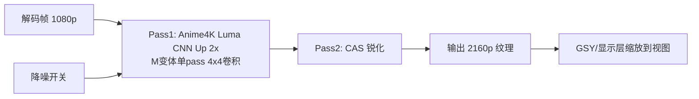
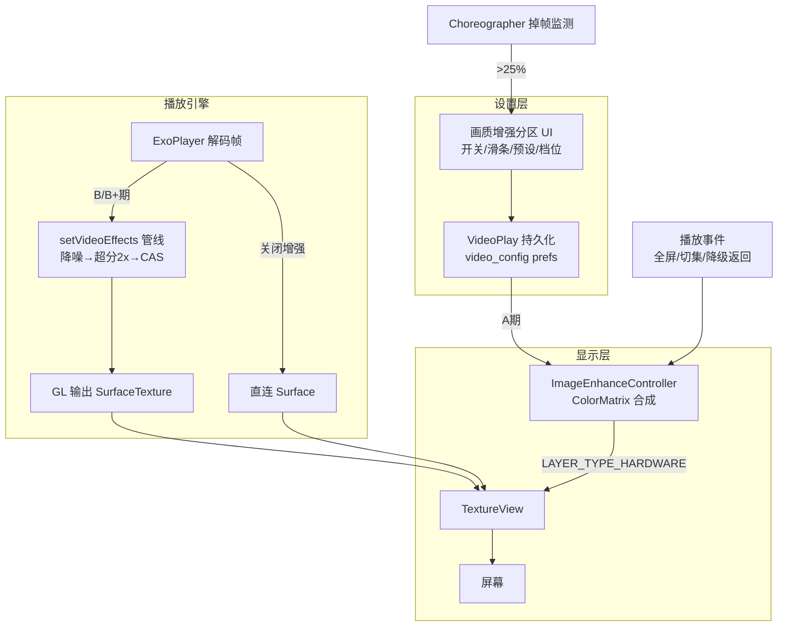

# Design：视频播放器画质增强（A / B / B+ 三级 + C 期探索）

## Technical Approach

### 总体架构：三级档位 + 设备自动定级

| 档位 | 内容 | 渲染技术 | 设备门槛 | GPU 开销（1080p 实测预算） |
|------|------|---------|---------|--------------------------|
| **基础档**（A 期） | 亮度/对比度/饱和度/色温 + 预设（护眼/鲜艳） | TextureView 硬件层 `ColorMatrixColorFilter` | 全机型 | ≈0（硬件合成器） |
| **进阶档**（B 期） | CAS 自适应锐化 + 轻度降噪 | Media3 Effect（GL 单 pass） | 中端+（骁龙 7 系/天玑 7 系+，GLES 3.0+） | 1~3ms |
| **高级档**（B+） | Anime4K 轻量 CNN 超分 2x + CAS 组合管线 | Media3 Effect（GL 多 pass，输出 2x 分辨率） | 中高端+（骁龙 8 系/天玑 9 系，检测门禁） | 4~7ms |
| C 期探索 | TFLite AI 超分降噪 / SDR→HDR | NNAPI/GPU delegate | 登记不实施 | — |

设备定级：`Build.SOC_MODEL`（API 31+）/ `Build.HARDWARE` 回退 + `GLES10.glGetString(GL_RENDERER)` GPU 型号 + `ActivityManager.isLowRamDevice` + `MemoryInfo.totalMem`，映射分级表（实施时枚举主流 SoC 清单，未知 SoC 归进阶档并允许用户手动开高级档试跑）。运行时守护：`Choreographer` 掉帧率监测，连续 3 秒丢帧 >25% 提示降档。

### A 期：色彩调节（TextureView ColorFilter）

**渲染层前提（⚠️ K1 待验证）**：渲染载体必须是 TextureView。子代理推断"GSY 11.3.0 默认 TextureView"依据是 `mTextureView` 字段名——但该字段实为历史命名的 RenderView 接口包装（SurfaceView/TextureView 皆可），且 `VideoPlayer.kt` L865 存在 `getShowView() is SurfaceView` 兜底分支（默认 SurfaceView 的反证信号）。**A0.1 必须运行时核实实际类型；若为 SurfaceView 则先切 `GSYVideoType.setRenderType(TEXTURE_TYPE)` 并回归全屏/旋转/双指缩放差异（AD-02 预案）。**

```kotlin
// 四参数 → 单一 ColorMatrix（应用顺序：色温 RGB 增益 → 饱和度 → 对比度缩放 → 亮度平移）
val cm = ColorMatrix()
applyColorTemp(cm, colorTemp)      // 暖色 R↑B↓ / 冷色反向（保留亮度守恒）
cm.postConcat(ColorMatrix().apply { setToSaturation(saturation) })
applyContrastBrightness(cm, contrast, brightness)
textureView.setLayerType(View.LAYER_TYPE_HARDWARE, Paint().apply {
    colorFilter = ColorMatrixColorFilter(cm)
})
```

**TextureView 获取（两级回退）**：
1. 首选：`surface_container`（`mTextureViewContainer`，`VideoPlayer.kt` L1034 有访问先例）遍历子 View 找 TextureView
2. 回退：反编译核实 carguo fork 11.3.0 的 `RenderViewFactory` API，注册自定义 TextureView

**应用时机钩子**：播放视图 attach 完成 / `onFullScreenChanged` / 切集数 / 切线路 / WebView 降级返回，统一收敛 `ImageEnhanceController.apply(view)`。

### B 期：CAS 自适应锐化 + 降噪（Media3 Effect）

**选型依据**：CAS（AMD FidelityFX Contrast Adaptive Sharpening，MIT 开源）基于 3x3 邻域局部对比度自适应调节锐化强度——平坦区不放大压缩噪点、边缘处加强，效果与噪声表现均优于固定系数 USM，且单 pass 开销低（中端 GPU 1~3ms @1080p）。

**GLSL 移植**：官方 `CasFilter` 核心 ~40 行，移植 GLSL ES 3.0；实现为自定义 `GlEffect`：

```kotlin
class CasSharpenEffect(private val sharpness: Float) : GlEffect {
    override fun isNoOp() = sharpness <= 0f
    override fun createProgram(context: Context, glObjectsProvider: GlObjectsProvider,
        inputVideoInfo: VideoInfo, outputVideoInfo: VideoInfo): GlShaderProgram =
        SinglePassGlEffect子类(CAS_FRAG_SHADER, mapOf("SHARPNESS" to sharpness))
}
```

**降噪**：轻量双边滤波简化版（亮度域 5x5，色度域跳过），pass 顺序 **降噪 → 锐化**（先除噪再锐化防噪点放大）。档位映射：轻（blurRadius 3 / sharpness 0.3）、中（5 / 0.6）、强（5 / 0.85）。

**实例暴露**：`Exo2MediaPlayer` 新增 `internal val exoPlayerInstance: ExoPlayer? get() = mInternalPlayer`（`mInternalPlayer` 为父类 protected 字段，L579 赋值自 `PlayerInstancePool.acquire`）。

**注入（运行时热更新）**：

```kotlin
val player = (videoManager.playerManager?.getMediaPlayer() as? Exo2MediaPlayer)?.exoPlayerInstance
player?.setVideoEffects(buildEffects(denoise, sharpen))   // ExoPlayer 接口公开 API
```

绕开 `PlayerInstancePool.acquire` 复用分支（L123-130）不重建实例的问题——档位切换即时生效，无需重建播放器。

### B+：Anime4K 轻量超分管线（中高端解锁）

**选型依据**：Anime4K（bloc97，MIT 协议，无 GPL 传染）v3 模块化 CNN 超分，**原生 1080p 源优化**（与订阅源场景匹配）；M 变体（fast）单 pass 实时性经过桌面端大量验证；Android 端有 libmpv 移植先例（mpv-android-anime4k），本项目走 Media3 Effect 管线移植（Media3 自定义 GLSL ES 效果有开源先例 sakuro 验证可行性）。

**管线（2 pass）**：



**分辨率变更**：Media3 Effect 链原生支持（`ScaleToFitEffect` 等改尺寸先例），超分 pass 输出 2x 纹理，Effect 框架自动串联中间纹理分配。

**性能预算（B+ 档位交付门禁）**：旗舰 GPU（Adreno 740+/Immortalis-G9+）CNN 单 pass 2~4ms + CAS 1ms ≈ 5ms，60fps 预算（16.6ms）内可行；实测 <24fps 档位不出货（RB6）。

**与 A 期协同**：ColorFilter 在显示层（TextureView），Effect 在解码后纹理层，两者正交可叠加（超分后色彩调节依然生效）。

### 兼容性与风险预案

| 风险 | 影响 | 预案 |
|------|------|------|
| `ExoPlayerManager` L92-98 API 29+ `SurfaceControl` 路径 vs GL Effect pipeline（Effect 要求 `SurfaceTexture` GL 输出） | B/B+ 期 SurfaceControl 模式下黑屏/无效 | 检测 surface 类型：Effect 开启时强制 TextureView 渲染路径 + 设置页提示 |
| Effect 管线引入 ~1 帧显示延迟 | seek/手势观感 | 仅显示层，进度条/手势逻辑零影响；实测确认 |
| GSY 内部重建渲染视图（切全屏/切集数）导致 TextureView 引用失效 | A 期滤镜丢失 | 应用时机钩子覆盖重建场景 + 容器遍历每次实时查找（不缓存引用） |
| 少数机型 TextureView 硬件层合成异常 | A 期无效果/黑屏 | 真机回归 + 总开关 `enhanceEnabled` 立即回退原画 |
| 低端机误开高级档 | 掉帧 | SoC 分级检测门禁 + Choreographer 掉帧监测提示降档 |

## 穿透验证清单（卡点与决策门禁）

> 自审识别的 7 个卡点（2026-08-29 用户质疑"确定可行？没有卡点？"后穿透式复审产出）。**K1/K2/K3 为 A 期开工前置门禁（A0 批），未通过则方案修订**。

| # | 卡点 | 影响 | 验证方式 | 失败预案 | 状态 |
|---|------|------|---------|---------|------|
| **K1** | GSY 11.3.0 默认渲染类型未穿透验证 | 若默认 SurfaceView → A 期 ColorFilter 方案整体不适用 | A0.1：反编译 fork 库 GSYVideoType 静态初始化 | 切 `setRenderType(TEXTURE_TYPE)` 并回归行为差异 | ✅ **已核实（2026-08-29 无侵入反编译）**：`<clinit>` 显示 `sRenderType=iconst_0` → 默认 `TEXTURE(0)`=TextureView（javap -c gsyvideoplayer-java-11.3.0 GSYVideoType.class）；项目内 `setRenderType` 零命中未被改；L865 SurfaceView 分支为防御代码。**A 期载体成立** |
| **K2** | TextureView 硬件层 ColorFilter 对 SurfaceTexture 内容是否生效 | A 期核心机制失效 | A0.2：最小实测 | 见 K3 | 🟡 **静态查证通过（2026-08-29）**：`setLayerType(LAYER_TYPE_HARDWARE, paint)` ColorFilter 在 layer 合成步骤生效为官方支持路径，TextureView 场景有成功案例（代价：每帧更新重录 layer，视频场景双倍带宽仍可接受）；API 21-22 有历史黑屏 bug（minSdk 23+ / API 26+ 稳定）。**最终生效性待 A0.2 最小实测**（不改源码无法运行时验证，需用户批准临时改动或独立 Demo） |
| **K3** | ColorFilter 失败后的替代技术路线未定义 | K2 失败时 A 期无方案 | A0.3：预定义两条替代路线并评估 ① 自定义 TextureView 覆写 draw + `canvas.saveLayer(paint)`（软件层，性能中） ② 直接采用 GL 管线（B 期提前，工作量重排） | 按 A0.3 评估结果修订 AD-01 | 🟡 路线已定义，评估随 A0.2 结果触发 |
| **K4** | B/B+ 期缺"关闭增强清空 effects"路径 | 关闭后效果残留（用户感知 bug） | 设计修正：档位=关时显式 `setVideoEffects(emptyList())`（已并入 B2.1 任务） | — | ✅ 已并入 B2.1 |
| **K5** | B+ Effect 输出 2x 与 SurfaceTexture 默认 buffer 尺寸/transform 矩阵兼容性 | 超分画面拉伸/模糊 | Bp1.2 实测（media3 输出端 setDefaultBufferSize 行为） | Effect 链末尾加下采样 pass 回原尺寸 | ⏳ 随 B+ 批验证 |
| **K6** | 性能门禁需真机：MEmu 跑 PC GPU 不能代表中高端 SoC | B/B+ 帧率门禁无法闭环 | 需要旗舰真机（用户提供或延后） | 模拟器先验功能正确性，性能门禁挂"真机待验"状态 | ⏳ 依赖真机资源 |
| **K7** | media3 1.10.1 `GlEffect` API 签名与后续版本有差异（VideoInfo 参数形态） | 编译失败/API 误用 | B1.3 实施时以 1.10.1 源码为准核对 | — | ⏳ 随 B 批实施核对 |

## Architecture Decisions

### AD-01: A 期渲染载体选 TextureView 硬件层 ColorFilter 而非 GL
- **Context**: 两期共同需要可介入的渲染层；GSY 实际默认渲染类型待 A0.1 核实（TextureView 为 ColorFilter 方案的必要载体，必要时主动切换）；A 期目标是全机型零风险可用
- **Concern**: ColorFilter 走硬件层合成是否覆盖 TextureView 内容（K2）；GL 链提前引入增加 A 期风险
- **Decision**: A 期用 `LAYER_TYPE_HARDWARE` + `ColorMatrixColorFilter`（前置 A0.1 渲染类型核实 + A0.2 实测门禁），GL 链推迟到 B 期与 Effect 一并验证
- **Goal**: 四参数实时调节零帧率损耗、全机型可用、实现最小
- **Tradeoff**: K2 实测失败则按 A0.3 两条替代路线（软件层 saveLayer / GL 提前）修订本决策；色彩矩阵非专业色准级
- **Status**: Accepted（以 A0 验证批通过为生效前提）

### AD-02: TextureView 获取采用 surface_container 遍历优先、RenderViewFactory 回退
- **Context**: GSY fork（carguo 11.3.0）内部创建渲染视图，项目零自定义 RenderView 先例；`mTextureViewContainer` 访问有先例（VideoPlayer.kt L1034）
- **Concern**: GSY 内部时序（切全屏/切集数重建渲染视图）导致拿不到或拿旧引用
- **Decision**: 首选容器遍历 + 每次实时查找不缓存引用 + 应用时机钩子覆盖重建场景；时序实测失效再反编译核实 fork 库 `RenderViewFactory`
- **Goal**: 不依赖未文档化库 API 完成接入，保留升级路径
- **Tradeoff**: 遍历方案对 GSY 内部结构有耦合（fork 锁定 11.3.0，风险可控）
- **Status**: Accepted

### AD-03: B 期效果注入用运行时 `player.setVideoEffects` 而非 Builder 注入
- **Context**: `PlayerInstancePool.acquire` 复用分支（L123-130）直接 return 池内旧实例不重建，Builder 注入对复用实例无效
- **Concern**: 用户切档位需要即时生效，不能要求重建播放器
- **Decision**: `Exo2MediaPlayer` 加 internal getter 暴露 `mInternalPlayer`，运行时调 `ExoPlayer.setVideoEffects`（接口公开 API，支持热更新）
- **Goal**: 档位切换即时生效，与实例池机制解耦
- **Tradeoff**: 一处 minimal 的 protected 字段暴露（internal 作用域）
- **Status**: Accepted

### AD-04: 画质参数持久化到 video_config prefs 十倍整值
- **Context**: `video-player-ux-fixes` 已建立 `video_config` + Int 十倍值模式（seekSensitivity/longPressSpeed）
- **Concern**: 滑条精度与存储一致性
- **Decision**: 亮度/对比度/色温存 -500~500（实际 -50.0~50.0），饱和度存 -1000~1000，预设/档位存枚举 Int；`ImageEnhanceController` 统一换算
- **Goal**: 与既有设置模式一致，避免浮点存储
- **Tradeoff**: 无明显缺点
- **Status**: Accepted

### AD-05: WebView 降级引擎不做画质增强，UI 明示
- **Context**: WebView 内 video 元素渲染归网页/系统 WebView，无法介入
- **Concern**: 用户在降级模式下调节参数无效造成困惑
- **Decision**: 降级模式时分区头部标注"仅 ExoPlayer 引擎生效"，参数保留（切回 Exo 自动应用）
- **Goal**: 行为可预期，参数不丢失
- **Tradeoff**: 无
- **Status**: Accepted

### AD-06: 锐化算法选 CAS（FidelityFX）替代 USM
- **Context**: 初版方案为 USM 固定系数锐化；用户期望中高端设备更强画质增强；CAS 为 AMD 开源（MIT）且为现代播放器主流锐化方案
- **Concern**: CAS 移植 GLSL ES 的工作量 vs 效果收益
- **Decision**: B 期锐化采用 CAS：3x3 邻域局部对比度自适应权重，平坦区抑制噪点放大、边缘加强；核心 ~40 行 GLSL ES 移植
- **Goal**: 中端机可跑的更高质量锐化，降噪联动抑制压缩噪声
- **Tradeoff**: 自定义 GlEffect 移植工作量略高于 USM（+0.5 天量级）；效果与噪声表现显著更好
- **Status**: Accepted

### AD-07: B+ 超分选 Anime4K v3 M 变体（MIT）单 pass，拒绝 GPL 移植与重型 CNN
- **Context**: 用户期望中高端"更强画质增强"；Anime4K v3 模块化 CNN（M 快版/UL 质量版）原生 1080p 源优化，Android 已有移植先例（libmpv 系）；Real-ESRGAN/waifu2x 类模型实时性不足
- **Concern**: 超分 GPU 开销与掉帧风险；开源协议传染
- **Decision**: B+ 期采用 Anime4K v3 Luma CNN Up 单 pass（M 变体）+ CAS 组合 2 pass 管线，输出 2x 分辨率；shader 算法 MIT 无传染；仅中高端档解锁（SoC 检测门禁）
- **Goal**: 中高端设备获得接近 SRGAN 观感的实时超分，帧率门禁 ≥24fps
- **Tradeoff**: 对 720p/480p 低分辨率源非最优（Anime4K 官方定位 1080p 原生源）；低端机完全禁用
- **Status**: Accepted

### AD-08: 设备定级用 SoC/GPU 检测 + 运行时掉帧守护双保险
- **Context**: 三级档位对应不同设备门槛；Android 设备碎片化，静态分级表无法覆盖全部
- **Concern**: 误判导致低端机开高级档掉帧，或旗舰机被低估
- **Decision**: 静态定级（`Build.SOC_MODEL`/`HARDWARE` + GPU renderer string + RAM 映射分级表，未知 SoC 归进阶档）+ 动态守护（Choreographer 连续 3 秒丢帧 >25% 提示降档）；允许用户手动越级试开
- **Goal**: 档位与设备能力匹配，体验可预期
- **Tradeoff**: 分级表需持续维护（主流 SoC 枚举）；越级试开可能掉帧（用户自主选择）
- **Status**: Accepted

## Data Flow



## File Changes

| 文件 | 变更类型 | 批次 | 变更内容 |
|------|---------|------|---------|
| `app/src/main/java/io/legado/app/model/VideoPlay.kt` | 修改 | A/B | 画质参数持久化属性（开关/四参数/预设/锐化降噪档位） |
| `app/src/main/java/io/legado/app/ui/video/ImageEnhanceController.kt` | 新增 | A | ColorMatrix 合成 + TextureView 应用 + 应用时机钩子统一入口 |
| `app/src/main/java/io/legado/app/ui/video/VideoSettingsPanelContent.kt` | 修改 | A/B/B+ | "画质增强"分区（开关/滑条/预设；B 期锐化降噪档位行；B+ 高级档 + 设备定级提示） |
| `app/src/main/java/io/legado/app/ui/video/VideoFragment.kt` | 修改 | A | 播放视图就绪/全屏切换/降级返回后触发 apply；掉帧监测接入 |
| `app/src/main/java/io/legado/app/help/gsyVideo/VideoPlayer.kt` | 修改 | A | surface_container TextureView 查找辅助 |
| `app/src/main/java/io/legado/app/help/gsyVideo/Exo2MediaPlayer.kt` | 修改 | B | internal getter 暴露 ExoPlayer 实例 |
| `app/src/main/java/io/legado/app/help/exoplayer/ImageEnhanceEffects.kt` | 新增 | B/B+ | CAS GlEffect + 降噪 GlEffect + Anime4K CNN pass + 效果链组装 |
| `app/src/main/java/io/legado/app/help/exoplayer/DeviceGrade.kt` | 新增 | B/B+ | SoC/GPU 分级检测 + 掉帧守护 |
| `gradle/libs.versions.toml` + `app/build.gradle` | 修改 | B | media3-effect 依赖 |
| `app/src/main/res/values/strings.xml` | 修改 | A/B | 画质增强文案 |
| `app/src/main/assets/updateLog.md` | 修改 | - | 版本交付同步 |

**不改动**：手势逻辑（`onTouch`/`handleSlideSeek*`）、播放核心（缓冲/嗅探/缓存）、`PlayerInstancePool` 主体（仅被调用不修改）。
