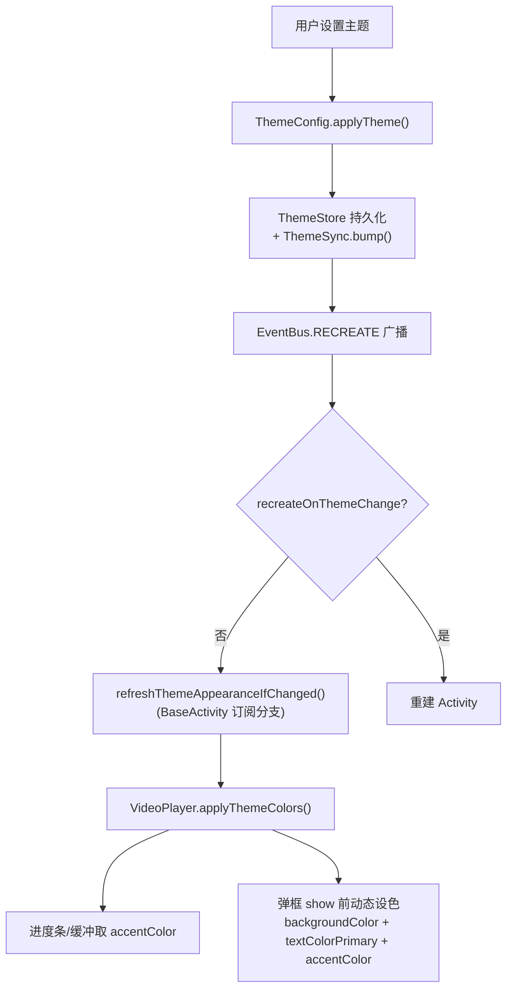

# 视频播放器主题统一 — 技术设计

> 关联需求：[spec.md](./spec.md)｜任务清单：[tasks.md](./tasks.md)

## Technical Approach

核心思想：**View 侧代码动态设色 + ThemeStore 主题属性**。播放器页面 `recreateOnThemeChange=false`，View 侧静态颜色不随主题刷新，因此不能只改 XML 静态资源，必须由代码在初始化与主题变化时机动态设置颜色。

### 模块 1：播放器控制条（VideoPlayer 控件）

在 `VideoPlayer` 控件（`help/gsyVideo/VideoPlayer.kt`）新增 `applyThemeColors()`：

| 元素 | 现状 | 改造 |
|------|------|------|
| 底部条背景 | `#99000000` 静态 | 保持深色半透明（不随主题，可读性） |
| 时间文字/弹幕/倍速 | `#ffffff` 静态 | 保持白色（深色悬浮层上可读） |
| 播放进度条（progress） | `video_seek_progress` 固定色 | `progressTintList` = `ThemeStore.accentColor()` |
| 缓冲进度条（bottom_progressbar） | `bottom_progress_buffer` 固定色 | `progressTintList` = 主题色半透明 |
| 全屏控制条 | 同上 | 同步调用 `applyThemeColors()` |

`applyThemeColors()` 调用时机：
- `init(context)` 初始化后
- BaseActivity 订阅的 `EventBus.RECREATE` 分支（recreateOnThemeChange=false 时）
- `onConfigurationChanged` 兜底

### 模块 2：倍速弹框（ChoiceSpeedDialog）

`switch_speed_video_dialog.xml` + `speed_dialog_item.xml` + `speed_dialog_panel_bg.xml`（`#CC1A1A1A`）：

| 元素 | 现状 | 改造 |
|------|------|------|
| 弹框容器背景 | `speed_dialog_panel_bg` 静态深色 | show 前动态设 `ThemeStore.backgroundColor()` + `UiCorner.panelRadius` 圆角 |
| 列表项文字 | `R.color.primaryText` | `ThemeStore.textColorPrimary()`（保留） |
| 选中高亮 | `R.color.primary` 静态 | `ThemeStore.accentColor()` 动态读取 + 20% 透明圆角背景 |
| 分隔项 | 固定样式 | 保留 |

### 模块 3：选集弹框（ChoiceEpisodeDialog）

`switch_episode_video_dialog.xml`（`#80121212` / `#88ffffff`）：同模块 2，show 前动态设色；标题"选集"迁移 strings.xml。

### 模块 4：画面比例/音轨 AlertDialog（VideoPlayer.kt）

`androidx.appcompat.app.AlertDialog.Builder(mContext)` 未走项目主题：

| 弹框 | 现状 | 改造 |
|------|------|------|
| 画面比例（showRatioDialog） | 原生 AlertDialog + 硬编码中文 | 改 `alert(mContext){...}`（`io.legado.app.lib.dialogs.alert`）自动应用主题；文案迁移 strings.xml |
| 音轨（showAudioTrackDialog） | 原生 AlertDialog + 硬编码中文 | 同上 |

### 模块 5：旧模式功能区 + 调试面板（activity_video_player.xml）

> **实施决策（用户确认）**：两区块为历史遗留冗余 UI，直接**删除**而非动态设色——`rss_video_panel`（播放地址/快进快退/倍速 Spinner/调试/上一集下一集/简介）与 `debug_panel`（调试日志），连同 VideoPlayerActivity 中配套代码（setupRssVideoPanel/toggleDebugPanel/appendDebugLog/skipVideo/updateVideoUrlDisplay/上下集按钮）一并移除。VIDEO_PLAY_ERROR 调试日志改由设置面板 settingsPanel.appendDebugLog 承载。

| 位置 | 现状 | 改造 |
|------|------|------|
| 旧模式功能区（L51-L66） | `#1A2B4A` / `#8AB4F8` 静态 | 删除（含配套代码） |
| 调试面板（L287-L304） | `#80000000` / `#FFFFFF` | 删除（含配套代码） |

### 模块 6：文案资源化

| 硬编码中文 | 位置 | strings.xml key |
|------|------|------|
| 倍速 | video_layout_controller.xml / VideoPlayer.kt | video_speed |
| 关弹幕 / 开弹幕 | VideoPlayer.kt resolveDanmakuShow | video_danmaku_off / on |
| 画面比例 | VideoPlayer.kt showRatioDialog | video_ratio |
| 音轨 | VideoPlayer.kt showAudioTrackDialog | video_audio_track |
| 选集 | switch_episode_video_dialog.xml | video_episode_list |
| 默认/16:9/4:3/填充 | VideoPlayer.kt showRatioDialog | video_ratio_default/16_9/4_3/fill |
| X 倍播放中 | VideoPlayer.kt | video_speed_playing |

## Architecture Decisions

### AD-01: 控制条保持深色悬浮层 + 主题高亮

- **Context**: 播放器控制条是视频播放标准悬浮层，视频画面背景多变（亮/暗/彩）。
- **Concern**: 完全跟随主题切换浅深色，浅色主题下控制条在视频画面上可读性风险高。
- **Decision**: 控制条背景/文字保持深色半透明悬浮层（不随主题），进度条/缓冲/选中高亮用 `ThemeStore.accentColor()` / `primaryColor()`。
- **Goal**: 视觉专业不跳变，同时让主题色体现在高亮元素，日夜间均可用。
- **Tradeoff**: 控制条背景不随主题变化，主题感主要体现在高亮与弹框。
- **Status**: Accepted

### AD-02: View 弹框动态设色而非 ComposeDialog 迁移

- **Context**: 倍速/选集弹框为 View Dialog，有分隔项/右侧滑出/选中高亮特殊交互；S5 View 内核红线。
- **Concern**: ComposeDialog 迁移成本高、回归风险大（破坏手势/播放交互）。
- **Decision**: 保留 View Dialog，show 前用 `ThemeStore` + `UiCorner` 动态设色。
- **Goal**: 低风险统一主题风格。
- **Tradeoff**: 保留部分 View 样板代码，未彻底 Compose 化。
- **Status**: Accepted

### AD-03: 主题切换经 EventBus.RECREATE 刷新 View 侧

- **Context**: 播放器页面 `recreateOnThemeChange=false`，View 侧静态颜色不随主题刷新。
- **Concern**: 主题切换后进度条/弹框颜色不更新，"主题管不到"的根因。
- **Decision**: `VideoPlayer` 提供 `applyThemeColors()`，由 BaseActivity 已订阅的 RECREATE 分支 + `onConfigurationChanged` 兜底触发；弹框每次 show 前动态设色天然跟随最新主题。
- **Goal**: 播放中切换主题实时刷新 View 侧主题色。
- **Tradeoff**: 增加主题刷新样板代码。
- **Status**: Accepted

## Data Flow

## File Changes

> 实际落盘清单（已与 git diff 核对一致）。

| 文件 | 变更 |
|------|------|
| `app/src/main/java/io/legado/app/help/gsyVideo/VideoPlayer.kt` | 新增 `applyThemeColors()`（进度条/缓冲/圆点 tint = accentColor）；init/startWindowFullscreen/resolveNormalVideoShow 时机调用；画面比例/音轨 AlertDialog 走 `alert()`；文案资源化 |
| `app/src/main/java/io/legado/app/help/gsyVideo/ChoiceSpeedDialog.kt` | show 前动态设色（容器背景 ThemeStore.backgroundColor + UiCorner.panelRadius、选中高亮 accentColor、文字 textColorPrimary） |
| `app/src/main/java/io/legado/app/help/gsyVideo/ChoiceEpisodeDialog.kt` | 同上动态设色；标题文案资源化；initialSelection 传 adapter |
| `app/src/main/java/io/legado/app/help/gsyVideo/SwitchVideoAdapter.kt` | 新增 currentSelection 参数，当前集高亮 accentColor + 20% 透明圆角背景 |
| `app/src/main/java/io/legado/app/ui/video/VideoPlayerActivity.kt` | observeLiveBus 订阅 EventBus.RECREATE + onConfigurationChanged 触发 applyVideoThemeColors()；新增 applyVideoThemeColors() 全量刷新（小屏/大屏/全屏实例）；删除旧模式功能区与调试面板配套代码 |
| `app/src/main/res/layout/video_layout_controller.xml` | 弹幕/倍速文案资源化（保留深色悬浮层 `#99/80-000000` + 白字，AD-01） |
| `app/src/main/res/layout/video_layout_controller_full.xml` | 弹幕/选集/音轨/倍速/比例文案资源化（同上） |
| `app/src/main/res/layout/switch_speed_video_dialog.xml` | 弹框容器背景改透明（由代码设色） |
| `app/src/main/res/layout/switch_episode_video_dialog.xml` | 同上 + 标题文案资源化 + 文字色改 primaryText |
| `app/src/main/res/layout/activity_video_player.xml` | 删除旧模式功能区 rss_video_panel 与调试面板 debug_panel 区块 |
| `app/src/main/res/values/strings.xml` + `values-zh/strings.xml` | 硬编码中文迁移（video_speed/video_danmaku_off/on/video_ratio/video_audio_track/video_episode_list/video_episode_list_btn/video_ratio_default/16_9/4_3/fill/video_speed_playing/video_speed_long_press/video_no_audio_track/video_ratio_playing/video_audio_track_playing） |
| `docs/specs/video-player-theme-unify/*` | 本设计文档 |

> 说明：`video_seek_progress.xml`/`video_seek_thumb.xml` 实际不存在，进度条改用现有 drawable + 代码动态 tint（progressTintList/secondaryProgressTintList/thumbTintList）；values/strings.xml 为默认（英文）语言，中文在 values-zh。
