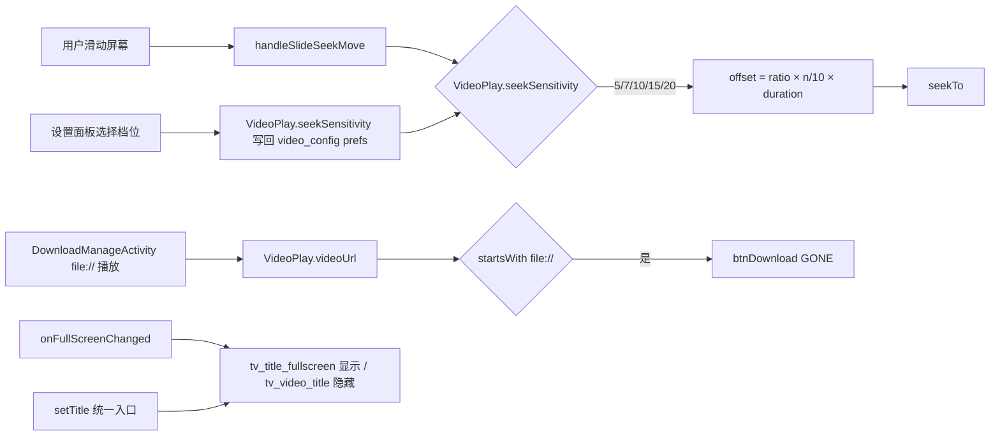

# Design：视频播放器体验五项修复

## Technical Approach

五个问题均为 UI 层改动，互不依赖播放核心。整体分三组：

- **显隐控制组（P1）**：VideoFragment 单文件逻辑
- **配置项组（P2）**：VideoPlay 存储层 + VideoSettingsPanelContent UI 层 + VideoFragment seek 计算层
- **布局规范组（P3/P4/P5）**：SettingsDialog 弹框壳、fragment_video.xml 布局、VideoFragment 全屏态切换

### P1：本地视频隐藏下载按钮

判定链：`DownloadManageActivity` 发起播放时 `putExtra("videoUrl", Uri.fromFile(file).toString())` → `VideoPlayerActivity.initFromIntent` 接收并置 `VideoPlay.singleUrl = true` → `VideoPlay.videoUrl` 以 `file://` 开头。

实现：`VideoFragment.bindViews()` 完成后的初始化段：

```kotlin
if (VideoPlay.videoUrl?.startsWith("file://") == true) {
    btnDownload?.gone()
}
```

Activity 生命周期内 `videoUrl` 不可变（`isNew=true` 重建 Intent），无需动态恢复逻辑。

### P2：滑动 seek 灵敏度设置

**存储层**（`VideoPlay.kt`，复用既有模式）：

```kotlin
// 滑动快进灵敏度：存 10 倍整数值（5=0.5x, 7=0.7x, 10=1.0x, 15=1.5x, 20=2.0x），默认 10
var seekSensitivity: Int
    get() = videoPrefs.getInt("seekSensitivity", 10)
    set(value) = videoPrefs.edit().putInt("seekSensitivity", value).apply()
```

**计算层**（`VideoFragment.handleSlideSeekMove`，L1240 附近）：

```kotlin
val ratio = dx / resources.displayMetrics.widthPixels
val offset = (ratio * (VideoPlay.seekSensitivity / 10f) * VideoPlay.videoManager.duration).toLong()
```

**UI 层**（`VideoSettingsPanelContent` 播放设置区）：

- 新增 `SettingsClickRow`（"滑动快进灵敏度"，summary 显示当前倍率如"1.0x"）
- 点击弹 `SingleChoiceDialog`（5 档），选择即写回 `VideoPlay.seekSensitivity`，与 `PlayerType` 选择模式一致（L354-370）

### P3：配置弹框规范对齐

**透明根因**：`ComposeDialogFragment` 基类 window 背景为 `R.color.transparent`，实际底色依赖内容自绘。`VideoSettingsPanel`（BottomSheet 版）在 `onStart` 用 `GradientDrawable` + `ThemeStore.backgroundColor()` 兜底；`SettingsDialog`（Dialog 版）无兜底 → 透明。

**修复**：`SettingsDialog.onCreateView` 内容包 `AppDialogFrame` 规范壳：

```kotlin
LegadoTheme {
    AppDialogFrame(
        style = rememberAppDialogStyle(),
        onDismissRequest = { dismiss() },
        // scrollContent 参数与内容滚动组件隔离（滚动嵌套禁令）
    ) {
        VideoSettingsPanelContent(...)
    }
}
```

**取色同源治理**（`VideoSettingsPanelContent.kt`）：`MaterialTheme.colorScheme.outlineVariant / onSurfaceVariant` 等替换为 `themeUiPalette`（`UiCorner.surfaceColor(palette.cardColor)` / `palette.secondaryText` 等），遵守 color.md 门禁。BottomSheet 版共享组件一并统一。

**风险点**：`VideoSettingsPanelContent` 内部含滚动容器（播放设置/功能菜单分区较长），接入 `AppDialogFrame` 必须按 dialog-shell.md L44-57 检查滚动嵌套（Frame `scrollContent` 与内容滚动互斥参数化），实施时以实际结构决定 `scrollable=false` 或 `heightIn(max=…)` 隔离。

### P4：全屏标题移位

**布局**（`fragment_video.xml`）：`btn_back_overlay` 后新增：

```xml
<TextView
    android:id="@+id/tv_title_fullscreen"
    android:layout_width="0dp"
    android:layout_height="wrap_content"
    android:layout_marginStart="8dp"
    android:layout_marginEnd="48dp"
    android:maxLines="1"
    android:ellipsize="end"
    android:textColor="#FFFFFF"
    android:textSize="@dimen/text_14sp"
    android:textStyle="bold"
    android:visibility="gone"
    app:layout_constraintTop_toTopOf="@id/btn_back_overlay"
    app:layout_constraintBottom_toBottomOf="@id/btn_back_overlay"
    app:layout_constraintStart_toEndOf="@id/btn_back_overlay"
    app:layout_constraintEnd_toEndOf="parent" />
```

**逻辑**（`VideoFragment.kt`）：

- 新增 `tvTitleFullscreen` 绑定 + 统一 `setTitle(text)` 私有方法（双控件同步赋值）
- 三处赋值点收敛：`updateVideoTitle`（L570）、集数切换（L888）、初始化（L923）
- `onFullScreenChanged`：进入全屏 `tvTitleFullscreen.visible()` + `tvVideoTitle.gone()`；退出反向
- overlay controls 显隐组（L708 附近的控件列表）加入 `tvTitleFullscreen`，随 3 秒自动隐藏

### P5：返回按钮尺寸

`fragment_video.xml` `btn_back_overlay`：`android:padding` 12dp → 14dp（净图标 48-14×2=20dp）。ic_back 为细线形矢量（2 条 path），无需改素材；"粗"观感源于 24dp 净尺寸，收敛后与非全屏 Compose 顶栏（20dp）一致。

## Architecture Decisions

### AD-01: 本地播放判定采用 `file://` scheme 而非 `singleUrl` 标志
- **Context**: 播放器无显式"本地文件"标志位；`singleUrl=true` 涵盖本地文件与用户手动输入的在线直链两类场景
- **Concern**: 判定过宽会误隐藏在线直链播放时的下载按钮
- **Decision**: 以 `VideoPlay.videoUrl.startsWith("file://")` 为唯一判定条件
- **Goal**: 精确区分本地文件播放与在线直链播放
- **Tradeoff**: 依赖上游 `Uri.fromFile` 包装约定（DownloadManageActivity L257-261），若未来新增本地播放入口未走该约定则需补判定；接受理由：当前仅此一条本地播放路径
- **Status**: Accepted

### AD-02: 灵敏度存储采用 Int 10 倍值而非 Float
- **Context**: `video_config` prefs 既有 `longPressSpeed`（存 30=3.0x）整型模式；档位含 0.7x 非整十倍率
- **Concern**: Float 直接存储的精度与既有模式不一致
- **Decision**: 存 Int（5/7/10/15/20），使用时 `/10f` 换算倍率
- **Goal**: 与既有设置项存储模式一致，避免浮点存储
- **Tradeoff**: 0.7x 换算存在理论精度损耗（7/10f 精确表示无问题）；选项文案需标注倍率含义
- **Status**: Accepted

### AD-03: 弹框修复复用 AppDialogFrame 规范壳而非独立背景
- **Context**: `SettingsDialog` 透明根因是 window 透明 + 内容无壳；项目已有 ui-standards/dialog-shell.md 规定的标准壳 `AppDialogFrame`
- **Concern**: 直接给 window 设背景色最快但违反规范，且内容 `colorScheme.*` 取色偏色问题不解决
- **Decision**: `SettingsDialog` 接入 `AppDialogFrame` + `rememberAppDialogStyle()`；`VideoSettingsPanelContent` 取色同源治理（双壳共享组件一并统一）
- **Goal**: 弹框视觉符合 ui-standards，双入口（Dialog/BottomSheet）风格统一
- **Tradeoff**: 共享组件取色替换影响 BottomSheet 版视觉（预期内收益），需双入口真机回归；AppDialogFrame 与内容滚动需按嵌套禁令参数化
- **Status**: Accepted

### AD-04: 全屏标题采用独立控件 + 统一 setTitle 而非动态约束
- **Context**: 标题需在"左下角（非全屏）/左上角返回键旁（全屏）"两位置切换
- **Concern**: 动态修改 ConstraintLayout 约束代码易碎；双控件存在数据源分叉风险
- **Decision**: 新增 `tv_title_fullscreen` 独立控件，全屏态切换显隐；抽取 `setTitle(text)` 单点同步双控件
- **Goal**: 位置切换稳定可控，标题更新无遗漏
- **Tradeoff**: 新增控件与双份数据源（收敛到单方法后风险可控）；布局文件多一个节点
- **Status**: Accepted

### AD-05: 返回按钮仅缩图标净尺寸不改触控目标
- **Context**: 全屏 `btn_back_overlay` 图标净 24dp 大于顶栏基线 20dp；右侧功能区统一 48dp 按钮本体
- **Concern**: 缩小按钮本体破坏触控目标统一性（无障碍）
- **Decision**: padding 12dp→14dp，图标净尺寸 20dp 对齐 GlassTopAppBar R4 档，本体保持 48dp
- **Goal**: 视觉尺寸对齐规范，触控目标不变
- **Tradeoff**: 无明显缺点
- **Status**: Accepted

## Data Flow



## File Changes

| 文件 | 变更类型 | 变更内容 |
|------|---------|---------|
| `app/src/main/java/io/legado/app/model/VideoPlay.kt` | 修改 | 新增 `seekSensitivity` 属性（P2） |
| `app/src/main/java/io/legado/app/ui/video/VideoFragment.kt` | 修改 | P1 下载按钮隐藏判定；P2 seek 计算乘灵敏度；P4 `setTitle` 统一 + `onFullScreenChanged` 标题切换 + overlay 显隐组 |
| `app/src/main/java/io/legado/app/ui/video/VideoSettingsPanelContent.kt` | 修改 | P2 灵敏度设置行 + SingleChoiceDialog；P3 取色同源治理 |
| `app/src/main/java/io/legado/app/ui/video/config/SettingsDialog.kt` | 修改 | P3 接入 `AppDialogFrame` 规范壳 |
| `app/src/main/res/layout/fragment_video.xml` | 修改 | P4 新增 `tv_title_fullscreen`；P5 `btn_back_overlay` padding 14dp |
| `app/src/main/res/values/strings.xml`（及中文 values-zh） | 修改 | P2 灵敏度设置文案 |
| `app/src/main/assets/updateLog.md` | 修改 | 版本交付同步（编译前基于 git diff 更新） |

**不改动**：`GlassTopAppBar.kt`（非全屏顶栏已合规）、`VideoSettingsPanel.kt`（BottomSheet 壳保持 GradientDrawable 兜底）、手势处理主体逻辑（仅 seek offset 一行乘系数）、播放核心。
