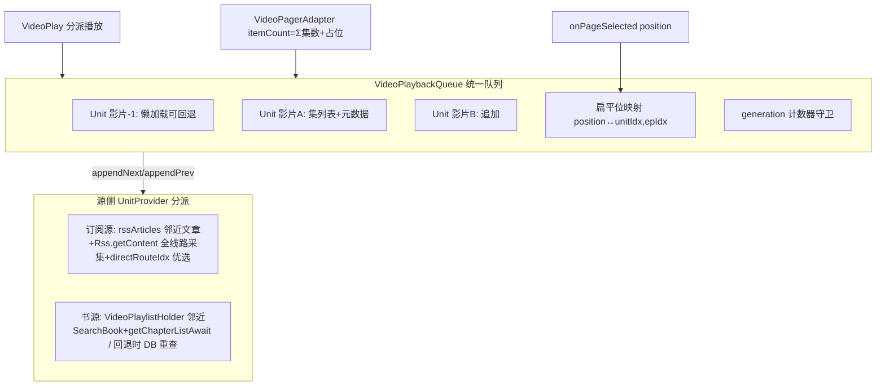
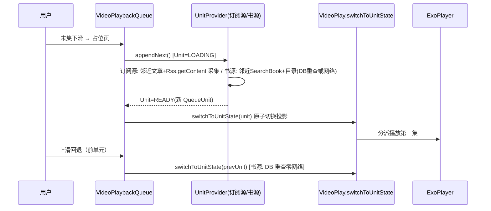

# design.md — video-playlist-continuity

> 五轮红队对抗审查后修订版（red-team-report.md，P0×7 全部整改）。核心结论：**统一队列架构方向与源码兼容**（itemId=position 稳定 ID、占位页激活安全、initSource 即时加载链可直接复用），本版吸收全部 P0/P1 修正。

## Technical Approach

**统一播放队列组件（VideoPlaybackQueue）**：把"多集下滑下一集、末集/单集下滑下一个影片、上滑回退"的播放会话模型抽成源类型无关组件，订阅源与书源双接入，**双向（前/后）懒加载回退**。

## Architecture Decisions

### AD-01: 统一播放队列组件 + 状态机 + 统一守卫
- **Context**: 用户裁决"行为一致性！组件化复用"；现状订阅源多线路多集下滑=切影片（分页优先级实锤）
- **Decision**: `VideoPlaybackQueue`：
  - `QueueUnit`：{title, episodes: List<RssEpisode>（统一集模型）, state: LOADING/READY/FAILED, meta（订阅源: RssArticle；书源: Book 引用+durVolumeIndex，<1KB 级）}
  - 扁平位映射 `locate(position)/(unitStart(unitIdx))`；itemCount = Σ(READY 单元集数) +（可追加 ? 1 占位）
  - **generation 计数器统一守卫**（替代三套 token 叠加）：任何异步追加/切换完成回调校验 generation，过期丢弃
  - Unit 状态机：LOADING（追加中，占位页）→ READY（可播）/ FAILED（可重试）；FAILED 单元重新进入触发重试
- **Status**: Accepted

### AD-02: 订阅源多集分页改造 + 既有触发分支限定
- **Decision**:
  - 多线路多集模式（isNewRoutesMode()）分页数据源 rssArticles → **rssEpisodes**（经队列统一模型）；末集下滑 → appendNext 下一影片
  - **采集方式修正（红队 R3-4）**：追加影片的集列表复用 **Rss.getContent 全线路采集 + directRouteIdx 直链线路优选**（`Rss.getEpisodesAwait` 仅单线路解析，无直链优选，不满足首集直出），非 getEpisodesAwait
  - **loadMoreArticles 限定（红队 R1-1）**：仅普通文章分支（非多线路多集）保留"position==articles.size-1 触发"逻辑；多线路多集分支的 loadMoreArticles 调用点移除/限定为影片追加服务（队列末单元触发），消除扁平位中段误触发双追加
  - **换线路 position 校正（红队 R1-2）**：换线路后队列当前 Unit 集列表刷新，`setCurrentItem(unitStart(currentUnit) + min(chapterInVolumeIndex, newEpisodes.size-1))`，禁止裸 setCurrentItem(0)
- **Status**: Accepted

### AD-03: 书源全回退扁平队列（红队裁决升级）
- **Decision**: **放弃"换源式不回退"**，升级为全回退扁平队列：
  - 向后 appendNext：playlist 下一 SearchBook → getChapterListAwait → 新 Unit
  - **向前 appendPrev（回退）**：playlist 前一 SearchBook → **BookChapter 已入库，DB 重查目录零网络**（initSource 同款 `bookChapterDao.getChapterList`）→ 新 Unit
  - 初始 Unit 之前的影片同样懒加载构造（Holder 有完整 books+index，前/后对称）；若实施中前向懒加载复杂度超预期，允许一期先做"已访问单元间回退 + Unit 内全回退"，**必须显式标注不允许沉默降级**
  - Unit.meta 持 Book 引用+durVolumeIndex；BookChapter 按 bookUrl 从 DB 重查
- **Tradeoff**: 对称回退实现 = appendNext 同一 switchToUnitState 的两次调用，增量仅"取前一 SearchBook + DB 重查"
- **Status**: Accepted（红队裁决升级）

### AD-04: 列表注入 + Holder 生命周期三铁律（红队 R5-1）
- **Decision**: `VideoPlaylistHolder`（object 单例，仿 RssSearchSourceHolder）：
  - **铁律1**：consume 一次性——openVideo 链消费后置 consumed 标记，二次进入（同 bookUrl）不重复消费
  - **铁律2**：bookUrl 校验——播放中滑动追加时校验当前 book.bookUrl ∈ Holder.books，不匹配（书架/历史重进陌生影片）则视为无列表
  - **铁律3**：VideoPlayerActivity onDestroy 清理 Holder（防残留列表导致后续单影片进入错误续播）
  - **注入入口 5 处（红队 R3-2 实锤补全）**：SearchActivity（单源+全局 L618-626）、**ExploreShowActivity L205（发现分类列表真实主体）**、ExploreFragment（聚合入口，若其点击经 SearchBookOpenHelper 则同点注入）、AI 入口两处（P2 登记）
- **Status**: Accepted

### AD-05: 占位页/失败/取消语义（红队 R4-2/R5-3）
- **Decision**: 可追加时尾部占位；onPageSelected(占位) 触发 appendNext（Unit 置 LOADING，防重）；**用户滑离占位页 = 取消**（generation 校验过期丢弃回调，不绑架导航）；成功 notifyDataSetChanged + 定位新单元首集；FAILED → VIDEO_PLAY_ERROR + setCurrentItem 回退占位前一页，重新进入占位可重试
- **Status**: Accepted

### AD-06: 状态权威契约 + switchToUnitState 原子切换（红队 R2-1/R2-2/R2-3）
- **Decision**:
  - **权威契约**：`QueueUnit` 是跨影片回退/追加的**持久权威**（谁在队列里、各影片集列表）；`VideoPlay` 全局字段（book/toc/volumes/episodes/rssRoutes/rssEpisodes/rssArticleIndex/chapterInVolumeIndex 等）是**当前播放单元的执行投影**——队列切换时由 switchToUnitState 原子重建投影，选集器/预加载直读投影字段不变（零改动）
  - **switchToUnitState(unit) 原子切换**：**复用 initSource 写入链重构**（L1036-1114 已是完整实现：book 解析/toc 读取或即时加载/volumes/映射），**禁止手抄字段清单**（红队实锤手抄必漏 12+ 字段：rssStar/rssRecord/originalPlayUrl/hasPlayedSuccessfully/chapter/durVolume 等）；Main 线程原子执行；**saveRead 短路**（切换窗口期跳过旧影片进度写回）
  - 订阅源侧同构：跨影片切换复用 switchToArticle 链路重构
- **Status**: Accepted

## Data Flow

## File Changes

| 文件 | 变更 |
|------|------|
| `app/src/main/java/io/legado/app/model/VideoPlaybackQueue.kt` | 新增：QueueUnit/状态机/扁平映射/generation 守卫/UnitProvider 接口 |
| `app/src/main/java/io/legado/app/model/VideoPlay.kt` | switchToUnitState（initSource 链重构复用）；Provider 双实现；onPageSelected 分派迁移；saveRead 短路；loadMoreArticles 分支限定 |
| `app/src/main/java/io/legado/app/ui/video/VideoPagerAdapter.kt` | itemCount=队列扁平大小+占位；订阅源多集分页数据源改造 |
| `app/src/main/java/io/legado/app/ui/video/VideoPlayerActivity.kt` | onPageSelected 队列映射+占位触发；换线路 position 校正；saveRead 窗口 |
| `app/src/main/java/io/legado/app/ui/video/VideoFragment.kt` | 占位页加载态渲染；activatePlayer 分派对齐队列（红队 R3-3） |
| `app/src/main/java/io/legado/app/ui/video/VideoPlaylistHolder.kt` | 新增：列表单例（三铁律） |
| `app/src/main/java/io/legado/app/ui/book/search/SearchActivity.kt` | 点击注入（L618-626 前） |
| `app/src/main/java/io/legado/app/ui/book/explore/ExploreShowActivity.kt` | **点击注入（L205，发现分类列表真实主体）** |
| `app/src/main/java/io/legado/app/ui/main/explore/ExploreFragment.kt` | 聚合入口注入（若经 openVideo 则同点） |
| RssArticlesFragment/RssSearchActivity/ReadRss | **零改动**（列表已注入，队列消费其数据） |

## 回归保障

- 行为矩阵六形态 + 红队补的 S7-S10 全覆盖真机（tasks 5.x）
- 订阅源普通文章模式零改动回归（AD-02 分支限定）
- "未找到章节"修复回归（initSource 即时加载）
- 换线路 position 校正 / 双追加消除 / Holder 串台 三专项验证
