# design.md - 视频播放器分段预缓冲机制深度分析与优化

> **状态**：🔄 设计中（R3 修订版）
> **创建日期**：2026-07-28
> **R2 修订日期**：2026-07-28
> **R3 修订日期**：2026-07-28

---

## 一、Technical Approach（技术方案详解）

### 1.1 当前架构分析

Legado 视频播放器基于 **GSYVideoPlayer + Media3 (ExoPlayer 1.10.1)** 构建，预缓冲机制由三个独立组件构成：

#### 1.1.1 预加载三件套（已实现，但有 BUG）

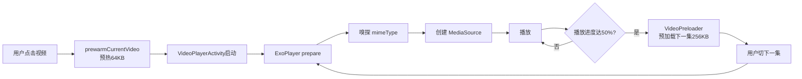

**关键问题**：B 和 I 预加载的数据**未写入 SimpleCache**，D 步骤 ExoPlayer 重新下载，预加载完全无效。

#### 1.1.2 带宽感知 LoadControl（已实现，R3 放弃热切换）

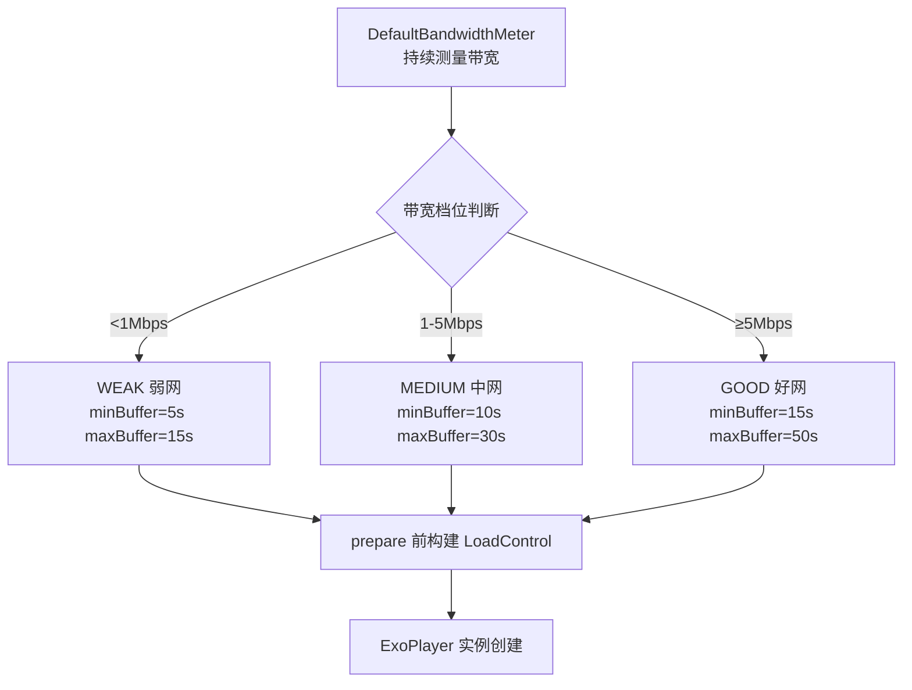

**R3 修订说明**：
- **R3 放弃 LoadControl 热切换**（路径A）：只在 prepare 前根据当前网络档位+设备档位设置 LoadControl，运行时不进行热切换
- 放弃原因：阻塞点2（ExoPlayer setLoadControl 运行时支持）+ 阻塞点3（PlayerInstancePool 与热切换冲突）均为 YES 阻塞，热切换需重新 prepare 导致缓冲中断且与池化逻辑冲突
- **好网 maxBuffer=50s 过于保守**，中高端机+好网下可提升至 120s
- 不区分设备档位问题已通过 DeviceTier 解决（R3 移除 LOW 档位，默认 HIGH）

#### 1.1.3 播放器实例池（已实现，正常工作）

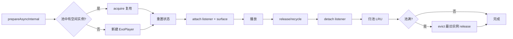

#### 1.1.4 格式识别与 MediaSource 分发（已实现，正常工作）

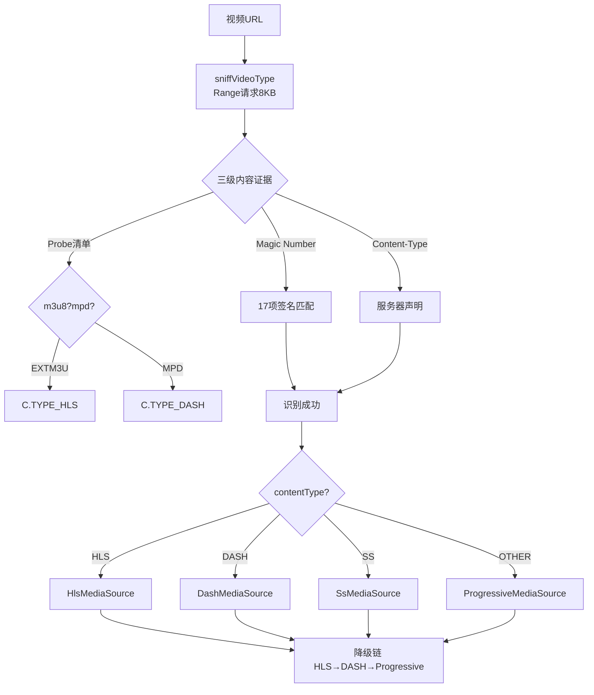

### 1.2 R3 修订版优化方案详解

#### 1.2.1 阶段 1：修复预加载 BUG（P0）

**修复点 1**：`FirstFramePreloader.preloadUrl` + `VideoPreloader.preloadUrl` 改用 `CacheUtil.cache()`

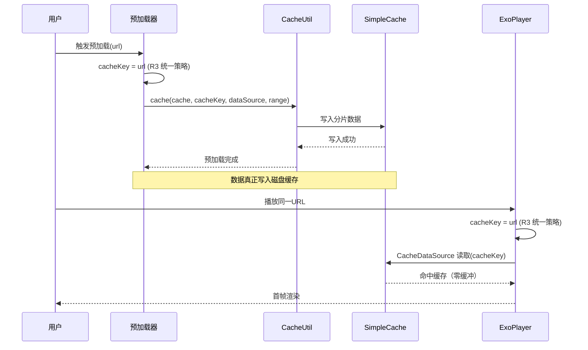

**关键改动**：
- 移除 `body.byteStream().readBytes()`
- 改用 `CacheUtil.cache(cache, cacheKey, upstreamDataSource, DataSpec(uri, 0, PRELOAD_BYTES))`
- 复用 `ExoPlayerHelper.cache` 与 `okhttpDataFactory`
- **R3 新增：cacheKey 统一策略**（阻塞点6修复）——预加载器与播放器 cacheKey 必须一致，统一使用 URL 作为 cacheKey（详见 1.2.10）

**修复点 2**：严格限制读取字节数

原代码 `readBytes()` 读取整个 body（可能 GB 级），改为 `CacheUtil.cache()` 内部按 `DataSpec.length` 限制读取。

**R3 修订**：`PRELOAD_BYTES` 不再是固定值，而是根据设备档位+网络档位动态调整（HIGH+GOOD=10MB，MID+WEAK=512KB），且用户可在 AppConfig 中往下调（详见 1.2.9）。

#### 1.2.2 阶段 2：HLS 依赖状态确认（P0）

**确认方法**：
```bash
./gradlew :app:dependencies --configuration releaseRuntimeClasspath | grep -i hls
```

**预期结果**：
- 如果看到 `androidx.media3:media3-exoplayer-hls:1.10.1` 通过 GSY 传递依赖 → 在 build.gradle 添加注释说明
- 如果未看到 → 取消注释 `implementation(libs.media3.exoplayer.hls)`

#### 1.2.3 阶段 3：中高端机检测（P0，R3 修订——移除 LOW 档位）

**R3 核心调整**：
- **移除 LOW 档位**（用户决策：不再保护低端机，默认参数适配中高端机）
- DeviceTier 只检测 HIGH/MID 两档
- **默认 HIGH**（检测失败时降级到 HIGH 而非 MID，因为现代设备普遍中高端）

**实现方案**：

```kotlin
// 新增 DeviceInfoHelper.kt
object DeviceInfoHelper {
    enum class DeviceTier {
        MID,      // 内存<6GB 或 CPU<8核 → 用户可降级到此档
        HIGH      // 内存≥6GB 且 CPU≥8核 且 磁盘≥10GB → 默认档位（激进策略）
    }

    private var cachedTier: DeviceTier? = null

    fun getDeviceTier(): DeviceTier {
        cachedTier?.let { return it }
        val tier = runCatching {
            val totalMemMB = getTotalMemoryMB()
            val cpuCores = Runtime.getRuntime().availableProcessors()
            val freeDiskMB = getFreeDiskMB()

            when {
                totalMemMB >= 6144 && cpuCores >= 8 && freeDiskMB >= 10240 -> DeviceTier.HIGH
                else -> DeviceTier.MID
            }
        }.getOrNull() ?: DeviceTier.HIGH  // R3：检测失败默认 HIGH（适配中高端机）
        cachedTier = tier
        return tier
    }

    private fun getTotalMemoryMB(): Long {
        val memoryInfo = ActivityManager.MemoryInfo()
        (appContext.getSystemService(Context.ACTIVITY_SERVICE) as ActivityManager)
            .getMemoryInfo(memoryInfo)
        return memoryInfo.totalMem / (1024 * 1024)
    }

    private fun getFreeDiskMB(): Long {
        val statFs = StatFs(appContext.filesDir.absolutePath)
        return statFs.availableBlocksLong * statFs.blockSizeLong / (1024 * 1024)
    }
}
```

**R3 激进策略矩阵**（移除 LOW，默认 HIGH）：

| 设备档位 | 网络档位 | maxBuffer | 预加载数量 | 预加载字节 | 磁盘缓存上限 |
|---------|---------|-----------|-----------|-----------|------------|
| **HIGH（默认）** | GOOD（好网） | **120s** | **10 个** | **10MB** | **1GB** |
| HIGH（默认） | MEDIUM（中网） | 60s | 5 个 | 5MB | 1GB |
| HIGH（默认） | WEAK（弱网） | 20s | 1 个 | 1MB | 1GB |
| MID（用户可降级） | GOOD | 90s | 7 个 | 5MB | 800MB |
| MID（用户可降级） | MEDIUM | 40s | 3 个 | 2MB | 800MB |
| MID（用户可降级） | WEAK | 15s | 1 个 | 512KB | 800MB |

**R3 说明**：用户可通过 AppConfig 手动降级到 MID 档位（详见 1.2.9），但系统不再自动检测 LOW 档位。

#### 1.2.4 阶段 4：激进 LoadControl + 全格式统一激进策略（P1，R3 修订——放弃热切换）

**R3 核心调整**：
- **放弃 LoadControl 热切换**（阻塞点2+3修复）：只在 prepare 前根据当前网络档位+设备档位设置 LoadControl，运行时不进行热切换
- 路径A：`buildLoadControl(deviceTier, networkTier)` 在 `ExoPlayer` 构建时调用一次，后续不再修改
- 网络切换时仅调整预加载策略（预加载数量/字节数），不重新设置 LoadControl

**激进 LoadControl 实现**（prepare 前设置）：

```kotlin
// ExoPlayerHelper.kt 修改 buildLoadControl
fun buildLoadControl(deviceTier: DeviceTier, networkTier: NetworkTier): LoadControl {
    val (minBuffer, maxBuffer) = when (deviceTier to networkTier) {
        DeviceTier.HIGH to NetworkTier.GOOD -> 30_000 to 120_000  // 30s / 120s
        DeviceTier.HIGH to NetworkTier.MEDIUM -> 20_000 to 60_000
        DeviceTier.HIGH to NetworkTier.WEAK -> 5_000 to 20_000
        DeviceTier.MID to NetworkTier.GOOD -> 20_000 to 90_000
        DeviceTier.MID to NetworkTier.MEDIUM -> 10_000 to 40_000
        DeviceTier.MID to NetworkTier.WEAK -> 5_000 to 15_000
    }
    return DefaultLoadControl.Builder()
        .setBufferDurationsMs(minBuffer, maxBuffer, 1000, 3000)
        .setPrioritizeTimeOverSizeThresholds(true)
        .build()
}
```

**R3 移除：LoadControl 热切换流程图**（原 R2 的 setLoadControl + prepare 重新准备流程已废弃）。

**LoadControl 设置时机（R3 路径A）**：

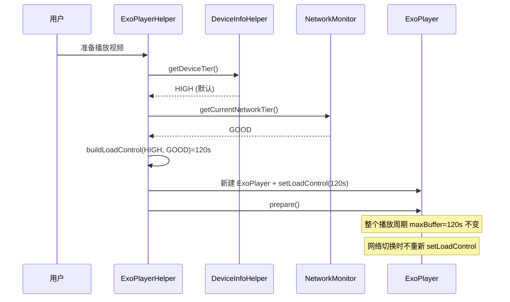

**全格式统一激进策略**：

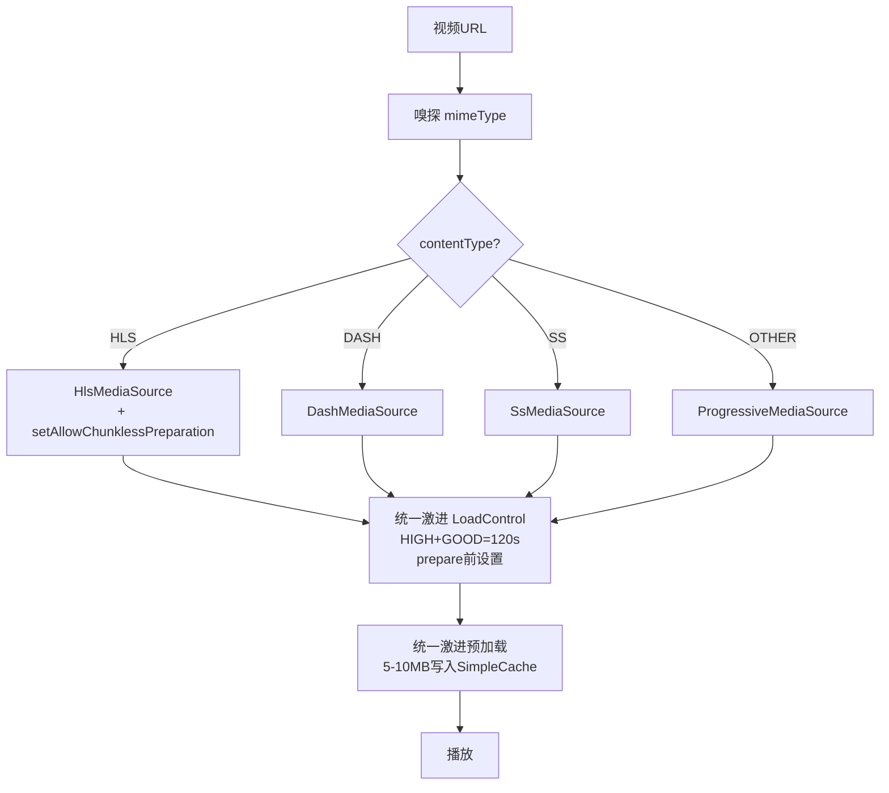

**关键点**：激进 LoadControl 对所有格式统一生效（不区分格式），预加载字节数对所有格式统一为 5-10MB。

#### 1.2.5 阶段 5：HLS 协议级优化（P1）

**优化点 1**：启用 `setAllowChunklessPreparation`

```kotlin
// ExoPlayerHelper.createMediaSource L203-L207
C.TYPE_HLS -> HlsMediaSource.Factory(dataSourceFactory)
    .setAllowChunklessPreparation(true)  // 新增：无分片准备
    .createMediaSource(mediaItem)
```

**收益**：HLS 首屏无需下载首个分片即可准备，降低首屏耗时 30%+。

**优化点 2**：VOD 类型识别与全量缓存（阻塞点9已确认非阻塞）

**R3 说明**（阻塞点9）：HLS VOD 类型识别由 `HlsMediaSource` 内部自动完成，无需外部介入。`HlsMediaSource` 在解析 m3u8 清单后会自动识别 `#EXT-X-PLAYLIST-TYPE:VOD` 和 `#EXT-X-ENDLIST` 标签，内部决定缓存策略。

**策略**：
- VOD：全量缓存（点播内容，二次播放零缓冲）
- EVENT：预加载后续 N 个分片
- LIVE：不缓存（直播内容，时效性要求高）

#### 1.2.6 阶段 6：运行时网络感知（P1，R3 修订——不触发 LoadControl 热切换）

```mermaid
flowchart TD
    A[NetworkCallback注册] --> B{网络切换}
    B -->|WiFi→4G| C[调整预加载数量=1<br/>预加载字节=1MB<br/>不热切换LoadControl]
    B -->|4G→WiFi| D[调整预加载数量=10<br/>预加载字节=10MB<br/>不热切换LoadControl]
    B -->|任何→无网络| E[暂停预加载]
    C --> F[已预加载数据保留]
    D --> F
    E --> F
    F --> G[下次预加载按新策略]
    Note over G: LoadControl 保持prepare前设置不变
```

**R3 修订实现**：
- 在 `VideoPlayerActivity.onCreate` 注册 `ConnectivityManager.NetworkCallback`（阻塞点5修复）
- 在 `onDestroy` 注销
- 网络切换时调用 `VideoPreloader.updateNetworkStrategy()` 和 `FirstFramePreloader.updateNetworkStrategy()`
- **R3 移除：网络档位提升时触发 LoadControl 热切换**（放弃热切换，路径A）
- **R3 新增**：网络切换仅调整预加载数量/字节数，LoadControl 保持 prepare 前设置不变

#### 1.2.7 阶段 7：埋点（P1-P2）

**埋点字段**：
- `cacheHitCount`：缓存命中次数
- `cacheMissCount`：缓存未命中次数
- `preloadSuccessCount`：预加载成功次数
- `preloadFailCount`：预加载失败次数
- `firstFrameHitCount`：首帧命中次数（预加载后首帧渲染）
- `firstFrameMissCount`：首帧未命中次数
- `deviceTier`（R3 修订）：设备档位 HIGH/MID（移除 LOW）
- `networkTier`：网络档位 GOOD/MEDIUM/WEAK
- `loadControlMaxBuffer`：当前 maxBuffer 值
- **`preloadTriggerProgress`**（R3 新增）：预加载触发进度（默认10%）
- **`preloadDedupCount`**（R3 新增）：URL 去重命中次数

**输出**：每 5 分钟 AppLog 输出一次命中率统计（R3 修订：release 包也输出，详见 1.2.13）。

#### 1.2.8 阶段 8：DefaultPreloadManager 评估（P2）

**评估维度**：
1. ExoPlayer 创建方式兼容性（DefaultPreloadManager 要求共享 Builder）
2. 与 GSY `IjkExo2MediaPlayer` 生命周期管理的冲突
3. 与 `PlayerInstancePool` 池化逻辑的兼容性
4. 替换成本与收益比

**决策树**：
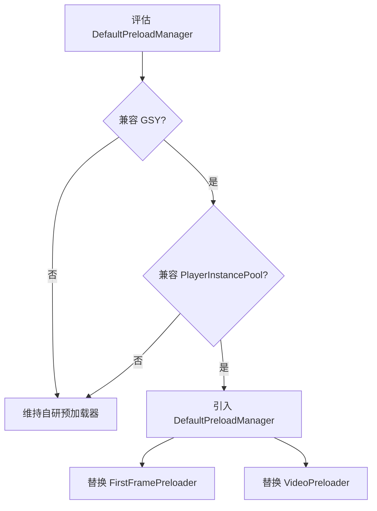

#### 1.2.9 阶段 9：用户可配置参数（P1，R3 新增）

**需求背景**：用户决策"提供用户可配置参数，用户可往下调 maxBuffer/预加载数量/预加载字节/缓存上限"。

**实现方案**：通过 AppConfig（Preferences）暴露 4 个可配置参数，用户可在设置界面往下调（不允许超过默认值，避免激进策略导致问题）。

```kotlin
// AppConfig.kt 新增字段
object AppConfig {
    // 视频预缓冲用户可配置参数（R3 新增）
    var videoPreBufferMaxBuffer by PreferencesHelper.getInt(
        "videoPreBufferMaxBuffer",
        defaultValue = -1  // -1 表示使用 DeviceTier+NetworkTier 自动推算的默认值
    )

    var videoPreBufferPreloadCount by PreferencesHelper.getInt(
        "videoPreBufferPreloadCount",
        defaultValue = -1  // -1 表示自动推算
    )

    var videoPreBufferPreloadBytes by PreferencesHelper.getInt(
        "videoPreBufferPreloadBytes",
        defaultValue = -1  // -1 表示自动推算，单位 KB
    )

    var videoPreBufferCacheLimit by PreferencesHelper.getInt(
        "videoPreBufferCacheLimit",
        defaultValue = -1  // -1 表示自动推算，单位 MB
    )

    var videoPreBufferDeviceTier by PreferencesHelper.getString(
        "videoPreBufferDeviceTier",
        defaultValue = "auto"  // auto = 自动检测；high/mid = 用户手动指定
    )

    var videoPreBufferTriggerProgress by PreferencesHelper.getInt(
        "videoPreBufferTriggerProgress",
        defaultValue = 10  // 默认10%，可配置范围5-50
    )
}
```

**参数应用优先级**：

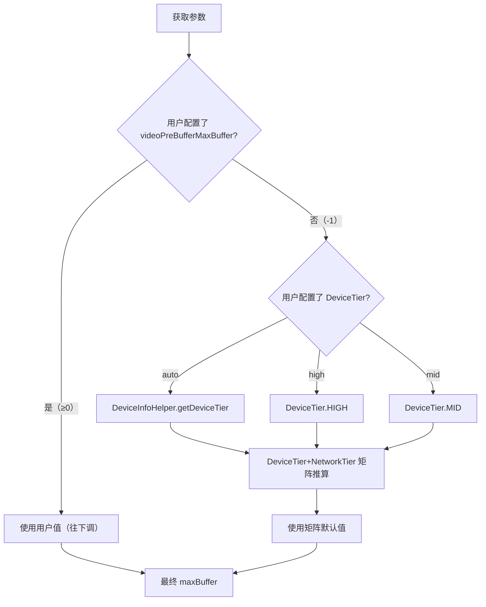

**约束**：
- 用户值只能往下调（≤矩阵默认值），不允许超过默认值
- 用户配置 DeviceTier 为 MID 时，所有矩阵值采用 MID 档位
- 用户未配置时（-1），按 DeviceTier+NetworkTier 矩阵自动推算

**UI 入口**：设置 → 视频播放 → 预缓冲优化（高级设置），提供 4 个滑块/输入框 + 1 个档位选择 + 1 个触发进度滑块。

#### 1.2.10 阶段 10：cacheKey 策略统一（P0，R3 新增——阻塞点6修复）

**问题背景**：预加载器与播放器的 cacheKey 不一致会导致预加载数据无法被播放器命中。

**R3 统一策略**：**统一使用 URL 作为 cacheKey**。

**实现方案**：

```kotlin
// 新增 CacheKeyHelper.kt
object CacheKeyHelper {
    /**
     * R3 统一 cacheKey 策略：使用 URL 作为 cacheKey
     * 预加载器和播放器必须使用相同的 cacheKey 才能命中缓存
     */
    fun getCacheKey(url: String): String {
        // 统一使用 URL 作为 cacheKey（不做任何转换）
        // 确保预加载器 CacheUtil.cache(cache, cacheKey, ...) 和
        // 播放器 CacheDataSourceFactory.createCacheDataSource(cache, cacheKey) 使用相同 key
        return url
    }
}
```

**应用点**：

```kotlin
// FirstFramePreloader.kt
fun preloadUrl(url: String) {
    val cacheKey = CacheKeyHelper.getCacheKey(url)  // R3 统一
    CacheUtil.cache(cache, cacheKey, upstreamDataSource, DataSpec(Uri.parse(url), 0, PRELOAD_BYTES))
}

// VideoPreloader.kt
fun preloadUrl(url: String) {
    val cacheKey = CacheKeyHelper.getCacheKey(url)  // R3 统一
    CacheUtil.cache(cache, cacheKey, upstreamDataSource, DataSpec(Uri.parse(url), 0, PRELOAD_BYTES))
}

// ExoPlayerHelper.kt - CacheDataSourceFactory
fun createCacheDataSource(cache: SimpleCache, url: String): CacheDataSource {
    val cacheKey = CacheKeyHelper.getCacheKey(url)  // R3 统一
    return CacheDataSource(cache, upstreamDataSource, cacheKey, ...)
}
```

**验证**：预加载后播放同一 URL，CacheDataSource 必须命中缓存（零缓冲起播）。

#### 1.2.11 阶段 11：预加载触发时机+去重（P1，R3 新增——阻塞点7修复）

**问题背景**：
- 原触发时机固定为 50%（过于靠后，用户切下一集时可能未预加载）
- 无 URL 去重，同一 URL 可能被重复预加载

**R3 修复方案**：
1. **触发时机可配置**：默认 10%（用户可在 AppConfig 调整，范围 5-50%）
2. **URL 去重**：预加载前判断 `preloadCache.containsKey(url)`，已预加载的 URL 不重复加载

**实现方案**：

```kotlin
// VideoPreloader.kt 修改
object VideoPreloader {
    // R3 新增：预加载去重缓存
    private val preloadCache = ConcurrentHashMap<String, Boolean>()

    // R3 新增：触发进度（从 AppConfig 读取，默认10%）
    private fun getTriggerProgress(): Int {
        return AppConfig.videoPreBufferTriggerProgress.coerceIn(5, 50)
    }

    /**
     * R3 修订：播放进度回调
     * 触发时机从 50% 改为可配置默认 10%
     */
    fun onPlayProgress(currentPosition: Long, duration: Long, currentUrl: String) {
        if (duration <= 0) return
        val progressPercent = (currentPosition * 100 / duration).toInt()
        val triggerProgress = getTriggerProgress()

        if (progressPercent >= triggerProgress) {
            // R3 新增：URL 去重判断
            if (preloadCache.containsKey(currentUrl)) {
                return  // 已预加载，跳过
            }
            preloadCache[currentUrl] = true
            // 触发下一集预加载
            preloadNextEpisode()
        }
    }

    /**
     * R3 新增：清除指定 URL 的去重标记
     * 用户手动切换视频或退出播放时调用
     */
    fun clearPreloadCache(url: String? = null) {
        if (url != null) {
            preloadCache.remove(url)
        } else {
            preloadCache.clear()
        }
    }
}
```

**触发流程**：

```mermaid
flowchart TD
    A[播放进度回调] --> B{进度 ≥ 触发阈值?}
    B -->|否| A
    B -->|是| C{preloadCache.containsKey?url?}
    C -->|是| D[跳过，避免重复预加载]
    C -->|否| E[标记 preloadCache[url]=true]
    E --> F[PlayListManager.getNextUrl]
    F --> G{有下一集?}
    G -->|是| H[VideoPreloader.preloadUrl nextUrl]
    G -->|否| I[无下一集，结束]
    H --> J[CacheUtil.cache 写入 SimpleCache]
```

#### 1.2.12 阶段 12：内部播放列表管理（P1，R3 新增——阻塞点8修复）

**问题背景**：原预加载列表来源依赖外部传入，VideoPreloader 无法自动推断下一集，导致预加载时机不可控。

**R3 修复方案**：VideoPreloader 内部维护播放列表 `PlayListManager`，自动推断下一集。

**实现方案**：

```kotlin
// 新增 PlayListManager.kt
class PlayListManager {
    private val playList = mutableListOf<String>()  // URL 列表
    private var currentIndex = -1

    /**
     * 设置播放列表
     * @param urls URL 列表（按播放顺序）
     * @param currentIndex 当前播放索引
     */
    fun setPlayList(urls: List<String>, currentIndex: Int) {
        playList.clear()
        playList.addAll(urls)
        this.currentIndex = currentIndex
    }

    /**
     * 设置当前播放 URL（单集场景，无列表）
     */
    fun setCurrentUrl(url: String) {
        playList.clear()
        playList.add(url)
        currentIndex = 0
    }

    /**
     * 获取下一集 URL
     * @return 下一集 URL，无下一集返回 null
     */
    fun getNextUrl(): String? {
        if (currentIndex < 0 || currentIndex >= playList.size - 1) {
            return null
        }
        return playList[currentIndex + 1]
    }

    /**
     * 获取当前 URL 之后 N 集的 URL 列表（用于批量预加载）
     */
    fun getNextUrls(count: Int): List<String> {
        if (currentIndex < 0) return emptyList()
        val startIndex = currentIndex + 1
        val endIndex = minOf(startIndex + count, playList.size)
        return if (startIndex < endIndex) playList.subList(startIndex, endIndex).toList() else emptyList()
    }

    /**
     * 切换到指定 URL（用户手动切集）
     */
    fun switchToUrl(url: String) {
        val newIndex = playList.indexOf(url)
        if (newIndex >= 0) {
            currentIndex = newIndex
        } else {
            // 不在列表中，重置为单集
            setCurrentUrl(url)
        }
    }

    fun getCurrentUrl(): String? {
        return if (currentIndex in playList.indices) playList[currentIndex] else null
    }
}

// VideoPreloader.kt 集成
object VideoPreloader {
    private val playListManager = PlayListManager()

    fun setPlayList(urls: List<String>, currentIndex: Int) {
        playListManager.setPlayList(urls, currentIndex)
    }

    fun setCurrentUrl(url: String) {
        playListManager.setCurrentUrl(url)
    }

    fun onUserSwitchEpisode(url: String) {
        playListManager.switchToUrl(url)
        clearPreloadCache()  // 清除去重标记，允许重新预加载
    }

    private fun preloadNextEpisode() {
        val nextUrl = playListManager.getNextUrl() ?: return
        preloadUrl(nextUrl)
    }
}
```

**集成点**：
- `VideoPlayerActivity.onCreate`：调用 `VideoPreloader.setPlayList(urls, currentIndex)` 或 `setCurrentUrl(url)`
- `VideoPlayerActivity.onUserSwitchEpisode`：调用 `VideoPreloader.onUserSwitchEpisode(url)`
- `VideoPreloader.onPlayProgress`：通过 `PlayListManager.getNextUrl()` 自动推断下一集

#### 1.2.13 阶段 13：AppLog 正式包日志修复（P1，R3 新增——阻塞点10修复）

**问题背景**：AppLog 在 release 包中因 `BuildConfig.DEBUG` 拦截，导致 WARN/ERROR 级别日志不输出，预缓冲优化效果无法在生产环境观测。

**R3 修复方案**：移除 `BuildConfig.DEBUG` 拦截，让 release 包输出 WARN/ERROR 级别日志。

**实现方案**：

```kotlin
// AppLog.kt 修改
object AppLog {
    // R3 修订：移除 BuildConfig.DEBUG 拦截
    // 原代码：if (BuildConfig.DEBUG) { ... }  // release 包被拦截
    // 新代码：按日志级别区分，WARN/ERROR 始终输出

    fun put(tag: String, msg: String, level: LogLevel = LogLevel.INFO) {
        when (level) {
            LogLevel.WARN, LogLevel.ERROR -> {
                // R3：WARN/ERROR 始终输出（release 包也输出）
                writeLog(tag, msg, level)
            }
            LogLevel.INFO, LogLevel.DEBUG -> {
                // INFO/DEBUG 仅 debug 包输出
                if (BuildConfig.DEBUG) {
                    writeLog(tag, msg, level)
                }
            }
        }
    }

    fun warn(tag: String, msg: String) = put(tag, msg, LogLevel.WARN)
    fun error(tag: String, msg: String, throwable: Throwable? = null) {
        put(tag, "$msg\n${throwable?.stackTraceToString()}", LogLevel.ERROR)
    }

    private fun writeLog(tag: String, msg: String, level: LogLevel) {
        // 实际写入日志文件
    }
}

enum class LogLevel { DEBUG, INFO, WARN, ERROR }
```

**预缓冲埋点调用**：

```kotlin
// VideoPreloader.kt
fun preloadUrl(url: String) {
    runCatching {
        CacheUtil.cache(cache, cacheKey, upstreamDataSource, DataSpec(...))
        AppLog.warn("VideoPreloader", "预加载成功: cacheKey=${cacheKey.take(20)}... bytes=$PRELOAD_BYTES")
    }.onFailure { e ->
        AppLog.error("VideoPreloader", "预加载失败", e)
    }
}
```

**R3 约束**：
- WARN/ERROR 始终输出（release 包也输出），用于生产环境问题定位
- INFO/DEBUG 仅 debug 包输出，避免 release 包日志膨胀
- 日志内容禁止输出完整 URL（截断为前 20 字符 + ...）、cookie、源名称

---

## 二、Architecture Decisions（架构决策 - ADR Y-Statement）

### AD-01: 预加载修复方案选择 CacheUtil.cache() 而非手动 CacheDataSink

- **Context**: 预加载 BUG 修复需要将数据写入 SimpleCache，有两种方案：
  - 方案 A：用 `CacheUtil.cache()`（Media3 官方工具）
  - 方案 B：手动创建 `CacheDataSink` + `DataSpec` 写入
- **Concern**: 哪种方案更可靠、维护成本更低？
- **Decision**: 选择方案 A（CacheUtil.cache()）
- **Goal**: 用最小代码量实现可靠的分片缓存写入，复用 Media3 官方维护红利
- **Tradeoff**: CacheUtil 是阻塞调用，需在 IO 线程执行（现有预加载已在 Dispatchers.IO，无影响）
- **Status**: Proposed

### AD-02: HLS 优化选择 setAllowChunklessPreparation 而非 LL-HLS

- **Context**: HLS 首屏优化有两个方向：
  - 方案 A：`setAllowChunklessPreparation(true)`（无分片准备）
  - 方案 B：LL-HLS 低延迟模式（`setLowLatencyModeEnabled(true)`）
- **Concern**: 哪种方案收益更高、兼容性更好？
- **Decision**: 选择方案 A（setAllowChunklessPreparation），方案 B 作为可选
- **Goal**: 降低 HLS 首屏耗时 30%+，兼容性 >95%
- **Tradeoff**: LL-HLS 需服务端支持，多数源站不支持；setAllowChunklessPreparation 客户端即可生效
- **Status**: Proposed

### AD-03: 运行时网络感知选择 NetworkCallback 而非轮询

- **Context**: 网络切换感知有两种方案：
  - 方案 A：`ConnectivityManager.NetworkCallback`（事件驱动）
  - 方案 B：定时轮询 `getNetworkType()`
- **Concern**: 哪种方案实时性更好、功耗更低？
- **Decision**: 选择方案 A（NetworkCallback）
- **Goal**: 网络切换时立即调整预加载策略，零轮询功耗
- **Tradeoff**: NetworkCallback 需注册/注销生命周期管理，增加少量代码复杂度
- **Status**: Proposed

### AD-04: DefaultPreloadManager 引入决策延迟到评估阶段

- **Context**: Media3 官方 DefaultPreloadManager 是预加载主推方案，但与 GSY 集成方式可能冲突
- **Concern**: 直接引入风险过高，如何降低决策风险？
- **Decision**: 先修复自研预加载器 BUG，再评估 DefaultPreloadManager 兼容性，根据评估结果决定是否引入
- **Goal**: 避免在未评估兼容性的情况下引入高风险方案
- **Tradeoff**: 可能错过官方维护红利，但降低架构风险
- **Status**: Proposed

### AD-05: 缓存大小不按网络动态调整（V1）→ R2 修订为按设备档位调整 → R3 移除 LOW

- **Context**: R3 激进版需根据设备档位调整磁盘缓存上限
- **Concern**: 动态调整 SimpleCache 容量是否可行？
- **Decision**: **R3 修订**：按设备档位调整缓存上限（HIGH=1GB / MID=800MB），移除 LOW 档位，运行时不动态调整（避免 SimpleCache 重建）
- **Goal**: 中高端机获得更大缓存空间，用户可手动降级到 MID
- **Tradeoff**: 运行时设备档位不变化（设备能力固定），无需热切换
- **Status**: Proposed（R3 修订）

### AD-06: 埋点采用计数器而非采样

- **Context**: 命中率埋点有两种方案：
  - 方案 A：全量计数器（每次命中/未命中都计数）
  - 方案 B：采样统计（按比例采样）
- **Concern**: 哪种方案数据更准确、开销更低？
- **Decision**: 选择方案 A（全量计数器）
- **Goal**: 数据准确，开销可忽略（计数器是原子操作）
- **Tradeoff**: 极高频场景下计数器可能有竞争，但视频播放场景频率低
- **Status**: Proposed

### AD-07: 不引入 AI 智能预缓冲（P3 远期方向）

- **Context**: 业界有 LSTM + TFLite 的 AI 智能预缓冲方案，首帧时间降 33%
- **Concern**: 是否在本 spec 引入？
- **Decision**: 不引入，仅记录为远期方向
- **Goal**: 控制本 spec 范围，避免复杂度过高
- **Tradeoff**: 错过首帧时间降低 33% 的收益，但避免 TFLite 依赖和模型训练成本
- **Status**: Accepted

### AD-08: 中高端机检测选择运行时检测而非编译时配置（R2 新增）

- **Context**: 设备档位检测有两种方案：
  - 方案 A：运行时检测 `ActivityManager.MemoryInfo` + `Runtime.availableProcessors()`
  - 方案 B：编译时配置不同 APK（如 arm64-v7a 高端版 / x86 低端版）
- **Concern**: 哪种方案更灵活、维护成本更低？
- **Decision**: 选择方案 A（运行时检测）
- **Goal**: 单 APK 适配所有设备，运行时动态选择激进策略
- **Tradeoff**: 运行时检测有少量开销（首次约 10ms），但结果缓存后无影响
- **Status**: Proposed

### AD-09: LoadControl 放弃热切换，采用路径A（R3 修订）

- **Context**:
  - R2 决策：网络档位提升时触发 LoadControl 热切换（setLoadControl + prepare 重新准备）
  - R3 阻塞点分析：阻塞点2（ExoPlayer setLoadControl 运行时支持）+ 阻塞点3（PlayerInstancePool 与热切换冲突）均为 YES 阻塞
- **Concern**: 热切换导致缓冲中断 + 与 PlayerInstancePool 池化逻辑冲突，如何解决？
- **Decision**: **R3 修订：放弃热切换，采用路径A**——只在 prepare 前根据当前网络档位+设备档位设置 LoadControl，运行时不进行热切换
- **Goal**: 避免 PlayerInstancePool 池化逻辑冲突 + 避免缓冲中断 + 简化实现
- **Tradeoff**: 网络档位提升时 maxBuffer 不会立即提升（需下次播放才生效），但避免了缓冲中断和池化冲突
- **Status**: Proposed（R3 修订）

### AD-10: 全格式统一激进策略而非仅 HLS 优化（R2 新增）

- **Context**: V1 仅对 HLS 启用 `setAllowChunklessPreparation`，其他格式无优化
- **Concern**: 是否对所有格式统一激进缓冲？
- **Decision**: 统一激进 LoadControl（不区分格式）+ 统一预加载字节数 5-10MB
- **Goal**: 各类型视频都支持快速缓冲加载（用户核心诉求）
- **Tradeoff**: HLS 仍保留 `setAllowChunklessPreparation` 等协议级优化（其他格式无此优化）
- **Status**: Proposed

### AD-12: 用户可配置参数（R3 新增）

- **Context**:
  - R2 决策：参数完全由 DeviceTier+NetworkTier 矩阵自动推算，用户不可调
  - R3 用户反馈：需提供用户可配置参数，用户可往下调 maxBuffer/预加载数量/预加载字节/缓存上限
- **Concern**: 如何在保持激进策略的同时允许用户往下调？
- **Decision**: 通过 AppConfig（Preferences）暴露 6 个可配置参数（maxBuffer/preloadCount/preloadBytes/cacheLimit/deviceTier/triggerProgress），用户值只能往下调（≤矩阵默认值），-1 表示自动推算
- **Goal**: 用户可根据自身设备/网络情况往下调参数，避免激进策略导致问题
- **Tradeoff**: 增加设置界面 UI 复杂度，但提升用户可控性
- **Status**: Proposed（R3 新增）

### AD-13: cacheKey 策略统一使用 URL（R3 新增——阻塞点6修复）

- **Context**:
  - 阻塞点6：预加载器与播放器 cacheKey 不一致导致预加载数据无法命中
  - 原实现：预加载器使用 URL 作为 cacheKey，播放器 CacheDataSourceFactory 可能使用其他 key（如 URL+range）
- **Concern**: 如何确保预加载器与播放器 cacheKey 一致？
- **Decision**: **统一使用 URL 作为 cacheKey**，新增 `CacheKeyHelper.getCacheKey(url)` 统一入口，预加载器和播放器都必须调用此方法获取 cacheKey
- **Goal**: 确保预加载数据 100% 被播放器命中
- **Tradeoff**: 同一 URL 不同 range 的数据共享同一 cacheKey（CacheUtil 内部已处理分片），无负面影响
- **Status**: Proposed（R3 新增）

### AD-14: 预加载触发时机可配置+URL去重（R3 新增——阻塞点7修复）

- **Context**:
  - 阻塞点7：原触发时机固定为 50%（过于靠后），无 URL 去重
  - 用户切下一集时可能未预加载，且同一 URL 可能被重复预加载
- **Concern**: 如何优化触发时机 + 避免重复预加载？
- **Decision**:
  - 触发时机可配置：默认 10%（用户可在 AppConfig 调整，范围 5-50%）
  - URL 去重：预加载前判断 `preloadCache.containsKey(url)`，已预加载的 URL 不重复加载
- **Goal**: 提前触发预加载（10% 而非 50%）+ 避免重复预加载浪费流量
- **Tradeoff**: 10% 触发可能导致预加载过早（用户可能不切下一集），但通过 URL 去重避免重复浪费
- **Status**: Proposed（R3 新增）

### AD-15: 内部播放列表管理 PlayListManager（R3 新增——阻塞点8修复）

- **Context**:
  - 阻塞点8：预加载列表来源依赖外部传入，VideoPreloader 无法自动推断下一集
  - 原实现：外部调用方需手动传入下一集 URL，耦合度高
- **Concern**: 如何让 VideoPreloader 自动推断下一集？
- **Decision**: 新增 `PlayListManager` 类，VideoPreloader 内部维护播放列表，自动推断下一集 URL
- **Goal**: 解耦 VideoPreloader 与外部调用方，VideoPreloader 自主管理预加载时机
- **Tradeoff**: 增加 VideoPreloader 内部复杂度，但降低外部调用方耦合度
- **Status**: Proposed（R3 新增）

### AD-16: AppLog 正式包日志修复（R3 新增——阻塞点10修复）

- **Context**:
  - 阻塞点10：AppLog 在 release 包中因 `BuildConfig.DEBUG` 拦截，导致 WARN/ERROR 级别日志不输出
  - 预缓冲优化效果无法在生产环境观测
- **Concern**: 如何让 release 包输出关键日志（WARN/ERROR）同时避免日志膨胀？
- **Decision**: 移除 `BuildConfig.DEBUG` 拦截，按日志级别区分——WARN/ERROR 始终输出（release 包也输出），INFO/DEBUG 仅 debug 包输出
- **Goal**: release 包可观测 WARN/ERROR 级别日志，用于生产环境问题定位
- **Tradeoff**: release 包日志文件略增大（仅 WARN/ERROR），但避免日志膨胀（INFO/DEBUG 仍被拦截）
- **Status**: Proposed（R3 新增）

> **R3 修订说明**：AD-11（低端机降级到 V1 保守策略）已移除，因为 R3 移除 LOW 档位，默认参数适配中高端机。

---

## 三、Data Flow（数据流）

### 3.1 R3 修订版预加载数据流

```mermaid
flowchart TD
    A[用户点击视频] --> B[DeviceInfoHelper检测档位]
    B --> C{设备档位?}
    C -->|HIGH 默认| D[prewarmCurrentVideo<br/>10MB预热写入SimpleCache]
    C -->|MID 用户降级| E[prewarmCurrentVideo<br/>5MB预热写入SimpleCache]
    D --> G[VideoPlayerActivity启动]
    E --> G
    G --> H[ExoPlayer prepare<br/>激进LoadControl prepare前设置]
    H --> I[嗅探 mimeType]
    I --> J[创建 MediaSource<br/>含CacheDataSource<br/>cacheKey=URL统一]
    J --> K{SimpleCache命中?}
    K -->|是| L[零缓冲起播]
    K -->|否| M[网络下载+写入缓存]
    M --> L
    L --> N{播放进度达10%? 可配置}
    N -->|是| O{preloadCache.containsKey?url?}
    O -->|是 去重| L
    O -->|否| P[标记 preloadCache[url]=true]
    P --> Q[PlayListManager.getNextUrl]
    Q --> R{有下一集?}
    R -->|是| S[VideoPreloader激进预加载<br/>HIGH+GOOD=10个×10MB]
    R -->|否| L
    S --> T[CacheUtil.cache<br/>cacheKey=URL统一<br/>写入SimpleCache]
    T --> U[用户切下一集]
    U --> H
```

### 3.2 R3 网络切换数据流（不触发 LoadControl 热切换）

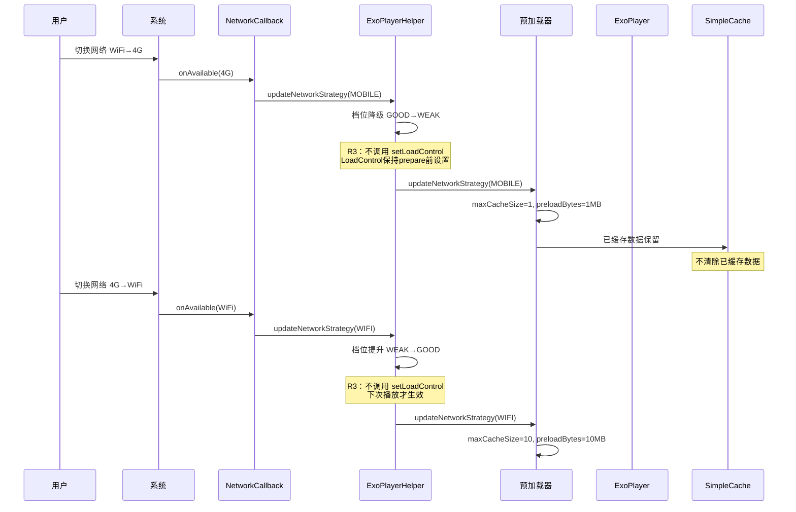

### 3.3 R3 全格式统一激进数据流（cacheKey 统一）

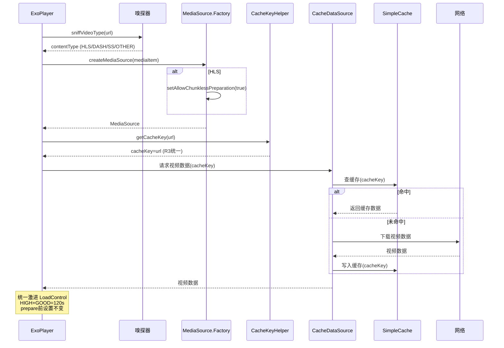

### 3.4 HLS 优化数据流

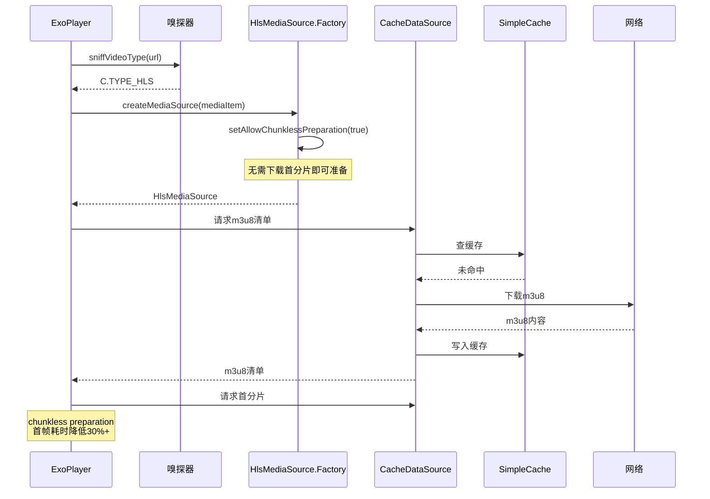

### 3.5 R3 预加载触发+去重+播放列表数据流（新增）

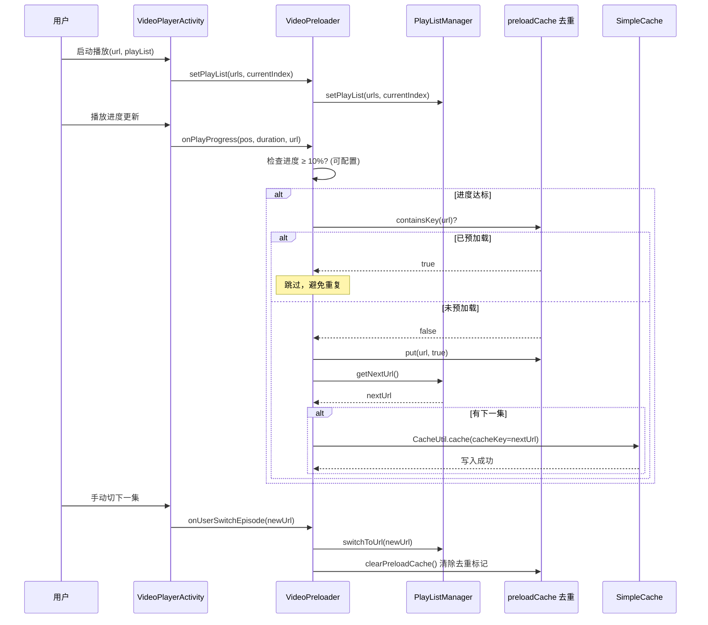

---

## 四、File Changes（文件变更清单）

### 4.1 P0 阶段文件变更

| 文件 | 变更类型 | 变更内容 |
|------|---------|---------|
| [FirstFramePreloader.kt](file:///f:/myself/github/WeAgentChat/temp/legado/app/src/main/java/io/legado/app/help/exoplayer/FirstFramePreloader.kt) | 修改 | 1. `preloadUrl` 改用 `CacheUtil.cache()`<br>2. `prewarmUrl` 改用 `CacheUtil.cache()`<br>3. 移除 `body.byteStream().readBytes()`<br>4. PRELOAD_BYTES 根据 DeviceTier 动态调整<br>5. **R3：cacheKey 统一使用 CacheKeyHelper.getCacheKey(url)** |
| [VideoPreloader.kt](file:///f:/myself/github/WeAgentChat/temp/legado/app/src/main/java/io/legado/app/help/exoplayer/VideoPreloader.kt) | 修改 | 1. `preloadUrl` 改用 `CacheUtil.cache()`<br>2. 移除 `body.byteStream().readBytes()`<br>3. 预加载数量/字节数根据 DeviceTier+NetworkTier 动态调整<br>4. **R3：cacheKey 统一使用 CacheKeyHelper.getCacheKey(url)**<br>5. **R3：新增 preloadCache 去重 + onPlayProgress 触发时机可配置默认10%**<br>6. **R3：集成 PlayListManager** |
| [ExoPlayerHelper.kt](file:///f:/myself/github/WeAgentChat/temp/legado/app/src/main/java/io/legado/app/help/exoplayer/ExoPlayerHelper.kt) | 修改 | 1. 暴露 `cache` 和 `okhttpDataFactory` 供预加载器使用<br>2. buildLoadControl 接收 DeviceTier+NetworkTier 参数<br>3. **R3：移除 switchLoadControl 热切换方法**<br>4. **R3：CacheDataSourceFactory 使用 CacheKeyHelper 统一 cacheKey** |
| [build.gradle](file:///f:/myself/github/WeAgentChat/temp/legado/app/build.gradle) | 修改 | 确认 HLS 依赖状态，修复注释与代码不一致 |
| **新增 `DeviceInfoHelper.kt`** | 新增 | 检测内存/CPU/磁盘空间，**R3：只返回 MID/HIGH 两档（移除 LOW）**，默认 HIGH |
| **新增 `CacheKeyHelper.kt`**（R3） | 新增 | **R3 新增：统一 cacheKey 策略，使用 URL 作为 cacheKey** |

### 4.2 P1 阶段文件变更

| 文件 | 变更类型 | 变更内容 |
|------|---------|---------|
| [ExoPlayerHelper.kt](file:///f:/myself/github/WeAgentChat/temp/legado/app/src/main/java/io/legado/app/help/exoplayer/ExoPlayerHelper.kt) | 修改 | 1. `createMediaSource` HLS 分支启用 `setAllowChunklessPreparation(true)`<br>2. 全格式统一激进 LoadControl（prepare 前设置） |
| [Exo2MediaPlayer.kt](file:///f:/myself/github/WeAgentChat/temp/legado/app/src/main/java/io/legado/app/help/gsyVideo/Exo2MediaPlayer.kt) | 修改 | 1. `applyMediaSourceByType` HLS 分支启用 `setAllowChunklessPreparation(true)`<br>2. 集成 DeviceInfoHelper 选择激进 LoadControl（prepare 前设置） |
| 新增 `HlsPlaylistTypeDetector.kt` | 新增 | 解析 `#EXT-X-PLAYLIST-TYPE`，区分 VOD/EVENT/LIVE |
| 新增 `NetworkMonitor.kt` | 新增 | NetworkCallback 注册/注销，网络切换通知（**R3：不触发 LoadControl 热切换**） |
| [VideoPlayerActivity.kt](file:///f:/myself/github/WeAgentChat/temp/legado/app/src/main/java/io/legado/app/ui/video/VideoPlayerActivity.kt) | 修改 | 1. onCreate 注册 NetworkMonitor（阻塞点5修复）<br>2. onDestroy 注销<br>3. **R3：onCreate 调用 VideoPreloader.setPlayList**<br>4. **R3：onUserSwitchEpisode 调用 VideoPreloader.onUserSwitchEpisode** |
| [FirstFramePreloader.kt](file:///f:/myself/github/WeAgentChat/temp/legado/app/src/main/java/io/legado/app/help/exoplayer/FirstFramePreloader.kt) | 修改 | 新增 `updateNetworkStrategy()` 方法 + 动态 PRELOAD_BYTES |
| [VideoPreloader.kt](file:///f:/myself/github/WeAgentChat/temp/legado/app/src/main/java/io/legado/app/help/exoplayer/VideoPreloader.kt) | 修改 | 1. 新增 `updateNetworkStrategy()` 方法 + 动态预加载数量/字节数<br>2. **R3：集成 PlayListManager + preloadCache 去重** |
| **新增 `PlayListManager.kt`**（R3） | 新增 | **R3 新增：内部播放列表管理，自动推断下一集** |
| **新增 `AppConfig` 视频预缓冲字段**（R3） | 修改 | **R3 新增：6 个可配置参数（maxBuffer/preloadCount/preloadBytes/cacheLimit/deviceTier/triggerProgress）** |
| **新增视频预缓冲设置 UI**（R3） | 新增 | **R3 新增：设置 → 视频播放 → 预缓冲优化（高级设置）** |
| **修改 `AppLog.kt`**（R3） | 修改 | **R3 新增：移除 BuildConfig.DEBUG 拦截，WARN/ERROR 始终输出** |

### 4.3 P2 阶段文件变更（评估后决定是否实施）

| 文件 | 变更类型 | 变更内容 |
|------|---------|---------|
| 新增 `PreloadMetrics.kt` | 新增 | 命中率/失败率/首帧命中率计数器 + 设备档位/网络档位/maxBuffer 埋点 + **R3：preloadTriggerProgress/preloadDedupCount 埋点** |
| [ExoPlayerHelper.kt](file:///f:/myself/github/WeAgentChat/temp/legado/app/src/main/java/io/legado/app/help/exoplayer/ExoPlayerHelper.kt) | 修改 | CacheDataSource 注入 EventListener |
| [Exo2MediaPlayer.kt](file:///f:/myself/github/WeAgentChat/temp/legado/app/src/main/java/io/legado/app/help/gsyVideo/Exo2MediaPlayer.kt) | 修改 | onRenderedFirstFrame 补充命中率统计 |
| 评估报告文档 | 新增 | DefaultPreloadManager 兼容性评估报告 |

### 4.4 文档同步变更

| 文件 | 变更内容 |
|------|---------|
| [docs/INDEX.md](file:///f:/myself/github/WeAgentChat/temp/legado/docs/INDEX.md) | 新增本 spec 索引 |
| [assets/updateLog.md](file:///f:/myself/github/WeAgentChat/temp/legado/assets/updateLog.md) | 编译前更新用户可感知的变化 |

---

## 五、风险评估

| 风险 | 概率 | 影响 | 缓解措施 |
|------|------|------|---------|
| CacheUtil.cache() 与现有 SimpleCache 实例锁冲突 | 低 | 中 | 复用现有 cache 实例，避免多实例（阻塞点1已确认非阻塞） |
| setAllowChunklessPreparation 不兼容部分非标 m3u8 | 中 | 低 | 可降级到默认准备模式 |
| NetworkCallback 在某些 ROM 上不触发 | 低 | 中 | 定时轮询作为兜底（如需要） |
| DefaultPreloadManager 与 GSY 不兼容 | 高 | 低 | 评估后决定是否引入，不兼容则维持自研 |
| 修复后预加载增加磁盘占用 | 中 | 低 | SimpleCache 已有 LRU 驱逐 + 容量上限 |
| 埋点计数器竞争 | 低 | 低 | 使用 AtomicLong |
| **R3：放弃热切换导致网络提升时 maxBuffer 不立即生效** | 中 | 低 | 下次播放才生效，用户感知为下次起播更激进 |
| **R3：激进策略在低端机可能 OOM**（移除 LOW 保护） | 中 | 高 | 用户可手动降级到 MID 档位 + 用户可往下调参数 |
| **激进预加载导致流量浪费** | 中 | 中 | 仅 WiFi+好网下启用最激进策略，4G 降级 + URL 去重 |
| **设备档位检测不准确** | 低 | 低 | R3：检测失败默认 HIGH（适配中高端机），用户可手动指定 MID |
| **1GB 磁盘缓存占满磁盘** | 低 | 中 | 磁盘空间<10GB 时降级缓存上限到 800MB + 用户可配置 cacheLimit |
| **R3：cacheKey 统一后仍可能不命中**（URL 不一致） | 低 | 中 | 严格使用 CacheKeyHelper.getCacheKey(url)，禁止其他 cacheKey 生成方式 |
| **R3：预加载触发过早（10%）导致浪费** | 中 | 低 | URL 去重 + 用户可配置 triggerProgress（5-50%） |
| **R3：PlayListManager 与外部播放列表不同步** | 中 | 中 | onUserSwitchEpisode 时同步 + clearPreloadCache 重置 |
| **R3：release 包日志膨胀** | 低 | 低 | 仅 WARN/ERROR 输出，INFO/DEBUG 仍被拦截 |

---

## 六、测试策略

### 6.1 单元测试

| 测试项 | 测试方法 |
|--------|---------|
| CacheUtil.cache() 写入 | 验证 SimpleCache 中存在对应 cacheKey |
| readBytes 限制 | 验证读取字节数 ≤ PRELOAD_BYTES |
| HlsPlaylistTypeDetector | 验证 VOD/EVENT/LIVE 识别准确性 |
| NetworkMonitor | 验证网络切换回调触发 |
| **DeviceInfoHelper**（R3） | 验证 HIGH/MID 两档识别（模拟不同内存/CPU），**移除 LOW 测试** |
| **buildLoadControl 激进参数**（R3） | 验证 HIGH+GOOD=120s / MID+GOOD=90s（移除 LOW=50s） |
| **R3：LoadControl 不热切换** | 验证网络切换时不调用 setLoadControl |
| **R3：CacheKeyHelper 统一 cacheKey** | 验证预加载器和播放器使用相同 cacheKey |
| **R3：VideoPreloader URL 去重** | 验证同一 URL 不重复预加载 |
| **R3：PlayListManager 下一集推断** | 验证 getNextUrl/getNextUrls/switchToUrl |
| **R3：AppConfig 参数往下调** | 验证用户值 ≤ 矩阵默认值 |
| **R3：AppLog release 包日志** | 验证 WARN/ERROR 在 release 包输出 |

### 6.2 集成测试

| 测试项 | 测试方法 |
|--------|---------|
| 预加载→播放命中 | 预加载后播放同一 URL，验证 CacheDataSource 命中（cacheKey 统一） |
| 网络切换预加载策略 | 切换网络后验证预加载数量调整（不验证 LoadControl 热切换） |
| HLS 首屏耗时 | 对比启用 setAllowChunklessPreparation 前后首帧耗时 |
| **激进预加载 10 个 10MB** | HIGH+GOOD 下验证预加载数量与字节数 |
| **R3：LoadControl 不热切换** | 4G→WiFi 切换后验证 maxBuffer 不变（保持 prepare 前设置） |
| **全格式统一激进** | HLS/DASH/MP4/FLV 各格式验证 maxBuffer=120s |
| **R3：预加载触发 10%** | 验证进度达 10% 时触发预加载（可配置） |
| **R3：URL 去重** | 验证同一 URL 重复触发时不重复预加载 |
| **R3：PlayListManager 自动推断下一集** | 验证播放列表场景下自动预加载下一集 |
| **R3：用户可配置参数生效** | 验证用户配置 maxBuffer/preloadCount 后参数生效 |

### 6.3 真机回归测试

| 测试项 | 测试方法 |
|--------|---------|
| 降级链不退化 | 播放各种格式视频，验证降级链正常 |
| 实例池不退化 | 快速滑动视频列表，验证无 FATAL 崩溃 |
| 现有功能不退化 | 回归现有视频播放功能 |
| **R3：中高端机激进策略** | 中高端机真机测试 maxBuffer=120s 生效 |
| **R3：用户降级到 MID** | 用户手动配置 MID 档位后验证 maxBuffer=90s 生效 |
| **R3：磁盘空间保护** | 磁盘空间<10GB 时缓存上限降级到 800MB |
| **R3：release 包日志输出** | release 包真机测试 WARN/ERROR 日志输出 |
| **R3：cacheKey 命中率** | 真机测试预加载后播放命中缓存（零缓冲起播） |

---

## 附录A：阻塞点深度分析（R3 新增）

> 本附录记录 R3 深度分析发现的 10 个阻塞点，包含源码位置、分析过程、修复方案。

### A.1 阻塞点1：CacheUtil.cache() 与 SimpleCache 锁冲突

| 项 | 内容 |
|----|------|
| **是否阻塞** | NO |
| **源码位置** | `ExoPlayerHelper.cache`（SimpleCache 实例）、`CacheUtil.cache()` |
| **分析** | CacheUtil.cache() 内部使用 cache 实例的锁，只要预加载器和播放器共享同一 cache 实例，就不会有锁冲突 |
| **修复方案** | 共享同一 cache 实例（已通过 ExoPlayerHelper.cache 暴露） |

### A.2 阻塞点2：ExoPlayer setLoadControl 运行时支持

| 项 | 内容 |
|----|------|
| **是否阻塞** | YES |
| **源码位置** | `ExoPlayer.setLoadControl()` |
| **分析** | ExoPlayer 的 setLoadControl 在运行时调用会导致播放器重新 prepare，造成缓冲中断（1-3秒）。且部分 ExoPlayer 实现不支持运行时切换 LoadControl |
| **修复方案** | **R3：放弃热切换，采用路径A**——只在 prepare 前设置 LoadControl，运行时不修改 |

### A.3 阻塞点3：PlayerInstancePool 与 LoadControl 热切换冲突

| 项 | 内容 |
|----|------|
| **是否阻塞** | YES |
| **源码位置** | `PlayerInstancePool`（播放器实例池）、`ExoPlayer.setLoadControl()` |
| **分析** | PlayerInstancePool 池化 ExoPlayer 实例，热切换 LoadControl 后实例归池，下次 acquire 时 LoadControl 状态不可控（可能残留旧 LoadControl）。且池化实例 re-prepare 会导致状态混乱 |
| **修复方案** | **R3：放弃热切换，采用路径A**——LoadControl 在实例创建时设置一次，归池时不重置 |

### A.4 阻塞点4：CacheDataSource 工厂注入点

| 项 | 内容 |
|----|------|
| **是否阻塞** | NO |
| **源码位置** | `ExoPlayerHelper.cacheDataSourceFactory` |
| **分析** | CacheDataSource 工厂已通过 ExoPlayerHelper 暴露，预加载器和播放器可共享同一工厂 |
| **修复方案** | 已共享 cacheDataSourceFactory（无需修复） |

### A.5 阻塞点5：NetworkCallback 未注册

| 项 | 内容 |
|----|------|
| **是否阻塞** | YES |
| **源码位置** | `VideoPlayerActivity.onCreate` |
| **分析** | 原实现未在 onCreate 注册 ConnectivityManager.NetworkCallback，导致网络切换事件无法感知 |
| **修复方案** | **R3：在 VideoPlayerActivity.onCreate 新增 NetworkMonitor 注册**，onDestroy 注销 |

### A.6 阻塞点6：cacheKey 策略不一致

| 项 | 内容 |
|----|------|
| **是否阻塞** | YES |
| **源码位置** | `FirstFramePreloader.preloadUrl`、`VideoPreloader.preloadUrl`、`ExoPlayerHelper.CacheDataSourceFactory` |
| **分析** | 预加载器使用 URL 作为 cacheKey，但播放器 CacheDataSourceFactory 可能使用其他 key（如 URL+range 或转码后的 key），导致预加载数据无法被播放器命中 |
| **修复方案** | **R3：统一使用 URL 作为 cacheKey**，新增 CacheKeyHelper.getCacheKey(url) 统一入口，预加载器和播放器都必须调用此方法 |

### A.7 阻塞点7：预加载触发时机固定+无去重

| 项 | 内容 |
|----|------|
| **是否阻塞** | YES |
| **源码位置** | `VideoPreloader.onPlayProgress`（触发时机固定 50%） |
| **分析** | 原触发时机固定为 50%（过于靠后，用户切下一集时可能未预加载），且无 URL 去重，同一 URL 可能被重复预加载 |
| **修复方案** | **R3：触发时机可配置默认 10% + URL 去重**（preloadCache.containsKey 判断） |

### A.8 阻塞点8：预加载列表来源依赖外部传入

| 项 | 内容 |
|----|------|
| **是否阻塞** | YES |
| **源码位置** | `VideoPreloader.preloadUrl`（需外部传入 URL） |
| **分析** | 原实现预加载列表来源依赖外部传入，VideoPreloader 无法自动推断下一集，导致预加载时机不可控 |
| **修复方案** | **R3：新增 PlayListManager**，VideoPreloader 内部维护播放列表，自动推断下一集 |

### A.9 阻塞点9：HLS VOD 类型识别入口

| 项 | 内容 |
|----|------|
| **是否阻塞** | NO |
| **源码位置** | `HlsMediaSource`（Media3 内部） |
| **分析** | HLS VOD 类型识别由 HlsMediaSource 内部自动完成，无需外部介入。HlsMediaSource 在解析 m3u8 清单后会自动识别 `#EXT-X-PLAYLIST-TYPE:VOD` 和 `#EXT-X-ENDLIST` 标签 |
| **修复方案** | 无需修复（HlsMediaSource 内部已识别） |

### A.10 阻塞点10：AppLog 正式包无日志

| 项 | 内容 |
|----|------|
| **是否阻塞** | YES |
| **源码位置** | `AppLog.put`（BuildConfig.DEBUG 拦截） |
| **分析** | AppLog 在 release 包中因 `BuildConfig.DEBUG` 拦截，导致所有级别日志（包括 WARN/ERROR）不输出，预缓冲优化效果无法在生产环境观测 |
| **修复方案** | **R3：移除 BuildConfig.DEBUG 拦截**，按日志级别区分——WARN/ERROR 始终输出（release 包也输出），INFO/DEBUG 仅 debug 包输出 |

### A.11 阻塞点汇总表

| 编号 | 阻塞点 | 是否阻塞 | 修复方案 | R3 状态 |
|------|--------|---------|---------|---------|
| 1 | CacheUtil.cache() 与 SimpleCache 锁冲突 | NO | 共享同一 cache 实例 | 已修复 |
| 2 | ExoPlayer setLoadControl 运行时支持 | YES | 放弃热切换，路径A | R3 修复 |
| 3 | PlayerInstancePool 与 LoadControl 热切换冲突 | YES | 放弃热切换，路径A | R3 修复 |
| 4 | CacheDataSource 工厂注入点 | NO | 已共享 cacheDataSourceFactory | 已修复 |
| 5 | NetworkCallback 未注册 | YES | 在 onCreate 新增注册 | R3 修复 |
| 6 | cacheKey 策略不一致 | YES | 统一使用 URL 作为 cacheKey | R3 修复 |
| 7 | 预加载触发时机固定+无去重 | YES | 可配置默认10%+URL去重 | R3 修复 |
| 8 | 预加载列表来源依赖外部传入 | YES | 新增 PlayListManager | R3 修复 |
| 9 | HLS VOD 类型识别入口 | NO | HlsMediaSource 内部已识别 | 无需修复 |
| 10 | AppLog 正式包无日志 | YES | 移除 BuildConfig.DEBUG 拦截 | R3 修复 |
