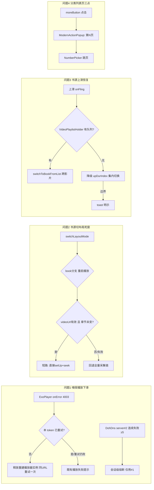

# design.md — video-regression-fix-0906

## Technical Approach

## Architecture Decisions

### AD-01: ExoPlayer 4003 解码失败重建重试（一次）
- **Version**: v1.0
- **UpdateTime**: 2026-09-06
- **Context**: 用户日志两次"播放失败"均为 ERROR_CODE_DECODING_FAILED(4003)，栈因 `queueInputBuffer at Released state`——快速切换视频时旧 MediaCodec 释放与新实例竞争。
- **Concern**: 解码竞态导致播放终止，观感"播放能力下滑"。
- **Decision**: 在播放错误处理处（videoPlayError 事件派发前）拦截 4003：同 startPlayToken 未重试过 → 释放当前播放器实例重建后同 URL setUp 重试一次；仍失败走既有错误提示。
- **Goal**: 消除快速切换场景的解码竞态终止。
- **Tradeoff**: 真损坏流多等待一次失败（约 1~2s）；接受理由：仅一次重试，可忽略。
- **Status**: Accepted
- **Superseded-by**: 空
- **ChangeLog**: 初版

### AD-02: DoH server#2 会话级熔断
- **Version**: v1.0
- **UpdateTime**: 2026-09-06
- **Context**: 用户网络下 server#2 全程 UnknownHostException（45 文件 99 次，跨全部会话），每次解析仍并行尝试 #2。
- **Concern**: 死节点参与并行解析浪费连接与等待，冷启动预热被拖长（观测最长 3 分钟）。
- **Decision**: DohDns 内 server#2 连续失败计数 ≥5 → 会话级熔断（本进程内跳过 #2，仅 #1）；preheat 同样跳过；**计数在 #2 任一次成功时清零（自愈）**。
- **Goal**: 解析路径零回退、无死节点开销。
- **Tradeoff**: 熔断为会话级（进程重启即恢复）；计数成功自愈，#2 短暂恢复可自动重新纳入；接受理由：#1 正常承载。
- **Status**: Accepted
- **Superseded-by**: 空
- **ChangeLog**: 初版

### AD-03: 书源切布局短路重采集（AD-05 六步契约内加快速路径）
- **Version**: v1.0
- **UpdateTime**: 2026-09-06
- **Context**: switchLayoutMode 容器切换同步，但书源重启播放走 Pipeline 全量重采集（SniffEngine.invalidate + getContent + 三层嗅探），死窗数秒~十余秒；此前 L2 仅覆盖重启路径（ui-batch-fix-0905 验证缺口）。
- **Concern**: 书源切布局不即时生效，与订阅源丝滑体验不一致。
- **Decision**: startPlayBookChapter/Pipeline 入口加快速路径守卫：book 非空且 videoUrl 非空且 chapter 未变 → 跳过 invalidate/getContent/嗅探，直接 setUp+seekOnStart 恢复进度；复用起播失败（onError）时自动清 videoUrl 回退全量采集。
- **Goal**: 书源切布局与订阅源同等级丝滑。
- **Tradeoff**: 播放地址有时效性，失效场景多一次失败往返；兜底：一次性回退全量链。
- **Status**: Accepted
- **Superseded-by**: 空
- **ChangeLog**: 初版

### AD-04: 书源上滑恢复——队列兜底注入 + 集内降级（AD-01 单页化决策边界增补，不推翻）
- **Version**: v1.0
- **UpdateTime**: 2026-09-06
- **Context**: align-rss AD-01 单页化后竖滑由手势层 switchToBookFromList 承接，但 VideoPlaylistHolder 仅 5 个列表入口注入；详情页/播放器直进无队列 → neighborOf null → 静默/toast，用户体感"上滑失效"（真回归）。
- **Concern**: 恢复上滑且不推翻单页化（多页 ViewPager 历史上三类状态失步事故）。
- **Decision**: 三处修复——①队列兜底注入：BookInfoActivity/BookInfoComposeActivity/MyFeatureBooksActivity 启动播放器前注入 VideoPlaylistHolder（详情页有兄弟列表上下文则注入全列表，否则单元素）；②switchToBookFromList 邻居为空时降级 upDurIndex（集内上/下集），集内也到边界才 toast；③onBookVerticalFling 的 currentPlayer==null 静默返回改 toast。
- **Goal**: 书源上滑/上下部恢复可用，无静默无反应路径。
- **Tradeoff**: 滑动语义条件化（有列表=跨影片，无列表=集内），与订阅源不完全一致；接受理由：不推翻单页化、风险最低；边界均 toast 明示。本 AD 为 align-rss AD-01 的边界增补（supplementary），Status 记 Accepted 并回写 align-rss design 变更记录。
- **Status**: Accepted
- **Superseded-by**: 空
- **ChangeLog**: 初版

### AD-05: 分类列表页三点接线（ModernActionPopup 收纳页码）
- **Version**: v1.0
- **UpdateTime**: 2026-09-06
- **Context**: ExploreShowActivity（MainTopBarView Mode.SUB）moreButton 由 setMode 强制可见但宿主从未接线（死按钮）；页码跳页功能现存于三横线 pageButton。
- **Concern**: 用户可感知的死按钮（第二轮反馈，上轮误修发现主页）。
- **Decision**: moreButton 接 ModernActionPopup：菜单含"第 N 页"（复用 NumberPickerDialog 跳页逻辑）；删除三横线 pageButton，消除双按钮重复；对齐书架页 ModernActionPopup 接线模式。
- **Goal**: 三点可用、交互统一。
- **Tradeoff**: 页码跳页从一级图标降为菜单项（多一次点击）；接受理由：对齐三点=溢出惯例且消除重复。
- **Status**: Accepted
- **Superseded-by**: 空
- **ChangeLog**: 初版

## File Changes

| 文件 | 变更 | 对应 AD |
|------|------|--------|
| `app/src/main/java/io/legado/app/ui/video/VideoPlayerActivity.kt` | 4003 拦截重建重试；视频错误回调处 | AD-01 |
| `app/src/main/java/io/legado/app/help/http/DohDns.kt`（以实际文件为准） | server#2 连续失败熔断 | AD-02 |
| `app/src/main/java/io/legado/app/help/video/VideoPlaybackPipeline.kt` + `VideoPlay.kt`（startPlayBookChapter） | 短路重采集快速路径 + 失败回退 | AD-03 |
| `app/src/main/java/io/legado/app/ui/book/info/BookInfoActivity.kt` / `BookInfoComposeActivity.kt` / `MyFeatureBooksActivity.kt` | 启动播放器前 VideoPlaylistHolder 注入 | AD-04 |
| `app/src/main/java/io/legado/app/model/VideoPlay.kt`（switchToBookFromList） | 邻居空降级 upDurIndex | AD-04 |
| `app/src/main/java/io/legado/app/ui/video/VideoPlayerActivity.kt`（onBookVerticalFling） | 静默返回改 toast | AD-04 |
| `app/src/main/java/io/legado/app/ui/book/explore/ExploreShowActivity.kt` | moreButton 接线 + 删 pageButton | AD-05 |
| `docs/specs/video-booksource-align-rss/design.md` | 追加 AD-04 增补记录 | 门禁 |
| `app/src/main/assets/updateLog.md` | 基于 git diff 追加 | 门禁 |

（实施时以实际符号定位为准，行号见探索报告。）
